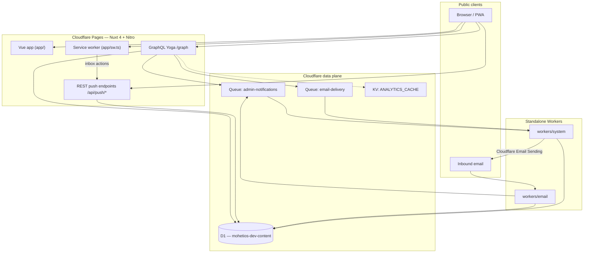

# Mohetios.dev

> Where ideas unfold into systems.

Personal engineering notebook, portfolio, and lightweight operations surface for Ali Zemani. The site is bilingual (English / Persian), editorial in tone, and intentionally compact — long-form writing up front, a small owner console behind authentication for inbox, leads, comments, and notifications.

## What It Is

| Surface                | Purpose                                                                                                    |
| ---------------------- | ---------------------------------------------------------------------------------------------------------- |
| **Public site**        | Blog, lab notes, project writeups, about/contact, tags, newsletter signup, moderated comments              |
| **Owner dashboard**    | Inbox workspace, leads pipeline, comment moderation, newsletter subscribers, analytics, push notifications |
| **Member area**        | Authenticated members can manage profile and participate in comments/chat affordances                      |
| **Background workers** | Inbound email ingestion and queue-driven email delivery + admin push notifications                         |

English is the default locale. Persian content and UI render RTL via `@nuxtjs/i18n`.

## Architecture Overview

Mohetios runs entirely on Cloudflare: **Pages (Nuxt/Nitro)** for the web app and API, **D1** as the relational store, **Queues** for async side effects, **KV** for analytics cache snapshots, and **two standalone Workers** for email routing and system jobs.



### Design principles

- **GraphQL-first API** — one `/graph` endpoint; resolvers stay thin and talk to D1 directly.
- **Build-time content** — Markdown is compiled by Velite, not parsed at request time.
- **Edge-safe server code** — no Node-only assumptions; low CPU, bounded queries, explicit permissions.
- **Queues for side effects** — Nuxt never sends email or push directly; it writes to D1 and enqueues work.
- **Shared contracts** — job payloads and permissions live in `shared/` so app, server, and workers agree on shapes.

## Runtime Topology

| Component         | Role                                                                                                                                                    | Config                                   |
| ----------------- | ------------------------------------------------------------------------------------------------------------------------------------------------------- | ---------------------------------------- |
| **Nuxt / Nitro**  | SSR dashboard, prerendered public pages, GraphQL, push subscription API                                                                                 | `nuxt.config.ts`, `wrangler.jsonc`       |
| **Email worker**  | Receives routed inbound mail, parses with PostalMime, writes inbox + notification rows, enqueues push job                                               | `workers/email/`                         |
| **System worker** | Consumes queues: sends Web Push to dashboard devices, delivers inbox replies and transactional emails via Cloudflare Email Sending; runs cron reminders | `workers/system/`                        |
| **D1**            | Users, inbox, replies, comments, newsletter, push subscriptions, admin notifications                                                                    | `server/models/schema.ts`, `migrations/` |
| **Queues**        | `admin-notifications` (producer: Pages + email worker; consumer: system worker), `email-delivery` (producer: Pages; consumer: system worker)            | `wrangler.jsonc`                         |
| **KV**            | Nitro cache binding for analytics dashboard snapshots (production)                                                                                      | `wrangler.jsonc`                         |

Local development runs all four processes together:

```bash
pnpm dev          # velite + nuxt + email worker + system worker
pnpm dev:web      # velite + nuxt only
pnpm dev:workers  # workers only
```

## Request & Rendering Model

Public content routes are **prerendered** at build time for fast, cache-friendly HTML. Dashboard and member routes use **SSR**. Login is a **client-only** route.

| Route family                                                                 | Strategy     | Notes                                             |
| ---------------------------------------------------------------------------- | ------------ | ------------------------------------------------- |
| `/`, `/blog/**`, `/lab/**`, `/projects/**`, `/about`, `/contact`, `/tags/**` | Prerender    | Localized via `prefix_except_default` (`/fa/...`) |
| `/dashboard/**`                                                              | SSR          | Auth middleware + `dashboard:view` permission     |
| `/member/**`                                                                 | SSR          | Authenticated member profile area                 |
| `/login`                                                                     | SPA (no SSR) | Redirects owners to dashboard, members to profile |
| `/graph`                                                                     | API          | POST in production; GraphiQL in dev only          |

Velite output (`.velite/*.json`) is imported by `app/utils/content.ts` — the Vue layer never touches raw Markdown at runtime.

## Content Pipeline

```txt
content/{locale}/
├── blog/          Long-form posts and book notes
├── lab/           Experiments, prototypes, research
├── projects/      Project writeups
├── about.md
└── contact.md
```

1. **Author** — Markdown + frontmatter under `content/en/` or `content/fa/`.
2. **Build** — Velite (`velite.config.ts`) validates schemas, runs Shiki highlighting, generates TOC, writes typed JSON to `.velite/`.
3. **Render** — Nuxt pages read compiled JSON; Shiki/rehype work already done.
4. **Assets** — Post images live in `public/content/` and are referenced from frontmatter `thumbnail`.

UI labels stay in `i18n/locales/en.json` and `i18n/locales/fa.json`. Prose stays in the matching `content/{locale}` tree.

## Persian Editorial Engine

Persian Editorial Engine is the repository guide for creating, editing, translating, localizing, and auditing Persian output. Its canonical entrypoint is `editorial/fa/ENTRYPOINT.md`.

The engine separates stable Persian writing rules from current project facts:

- `editorial/fa/core/` defines language, reasoning, preservation, factual safety, and temporal integrity.
- `editorial/fa/profiles/ali/` defines Ali's default author voice.
- `editorial/fa/dimensions/` and `editorial/fa/workflows/` define task shape and transformation flow.
- `editorial/fa/evaluation/` and `editorial/fa/tooling/` provide checks and review support.
- `.agents/skills/persian-editorial/` and the other agent files are thin adapters that point back to the entrypoint.

Daily workflow:

```text
Draft
→ task dimensions
→ factual/temporal inventory
→ structural edit
→ Ali voice pass
→ preservation review
→ lint/validation
→ human approval
```

Commands:

```bash
pnpm editorial:validate
pnpm editorial:lint -- content/fa/blog/example.md
pnpm editorial:lint:fa
pnpm editorial:check
```

Example prompt:

```text
Rewrite this Persian draft as a compact article ready for review.
Use Ali's default voice, preserve frontmatter, links, code, dates, ownership, and uncertainty, and report any factual gaps instead of filling them in.
```

Important rules:

- English counterparts are not line-by-line translation sources.
- Nearby source code and current repository docs are stronger factual sources than older prose.
- Do not create claims without a source.
- Voice profile is not project context.
- Mark text as publish-ready only after human review.

Prerequisite: Python 3.x for editorial validation and lint tooling.

## Data & Domain Model

Drizzle schema: `server/models/schema.ts`

| Table                    | Domain                                                                       |
| ------------------------ | ---------------------------------------------------------------------------- |
| `users`                  | Dashboard auth (`OWNER` / `MEMBER`), PBKDF2 password hashes                  |
| `inbox_messages`         | Contact form + inbound email threads; lead fields co-located on message rows |
| `inbox_replies`          | Outbound replies (`DRAFT` → `QUEUED` → `SENT` / `FAILED`)                    |
| `admin_notifications`    | In-app notification feed for dashboard                                       |
| `push_subscriptions`     | Web Push endpoints per user/device                                           |
| `newsletter_subscribers` | Consent-tracked newsletter list                                              |
| `comments`               | Moderated public comments on blog posts                                      |

Migrations live in `migrations/`. Apply locally with `pnpm db:push`.

## Inbox, Email & Notifications

This is the most cross-cutting flow — intentionally split across three runtimes.

### Inbound paths

**Contact form** → GraphQL `createContactMessage` → D1 `inbox_messages` → `admin_notifications` row → `admin-notifications` queue.

**Inbound email** → Cloudflare Email Routing → `workers/email` → PostalMime parse → D1 insert → notification row → queue. Optional `BACKUP_FORWARD_EMAIL` forwards a copy.

### Outbound paths

**Inbox reply** → GraphQL `replyToInboxMessage` → D1 `inbox_replies` (`QUEUED`) → `email-delivery` queue → system worker sends via Cloudflare Email Sending binding.

**Newsletter welcome / comment transactional mail** → same `email-delivery` queue pattern with typed jobs from `shared/contracts/email.ts`.

### Admin push (PWA)

1. Owner subscribes in dashboard → REST `/api/push/subscribe` stores subscription in D1.
2. New inbox/comment events enqueue `AdminNotificationJob` (`shared/contracts/notifications.ts`).
3. System worker loads subscriptions, builds VAPID payload, sends Web Push.
4. Custom service worker (`app/sw.ts`) shows notifications with inbox actions (view / read / spam) that POST to `/api/push/inbox-action`.

Nuxt does **not** send push or SMTP email directly — only the system worker does.

## GraphQL API

Single endpoint: **`/graph`** (`server/routes/graph.ts`)

```txt
server/
├── schema.ts              SDL type definitions
├── routes/graph.ts        Yoga setup + JWT context
├── queries/{feature}.ts   Query resolvers
├── mutations/{feature}.ts Mutation resolvers
├── services/{domain}/     Extracted logic when resolvers grow or repeat
├── models/
│   ├── schema.ts          Drizzle tables
│   └── client.ts          D1 client from request bindings
└── utils/                 Auth, crypto, mappers, rate limits
```

Client operations live in `shared/graphql/` and codegen to `Gql*()` helpers via `nuxt-graphql-client`. Auth token is stored in a cookie (`mohetios_auth_token`) and forwarded as Bearer to `/graph`.

### Adding a feature

1. Extend `server/schema.ts`
2. Add resolver in `server/queries/` or `server/mutations/`, register in `index.ts`
3. Add `.gql` document under `shared/graphql/`
4. Call generated `GqlFeature()` from app code
5. If storage is needed: table in `server/models/schema.ts` → `pnpm db:generate` → use in resolver

Extract to `server/services/{domain}/` only when logic repeats 3+ times or a resolver exceeds ~300 lines.

## Auth & Permissions

- **Username + password** login/register with Cloudflare Turnstile on public forms
- **JWT** (`jose`) issued on login; verified per GraphQL request
- **Roles**: `OWNER`, `MEMBER`, `GUEST` (unauthenticated)
- **Permissions** in `shared/constants/permissions.ts` — server resolvers call `requirePermission`; client uses the same map for UI affordances

First registered user becomes `OWNER`. Dashboard routes require `dashboard:view`. Route middleware in `app/middleware/auth.ts` restores the token, fetches `me`, and redirects unauthenticated users to `/login`.

## Frontend Structure

```txt
app/
├── pages/           Public routes, dashboard, login, member profile
├── layouts/         Default, dashboard, auth
├── components/
│   ├── site/        Header, footer, logo
│   ├── content/     Article shell, TOC, JSON-LD
│   ├── dashboard/   Inbox, leads, comments, stats workspace UI
│   └── comments/    Public comment form and cards
├── composables/     Auth, dashboard data, SEO, PWA install, push
├── middleware/      auth.ts
├── utils/           Content helpers, inbox normalization
└── sw.ts            Custom service worker (push + inbox actions)
```

Dashboard sidebar targets: Overview, Inbox, Leads, Content, Analytics, System, Settings — implemented pages include inbox, leads, comments, newsletter, and analytics.

## Tech Stack

| Layer    | Choices                                                    |
| -------- | ---------------------------------------------------------- |
| Frontend | Nuxt 4, Nuxt UI, Tailwind CSS 4, nuxt-charts               |
| Content  | Velite, Shiki syntax highlighting                          |
| API      | GraphQL Yoga, nuxt-graphql-client                          |
| Data     | Cloudflare D1, Drizzle ORM                                 |
| Hosting  | Cloudflare Pages (`cloudflare_pages` Nitro preset)         |
| Workers  | Email inbound + system queue consumer                      |
| Auth     | JWT, PBKDF2 (Worker-safe iteration count), Turnstile       |
| i18n     | `@nuxtjs/i18n` — English + Persian RTL                     |
| PWA      | `@vite-pwa/nuxt`, custom SW, Web Push (VAPID)              |
| Security | `nuxt-security` CSP, rate limits on `/graph` and `/api/**` |

## Project Layout

```txt
app/         Vue frontend — pages, components, composables, layouts, middleware, SW
server/      Nitro backend — GraphQL, D1, auth, compact services, REST under api/
shared/      Pure contracts — GraphQL documents, types, constants, validation, job payloads
content/     Velite Markdown source (en/ and fa/)
workers/     Standalone Cloudflare Workers (email, system)
migrations/  Drizzle SQL migrations
i18n/locales UI strings (en.json, fa.json)
public/      Static assets, icons, content images
scripts/     GraphQL schema sync, seed, lint helpers
```

## Prerequisites

- **Node.js** 20+
- **pnpm** (see `packageManager` in `package.json`)
- **Cloudflare account** with D1, Queues, and Email Routing for full-stack local dev

## Environment

```bash
cp .env.example .env
```

| Variable                                                       | Purpose                                  |
| -------------------------------------------------------------- | ---------------------------------------- |
| `NUXT_JWT_SECRET`                                              | Required — signs auth tokens             |
| `NUXT_AUTH_TOKEN_TTL_SECONDS`                                  | Token lifetime (default 7 days)          |
| `NUXT_VAPID_*`                                                 | Web Push keys and subject                |
| `NUXT_MAIL_FROM` / `NUXT_MAIL_FROM_NAME`                       | Outbound email identity                  |
| `NUXT_PUBLIC_TURNSTILE_SITE_KEY` / `NUXT_TURNSTILE_SECRET_KEY` | Bot protection on login/register/contact |
| `NUXT_BASE_URL`                                                | Canonical site URL                       |
| `NUXT_CLOUDFLARE_*`                                            | Optional real analytics dashboard data   |

Workers read the same `.env` in local `wrangler dev` via `--env-file .env`. Production secrets are configured on the Cloudflare Pages project and each Worker separately.

## Database

```bash
pnpm db:generate   # new migration from schema changes
pnpm db:push       # apply migrations to local D1
pnpm db:seed       # seed local dev data
pnpm db:studio     # Drizzle Studio
```

## Quality Checks

```bash
pnpm check         # lint + vue lint + typecheck (nuxt + workers)
pnpm lint
pnpm typecheck
pnpm format:check
pnpm clean         # remove .nuxt, .output, .velite, dist, etc.
```

## Build & Deploy

Output targets Cloudflare Pages `dist/`:

```bash
pnpm build         # velite build + gql schema sync + nuxt build
pnpm preview       # wrangler pages dev dist
pnpm deploy        # wrangler pages deploy dist
```

Workers deploy separately from their own `wrangler.jsonc` configs under `workers/email/` and `workers/system/`.

## Agent / Contributor Notes

`AGENTS.md` at the repo root is the source of truth for coding-agent conventions — stack boundaries, GraphQL patterns, Cloudflare performance rules, and completion reporting. Read it before making structural changes.

## License

Code is licensed under the terms in [LICENSE](./LICENSE). Written content and images may have separate ownership or source-specific restrictions.
