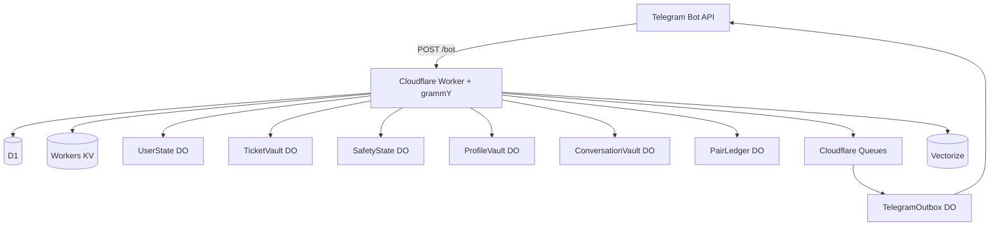

## The Problem Started With A Delivered Message

Building the simplest version of an anonymous message bot is not strange:

```txt
personal link
-> one message
-> resolve the link owner
-> deliver the message
```

Even anonymous replies look simple at first:

```txt
sender
-> bot
-> recipient
-> bot
-> sender
```

The problem starts when this flow is implemented with a normal table:

```txt
sender_id
recipient_id
message_body
conversation_id
created_at
```

As code, this model is clean and easy to understand. With a few queries, it can power an inbox, follow replies, and show a conversation history.

But at the same time, it creates something the product was never supposed to own:

> a tidy ledger of who contacted whom, when, and how often.

Even if the message body is encrypted, the relationship is still inside the database.

That changed the main question of Nekonymous for me.

The question was no longer:

> How do we send an anonymous message in Telegram?

The more precise question became:

> How do we deliver the message, keep replies and abuse controls working, and still avoid building a permanent joinable archive of people and their relationships?

The current Nekonymous architecture is my current answer to that question.

## A Product Kept Deliberately Small

Nekonymous is a Persian-first open-source Telegram bot.

The primary product surface is Telegram. The Worker does not expose a public dashboard, standalone web app, or product API.

Main commands:

```txt
/start
/inbox
/settings
/assessment
/match
```

The messaging flow includes:

- personal anonymous link creation;
- text and supported Telegram media;
- notifications for undelivered messages;
- opening the inbox and draining queued messages;
- anonymous replies;
- private nicknames for senders;
- block and unblock;
- abuse reports;
- pause and resume for incoming messages;
- account deletion and fresh identity creation.

Conversation Suggestions adds:

- conversation style assessment;
- limited conversation profile creation;
- one hub for profile status, summary, and suggestion readiness;
- optional discoverability;
- conversation options;
- intro writing;
- accept or decline;
- accepted requests becoming normal anonymous tickets.

Both parts eventually use one shared primitive:

```txt
every message = one independent ticket
```

Nekonymous is not trying to become a new messenger with permanent history. It is a hosted relay that moves a message from one boundary to another and then gets out of the way as much as possible.

## Before Architecture, The Trust Boundary

First, a limit that no internal architecture can remove.

Nekonymous is not:

- E2EE;
- zero-knowledge;
- a perfect-anonymity or untraceability system;
- independent of trust in Telegram and Cloudflare;
- an identity or safety verifier for the other person;
- protection against screenshots, forwards, or publishing by the recipient.

The sender types the message in Telegram. Telegram sees it.

The Worker receives the message for processing, encryption, and delivery. The Worker sees it too.

On the other side, the message goes back through the Bot API and lands in the recipient's Telegram history.

So application-level encryption in Neko does not remove plaintext from the entire path.

Its role is narrower:

> reduce stored plaintext, reduce joinability across storage planes, and limit the lifetime of data Neko needs in order to do its job.

That boundary matters more than claims like "absolute security" or "unconditional anonymity."

Good architecture should not start with a large promise. It should start by describing exactly what still has to be trusted.

## The Mental Model Shift: A Message Is Not A Row

The main architecture move happened when I stopped treating a message as a record that belongs to two users.

In the ordinary model:

```txt
Message belongs to Sender
Message belongs to Recipient
Message belongs to Conversation
```

In Neko:

```txt
Message is an independent sealed capability
```

Each message has:

- independent lookup;
- independent keys;
- independent lifecycle;
- independent delivery status;
- independent idempotency;
- enough action material to support reply, block, report, and nickname without a permanent conversation row.

The ticket is like a sealed envelope.

Inside the envelope is the information needed to deliver the message and perform a small set of later actions. But the outside of the envelope does not say which two internal accounts it belongs to.

The compact form:

```txt
Message
= Blind lookup
+ Encrypted route
+ Temporary encrypted payload
+ Encrypted metadata
+ Recipient-bound capability
+ Bounded lifecycle
```

## System Map

Nekonymous has one Worker, not a set of independent microservices.

Inside that runtime, state and responsibility are split across several storage planes.



The important part is not the number of boxes. The important part is that no single box is allowed to become the whole story.

## Each Storage Plane Sees Only Part Of The Picture

### D1

D1 is authoritative for active users, public links, and aggregate daily statistics.

It must not become:

- an anonymous transcript store;
- a profile store;
- a sender-recipient graph;
- a request or pair graph.

It can resolve identity structure and public links, but it should not hold anonymous message bodies or a direct message relationship.

### UserState Durable Object

UserState owns recipient-local workflow state:

- unread queue;
- drafts;
- private nicknames;
- blocks;
- rate limits;
- active conversation profile session;
- discoverability and exposure state.

For unread messages, UserState stores a sealed capability ciphertext, blind dedupe data, delivery state, attempt id, and lease timestamps.

It does not store the message body, ticket hash, plaintext capability, route capsule, or sender account id.

### TicketVault Durable Object

TicketVault owns sealed anonymous tickets.

It stores:

- blind `ticketHash`;
- owner proof;
- encrypted route capsule;
- encrypted payload capsule;
- encrypted metadata capsule;
- status;
- creation and expiry time.

TicketVault is neither an inbox nor a message table.

It does not store raw capabilities, lookup nonces, key seeds, direct Telegram user ids, direct sender/recipient account ids, or transcripts.

### SafetyState Durable Object

SafetyState owns abuse reports and sanctions for one blind abuse subject.

It is where report events, distinct reporter tags, reason codes, and sanction state live.

It should not become a reversible reporter-subject graph.

### ProfileVault Durable Object

ProfileVault stores finalized conversation profiles in encrypted form, with revision and indexing state.

Raw questionnaire answers stay only in the active encrypted session in UserState until finalization. Vectorize receives controlled 8-dimensional vectors, not raw answers.

### ConversationVault And PairLedger

ConversationVault stores sealed suggestions, sealed requests, encrypted request routes, and intro text.

PairLedger stores blind pair locks, cooldowns, blocks, and pair state.

Together they allow suggestions and requests to work without turning D1 into a relationship table.

### TelegramOutbox Durable Object

TelegramOutbox is the boundary between internal state and Telegram's external API.

It provides per-chat leases, pacing, idempotency, retry handling, and bounded idempotency retention.

This is what keeps a Queue retry from becoming a duplicate logical send.

### KV

KV is best-effort cache and routing:

```txt
tg:{telegramActorHash}
link:{slug}
```

It is not a source of truth. If KV is missing or stale, D1 and the Durable Objects still have to carry the product.

### Queues

Queues carry retryable background work:

- inbox notifications;
- inbox delivery;
- Telegram outbox work;
- statistics;
- profile indexing.

They are at least once, not exactly once. Every consumer has to assume duplicate delivery.

### Vectorize

Vectorize retrieves bounded initial candidates for Conversation Suggestions.

It is not the final ranker, not an identity store, and not the profile source of truth.

The final ordering is deterministic TypeScript.

## Internal Identity Without Direct Telegram IDs

Telegram ids are useful for runtime routing, but they should not become the join key for every part of the system.

Neko separates a stable Telegram actor hash from the current internal account id.

That distinction matters:

- a stable actor hash lets safety sanctions survive ordinary account reset;
- a current account id lets hard reset invalidate old ticket actions;
- direct Telegram ids do not need to appear across storage planes.

Hard reset creates a new internal account. Old owner proofs fail because the proof includes the old account id.

That means an old delivered callback can still contain a capability in Telegram, but it no longer authorizes an action after reset.

## The Heart Of The Ticket: A 32-Byte Capability

Telegram inline buttons have a tight `callback_data` limit. The capability has to fit inside callbacks like `r:` or `rp:`.

The canonical `TicketCapability` is exactly 32 bytes:

```txt
bytes 0..15   lookupNonce
bytes 16..31  keySeed
```

Its canonical encoded form is:

```txt
43 unpadded Base64URL characters
[A-Za-z0-9_-]{43}
```

There is one canonical format. Callback parsing rejects malformed or non-canonical values.

### Why Two Parts?

The two halves do different jobs.

`lookupNonce` is used to derive a blind ticket lookup:

```txt
HMAC(APP_HMAC_PEPPER,
     "nekonymous:ticket:lookup" || lookupNonce)
```

TicketVault uses the resulting `ticketHash` to find the record.

`keySeed` is used with `APP_MASTER_KEY` and HKDF labels to derive independent keys for:

- route capsule;
- payload capsule;
- metadata capsule.

That means lookup does not reveal the material needed to decrypt.

### The Capability Is Not Stored In The Vault

TicketVault does not have:

- raw capability;
- lookup nonce;
- key seed.

It has only the blind lookup, owner proof, encrypted capsules, and lifecycle state.

If a storage dump reveals TicketVault alone, it does not reveal the plaintext capability needed to act on a ticket.

## Capability Alone Is Not Permission

Putting a capability in a Telegram callback does not mean anyone who sees it can execute the action.

Every delivered-ticket action follows the same shape:

```txt
callback capability
-> parse canonical 43-character capability
-> derive ticketHash
-> load TicketVault record
-> verify owner proof for current actor/current account
-> derive keys
-> decrypt only the required capsule
-> apply action policy
```

The owner proof binds:

```txt
recipient stable Telegram actor hash
+ recipient current internal account id
+ ticketHash
```

So capability possession is a bearer component, but authorization is still actor-bound and account-bound.

## What Is Inside A Ticket?

TicketVault keeps three encrypted capsules.

### Route Capsule

The route capsule contains the action material needed after delivery:

```txt
senderChatRoute
replyRouteTag
contactTag
blockTag
abuseSubjectTag
replyPolicy
parentMessageId
replyToMessageId
```

This is what makes reply, nickname, block, and report possible after the payload has been cleared.

### Payload Capsule

The payload is temporary.

It contains either:

- text and minimal Telegram context; or
- a supported Telegram file identifier and caption context.

After successful Telegram delivery, the payload is cleared and the ticket is marked viewed.

### Metadata Capsule

Metadata contains display data such as the short ticket number and creation time.

It is encrypted separately so each capsule has its own key and associated data.

## Creating A Message: Where The Ticket Is Accepted

The sender-facing path is intentionally bounded:

```txt
resolve sender identity and draft
-> resolve recipient from public slug
-> create sealed ticket
-> store TicketVault record
-> insert sealed unread capability in UserState
-> acknowledge sender
-> enqueue notification and stats
```

The durable acceptance point is:

```txt
TicketVault storage succeeds
+ UserState unread insertion succeeds
```

Notification and statistics are side effects. If they fail after a ticket has been accepted, they should retry or be skipped without deleting a healthy ticket.

That distinction matters because the user-facing message is accepted only after both durable pieces exist.

## Compensation Without Deleting A Healthy Ticket

Partial failure is where many distributed flows become dangerous.

Consider this:

```txt
TicketVault store succeeds
-> UserState unread insertion fails
```

For an ordinary random ticket, the current invocation may delete the vault record it just created.

But for deterministic operations, such as accepting a conversation request, retries derive the same capability and the same `ticketHash`.

So compensation must never delete a healthy ticket created by an earlier successful attempt.

The code treats TicketVault storage as `created` or `existing`. Compensation only deletes a record created by the current invocation.

That small distinction prevents a retry from becoming destructive.

## The Inbox Is Not A Page; It Is A Delivery Queue

Neko does not have an inbox list, pagination, viewed shell, or durable delivered registry.

For each unread item, UserState keeps:

```txt
item_id
sealed_capability_enc
dedupe_tag
delivery_state
delivery_attempt_id
delivery_lease_until
created_at
expires_at
```

UserState does not keep:

- ticket hash;
- plaintext capability;
- message body;
- route capsule;
- sender account id.

When the user opens `/inbox`, the system claims unread rows, opens sealed capabilities in memory, resolves TicketVault records, verifies owner proof, sends through TelegramOutbox, then clears the payload and deletes the unread row after success.

Unread capacity and one drain attempt are both bounded to 50.

## Notifications Do Not Carry Counts

Each accepted unread item returns a random notification event id.

The Queue job does not carry:

- ticket capability;
- ticket hash;
- message body;
- sender identity;
- authoritative unread count.

Right before sending, the consumer reads the live unread count from UserState.

If the inbox has already been drained and the current count is zero, the job is acknowledged without sending.

Notifications are intentionally per accepted unread, not one editable aggregate message. This can create multiple paced notifications during a burst, but it avoids joining tickets into one durable notification state.

## Opening The Inbox

`/inbox`, the main keyboard inbox entry, and `ib:d` all request the same operation.

```txt
user requests inbox
-> cleanup expired unread rows
-> read live unread count
-> if zero, show empty message
-> enqueue inbox-drain job
-> immediately acknowledge delivery start

consumer
-> claim one unread row with a lease
-> decrypt sealed capability in memory
-> resolve TicketVault record
-> verify current actor and account
-> decrypt route/payload/meta
-> send through TelegramOutbox
-> clear payload and mark viewed
-> complete and delete unread row
-> repeat up to 50
```

Temporary failures release the lease and retry.

Permanent missing, expired, invalid, or unsupported tickets are completed as orphans after the current unread attempt is proven.

## Why Payload Is Cleared Only After Successful Send

It would be tempting to clear the payload before calling Telegram, because the system is "about to" deliver it.

That would be wrong.

Telegram is an external side effect. It can fail, rate-limit, time out, or accept the request while the Worker crashes before persistence.

The payload is cleared only after TelegramOutbox reports successful delivery.

This keeps temporary failure from destroying a message that has not actually reached the user.

The tradeoff is that the payload stays encrypted in storage a little longer, but correctness wins here. A privacy feature that randomly loses messages is not a good product boundary.

## In A Distributed System, Retry Is Not Exceptional

Cloudflare Queues deliver at least once.

Durable Objects can be retried.

Telegram can rate-limit.

Network calls can timeout.

So retry is not a rare error path. It is part of the normal model.

Neko's sensitive operations are designed around idempotency:

- ticket creation;
- unread notification;
- inbox delivery;
- Telegram sending;
- report submission;
- profile indexing;
- request acceptance;
- statistics aggregation.

Every promise must be awaited, returned, queued, or intentionally deferred through the runtime. Required work is not hidden in floating promises.

## TelegramOutbox: The Boundary To The External API

TelegramOutbox is a Durable Object per chat lane.

It provides:

- per-chat lock and lease;
- first send without artificial pacing delay;
- about one second between real sends in the same chat;
- Telegram `retry_after` as authoritative backoff;
- generic retry for transient failures;
- permanent rejection for non-retryable Telegram errors;
- bounded idempotency retention;
- alarm-based cleanup.

This keeps Telegram's external behavior from leaking complexity into every feature.

The application asks for a logical send with an idempotency key. TelegramOutbox decides when and how to send it safely.

## Anonymous Replies Do Not Create Conversation Rows

A delivered ticket can contain a reply button.

When the recipient replies, the system does not append to a permanent conversation row.

The reply creates a new independent ticket:

```txt
delivered ticket action
-> verify owner proof
-> decrypt route capsule
-> compose reply
-> create new sealed ticket to the original sender
```

Each reply has its own capability, payload, and lifecycle.

This gives enough continuity for a conversation without turning the storage model into a permanent transcript.

## Private Nicknames Without Sender Profiling

Recipients can give a sender a private name.

The label is encrypted inside the recipient's UserState and keyed by `contactTag`.

`contactTag` is derived from:

```txt
recipient current internal account id
+ sender current internal account id
```

If either side hard-resets, nickname continuity ends.

That is intentional. A private nickname is recipient-local convenience, not a durable profile of the sender.

## Block Must Not Be Bypassed By Sender Reset

Nickname continuity can end on reset, but block should not be bypassed by an ordinary sender reset.

So `blockTag` uses:

```txt
recipient current internal account id
+ sender stable Telegram actor hash
```

The sender can create a new internal account, but the stable actor hash remains the same. The block still applies.

If the recipient hard-resets, recipient-local blocks are cleared because the recipient account scope changes.

`checkCanReceive` is enforced for direct anonymous messages, replies, and conversation requests.

## Blind Reports And SafetyState

Reporting needs to count abuse without building a readable reporter-subject graph.

The system uses blind, domain-separated tags.

### abuseSubjectTag

```txt
sender stable Telegram actor hash
```

This routes all reports for one abuse subject to one SafetyState DO and survives sender account reset.

### reportEventTag

```txt
ticketHash
+ reporter stable Telegram actor hash
```

This prevents the same reporter from counting the same ticket more than once.

### reporterSubjectTag

```txt
abuseSubjectTag
+ reporter stable Telegram actor hash
```

This counts distinct reporters for one subject without creating a globally reusable reporter identity.

The current policy:

- 5 distinct reporters in 24 hours -> 72-hour suspension;
- then 30 days of probation;
- 3 distinct reporters in 7 days during probation -> indefinite ban;
- a later full first-strike threshold after an earlier strike can also ban;
- report events are retained for 90 days.

This is an abuse-control heuristic, not proof of misconduct.

## Hard Reset Must Break The Operational Identity

Hard reset is not only "change my public link."

It has to break the old operational account.

The sequence is:

```txt
disable and invalidate conversation profile state
-> best-effort remove unread TicketVault records
-> purge UserState
-> hard-delete user and public links from D1
-> remove routing cache entries
-> create a new internal user and public link
```

Because owner proof includes the internal account id, old ticket actions stop working immediately after reset.

Some encrypted vault records may remain until bounded cleanup, but callbacks from the old account no longer authorize actions.

## Conversation Profile, Not Personality Test

Conversation Suggestions is optional.

It starts with a 25-question profile across 8 dimensions:

```txt
depth
replyPace
directness
energy
playfulness
supportStyle
disclosurePace
repairStyle
```

The profile separates:

```txt
self style
desired style
current intent
```

The current Telegram flow keeps the assessment and suggestion state in one place.

The first 16 self-style questions share a simple five-point scale. The next 8 desired-style questions still use the same five buttons, but each dimension now explains its own ends:

```txt
depth       -> very light ... very deep
reply pace  -> very slow  ... very fast
directness  -> indirect   ... direct
```

The last question asks for current intent.

Assessment progress can be saved and resumed. Starting a retake clears the active session and turns discoverability off before the first new answer is stored.

Raw answers exist only in the active encrypted session in UserState.

Finalization:

1. validates profile version and complete answer count;
2. normalizes self-style values;
3. derives desired values and no-preference flags;
4. derives per-dimension importance;
5. calculates uncertainty for repeated self items;
6. records current intent;
7. builds controlled product display text;
8. stores the finalized profile encrypted in ProfileVault;
9. removes raw answers from UserState;
10. issues a sealed profile-index Queue job.

Completing a profile does not make the user discoverable. Discoverability is off by default.

The Suggestions hub shows the assessment state, discoverability state, index readiness, and a controlled profile summary together. There is no separate "view profile" screen.

The UI also does not treat a stored profile as search-ready too early. Search stays unavailable while the vault is indexing or failed, and only becomes available when:

```txt
vault status is private or discoverable
+
profile route contains both self and desired Vectorize ids
```

That check matters because a finalized profile record can exist before both vectors are written and verified.

The product does not infer demographic, clinical, political, religious, sexual, or identity attributes.

## Why Workers AI Is Not Used In Suggestions

This feature does not need a generative model to decide who should talk to whom.

Vectorize performs bounded candidate retrieval. The ranker is deterministic TypeScript.

That choice keeps the system:

- easier to test;
- cheaper to run;
- more predictable;
- less tempted to claim psychological authority;
- aligned with the project's privacy boundary.

The output should be framed as current conversation options, not perfect matches.

## Suggestions Have Their Own Capabilities

The capability chain is:

```txt
profile capability
-> sealed index job
-> sealed suggestion
-> sealed request
-> accepted request
-> normal sealed ticket
```

Suggestions and requests are not public rows in D1.

ConversationVault stores sealed suggestions and sealed requests with encrypted route and intro material.

PairLedger stores blind pair locks and cooldowns.

A suggestion can become:

```txt
active
converted_to_request
dismissed
expired
revoked
```

No conversation starts from a suggestion alone.

## Accepting A Request Must Not Create Two Messages On Retry

Accepting a conversation request is a sensitive operation.

If the Worker succeeds in creating the ticket but crashes before recording the accept result, a retry must not create a second message.

The accept operation uses:

```txt
operationId = conversation-request:{requestHash}
```

That operation id becomes the `dedupeKey` for sealed-ticket creation.

The same request therefore derives the same capability and the same `ticketHash`.

TicketVault can report:

```txt
created
existing
```

Repeated accepted callbacks return success without another message.

The accepted intro is delivered through the normal TicketVault and inbox pipeline. Conversation Suggestions does not create a separate messaging channel.

## Statistics Without Scanning User Lives

Public statistics should not scan TicketVault or UserState.

Instead, product events are best-effort Queue messages aggregated into D1 daily tables.

Each stats event has an event id. The consumer records a bounded D1 receipt before applying counters, so Queue retries do not double-count.

Public statistics are aggregate only. They do not expose top users, per-link activity, message bodies, ticket details, or timelines.

## Logging Is Also Part Of Privacy Architecture

A storage model can be careful while logs quietly undo the work.

Neko should not log:

- message content;
- raw capabilities;
- raw Telegram ids;
- bot tokens;
- webhook secrets;
- application keys;
- decrypted route material;
- profile answers;
- request intros.

Logs should carry bounded operational context: event type, status, safe ids, and error categories.

Debuggability matters, but not by copying private data into another storage plane.

## What Happens If Storage Is Exported?

The architecture is easier to reason about by asking what each dump can reveal.

D1 can reveal account structure, public links, aggregate stats, and encrypted chat routes. It should not reveal anonymous transcripts or a message graph.

UserState can reveal sealed unread capabilities, leases, drafts, encrypted nicknames, blocks, active profile session state, and local rate/exposure state. It should not reveal ticket hashes or plaintext inbox content.

TicketVault can reveal blind ticket hashes, encrypted capsules, statuses, and timestamps. It should not reveal sender or recipient ids.

SafetyState can reveal blind abuse subjects, report events, and sanctions. It should not reveal reversible reporter identity.

Vectorize can reveal controlled 8-dimensional vectors and minimal routing metadata. It should not reveal raw answers or Telegram identity.

This does not make the system unbreakable. It makes accidental and single-plane exposure less useful.

## Threats The Architecture Cannot Remove

### Worker Compromise

The Worker processes plaintext and holds the keys needed to decrypt stored data. A compromised deployment or secret set can observe messages processed during that compromise.

### Telegram Account Compromise

If a recipient's Telegram account is compromised, the attacker can read delivered messages and use callbacks available to that account until expiry and authorization permit.

### Project Operator

An operator with deployment credentials and application keys can deploy code that observes plaintext or decrypts ciphertext. The architecture reduces accidental exposure; it does not remove operator power.

### Recipient Behavior

The recipient can copy, screenshot, forward, or publish a message.

### Traffic Analysis

Timestamps, message bursts, notification patterns, and access timing remain metadata.

### Coordinated Abuse

Distinct Telegram accounts can coordinate reports. Safety sanctions are heuristics, not proof.

## Performance Is Part Of The Threat Model

On Cloudflare Workers, performance is not only about speed.

Expensive paths can become reliability and abuse problems.

Neko keeps hot paths bounded:

- no full-vault scans;
- no unbounded inbox drain;
- no D1 candidate retrieval for suggestions;
- no large profile payloads in Queue jobs;
- no runtime markdown/content processing;
- bounded Vectorize result counts;
- bounded Durable Object cleanup batches;
- deterministic ranking in small candidate sets.

Small, predictable server code is a privacy feature too. A system that falls over under normal traffic will create pressure to add shortcuts, logs, manual fixes, and data access that should not exist.

## Code Structure

The codebase keeps the Worker-native boundary visible:

```txt
src/
  index.ts       Worker entry, queue dispatch, DO exports
  bot/           grammY wiring, commands, keyboards, callbacks
  types/         shared runtime and domain types
  identity/      users, public links, display names, reset
  ticketing/     sealed tickets, inbox, replies, block, report
  moderation/    blind report creation
  settings/      privacy controls, settings, aggregate statistics
  profile/       assessment, profile lifecycle, readiness, summary
  suggestions/   retrieval, ranking, suggestions, requests
  storage/       flat Durable Object clients and implementations
  queues/        Queue consumers
  stats/         aggregate event emission and readers
  i18n/          Persian-first visible copy
  utils/         small shared runtime helpers
```

The July 16, 2026 source cleanup removed the older `contracts/` and `features/` nesting. Product areas now sit directly under `src/`, while shared types and storage files remain easy to scan. This changed source navigation and import paths, not the runtime or storage model.

Handlers parse Telegram input, call product logic, and render responses.

Crypto and storage details stay outside UI handlers.

Durable Object clients are typed and centralized.

Pure profile and ranking code does not receive `env`.

Every loop, result set, Queue batch, decryption, and retention scan is bounded.

## Architecture Is Not Enforced By Documentation Alone

The repository includes verification around the boundaries:

```bash
pnpm check
pnpm audit:d1
pnpm audit:ticket-storage
pnpm audit:types
pnpm test:workers
```

The checks cover storage boundaries, ticket lifecycle, Queue and Outbox idempotency, UserState RPC behavior, Safety thresholds, request accept idempotency, profile indexing, retrieval and ranking, privacy leakage, reset hardening, and bot routing.

Documentation explains the architecture. Tests and audits keep it from drifting silently.

## Things I Deliberately Did Not Build

Nekonymous does not include:

- a web dashboard;
- public conversation history;
- GraphQL or REST product API;
- realtime subscriptions;
- a CRM-style moderation panel;
- a dating-style match score;
- a personality diagnosis;
- Workers AI ranking;
- a permanent anonymous transcript;
- a globally readable relationship graph.

Some of these could be useful in other products.

For this one, they would make the privacy boundary heavier before the first version needs them.

## Version One Status

The first version is ready for public release.

The supported `master` line includes:

- canonical capability for each message;
- sealed TicketVault;
- bounded UserState inbox;
- payload clearing after successful delivery;
- actor/account-bound ticket actions;
- anonymous replies;
- private nicknames;
- block and unblock;
- blind reporting and Safety sanctions;
- hard reset;
- TelegramOutbox idempotency and pacing;
- aggregate stats;
- conversation profiles;
- one profile and suggestion hub with verified index readiness;
- optional suggestions;
- sealed suggestions and requests;
- deterministic request acceptance;
- tests and audits for the main storage boundaries.

Neko is still a hosted relay, not a perfect-anonymity system.

That sentence is not a weakness to hide. It is the boundary that keeps the design honest.

## Summary

Nekonymous started with a very simple flow:

```txt
link -> message -> delivery
```

The deeper question was what the system learns while doing that.

The current answer is:

```txt
message       = independent capability
inbox         = temporary delivery queue
ticket vault  = encrypted route + temporary payload
reply         = new ticket
block/report  = blind tags
suggestion    = sealed request
callback      = capability + owner proof
reset         = new operational identity
```

It does not remove trust in Telegram, Cloudflare, or the operator.

It does reduce stored plaintext, direct joins, permanent transcripts, and accidental relationship graphs.

For me, that is the interesting part of the project: not that an anonymous bot can be built, but that even a small bot forces real choices about data shape, retry semantics, trust boundaries, and product language.

## Reference Paths

- [Nekonymous repository](https://github.com/mohetios/Nekonymous)
- [Canonical architecture](https://github.com/mohetios/Nekonymous/blob/master/docs/architecture.md)
- [Sealed Ticketing protocol](https://github.com/mohetios/Nekonymous/blob/master/docs/sealed-ticketing.md)
- [Conversation Suggestions](https://github.com/mohetios/Nekonymous/blob/master/docs/conversation-suggestions.md)
- [Threat Model](https://github.com/mohetios/Nekonymous/blob/master/docs/threat-model.md)
- [Project intro page](https://mohetios.github.io/Nekonymous/)
- [Build story](https://mohetios.dev/en/blog/building-nekonymous-anonymous-telegram-bot)
- [Telegram bot](https://t.me/nekonymous_bot)
