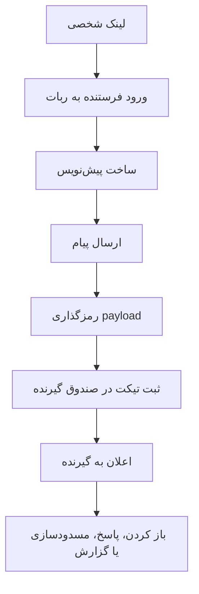
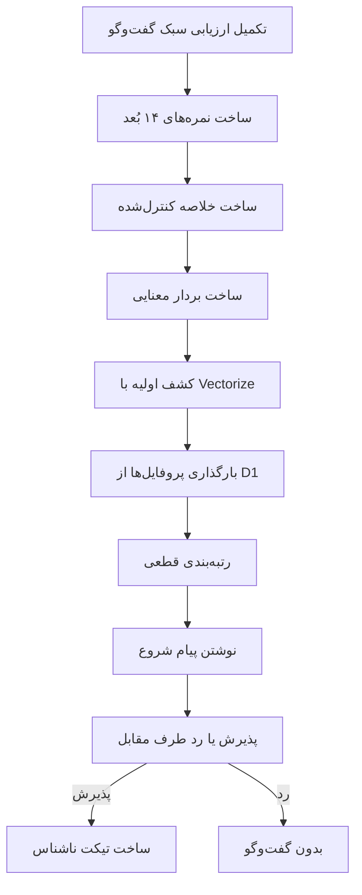
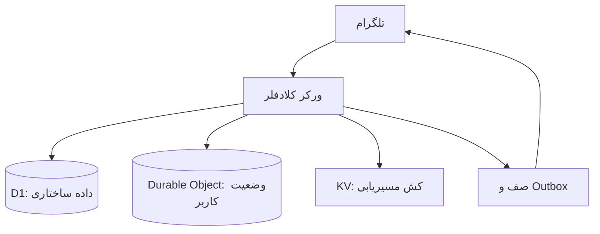

گاهی یک ایده‌ی ساده در اینترنت، بیشتر از چیزی که در نگاه اول به نظر می‌رسد، درباره‌ی اعتماد حرف می‌زند.

پیام ناشناس از همان ایده‌هاست.

در ظاهر، چیز پیچیده‌ای نیست: یک نفر لینک شخصی‌اش را می‌گذارد، دیگران بدون اینکه نامشان مشخص شود پیام می‌فرستند، و صاحب لینک می‌تواند پیام‌ها را بخواند. اما همین ایده‌ی ساده در وب فارسی تبدیل شد به یک رفتار آشنا: آدم‌ها از آن برای شروع حرف‌هایی استفاده می‌کردند که شاید در حالت عادی نمی‌گفتند؛ برای شوخی، اعتراف، سؤال‌های شخصی، کنجکاوی، دوستی، دلخوری، یا حتی فقط برای اینکه یک مکالمه از جایی شروع شود.

این بخش ماجرا هنوز جالب است.

اما بعد از ماجرای هک شدن یکی از ربات‌های ناشناس معروف فارسی، حس ماجرا برای خیلی‌ها عوض شد. وقتی معلوم شد یک ابزار ناشناس می‌تواند مقدار زیادی داده شخصی و ارتباطی را نگه دارد، سؤال اصلی دیگر فقط این نبود که «ربات پیام را می‌رساند یا نه». سؤال این شد که پشت این تجربه‌ی ساده، چه چیزی ذخیره می‌شود، چه کسی آن را می‌بیند، و اگر سرور یا دیتابیس لو برود چه چیزی از آدم‌ها باقی می‌ماند.

ایده‌ی پیام ناشناس هنوز ابزار جالبی است. به آشنایی، شروع مکالمه و گفتن حرف‌هایی کمک می‌کند که شاید در فضای مستقیم گفته نشوند. همین هم نشان می‌دهد جامعه از چنین ابزاری استفاده می‌کند و برایش نیاز واقعی وجود دارد.

ولی برای من، نقطه‌ی شروع نِکونیموس همان حس ناامنی بعد از آن اتفاق بود.

نه اینکه یک ربات ناشناس دیگر بسازیم.
یک ربات ناشناس که تا حد ممکن کمتر بداند.

یک رباتی که اگر قرار است چیزی ذخیره کند، دلیلش روشن باشد. اگر داده‌ای حساس است، محدود و رمزگذاری‌شده بماند. اگر ادعایی درباره حریم خصوصی دارد، از واقعیت فنی خودش بزرگ‌تر حرف نزند.

نِکونیموس دور همین سؤال شکل می‌گیرد:

> یک ربات پیام ناشناس، واقعاً چقدر باید از ما بداند؟

هدف فقط ساختن یک ربات ناشناس دیگر نیست. نِکونیموس روی سه اصل می‌ایستد:

1. تیکتینگ ناشناس با ذخیره‌سازی کمینه و رمزگذاری داده‌های لازم.
2. پیشنهاد گفت‌وگو با ارزیابی سبک گفت‌وگو، نه ادعای سازگاری قطعی.
3. سرویس کوچک و پایدار روی Cloudflare، با هزینه نگهداری پایین و معماری قابل توضیح.

نِکونیموس یک پیام‌رسان رمزنگاری‌شده‌ی سرتاسری نیست. zero-knowledge نیست. ادعای ناشناسی کامل ندارد. قرار نیست بگوید هیچ‌کس هیچ‌چیز نمی‌بیند. چون چنین حرفی در یک ربات تلگرام درست نیست.

نِکونیموس یک hosted anonymous relay است: یک ربات تلگرامی که تلاش می‌کند ارتباط بین کاربران را از دید همدیگر پنهان کند، داده‌های ذخیره‌شده را تا حد ممکن کمینه نگه دارد، چیزهایی را که باید ذخیره شوند در حالت ذخیره رمزنگاری کند، و صادقانه بگوید چه چیزی محافظت می‌شود و چه چیزی نه.

این مقاله درباره‌ی همین طراحی است.

## ایده‌ی اصلی: کمتر دانستن

در طراحی خیلی از سیستم‌ها، وسوسه‌ی ساده‌ای وجود دارد: همه‌چیز را ذخیره کن، شاید لازم شد.

برای analytics.
برای debug.
برای abuse handling.
برای featureهای بعدی.
برای اینکه «اگر خواستیم استفاده کنیم».

اما وقتی محصول درباره‌ی پیام ناشناس است، این نگاه خطرناک می‌شود. هر داده‌ای که امروز ذخیره می‌شود، فردا می‌تواند تبدیل شود به ریسک. حتی اگر نیت اولیه بد نباشد، storage همیشه یک سطح حمله است.

برای همین در نِکونیموس، اصل طراحی این است:

> اگر لازم نیست، ذخیره نکن.
> اگر لازم است، محدود ذخیره کن.
> اگر حساس است، در حالت ذخیره رمزنگاری کن.
> اگر بعد از تحویل لازم نیست، پاکش کن.

این اصل ساده به طراحی تیکتینگ نِکونیموس شکل می‌دهد.

## ۱. تیکتینگ ناشناس: پیام به‌عنوان یک قابلیت محدود

در مدل ساده‌ی یک ربات پیام ناشناس، ممکن است هر پیام مثل یک رکورد معمولی در دیتابیس ذخیره شود:

```text
شناسه فرستنده
شناسه گیرنده
متن پیام
زمان ساخت
وضعیت
```

این مدل از نظر پیاده‌سازی راحت است، اما از نظر حریم خصوصی ضعیف است. چون اگر دیتابیس لو برود، مهاجم می‌تواند رابطه‌ها و پیام‌ها را مستقیم ببیند.

در نِکونیموس، پیام ناشناس بیشتر شبیه یک ticket محدود است، نه یک transcript دائمی.

وقتی کسی از طریق لینک شخصی گیرنده پیام می‌فرستد، سیستم برای گیرنده یک تیکت می‌سازد. این تیکت به گیرنده اجازه می‌دهد پیام را ببیند و روی همان ارتباط کارهایی انجام دهد: پاسخ بدهد، فرستنده را مسدود کند، گزارش ثبت کند، یا برای خودش یک نام خصوصی روی آن فرستنده بگذارد.

مسیر کوچک پیام این است:



اما متن پیام قرار نیست مثل یک history ساده در D1 ذخیره شود.

داده‌های اصلی به چند بخش تقسیم شده‌اند:

```text
D1
→ کاربران، لینک‌ها، ارزیابی، پیشنهادهای گفت‌وگو، گزارش‌ها، آمار ناشناس

UserState Durable Object
→ تیکت‌های صندوق، پیش‌نویس‌ها، مسدودسازی‌ها، نام‌های خصوصی، جلسه ارزیابی

KV
→ فقط کش و مسیر‌یابی سریع، نه منبع اصلی داده

Queue / Outbox
→ ارسال‌های غیرحیاتی و قابل تکرار امن به تلگرام
```

این تقسیم‌بندی مهم است، چون همه‌ی داده‌ها یک سطح حساسیت ندارند.

D1 برای داده‌های ساختاری خوب است: کاربر، لینک عمومی، وضعیت ارزیابی، درخواست گفت‌وگو. اما متن پیام ناشناس نباید به شکل ساده وارد دیتابیس اصلی شود. payload پیام در UserState Durable Object نگه داشته می‌شود و بعد از تحویل در صندوق پیام‌ها، تا حد ممکن پاک می‌شود. برای ادامه‌ی قابلیت‌هایی مثل پاسخ، مسدودسازی، گزارش یا نام خصوصی، فقط فراداده لازم باقی می‌ماند؛ آن هم در حالت رمزنگاری‌شده.

در این طراحی، اگر فقط D1 لو برود، مهاجم نباید بتواند یک transcript کامل از پیام‌های ناشناس بخواند. این ادعای «امنیت کامل» نیست؛ فقط کوچک‌تر کردن سطح آسیب است.

چند تصمیم اصلی این بخش:

```text
شناسه خام کاربر تلگرام
→ ذخیره نمی‌شود؛ به‌جای آن HMAC‌شده نگه داشته می‌شود.

شناسه chat تلگرام
→ در حالت ذخیره رمزنگاری می‌شود.

payload پیام ناشناس
→ در UserStateDO نگه داشته می‌شود، نه به‌عنوان متن ساده در D1.

payload صندوق پیام
→ بعد از تحویل تا حد ممکن پاک می‌شود.

قابلیت callback
→ خام ذخیره نمی‌شود؛ hash و فراداده لازم نگه داشته می‌شود.
```

اینجا تفاوت مهمی وجود دارد: نِکونیموس نمی‌گوید پیام‌ها در تمام مسیر از همه پنهان‌اند. پیام‌ها از تلگرام عبور می‌کنند و Worker هنگام پردازش متن را می‌بیند. بنابراین این سیستم E2EE نیست.

اما بین «E2EE نیست» و «همه‌چیز را راحت ذخیره کنیم» فاصله زیادی وجود دارد.

نِکونیموس دقیقاً در همین فاصله می‌ایستد.

## ۲. پیشنهاد گفت‌وگو: شروع مکالمه، نه ادعای سازگاری

کنار پیام ناشناس، بخش دوم نِکونیموس با یک سؤال دیگر تعریف می‌شود:

اگر آدم‌ها از پیام ناشناس برای شروع حرف‌های سخت یا متفاوت استفاده می‌کنند، آیا می‌شود کمک کرد شروع گفت‌وگو کمی بهتر شود؟

نه به معنی dating.
نه به معنی سازگاری قطعی.
نه به معنی تشخیص شخصیت.
نه به معنی اینکه سیستم بداند چه کسی برای چه کسی «مناسب» است.

فقط به این معنی که اگر کاربری بخواهد، بتواند یک ارزیابی سبک گفت‌وگو انجام دهد و بر اساس آن، چند گزینه‌ی نزدیک‌تر برای شروع یک مکالمه‌ی ناشناس ببیند.

از نظر محصول، این بیشتر شبیه یک امتیازدهی تقریبی و فازی است تا یک حکم قطعی. چند سیگنال از ارزیابی، چند فیلتر ایمنی، و یک رتبه‌بندی قابل توضیح کنار هم قرار می‌گیرند تا بگویند «این گزینه‌ها احتمالاً برای شروع گفت‌وگو نزدیک‌ترند»، نه اینکه «این دو نفر با هم سازگارند».

برای همین واژه‌ی اصلی محصول «مچ‌یابی» نیست. در متن فارسی محصول، اصطلاح اصلی این است:

> پیشنهاد گفت‌وگو

این تفاوت مهم است. «مچ» در ذهن کاربر خیلی سریع به dating، compatibility و درصد سازگاری وصل می‌شود. اما نِکونیموس چنین چیزی نیست. اینجا قرار نیست سیستم بگوید دو نفر با هم جور هستند. قرار است فقط چند گزینه‌ی نزدیک‌تر را برای شروع یک گفت‌وگوی ناشناس پیشنهاد کند.

فرآیند کلی این بخش این‌طور است:



```text
کاربر ارزیابی سبک گفت‌وگو را کامل می‌کند
→ نمره‌ها برای ۱۴ بُعد گفت‌وگو ساخته می‌شوند
→ یک خلاصه‌ی کنترل‌شده از پروفایل تولید می‌شود
→ از آن خلاصه بردار معنایی ساخته می‌شود
→ Vectorize برای پیدا کردن گزینه‌های اولیه استفاده می‌شود
→ D1 پروفایل‌های مرتبط را بارگذاری می‌کند
→ رتبه‌بندی نهایی با منطق قطعی TypeScript انجام می‌شود
→ اگر کاربر خواست، یک پیام شروع می‌نویسد
→ طرف مقابل باید درخواست را بپذیرد
→ فقط بعد از پذیرش، گفت‌وگوی ناشناس ساخته می‌شود
```

در این مدل، Workers AI و Vectorize تصمیم نهایی را نمی‌گیرند. آن‌ها فقط برای کشف اولیه استفاده می‌شوند: یعنی کمک می‌کنند از بین پروفایل‌های فعال، چند گزینه‌ی اولیه پیدا شوند. رتبه‌بندی نهایی با منطق مشخص و قابل توضیح داخل کد انجام می‌شود.

این یک تصمیم عمدی است. چون اگر تمام تصمیم به یک مدل یا embedding سپرده شود، توضیح دادن رفتار سیستم سخت‌تر می‌شود. برای محصولی که با اعتماد سروکار دارد، «قابل توضیح بودن» از هیجان تکنیکی مهم‌تر است.

ارزیابی هم به‌عنوان «تست شخصیت» طراحی نشده. اسمش ارزیابی سبک گفت‌وگوست. یعنی سیگنال‌هایی درباره‌ی نحوه‌ی گفتگو، مرزها، عمق، ریتم پاسخ، مستقیم‌بودن، گرمی، تنظیم هیجان، و ترجیح‌های ارتباطی.

نتیجه‌ی این ارزیابی حقیقت قطعی درباره‌ی شخصیت کاربر نیست. فقط یک ورودی محصولی است برای اینکه پیشنهادهای گفت‌وگو کمتر تصادفی باشند.

چند قانون اصلی این بخش:

```text
قابلیت دیده‌شدن در پیشنهادها
→ پیش‌فرض خاموش است و کاربر باید خودش فعال کند.

درخواست گفت‌وگو
→ فقط وقتی ساخته می‌شود که کاربر یک پیام شروع بنویسد.

درخواست پذیرفته‌شده
→ وارد همان سیستم تیکتینگ ناشناس می‌شود.

درخواست ردشده
→ هیچ گفت‌وگویی نمی‌سازد.

Vectorize
→ فقط کشف اولیه است، نه تصمیم نهایی.

رتبه‌بندی نهایی
→ با منطق قطعی TypeScript انجام می‌شود.

متن محصول
→ نباید درصد سازگاری، تشخیص شخصیت یا وعده‌ی رابطه بدهد.
```

این بخش از نِکونیموس بیشتر از اینکه فقط یک feature باشد، تمرینی برای مهار کردن زبان محصول است. چون گاهی خطر واقعی فقط در کد نیست؛ در کلمه‌هایی است که برای توضیح کد استفاده می‌کنیم.

اگر به کاربر بگویی «سازگارترین آدم با تو را پیدا کردیم»، انتظار غلط می‌سازی.

اگر بگویی «چند گزینه‌ی نزدیک به سبک گفت‌وگوی تو پیدا شد»، هم صادق‌تری، هم محصول را درست‌تر توضیح داده‌ای.

## ۳. معماری Cloudflare-native: کوچک، قابل اجرا، قابل رشد

نِکونیموس روی یک معماری Cloudflare-native اجرا می‌شود.

نه به این خاطر که هر پروژه‌ای باید روی edge باشد. بلکه چون این نوع محصول چند نیاز مشخص داشت:

```text
وبهوک ساده برای تلگرام
ذخیره‌سازی سبک و جداشده
وضعیت نزدیک به هر کاربر
صف برای ارسال‌های غیرحیاتی
KV برای مسیر‌یابی و کش
جست‌وجوی برداری برای پیشنهاد گفت‌وگو
هزینه‌ی نگهداری پایین
استقرار ساده
```

سطح اصلی محصول ربات تلگرام است. Worker یک نقطه ورودی برای وبهوک تلگرام دارد و پیام‌ها، دستورها، callbackها و مصرف‌کننده صف را مدیریت می‌کند.

تصویر کلی ساده است:



در این معماری، هر بخش یک مسئولیت مشخص دارد:

```text
ورکر کلادفلر
→ ورودی اصلی ربات، commandها، callbackها و منطق محصول

D1
→ کاربران، لینک‌ها، ارزیابی‌ها، پیشنهادهای گفت‌وگو، گزارش‌ها و آمار ناشناس

Durable Objectها
→ صندوق، پیش‌نویس، مسدودسازی، نام خصوصی، جلسه ارزیابی و وضعیت نزدیک به کاربر

KV
→ فقط cache و مسیر‌یابی سریع مثل tg:{hash} و link:{slug}

صف‌ها + TelegramOutboxDO
→ ارسال‌های غیرحیاتی تلگرام، با رفتار idempotent

Workers AI + Vectorize
→ ساخت embedding و کشف اولیه‌ی گزینه‌های پیشنهاد گفت‌وگو
```

این جداسازی باعث می‌شود سیستم شبیه یک دیتابیس بزرگ و مبهم نباشد. هر نوع داده جایی قرار می‌گیرد که با نقشش سازگارتر است.

البته این معماری هم جادویی نیست. Cloudflare-native بودن به معنی امنیت کامل یا مقیاس بی‌نهایت نیست. اما برای یک ربات کوچک و جدی، مزیت خوبی دارد: بدون سرور سنتی می‌توان محصول را اجرا کرد، هزینه‌ی نگهداری را پایین نگه داشت، و بخش‌های مختلف storage/queue/vector را به‌صورت managed کنار هم آورد.

این پروژه فقط ساخت یک ربات نیست. تمرین طراحی یک سیستم کوچک است که می‌شود درباره‌ی آن صادقانه نوشت.

## چیزهایی که نِکونیموس عمداً ادعا نمی‌کند

در محصولاتی که با privacy سروکار دارند، ادعا نکردن گاهی مهم‌تر از ادعا کردن است.

نِکونیموس عمداً این‌ها را نمی‌گوید:

| ادعا نمی‌کنیم | انجام می‌دهیم |
| --- | --- |
| ناشناسی کامل | کم‌کردن نشت هویت قابل‌دیدن داخل UI ربات |
| رمزنگاری سرتاسری یا zero-knowledge | رمزگذاری داده‌های حساس در حالت ذخیره |
| پیام‌رسان امن مستقل | relay ناشناس روی تلگرام با مرز اعتماد روشن |
| نگه‌داشتن transcript کامل پیام‌ها | تبدیل پیام به تیکت محدود و پاک‌کردن payload بعد از تحویل |
| تطابق شخصیتی یا درصد سازگاری | پیشنهاد گفت‌وگو بر اساس ارزیابی سبک گفت‌وگو |
| شروع خودکار مکالمه | ساخت گفت‌وگو فقط بعد از پذیرش طرف مقابل |
| تشخیص روان‌شناختی | چند سیگنال محصولی برای شروع گفت‌وگوی بهتر |

چرا؟

چون این‌ها یا درست نیستند، یا برای محدوده محصول بیش از حد بزرگ‌اند، یا کاربر را به اشتباه می‌اندازند.

نِکونیموس روی تلگرام اجرا می‌شود. پیام‌ها از مسیر تلگرام و Worker عبور می‌کنند. پس Worker هنگام پردازش متن پیام را می‌بیند. Telegram هم پیام‌هایی را که از طریق Telegram ارسال می‌شوند در سطح پلتفرم خودش پردازش می‌کند.

پس اگر کسی دنبال یک سیستم رمزنگاری‌شده‌ی سرتاسری است، نِکونیموس جواب آن نیست.

اما اگر هدف این باشد که یک ربات پیام ناشناس فارسی‌محور داشته باشیم که نسبت به داده‌هایی که ذخیره می‌کند محتاط‌تر باشد، مرزهایش را توضیح بدهد، و source/threat model آن قابل خواندن باشد، نِکونیموس یک تلاش در همین مسیر است.

## تهدید اصلی همیشه هکر نیست

وقتی درباره امنیت حرف می‌زنیم، ذهن سریع می‌رود سمت هک، حمله، exploit و leak.

اما در چنین محصولی، تهدید اصلی همیشه مهاجم بیرونی نیست. گاهی تهدید اصلی، طراحی بد است.

طراحی بد یعنی سیستم چیزهایی را ذخیره کند که لازم ندارد.
یعنی متن‌ها و شناسه‌ها را راحت کنار هم نگه دارد.
یعنی کاربر خیال کند چیزی کاملاً خصوصی است، در حالی که نیست.
یعنی محصول با کلمات بزرگ‌تر از واقعیت خودش را معرفی کند.
یعنی حتی سازنده هم دقیق نداند اگر یک storage leak رخ دهد، چه چیزی لو می‌رود.

برای همین کنار README، یک threat model هم برای نِکونیموس وجود دارد. مخصوصاً برای یک سناریوی ساده:

> اگر فقط D1 لو برود، مهاجم چه چیزی می‌فهمد؟

این سؤال کمک می‌کند طراحی از حالت کلی خارج شود.

اگر بگوییم «دیتا امن است»، چیزی توضیح نداده‌ایم.

اما اگر بگوییم:

```text
D1 پیام‌های ناشناس را به شکل transcript نگه نمی‌دارد.
Telegram user id خام در D1 نیست.
chat id رمزنگاری شده است.
assessment scores در D1 هستند.
match relationships با internal id قابل دیدن‌اند.
اگر secretها هم لو بروند، آسیب بیشتر می‌شود.
```

آن وقت سیستم قابل بحث می‌شود. می‌شود درباره‌اش فکر کرد، نقدش کرد، بهترش کرد.

این همان چیزی است که برای Mohetios مهم است: ساختن فقط نصف کار است؛ توضیح دادن دقیق هم بخشی از ساختن است.

## چرا open-source؟

کد نِکونیموس open-source است، چون برای چنین پروژه‌ای اعتماد فقط با حرف ساخته نمی‌شود.

کسی که به این محصول نگاه می‌کند باید بتواند ببیند:

```text
چه چیزی ذخیره می‌شود؟
چه چیزی ذخیره نمی‌شود؟
کجا رمزنگاری انجام می‌شود؟
D1 چه چیزی دارد؟
Durable Object چه چیزی نگه می‌دارد؟
KV برای چیست؟
Vectorize چه نقشی دارد؟
حذف حساب چه چیزی را پاک می‌کند؟
پیشنهاد گفت‌وگو دقیقاً چه ادعایی دارد و چه ادعایی ندارد؟
```

Open-source بودن به‌تنهایی سیستم را امن نمی‌کند. اما حداقل مسیر بررسی و نقد را باز می‌کند. برای پروژه‌ای مثل نِکونیموس، این مهم است.

هدف این نیست که فقط یک ربات deploy شود و روی آن نوشته شود «اعتماد کنید». README، threat model، معماری matching، و متن‌های داخل بات باید یک چیز را بگویند:

> این سیستم کامل نیست، اما سعی می‌کند صادق باشد.

## نِکونیموس چه چیزهایی دارد؟

نِکونیموس روی چند جریان اصلی متمرکز است:

```text
لینک شخصی ناشناس
دریافت پیام ناشناس
صندوق پیام‌ها
پاسخ ناشناس
مسدودسازی
گزارش
نام خصوصی برای فرستنده
توقف/فعال‌سازی دریافت پیام
ارزیابی سبک گفت‌وگو
پیشنهاد گفت‌وگوی اختیاری
درخواست گفت‌وگو با پذیرش طرف مقابل
پاک کردن حساب
```

و چند چیز عمداً در محدوده محصول نیست:

```text
وب‌اپ عمومی داخل Worker
پیام‌رسان E2EE
شبکه اجتماعی کامل
اپلیکیشن dating
پرداخت و اشتراک
تشخیص شخصیت
درصد سازگاری
```

این محدود کردن scope مهم است. چون اگر محصول بخواهد همه‌چیز باشد، احتمالاً هیچ‌چیز را درست توضیح نمی‌دهد.

## نتیجه: یک ربات ناشناس صادق‌تر

نِکونیموس تلاشی برای ساختن «امن‌ترین ربات ناشناس» نیست.

چنین ادعایی نه جذاب است، نه احتمالاً دقیق.

نِکونیموس بیشتر یک تمرین طراحی است:

```text
چطور یک ابزار ناشناس بسازیم که کمتر بداند؟
چطور داده‌های لازم را از داده‌های اضافی جدا کنیم؟
چطور متن پیام را تبدیل به transcript دائمی نکنیم؟
چطور پیشنهاد گفت‌وگو بسازیم بدون اینکه ادعای سازگاری کنیم؟
چطور معماری را طوری بنویسیم که قابل نقد باشد؟
چطور به کاربر بگوییم چه چیزی محافظت می‌شود و چه چیزی نه؟
```

شاید جواب کامل نباشد. اما شروع بهتری است از اینکه فقط یک ربات بسازیم و روی آن بنویسیم «امن و ناشناس».

پیام اصلی نِکونیموس همین است:

> در محصولاتی که با اعتماد سروکار دارند، ادعای کمتر و توضیح دقیق‌تر، خودش بخشی از طراحی است.

کد و مستندات پروژه اینجاست:

https://github.com/mohetios/Nekonymous

## یادداشت فنی مرتبط

برای جزئیات معماری، data flow، ticketing، storage و مرزهای فنی سیستم، یادداشت lab را بخوانید:

- [Nekonymous: ساخت یک ربات پیام ناشناس و پیشنهاد گفت‌وگو](/fa/lab/nekonymous-anonymous-messaging-technical-lab)
