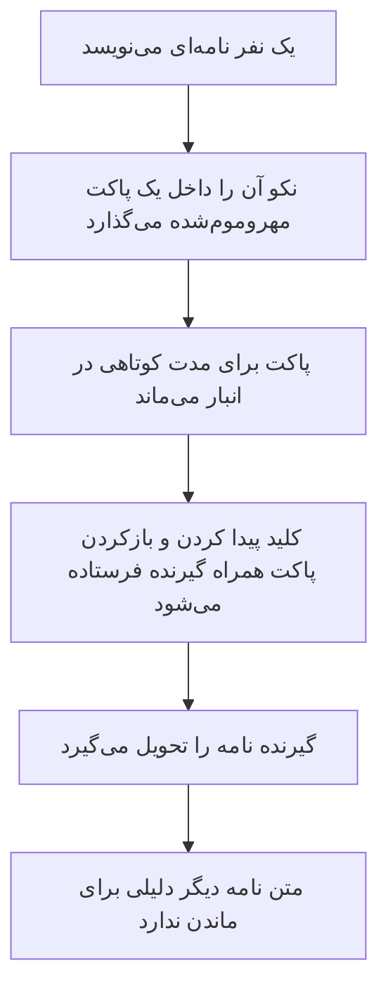

گاهی ایده‌ی یک محصول از خود محصول شروع نمی‌شود؛ از یک حس بد شروع می‌شود.

ایده‌ی اولیه‌ی ساخت نِکونیموس یکی دو سال پیش، بعد از ماجرای هک‌شدن چند ربات معروف پیام ناشناس در ذهنم نشست.

طبق چیزهایی که آن زمان منتشر شد، هکرها بعد از ورود به سرورها با حجم بزرگی از پیام‌ها، تصاویر و اطلاعات کاربران روبه‌رو شده بودند؛ داده‌هایی که منظم ذخیره شده بودند و می‌شد بخش‌های مختلف آن‌ها را به آدم‌ها و گفت‌وگوهایشان مرتبط کرد.

ربات‌هایی که کاربران با تصور «ناشناس‌بودن» در آن‌ها حرف زده بودند، پشت صحنه آرشیوی از روابط و حرف‌های خصوصی آن‌ها ساخته بودند.

هکرها گفتند داده‌ها را پاک کرده‌اند و کاری کرده‌اند که ربات‌ها دیگر نتوانند به شکل قبلی بالا بیایند. شاید واقعاً همین کار را کرده باشند. شاید هم نه.

ولی خب، شد آنچه شد:))

برای من شوخی تلخش همین‌جا بود: ابزاری که قرار بود آدم‌ها در آن راحت‌تر حرف بزنند، خودش تبدیل شده بود به جایی که حرف‌های خصوصی را مرتب، قابل جست‌وجو و قابل اتصال نگه می‌داشت.

چیزی که برای من از آن ماجرا باقی ماند یک سؤال ساده بود:

> یک ربات پیام ناشناس واقعاً چقدر باید درباره‌ی آدم‌ها بداند؟

## رباتی که نباید فضولی کند

در ظاهر، کار یک ربات پیام ناشناس خیلی ساده است.

یک نفر لینک شخصی خودش را منتشر می‌کند. فرد دیگری لینک را باز می‌کند، چیزی می‌نویسد و ربات آن را به صاحب لینک می‌رساند.

همین.

ربات قرار نیست زندگی‌نامه‌ی آدم‌ها را بنویسد. قرار نیست از گفت‌وگوهای آن‌ها یک آرشیو بسازد. قرار نیست بداند چه کسی بیشتر به چه کسی پیام می‌دهد یا چه رابطه‌ای میان کاربران وجود دارد.

وظیفه‌اش فقط رساندن پیام است.

ایده‌ی من این بود که نکو را طوری بسازم که فقط همان کاری را انجام بدهد که برایش ساخته شده:

پیام را بگیرد، آن را به نفر بعدی برساند و بعد چیزهایی را که دیگر لازم نیست فراموش کند.

نه آرشیو اضافه.

نه کنجکاوی اضافه.

نه نگه‌داشتن داده فقط برای اینکه شاید یک روز به درد خورد.

اگر کاربری هم تصمیم گرفت دیگر از ربات استفاده نکند، بتواند حساب و داده‌های وابسته به خودش را پاک کند و با یک هویت و لینک تازه از نو شروع کند.

پاک‌کردن حساب بخش دشوار ماجرا نبود.

سؤال سخت‌تر این بود:

> چطور می‌شود گفت‌وگویی را ادامه داد، بدون اینکه از آن یک دفترچه‌ی دائمی از روابط آدم‌ها ساخت؟

## پیام به‌جای پرونده

ساده‌ترین روش ساخت چنین رباتی این است که هر پیام را داخل یک جدول قرار بدهیم:

چه کسی فرستاد، برای چه کسی فرستاد، چه چیزی نوشت و چه زمانی آن را نوشت.

از نظر برنامه‌نویسی، روش راحتی است.

اما اگر کسی روزی به آن جدول دسترسی پیدا کند، عملاً یک دفتر کامل جلوی او قرار دارد؛ دفتری که می‌تواند بگوید چه کسی با چه کسی حرف زده و در آن میان چه گذشته است.

حتی اگر متن پیام‌ها رمزنگاری شده باشد، خود ارتباط میان آدم‌ها هنوز می‌تواند چیزهای زیادی تعریف کند.

من نمی‌خواستم نکو چنین دفتری داشته باشد.

برای همین پیام‌ها در نسخه‌ی اولیه‌ی نکو بیشتر شبیه **نامه‌های مهروموم‌شده** بودند تا رکوردهای معمولی یک دیتابیس.

مدلی که به آن رسیدم ترکیبی از چند چیز کوچک بود: key-value storage برای نگه‌داری کوتاه‌مدت، hash برای پیدا کردن بسته، encrypted payload برای متن و مسیر حساس، capability کوتاه داخل دکمه‌ی تلگرام و پاک‌کردن payload بعد از تحویل.

تصویر ذهنی‌اش چیزی شبیه این بود:



کلیدی که گیرنده داشت داخل دیتابیس نکو ذخیره نمی‌شد. همراه همان پیام و دکمه‌های تلگرام برای او فرستاده می‌شد و در تاریخچه‌ی گفت‌وگوی خودش باقی می‌ماند.

وقتی گیرنده می‌خواست پیام را ببیند یا به آن پاسخ بدهد، همان کلید را دوباره به نکو تحویل می‌داد.

نکو با کمک همان کلید دو کار انجام می‌داد: بسته‌ی درست را در storage پیدا می‌کرد و بعد payload رمزنگاری‌شده را باز می‌کرد.

اگر گیرنده پاسخ می‌داد، یک نامه‌ی تازه و یک کلید تازه ساخته می‌شد و همین چرخه برای نفر بعدی ادامه پیدا می‌کرد.

هیچ نیازی نبود همه‌ی گفت‌وگو مثل یک رشته‌ی بلند و دائمی در یک جدول باقی بماند.

هر پاسخ یک تیکت تازه بود؛ یک پاکت تازه با عمر محدود.

این برای من بخش اصلی مسئله بود: گفت‌وگو ادامه پیدا کند، اما خود سیستم مجبور نباشد یک transcript دائمی و مرتب از رابطه‌ی دو نفر بسازد.

## انباری که داستان آدم‌ها را نمی‌داند

نتیجه چیزی بود که در ذهن خودم به آن می‌گفتم:

> یک دیتابیس کور.

اگر کسی فقط وارد انبار نکو می‌شد، با مجموعه‌ای از keyهای نامفهوم و بسته‌های رمزنگاری‌شده روبه‌رو بود.

نه دفترچه‌ای وجود داشت که نوشته باشد این پیام را چه کسی برای چه کسی فرستاده، نه اسم روشنی روی پاکت‌ها بود و نه کلید بازکردن آن‌ها کنارشان قرار داشت.

انباری بود پر از بسته‌های بی‌نام.

البته «کور» به این معنا نیست که سیستم هیچ‌چیز نمی‌داند یا هیچ خطری وجود ندارد. نکو هنگام رساندن پیام باید برای مدتی آن را پردازش کند و باید راهی داشته باشد که پاسخ را به مسیر درست برگرداند.

اما تفاوت مهم این بود که اطلاعات ذخیره‌شده به‌تنهایی نباید می‌توانستند داستان کامل آدم‌ها را تعریف کنند.

هدف من این نبود که سیستمی هک‌نشدنی بسازم. چنین قولی درباره‌ی هیچ سیستم واقعی نمی‌توان داد.

هدف این بود که اگر روزی انبار داده‌ها لو رفت، مهاجم با یک آلبوم مرتب از زندگی کاربران روبه‌رو نشود.

این هسته‌ی اولیه‌ی تیکتینگ نِکونیموس بود.

## بازگشت به نکو

آن نسخه‌ی اولیه بیشتر یک ایده و یک نمونه‌ی خام بود.

مدتی گذشت و من دوباره سراغش رفتم. این بار تصمیم گرفتم نکو را از یک آزمایش کوچک بیرون بیاورم و آن را به یک پروژه‌ی کامل‌تر، تمیزتر و قابل بررسی تبدیل کنم.

قرار نبود فقط چند تکنولوژی جدید به آن اضافه کنم و اسمش را معماری بگذارم.

می‌خواستم هر ابزار دقیقاً برای بخشی از هسته‌ی نکو استفاده شود.

یک vector database برای پیدا کردن candidateهای اولیه در پیشنهاد گفت‌وگو؛ در اینجا Cloudflare Vectorize فقط مرحله‌ی بازیابی را انجام می‌دهد، نه تصمیم نهایی را.

یک queue برای کارهایی که نباید مسیر اصلی پاسخ را نگه دارند؛ مثل ارسال‌های غیرهمزمان، ایندکس‌کردن پروفایل‌ها و کارهای تکرارپذیر.

Durable Objects به‌عنوان آبجکت‌های stateful با حافظه و ترتیب مشخص؛ برای inbox، ticket vault و جاهایی که race یا دوباره‌اجراشدن callback می‌تواند داده را خراب کند.

D1 به‌عنوان relational database کوچک و قابل query؛ برای داده‌های ساختاری، لینک‌ها و چیزهایی که واقعاً باید با query خوانده شوند.

KV به‌عنوان key-value data storage؛ برای cache و lookup کوتاه‌عمر، نه منبع حقیقت محصول.

Web Crypto به‌عنوان native cryptography engine خود runtime؛ برای hash، derivation و رمزنگاری بدون اضافه‌کردن یک کتابخانه‌ی سنگین سمت Worker.

در چنین پروژه‌هایی انتخاب طبیعی من معمولاً Cloudflare Workers است.

نه صرفاً به این دلیل که روی edge اجرا می‌شود یا اسم ابزارهای زیادی کنارش وجود دارد؛ بلکه چون اجازه می‌دهد یک سرویس کوچک را بدون نگهداری یک سرور بزرگِ دائماً روشن بسازم.

برای کاری مثل نکو، این مدل با ذهن من جور درمی‌آید: هر قسمت فقط وقتی لازم است کار می‌کند، هزینه‌ی idle بی‌خود ندارد و هر نوع داده در جای متناسب با خودش قرار می‌گیرد.

در نسخه‌ی جدید، دیگر مخزن Key-Value نسخه‌ی اولیه مسئول همه‌چیز نیست. تیکت‌ها، صندوق کاربران، صف ارسال، گزارش‌ها، اطلاعات ساختاری و پیشنهادهای گفت‌وگو هرکدام مرز جداگانه‌ای دارند.

از دید کاربر اما همه‌ی این‌ها باید نامرئی بمانند.

کاربر فقط یک گربه‌ی نارنجی می‌بیند که پیامش را می‌گیرد و به مقصد می‌رساند.

جزئیات فنی این معماری، تیکت‌ها، رمزنگاری، نوع دیتابیس‌ها و مرز هر بخش را جداگانه در [مقاله‌ی آزمایشگاه نِکونیموس](https://mohetios.dev/fa/lab/nekonymous-anonymous-messaging-technical-lab) نوشته‌ام.

## وقتی گربه‌ی پستچی آدم‌ها را هم معرفی می‌کند

در کنار بازسازی بخش پیام ناشناس، تصمیم گرفتم یک قابلیت دیگر هم به نکو اضافه کنم:

**پیشنهاد گفت‌وگو.**

پیام‌های ناشناس معمولاً برای گفتن چیزهایی استفاده می‌شوند که شروع مستقیم آن‌ها سخت است.

یک سؤال شخصی، یک اعتراف، یک کنجکاوی یا حتی فقط تلاش برای شروع یک مکالمه.

با خودم فکر کردم شاید نکو بتواند یک قدم قبل‌تر هم کمک کند.

نه اینکه تشخیص بدهد چه کسی برای چه کسی ساخته شده است.

نه اینکه برای آدم‌ها درصد سازگاری تولید کند.

نه اینکه نقش روان‌شناس یا واسطه‌ی رابطه را بازی کند.

فقط بتواند میان آدم‌هایی که خودشان خواسته‌اند در این بخش حضور داشته باشند بگردد و بگوید:

> شاید حرف‌زدن با این چند نفر برای تو راحت‌تر یا جالب‌تر باشد.

کاربر ابتدا به تعدادی سؤال درباره‌ی سبک گفت‌وگوی خودش پاسخ می‌دهد: اینکه چقدر مستقیم حرف می‌زند، چه عمقی از گفت‌وگو را دوست دارد، با اختلاف‌نظر چطور کنار می‌آید و از یک مکالمه چه انتظاری دارد.

نکو از این پاسخ‌ها یک پروفایل گفت‌وگو می‌سازد.

اما این پروفایل حکم قطعی درباره‌ی شخصیت آدم نیست. فقط مجموعه‌ای از نشانه‌هاست که کمک می‌کند پیشنهادها کاملاً تصادفی نباشند.

نمایش در پیشنهادها هم به‌صورت پیش‌فرض خاموش است.

هرکس باید خودش تصمیم بگیرد که می‌خواهد در این بخش دیده شود یا نه.

حتی بعد از یک پیشنهاد، هیچ گفت‌وگویی خودکار شروع نمی‌شود. یک نفر پیام کوتاهی برای شروع می‌نویسد و طرف مقابل می‌تواند آن را بپذیرد یا رد کند.

اگر پذیرفته شد، نکو دوباره همان کاری را می‌کند که از ابتدا برایش ساخته شده بود:

یک نامه‌ی ناشناس می‌سازد و آن را به نفر بعدی می‌رساند.

## چرا یک گربه‌ی نارنجی؟

اسم Nekonymous از کنار هم قرار گرفتن دو کلمه آمده است:

```txt
Neko + Anonymous
```

`Neko` در زبان ژاپنی یعنی گربه و بخش دوم هم از Anonymous، به معنای ناشناس، می‌آید.

پس نِکونیموس را می‌شود چیزی شبیه «گربه‌ی ناشناس» ترجمه کرد.

اما در ذهن من کمی دقیق‌تر است:

> گربه‌ی نارنجی پیام‌های ناشناس.

این شخصیت فقط برای لوگو ساخته نشده است.

سعی کردم لحن و رفتار خود ربات هم شبیه همان گربه باشد؛ کنجکاو و کمی بازیگوش، ولی نه فضول.

وقتی برای اولین بار نکو را start می‌کنید، به‌جای یک متن رسمی و طولانی، چنین چیزی می‌بینید:

```txt
میو، اینم لینک پیام ناشناست:

https://t.me/nekonymous_bot?start=chmF1BJmYoIpQdK-61EIeQ

هرکی بازش کنه، می‌تونه برات پیام ناشناس بفرسته.
```

گاهی هم اگر میان دستورها گیج شود، چیزی پیدا نکند یا یک دکمه‌ی قدیمی را فشار بدهید، به زبان گربه‌ای خودش جواب می‌دهد:))

این لحن برای من بخش مهمی از محصول بود.

نکو با موضوع نسبتاً جدی حریم خصوصی سروکار دارد، اما لازم نیست خشک، ترسناک یا شبیه پنل یک نرم‌افزار امنیتی باشد.

می‌تواند صمیمی باشد و در همان حال مرزهایش را جدی بگیرد.

## نکو چه قولی نمی‌دهد؟

اینجا یک مرز مهم وجود دارد.

نِکونیموس یک پیام‌رسان با رمزنگاری سرتاسری نیست.

وقتی پیامی را در تلگرام می‌فرستید، تلگرام آن را پردازش می‌کند. نکو هم برای اینکه بتواند پیام را رمزنگاری و به گیرنده تحویل دهد، هنگام پردازش آن را می‌بیند.

پس نکو نمی‌تواند ادعا کند هیچ‌کس در هیچ مرحله‌ای به متن پیام دسترسی ندارد.

همچنین قرار نیست وعده بدهد که همه‌ی لایه‌ها و همه‌ی خطرها حذف شده‌اند.

ناشناس‌بودن در نکو یعنی در جریان عادی محصول، دو کاربر هویت تلگرامی یکدیگر را نمی‌بینند.

حریم خصوصی در نکو یعنی خود ربات سعی می‌کند کمتر ذخیره کند، داده‌های حساس ذخیره‌شده را در حالت ذخیره رمزنگاری کند، متن پیام را بیشتر از زمان لازم نگه ندارد و یک گراف روشن از ارتباط کاربران نسازد.

این دو با هم فرق دارند.

من ترجیح می‌دهم نکو درباره‌ی همین مرزها واضح حرف بزند، تا اینکه با چند کلمه‌ی بزرگ حس امنیتی بسازد که واقعاً وجود ندارد.

## چرا متن‌باز؟

کل پروژه‌ی نِکونیموس open-source است.

نه به این دلیل که open-source بودن به‌تنهایی یک سیستم را امن می‌کند. چنین تضمینی وجود ندارد.

دلیلش این است که برای محصولی که درباره‌ی اعتماد و حریم خصوصی حرف می‌زند، «به من اعتماد کنید» جمله‌ی کافی‌ای نیست.

کد، ساختار، مستندات و مدل تهدید باید قابل دیدن و نقدکردن باشند.

هرکس باید بتواند بررسی کند نکو چه چیزی را نگه می‌دارد، چه چیزی را نگه نمی‌دارد، چه زمانی پیام را پاک می‌کند و ادعاهایش تا چه اندازه با چیزی که در کد اتفاق می‌افتد هم‌خوان‌اند.

برای همین در کنار سورس پروژه، مستندات معماری، محدودیت‌ها، مدل تهدید و توضیح سیستم پیشنهاد گفت‌وگو هم منتشر شده‌اند.

من تا جای ممکن کدها و مستندات را مرور، تمیز و بهینه کرده‌ام تا نکو بتواند با منابع محدود، پایدار و قابل فهم کار کند.

اما هیچ پروژه‌ای با منتشرشدن کامل نمی‌شود.

احتمالاً هنوز جاهایی برای بهترشدن، ساده‌ترشدن یا نقدشدن وجود دارد.

## گربه‌ای که چیزی برای پنهان‌کردن ندارد

نِکونیموس از یک سؤال شروع شد:

یک ربات پیام ناشناس چقدر باید درباره‌ی کاربرانش بداند؟

جوابی که در طول ساختن پروژه به آن رسیدم این بود:

تا جای ممکن، کمتر.

نکو باید بداند یک نامه وجود دارد.

باید بتواند آن را به مقصد برساند.

برای مدتی باید مسیر برگشت را حفظ کند تا پاسخ، گزارش یا مسدودکردن ممکن باشد.

اما لازم نیست از نامه‌ها یک آرشیو دائمی بسازد. لازم نیست روابط آدم‌ها را مثل یک نقشه کنار هم بچیند و لازم نیست چیزی را فقط با این توجیه نگه دارد که شاید یک روز به کار بیاید.

شاید اعتماد لزوماً از سیستم‌هایی نیاید که ادعا می‌کنند همه‌چیز را می‌دانند و می‌توانند از آن محافظت کنند.

گاهی اعتماد از سیستمی می‌آید که از ابتدا تصمیم گرفته بعضی چیزها را اصلاً نداند.

نِکونیموس تلاش من برای ساختن چنین سیستمی است:

یک گربه‌ی نارنجی که نامه‌های ناشناس را می‌رساند، اما قرار نیست درون آن‌ها سرک بکشد یا از زندگی صاحبانشان دفترچه بسازد.

میو.

---

سورس پروژه، مستندات و راهنمای اجرا در [GitHub نِکونیموس](https://github.com/mohetios/Nekonymous) در دسترس است.

برای دیدن جزئیات معماری، مدل تیکتینگ و مرزهای فنی حریم خصوصی می‌توانید [مقاله‌ی آزمایشگاه نِکونیموس](https://mohetios.dev/fa/lab/nekonymous-anonymous-messaging-technical-lab) را بخوانید.

هرجا در کد، معماری، مستندات یا ادعاهای پروژه مشکلی دیدید، خوشحال می‌شوم به من بگویید.
