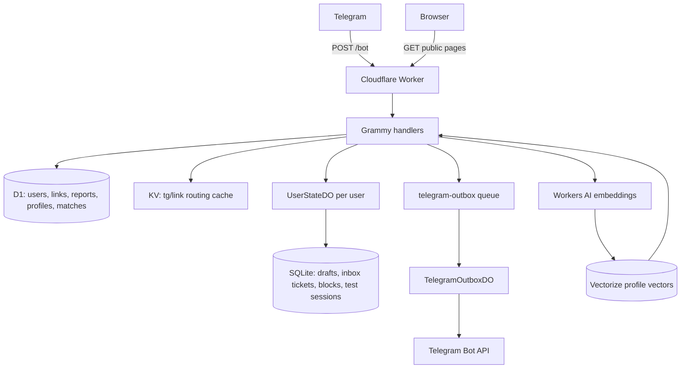
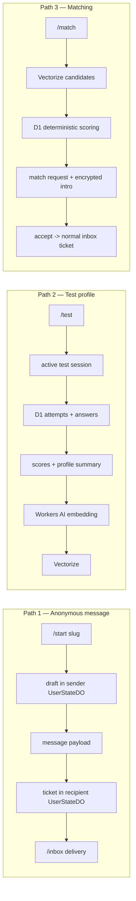
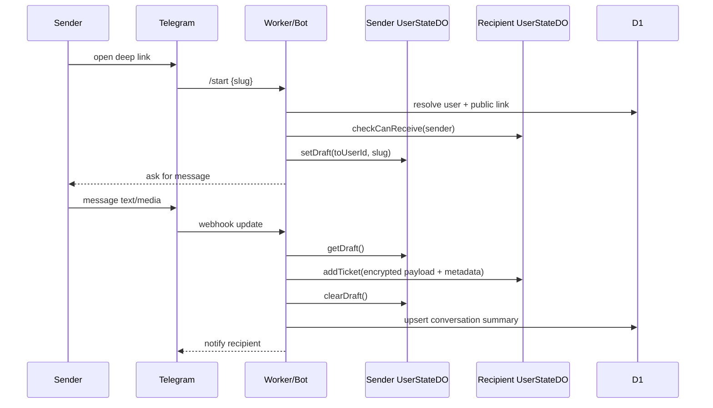
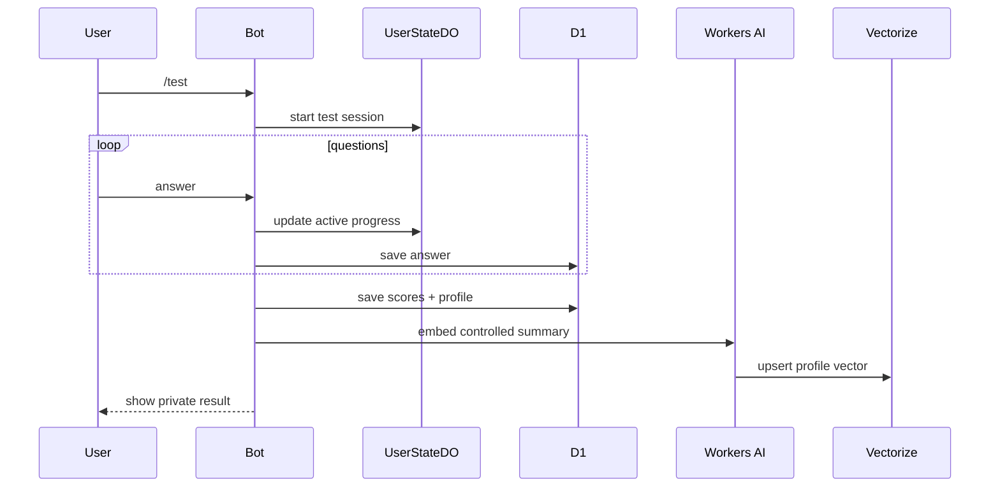
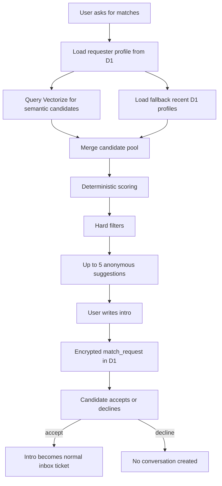
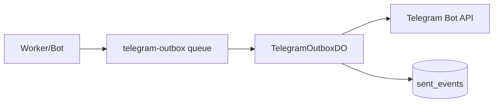

## نسخه اول نکونیموس

چند روز گذشته نسخه اول Nekonymous را جمع‌وجور کردم.

ایده اولیه خیلی کوچک بود: یک ربات تلگرام که هر کاربر یک لینک شخصی داشته باشد و بقیه بتوانند بدون دیدن یوزرنیم تلگرام او پیام بفرستند. صاحب لینک هم پیام را از داخل ربات بخواند، اگر خواست ناشناس جواب بدهد، اگر فضا خوب نبود فرستنده را block یا report کند، دریافت پیام‌های جدید را pause کند، و برای آدم‌های تکراری یک nickname خصوصی بگذارد.

از بیرون، این می‌تواند شبیه یک bot ساده باشد:

```txt
/start
  -> ساخت کاربر
  -> ساخت لینک شخصی
  -> دریافت پیام از deep link
  -> نمایش پیام در /inbox
```

اما همین مسیر ساده، وقتی قرار است واقعاً کار کند، خیلی زود چند سؤال جدی می‌آورد. اگر تلگرام یک update را دوباره فرستاد چه؟ اگر کاربر وسط نوشتن پیام برگشت چه؟ اگر گیرنده نمی‌خواهد دیگر پیام بگیرد چه؟ اگر کسی abuse کرد چه؟ متن پیام را کجا نگه می‌داریم و چقدر نگه می‌داریم؟ اگر بعداً بخواهیم آدم‌های نزدیک‌تر را به هم پیشنهاد کنیم، source of truth ما کجاست؟

همین سؤال‌ها باعث شد نکونیموس از «یک command برای پیام ناشناس» تبدیل شود به یک هسته کوچک اما جدی‌تر: پیام ناشناس، تست سبک گفت‌وگو، و مچ‌یابی ناشناس.

این نوشته مستند رسمی کد نیست. صفحه فروش محصول هم نیست. بیشتر شبیه دفترچه ساخت نسخه اول است: اینکه چرا پروژه را این‌طور چیدم، هر بخش چه مسئولیتی دارد، داده از کجا وارد می‌شود، کجا ذخیره می‌شود، و کجا باید عمداً چیزی نسازیم.

لینک‌های پروژه:

- [mehotkhan/Nekonymous](https://github.com/mehotkhan/Nekonymous)
- [nekonymous.mohetios.dev](https://nekonymous.mohetios.dev/)

## ایده از کجا آمد؟

پیام ناشناس ایده تازه‌ای نیست. یک نفر لینک می‌گیرد، نفر دیگر لینک را باز می‌کند، پیام می‌فرستد، و صاحب لینک بدون دیدن هویت مستقیم فرستنده پیام را می‌خواند.

برای کاربر، همین کافی است. نباید از او خواست یک اکانت جدید بسازد، وارد داشبورد شود، یا اپلیکیشن جدا نصب کند. تلگرام از قبل روی گوشی خیلی‌ها هست. deep link باز می‌شود، ربات start می‌شود، و کاربر همان‌جا پیامش را می‌نویسد.

اما ناشناس‌بودن دو لبه دارد. فاصله می‌تواند کمک کند کسی راحت‌تر چیزی را بگوید. همان فاصله می‌تواند سوءاستفاده را هم راحت‌تر کند. برای همین از همان اول block، report، pause، rate limit و nickname خصوصی را جزئی از محصول دیدم، نه featureهایی که بعداً شاید اضافه شوند.

مسئله اصلی برای من این نبود که «چطور یک Telegram bot بسازم». مسئله دقیق‌تر این بود:

> چطور می‌شود یک anonymous relay کوچک ساخت که ادعای privacy بزرگ‌تر از واقعیت نکند، اما تا حد ممکن plaintext کمتری ذخیره کند، نشت هویت قابل مشاهده را کم کند، و همچنان ساده و عملیاتی بماند؟

نکونیموس جواب فعلی من به همین سؤال است.

## چرا تلگرام؟

تلگرام برای شروع این محصول طبیعی بود، چون اصطکاک را کم می‌کند. کاربر با همان identity و session تلگرام وارد می‌شود. لینک شخصی هم با همان مدل deep link خود تلگرام کار می‌کند. برای نسخه اول، UI خود bot کافی است: چند دکمه، چند command، چند پیام کوتاه.

این انتخاب البته هزینه هم دارد. چون پیام از Telegram عبور می‌کند و Worker هم هنگام پردازش متن خام را می‌بیند. پس نکونیموس را نباید به‌عنوان پیام‌رسان end-to-end encrypted معرفی کرد.

claim درست‌تر این است:

```txt
Nekonymous is a hosted anonymous relay.
It reduces visible identity leakage inside the bot UI.
It encrypts sensitive payloads at rest.
It does not remove Telegram or the Worker runtime from the trust boundary.
```

این جمله شاید از نظر تبلیغاتی هیجان کمتری داشته باشد، اما برای محصولی که با اعتماد و ناشناس‌بودن سروکار دارد، دقیق‌تر و سالم‌تر است.

## چرا Cloudflare؟

برای نسخه اول نمی‌خواستم چند سرویس پراکنده کنار هم بچینم: یک سرور برای webhook، یک دیتابیس جدا، یک queue جدا، یک worker جدا برای ارسال پیام، یک سرویس جدا برای vector search، و بعد کلی glue code برای وصل‌کردنشان.

Cloudflare برای این مدل پروژه جذاب بود، نه چون همه چیز را جادویی حل می‌کند، بلکه چون چند primitive مهم را کنار هم می‌گذارد:

- Worker برای ورود HTTP و webhook تلگرام.
- D1 برای داده ساختاریافته و قابل query.
- Durable Objects برای state حساس، ترتیبی و per-user.
- KV برای routing/cache سبک.
- Queues برای کارهایی که نباید webhook را نگه دارند.
- Workers AI و Vectorize برای profile و مچ‌یابی معنایی.

قاعده‌ای که با آن جلو رفتم این بود:

```txt
Worker برای ورود و routing.
D1 برای داده‌ای که باید query شود.
Durable Object برای state داغ و ترتیبی.
KV فقط برای cache و lookup سریع.
Queue برای کاری که نباید webhook را نگه دارد.
Workers AI + Vectorize برای discovery، نه تصمیم نهایی.
```

این معماری قرار نیست بزرگ‌ترین یا کامل‌ترین شکل ممکن باشد. برای نسخه اول، هدف چیز دیگری است: سیستم باید قابل فهم، bounded، قابل تست، و قابل توضیح بماند.

## تصویر کلی معماری

قبل از رفتن سراغ جزئیات، بهتر است تصویر اصلی را نگه داریم. نکونیموس از نظر runtime یک Worker دارد، اما از نظر data flow سه مسیر مهم دارد: پیام ناشناس، تست سبک گفت‌وگو، و مچ‌یابی ناشناس.



Worker دروازه است. درخواست‌های تلگرام و صفحه‌های عمومی از آن وارد می‌شوند.

D1 حافظه قابل query است: کاربرها، لینک‌ها، گزارش‌ها، پروفایل تست، درخواست‌های مچ و eventهای اصلی.

UserStateDO حافظه زنده هر کاربر است: draft، inbox ticket، block list، rate limit، eventهای پردازش‌شده و session فعال تست.

KV فقط نقش cache و routing دارد. مثلاً اینکه `tg:{telegramUserHash}` یا `link:{slug}` سریع به user id برسد. KV نباید source of truth داده حساس باشد.

Queue و TelegramOutboxDO کمک می‌کنند ارسال‌های غیرحیاتی به Telegram تکراری نشوند و webhook بی‌دلیل منتظر نماند.

Vectorize هم موتور تصمیم‌گیری نیست. فقط نقطه شروع candidate discovery است. تصمیم نهایی را کد deterministic و hard filterها می‌گیرند.

از نظر محصول هم همین نگاه کوچک باید حفظ شود:

```txt
نه شبکه اجتماعی.
نه dating platform رسمی.
نه پیام‌رسان کامل.
نه ادعای privacy بزرگ‌تر از واقعیت.
```

یک hosted anonymous relay روی تلگرام، با encrypted-at-rest storage، تست سبک گفت‌وگو، و مچ‌یابی opt-in.

همین.

## سه مسیر داده

برای فهمیدن نکونیموس، بهتر است به جای اسم فایل‌ها، مسیر داده را ببینیم.

سه مسیر اصلی داریم:

1. پیام ناشناس
2. تست و profile
3. مچ‌یابی و درخواست گفت‌وگو



این سه مسیر مستقل‌اند، اما روی یک هسته مشترک می‌نشینند. مهم‌ترین تصمیم طراحی همین بود: featureهای جدید نباید سیستم پیام را دور بزنند. اگر مچ قبول شد، intro باید از همان مسیر پیام ناشناس عبور کند، نه اینکه یک مدل چت جدید کنار سیستم اصلی بسازد.

## مسیر اول: پیام ناشناس

مسیر پیام از یک deep link شروع می‌شود:

```txt
https://t.me/{bot}?start={slug}
```

وقتی کسی این لینک را باز می‌کند، bot باید چند چیز را تشخیص بدهد:

- فرستنده کیست؟
- slug متعلق به کدام گیرنده است؟
- فرستنده دارد به خودش پیام می‌دهد یا نه؟
- گیرنده pause کرده؟
- گیرنده این فرستنده را block کرده؟
- آیا فرستنده rate limit شده؟
- آیا inbox گیرنده ظرفیت دارد؟

در این مرحله هنوز پیامی وجود ندارد. پس ticket هم ساخته نمی‌شود. فقط یک draft برای فرستنده ساخته می‌شود تا پیام بعدی او معنی پیدا کند.

```txt
/start {slug}
  -> resolve sender from Telegram
  -> resolve recipient from link slug
  -> reject self-message
  -> check recipient can receive
  -> create draft for sender
  -> wait for sender message
```

وقتی فرستنده پیام می‌فرستد، آن پیام وارد مسیر اصلی ticketing می‌شود:

```txt
sender sends message
  -> read sender draft
  -> check rate limit
  -> check recipient pause/block/inbox cap
  -> create ticket_id + ref
  -> encrypt payload
  -> encrypt connection metadata
  -> insert inbox ticket in recipient UserStateDO
  -> clear sender draft
  -> update D1 conversation summary
  -> notify recipient
```

نمای sequence همین مسیر:



در این مدل، D1 history کامل پیام‌ها را نگه نمی‌دارد. D1 فقط summary و index سبک conversation را دارد. خود inbox داخل UserStateDO گیرنده زندگی می‌کند، چون ترتیب، ownership و callbackها همه به همان گیرنده مربوط‌اند.

## ticket یعنی چه؟

در نکونیموس، ticket یک «تیکت پشتیبانی» نیست. ticket یعنی یک reference عملیاتی برای یک پیام ناشناس.

هر ticket چند کار انجام می‌دهد:

- پیام را در inbox گیرنده نگه می‌دارد.
- یک ref کوتاه برای دکمه‌های تلگرام می‌دهد.
- metadata لازم برای reply، block، report و nickname را نگه می‌دارد.
- جلوی duplicate شدن پیام را با dedupe key می‌گیرد.

دو شناسه مهم داریم:

| شناسه | نقش |
| --- | --- |
| `ticket_id` | شناسه داخلی، طولانی و random؛ برای crypto context و tracking |
| `ref` | شناسه کوتاه callback؛ فقط داخل inbox همان گیرنده معنی دارد |

callback data تلگرام باید کوتاه بماند:

```txt
r:{ref}   reply
b:{ref}   block
rp:{ref}  report
n:{ref}   nickname
```

نباید داخل callback بگذاریم:

```txt
sender_user_id
recipient_user_id
conversation_id
ticket_id
```

چون callback از UI تلگرام برمی‌گردد و نباید خودش حامل metadata حساس باشد. مسیر درست‌تر این است:

```txt
callback r:{ref}
  -> current user از Telegram resolve می‌شود
  -> ticket از UserStateDO همان user خوانده می‌شود
  -> ownership verify می‌شود
  -> connection metadata decrypt می‌شود
  -> action اجرا می‌شود
```

یک شکل ذهنی از ticket:

```ts
type InboxTicket = {
  ref: string
  ticketId: string
  senderUserId: string
  recipientUserId: string
  conversationId: string
  payloadCiphertext?: string
  connectionCiphertext: string
  status: 'pending' | 'delivered'
  createdAt: number
}
```

این type مستند دقیق implementation نیست؛ بیشتر برای نشان دادن ذهنیت سیستم است. payload موقت است. connection metadata برای ادامه مسیر باقی می‌ماند.

## رمزگذاری، بدون ادعای اضافه

این بخش باید صریح بماند: نکونیموس end-to-end encrypted نیست.

تلگرام پیام اولیه را می‌بیند. Worker هنگام پردازش، متن خام را می‌بیند. runtime secretها بخشی از trust boundary هستند. پس رمزگذاری در نکونیموس برای حذف همه trust نیست؛ برای کم‌کردن plaintext ذخیره‌شده است.

هدف‌ها روشن‌اند:

- username تلگرام دو طرف در UI لو نرود.
- Telegram user id خام به‌عنوان public id استفاده نشود.
- chat id تلگرام encrypted ذخیره شود.
- متن پیام در storage به شکل plaintext نماند.
- payload بعد از delivery از inbox پاک شود.
- فقط connection metadata رمزگذاری‌شده برای reply/block/report/nickname باقی بماند.
- match intro هم در D1 به شکل encrypted-at-rest ذخیره شود.

شکل ذهنی crypto این است:

```txt
APP_HMAC_PEPPER + telegram_user_id
  -> HMAC-SHA-256
  -> telegram_user_hash

APP_MASTER_KEY + ticket_id
  -> HKDF-SHA-256
  -> AES-256-GCM key
  -> payload_ciphertext + connection_ciphertext
```

نمونه کوچک:

```ts
const ticketId = generateTicketId()
const ref = generateCallbackRef()

const payloadCiphertext = await encryptMessagePayload(
  ticketId,
  JSON.stringify(payload),
  env.APP_MASTER_KEY
)

const connectionCiphertext = await encryptConnectionMetadata(
  ticketId,
  JSON.stringify(connection),
  env.APP_MASTER_KEY
)
```

این کد قرار نیست همه implementation را توضیح بدهد. فقط نشان می‌دهد چرا `ticketId` مهم است: ciphertext باید به context همان ticket وصل باشد، نه یک blob بی‌نام.

## بعد از inbox چه می‌شود؟

وقتی گیرنده `/inbox` را می‌زند، bot ticketهای pending را از `UserStateDO` همان گیرنده می‌خواند، payload را decrypt می‌کند، پیام را به کاربر نشان می‌دهد، و بعد ticket را delivered می‌کند.

نقطه مهم اینجاست:

```sql
UPDATE inbox_tickets
SET status = 'delivered',
    payload_ciphertext = NULL,
    delivered_at = ?
WHERE ref = ?
```

payload پاک می‌شود، اما `connection_ciphertext` می‌ماند. چرا؟ چون بدون آن reply، block، report و nickname بعد از delivery کار نمی‌کند.

این tradeoff آگاهانه است:

```txt
payload کوتاه‌عمر است.
connection metadata طولانی‌تر می‌ماند، ولی encrypted است.
```

این مدل کامل نیست، اما برای نسخه اول قابل دفاع است: متن پیام برای همیشه در storage نمی‌ماند، ولی مسیر ادامه ارتباط هنوز از روی metadata رمزگذاری‌شده قابل انجام است.

## مالکیت داده‌ها

یکی از تغییرهای اصلی نسخه اول این بود که هر داده owner مشخص پیدا کند.

| داده | owner | چرا |
| --- | --- | --- |
| user identity | D1 | باید query شود و source of truth باشد |
| telegram user hash | D1 + KV cache | lookup سریع، identity پایدار |
| encrypted chat id | D1 | برای ارسال پیام لازم است |
| public link slug | D1 + KV cache | link باید قابل query و cache باشد |
| active draft | UserStateDO | state داغ و per-user |
| pause/block | UserStateDO | در مسیر دریافت پیام چک می‌شود |
| inbox ticket | UserStateDO | ordering، cap و callback ownership |
| private nickname | UserStateDO | private و recipient-scoped |
| conversation summary | D1 | فقط index و count، نه متن پیام |
| report | D1 | moderation و audit سبک |
| test attempt/answer/profile | D1 | قابل query و قابل review |
| active test session | UserStateDO | progress لحظه‌ای کاربر |
| profile vector | Vectorize + D1 metadata | discovery و index state |
| match request | D1 | lifecycle، accept/decline، expiry |
| match intro | D1 encrypted | payload حساس request |
| outbound Telegram job | Queue + OutboxDO | retry و idempotency |

این جدول برای خودم هم مهم است. هر بار temptation می‌آید که چیزی را سریع در KV بگذارم، باید به این جدول برگردم.

KV جای cache است، نه جای truth حساس.

## چرا Durable Object برای user state؟

چند نوع state در نکونیموس per-user و ترتیبی‌اند:

- draft فعال
- inbox ticketها
- block list
- nicknameهای خصوصی
- rate limit
- processed events
- active test session

اگر این‌ها در KV پخش شوند، مدل ذهنی سخت می‌شود. Durable Object اینجا خوب می‌نشیند، چون یک instance برای یک user می‌تواند state همان user را مرتب و bounded نگه دارد.

ساختار داخل UserStateDO تقریباً این ذهنیت را دارد:

```txt
UserStateDO:{userId}
  user_state
  drafts
  inbox_tickets
  blocks
  contact_labels
  rate_limits
  processed_events
  test_sessions
```

لازم نیست هر conversation یک DO داشته باشد. لازم هم نیست کل bot در یک DO جمع شود. برای نسخه اول، per-user کافی و قابل توضیح است.

## مسیر دوم: تست سبک گفت‌وگو

بعد از اینکه پیام ناشناس تمیز شد، سؤال بعدی این بود:

اگر بخواهیم آدم‌ها را ناشناس به هم پیشنهاد کنیم، بر اساس چه چیزی؟

نمی‌خواستم نکونیموس تبدیل شود به تست شخصیت سنگین یا labelهای سرگرمی‌محور. این تست قرار نیست تشخیص روان‌شناسی بدهد. therapy نیست. ارزیابی پزشکی نیست. فقط یک ابزار محصولی است برای فهمیدن سبک گفت‌وگو:

- گفت‌وگوی عمیق یا سبک؟
- جواب سریع یا آرام؟
- مستقیم یا نرم؟
- مرزدار یا آزادتر؟
- ناشناس‌بودن راحت یا محتاط؟
- curiosity بیشتر یا گفت‌وگوی روزمره‌تر؟

مسیر داده تست این است:



یک نکته مهم این است که embedding از raw answer ساخته نمی‌شود. اول یک summary کنترل‌شده ساخته می‌شود؛ متنی شبیه این:

```txt
Language: fa.
Conversation profile: flexible reply pace, deep thoughtful, low-pressure.
Signals: high curiosity, moderate boundary respect, warm cooperative style.
Communication preferences: clear boundaries, respectful tone, no pressure to continue.
```

این متن برای matching کافی است، ولی همه جزئیات پاسخ‌ها را به index نمی‌فرستد.

## مسیر سوم: مچ‌یابی ناشناس

مچ‌یابی در نکونیموس opt-in است.

کاربر باید تست را کامل کند، profile ساخته شود، vector index شود، و خودش discoverable بودن را فعال کند. تا وقتی این اتفاق نیفتاده، نباید در پیشنهادها ظاهر شود.

Vectorize در این مدل فقط نقطه شروع است. نزدیک‌ترین candidateهای معنایی را پیدا می‌کند. بعد کد deterministic دوباره candidateها را score و filter می‌کند.



Hard filterها از similarity مهم‌ترند:

- خود کاربر حذف می‌شود.
- کاربر inactive حذف می‌شود.
- profile ناقص حذف می‌شود.
- discoverable نبودن یعنی حذف.
- block و report یعنی حذف.
- pending request تکراری ساخته نمی‌شود.
- safety restriction بالاتر از score است.

Similarity فقط زبان پیشنهاد است، نه حکم قطعی.

اگر فقط یک نفر eligible وجود دارد، سیستم نباید بگوید «مچ خوبی پیدا نشد». جمله درست‌تر این است:

```txt
نزدیک‌ترین گزینه فعلی این است.
```

این تفاوت کوچک است، ولی روی حس محصول اثر دارد. سیستم نباید تظاهر کند oracle است.

## چرا match request مستقیم گفت‌وگو نمی‌سازد؟

این بخش برای من مهم بود.

اگر user A یک candidate را دید و intro نوشت، user B نباید ناگهان وارد conversation شود. اول باید درخواست را ببیند و accept یا decline کند.

مدل:

```txt
requester chooses candidate
  -> writes intro
  -> intro encrypted in match_requests
  -> candidate receives approximate similarity + safe reasons + intro
  -> candidate accepts or declines
```

فقط بعد از accept:

```txt
accepted match request
  -> decrypt intro
  -> call sendAnonymousMessage()
  -> create normal inbox ticket
```

این یعنی feature مچ‌یابی کنار سیستم پیام ننشسته؛ روی همان مسیر پیام سوار شده است. نتیجه‌اش ساده‌تر است: intro بعد از accept مثل یک پیام ناشناس عادی رفتار می‌کند.

## Outbox و idempotency

Telegram output نقطه‌ای است که معمولاً دیر جدی گرفته می‌شود.

Webhook باید سریع جواب بدهد. اما ارسال پیام به Telegram ممکن است fail شود، retry بخواهد، یا duplicate شود. برای همین بخشی از خروجی‌ها از مسیر outbox عبور می‌کنند.



`TelegramOutboxDO` وظیفه دارد sendهای قبلی را با `idempotency_key` بشناسد. اگر همان job دوباره رسید، لازم نیست دوباره همان پیام را بفرستد.

شکل ذهنی:

```ts
await enqueueTelegramOutbox(env, {
  idempotencyKey: `seen:${sender.id}:${parentMessageId ?? 'none'}`,
  chatCiphertext: sender.telegram_chat_ciphertext,
  chatHash: sender.telegram_user_hash,
  method: 'sendMessage',
  payload: { text: YOUR_MESSAGE_SEEN_MESSAGE },
  priority: 'low',
  createdAt: Date.now()
})
```

اصل مهم این است:

```txt
کاری که پاسخ webhook به آن وابسته نیست، نباید بی‌دلیل webhook را نگه دارد.
```

همه چیز لازم نیست queue شود. اما وقتی side effect غیرحیاتی است، outbox مدل بهتری می‌دهد.

## چه چیزهایی را عمداً نساختم؟

این بخش به اندازه featureها مهم است.

نسخه اول این‌ها را ندارد:

- شبکه اجتماعی کامل
- public profile
- dating mode رسمی
- wallet یا payment
- Telegram Stars پیاده‌سازی‌شده
- subscription
- boost و ranking پولی
- پیام‌رسان end-to-end encrypted
- تفسیر روان‌شناسی سنگین با AI
- auto-match بدون consent
- باز شدن conversation بدون accept طرف مقابل
- translation خودکار پیام‌ها
- real-time chat room
- ConversationDO جدا برای هر گفت‌وگو

بعضی از این‌ها شاید بعداً معنی پیدا کنند. اما الان هسته را بهتر نمی‌کنند.

نسخه اول باید کوچک بماند تا بتوان فهمید کجا درست کار می‌کند و کجا نه.

## اگر بخواهم همین را از صفر بسازم

اگر بخواهم همین مسیر را برای یک پروژه مشابه پیشنهاد کنم، ترتیبش این است:

```txt
1. یک bot ساده بساز که /start را جواب بدهد.
2. user را با Telegram id resolve کن، اما id خام را public نکن.
3. برای هر user یک public slug بساز.
4. deep link را به owner user وصل کن.
5. draft بساز، بعد از دریافت پیام ticket بساز.
6. inbox را per-recipient و bounded نگه دار.
7. reply/block/report را فقط از روی owned ticket انجام بده.
8. payload را encrypted-at-rest نگه دار و بعد از delivery پاک کن.
9. بعد از اینکه پیام پایدار شد، تست و profile را اضافه کن.
10. بعد از profile، matching را opt-in و consent-based اضافه کن.
```

اگر این order را برعکس کنی، خیلی زود featureهای جذاب روی پایه‌ای می‌نشینند که هنوز معلوم نیست پیام ساده را درست تحویل می‌دهد یا نه.

برای همین نکونیموس اول inbox شد، بعد ticketing، بعد profile، بعد matching.

## برنامه بعدی

قدم بعدی بیشتر محصولی است تا معماری:

- تست با چند کاربر واقعی
- تمیزکردن UX داخل bot
- بهترکردن empty stateها
- روشن‌ترکردن متن‌های privacy
- بهترکردن moderation و report
- آماده‌کردن screenshot و README عمومی‌تر
- نوشتن خلاصه‌های کوتاه برای LinkedIn و X

درآمدزایی را احتمالاً با Telegram Stars جلو می‌برم، اما نه قبل از اینکه مطمئن شوم هسته رایگان محصول درست کار می‌کند.

ایده‌های بعدی:

- credit pack برای match request
- premium اختیاری
- profile report کامل‌تر
- AI intro rewrite

این‌ها roadmap هستند، نه وضعیت فعلی.

## وضعیت فعلی

نسخه اول نکونیموس الان یک core قابل استفاده دارد:

- پیام ناشناس
- inbox
- reply
- block/report/nickname
- pause/resume
- تست سبک گفت‌وگو
- profile indexing
- مچ‌یابی ناشناس opt-in
- match request با accept/decline

هنوز محصول نهایی نیست.

اما دیگر فقط یک آزمایش کوچک هم نیست. حالا یک هسته دارد که می‌شود به آن لینک داد، درباره‌اش نوشت، با چند کاربر واقعی تستش کرد، و از رویش نسخه‌های بعدی را ساخت.

اگر بخواهم کل مسیر را در چند خط نگه دارم:

```txt
پیام ناشناس ساده شروع می‌شود.
ساده ماندن سخت است.
هر state باید owner داشته باشد.
privacy باید کمتر ادعا کند و بهتر عمل کند.
matching باید با consent جلو برود.
AI کمک می‌کند، اما حکم نمی‌دهد.
```

این برای من نسخه اول Nekonymous است: یک bot کوچک، با معماری قابل توضیح، برای گفت‌وگوهای ناشناس که قرار نیست بیشتر از چیزی که هست ادعا کند.
