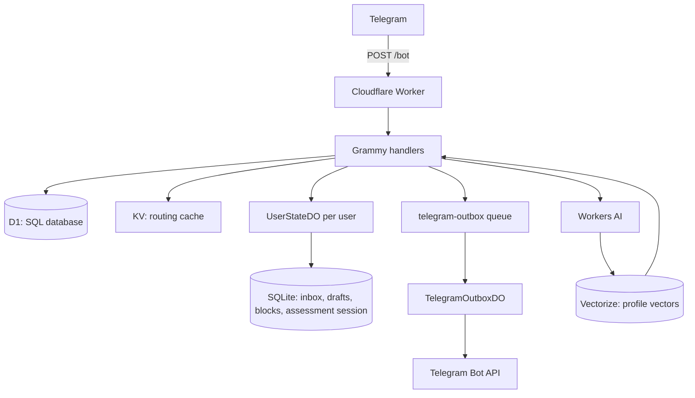
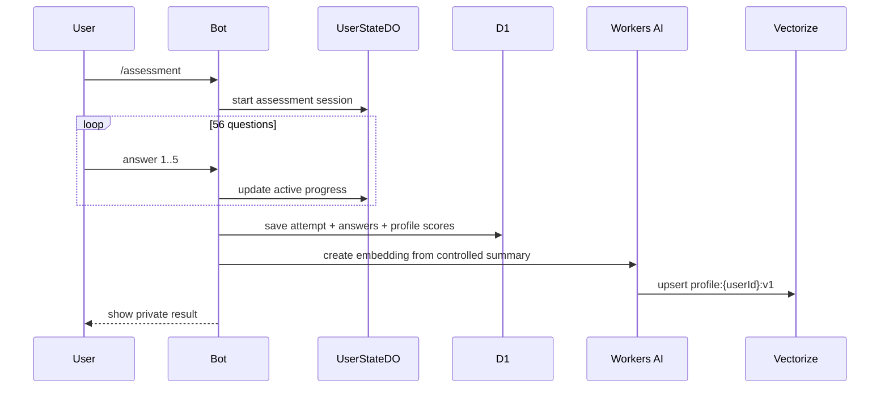
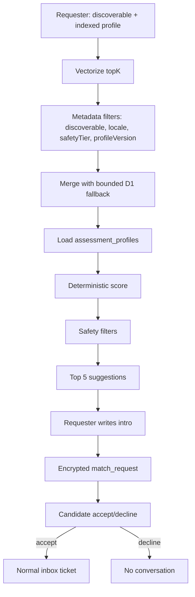
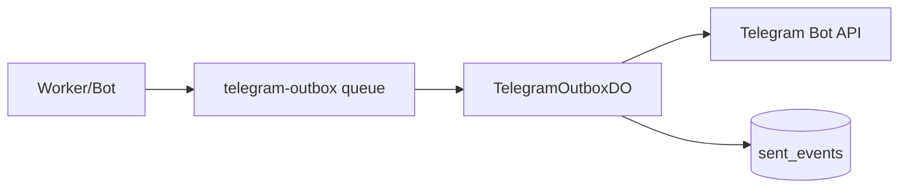

## نسخه اول نکونیموس

چند روز گذشته نسخه اول Nekonymous را جمع‌وجور کردم.

ایده اولیه ساده بود: یک ربات تلگرام که هر کاربر یک لینک شخصی داشته باشد و بقیه بتوانند بدون دیدن یوزرنیم تلگرام او پیام بفرستند. صاحب لینک هم بتواند پیام‌ها را از داخل خود ربات بخواند، ناشناس جواب بدهد، فرستنده را block یا report کند، دریافت پیام‌های جدید را pause کند، و برای آدم‌های تکراری یک nickname خصوصی بگذارد.

از بیرون، این شبیه یک bot کوچک است:

```txt
/start
  -> ساخت کاربر
  -> ساخت لینک شخصی
  -> دریافت پیام از deep link
  -> نمایش پیام در /inbox
```

اما وقتی قرار است همین مسیر کوچک واقعاً قابل استفاده باشد، سریع چند سؤال جدی پیدا می‌شود. اگر تلگرام یک update را دوباره فرستاد چه؟ اگر کاربر وسط نوشتن پیام برگشت چه؟ اگر گیرنده دیگر نمی‌خواهد پیام بگیرد چه؟ اگر کسی abuse کرد چه؟ متن پیام را کجا نگه داریم و چقدر نگه داریم؟ اگر بعداً بخواهیم آدم‌هایی با سبک گفت‌وگوی نزدیک‌تر را به هم پیشنهاد کنیم، داده اصلی ما کجاست؟

همین سؤال‌ها باعث شد نکونیموس از «یک command برای پیام ناشناس» تبدیل شود به یک هسته کوچک اما جدی‌تر: پیام ناشناس، ارزیابی سبک گفت‌وگو، و مچ‌یابی ناشناس.

نکونیموس در نسخه اول public website یا SPA ندارد. UI اصلی فقط تلگرام است. یک Cloudflare Worker پیام‌های تلگرام را می‌گیرد، commandها و callbackها را پردازش می‌کند، داده‌ها را در چند storage مناسب نگه می‌دارد، ارزیابی را مدیریت می‌کند و مچ‌یابی را اجرا می‌کند.

این نوشته مستند کامل کد نیست. صفحه فروش محصول هم نیست. بیشتر شبیه دفترچه ساخت نسخه اول است: چرا این مسیر را انتخاب کردم، هر قطعه چه مسئولیتی دارد، داده از کجا وارد می‌شود، کجا ذخیره می‌شود، و کجا عمداً چیزی نساخته‌ام.

لینک پروژه:

- [mehotkhan/Nekonymous](https://github.com/mehotkhan/Nekonymous)

## ایده از کجا آمد؟

پیام ناشناس ایده تازه‌ای نیست. یک نفر لینک می‌گیرد، نفر دیگر لینک را باز می‌کند، پیام می‌فرستد، و صاحب لینک بدون دیدن هویت مستقیم فرستنده پیام را می‌خواند.

برای کاربر، همین کافی است. نباید از او خواست اکانت جدید بسازد، وارد داشبورد شود، یا اپلیکیشن جدا نصب کند. تلگرام از قبل روی گوشی خیلی‌ها هست. deep link باز می‌شود، ربات start می‌شود، و کاربر همان‌جا پیامش را می‌نویسد.

اما ناشناس‌بودن دو لبه دارد. از یک طرف کمک می‌کند آدم‌ها راحت‌تر حرف بزنند. از طرف دیگر اگر کنترل نشود، می‌تواند به مزاحمت، پیام‌های تکراری، فشار بی‌جا یا سوءاستفاده برسد. برای همین از همان اول block، report، pause، rate limit و nickname خصوصی را بخشی از محصول دیدم، نه featureهایی که شاید بعداً اضافه شوند.

مسئله اصلی برای من این نبود که «چطور یک Telegram bot بسازم». مسئله دقیق‌تر این بود:

> چطور می‌شود یک anonymous relay کوچک ساخت که ادعای privacy بزرگ‌تر از واقعیت نکند، اما تا حد ممکن plaintext کمتری ذخیره کند، نشت هویت قابل مشاهده را کم کند، و همچنان ساده و عملیاتی بماند؟

نسخه اول نکونیموس جواب فعلی من به همین سؤال است.

## نکونیموس دقیقاً چه کار می‌کند؟

در V1 سه مسیر اصلی داریم.

### ۱. پیام ناشناس

کاربر `/start` را می‌زند و یک لینک شخصی از جنس `t.me/Bot?start={slug}` می‌گیرد. هر کسی این لینک را باز کند، می‌تواند یک پیام ناشناس بفرستد. صاحب لینک پیام‌های pending را با `/inbox` می‌بیند و می‌تواند جواب بدهد، فرستنده را block/report کند، inbox را pause کند، یا برای فرستنده‌های تکراری nickname خصوصی بگذارد.

اینجا نکته مهم این است که reply هم یک مسیر جدا نیست. اگر گیرنده جواب بدهد، سیستم فقط یک پیام ناشناس جدید در جهت برعکس می‌سازد. همین باعث می‌شود هسته پیام ساده بماند.

### ۲. ارزیابی سبک گفت‌وگو

مسیر دوم، ارزیابی است. این بخش قبلاً به شکل ساده‌تر «تست» بود، اما در نسخه جدید بهتر است آن را assessment یا ارزیابی سبک گفت‌وگو ببینیم.

ارزیابی V1 شامل ۵۶ سؤال Likert در ۱۴ بُعد است. هدفش تشخیص روان‌شناسی، درمان، یا label زدن به کاربر نیست. فقط کمک می‌کند بفهمیم کاربر چه نوع گفت‌وگویی را ترجیح می‌دهد: آرام یا سریع، عمیق یا سبک، مستقیم یا نرم، مرزدار یا آزادتر، حساس‌تر یا آرام‌تر، راحت‌تر با ناشناس‌بودن یا محتاط‌تر.

نتیجه ارزیابی خصوصی است. کاربر خودش آن را می‌بیند. برای مچ‌یابی هم فقط از scoreهای ساختاریافته و یک summary کنترل‌شده استفاده می‌شود، نه از نمایش کامل پاسخ‌ها به طرف مقابل.

### ۳. مچ‌یابی ناشناس

بعد از ارزیابی، کاربر می‌تواند discoverability را فعال کند. یعنی اجازه بدهد پروفایل گفت‌وگویش برای پیشنهادهای ناشناس استفاده شود.

سیستم با Vectorize candidateهای نزدیک را پیدا می‌کند، اما تصمیم نهایی با کد deterministic گرفته می‌شود. similarity پایین دلیل حذف نیست؛ اگر فقط یک گزینه eligible وجود دارد، همان گزینه باید پیشنهاد شود. متن درست این نیست که «مچ خوب پیدا نشد»، بلکه این است: «نزدیک‌ترین گزینه فعلی این است.»

مچ‌یابی هم بدون consent طرف مقابل conversation نمی‌سازد. درخواست‌کننده یک intro می‌نویسد. طرف مقابل درصد شباهت تقریبی، چند دلیل کوتاه، و intro را می‌بیند. فقط اگر قبول کند، intro به یک پیام ناشناس عادی داخل inbox تبدیل می‌شود.

## چرا تلگرام؟

تلگرام برای شروع این محصول طبیعی بود، چون اصطکاک را کم می‌کند. کاربر با همان identity و session تلگرام وارد می‌شود. لینک شخصی هم با deep link خود تلگرام کار می‌کند. برای نسخه اول، UI خود bot کافی است: چند دکمه، چند command، چند پیام کوتاه.

این انتخاب البته هزینه هم دارد. چون پیام از Telegram عبور می‌کند و Worker هم هنگام پردازش متن خام را می‌بیند. پس نکونیموس را نباید به‌عنوان پیام‌رسان end-to-end encrypted معرفی کرد.

claim درست‌تر این است:

```txt
Nekonymous is a hosted anonymous relay.
It reduces visible identity leakage inside the bot UI.
It encrypts sensitive payloads at rest.
It does not remove Telegram or the Worker runtime from the trust boundary.
```

این جمله شاید از نظر تبلیغاتی هیجان کمتری داشته باشد، اما برای محصولی که با اعتماد و ناشناس‌بودن سروکار دارد، دقیق‌تر و سالم‌تر است.

## چرا Cloudflare؟

برای نسخه اول نمی‌خواستم چند سرویس پراکنده کنار هم بچینم: یک سرور برای webhook، یک دیتابیس جدا، یک queue جدا، یک worker جدا برای ارسال پیام، یک سرویس جدا برای vector search، و بعد کلی glue code برای وصل‌کردنشان.

Cloudflare برای این مدل پروژه جذاب بود، نه چون همه چیز را جادویی حل می‌کند، بلکه چون چند قطعه لازم را نزدیک هم می‌گذارد. Worker ورودی تلگرام را می‌گیرد. D1 مثل یک دیتابیس SQL معمولی برای جدول‌های اصلی کار می‌کند. Durable Object برای state زنده هر کاربر استفاده می‌شود. KV فقط دفترچه lookup سریع است. Queue برای کارهایی است که لازم نیست webhook را نگه دارند. Workers AI و Vectorize هم بعداً برای ارزیابی و مچ‌یابی وارد شدند.

اگر بخواهم خیلی ساده بگویم:

| اسم فنی | اگر فنی نباشیم یعنی چه؟ | نقش در نکونیموس |
| --- | --- | --- |
| Cloudflare Worker | همان برنامه اصلی که روی درخواست‌ها اجرا می‌شود | webhook تلگرام، routing، اجرای منطق bot |
| D1 | دیتابیس SQL؛ مثل یک SQLite serverless با جدول و query | user، لینک‌ها، ارزیابی، مچ‌ها، گزارش‌ها |
| Durable Object | یک state شخصی و مرتب برای هر کاربر | inbox، draft، block، session ارزیابی |
| KV | یک دفترچه key-value سریع؛ مثل `key -> value` | فقط cache برای `slug -> userId` و `telegramHash -> userId` |
| Queue | صف کارهای بعداً انجام‌شونده | ارسال پیام‌های غیرحیاتی به تلگرام |
| OutboxDO | نگهبان ارسال‌های تلگرام | جلوگیری از ارسال تکراری در retryها |
| Workers AI | مدل هوش مصنوعی روی Cloudflare | تبدیل summary ارزیابی به embedding |
| Vectorize | دیتابیس برداری برای شباهت معنایی | پیدا کردن candidateهای نزدیک برای مچ‌یابی |

قاعده‌ای که با آن جلو رفتم:

```txt
Worker برای ورود و routing.
D1 برای داده‌ای که باید query شود.
Durable Object برای state داغ و ترتیبی.
KV برای cache و lookup سریع.
Queue برای کاری که نباید webhook را نگه دارد.
Workers AI + Vectorize برای discovery، نه تصمیم نهایی.
```

این تفکیک برای ذهن خودم هم مهم بود. هر بار که وسوسه می‌شود چیزی را سریع در KV بگذارم، باید بپرسم: آیا این داده فقط cache است یا حقیقت سیستم؟ اگر حقیقت سیستم است، جای آن KV نیست.

## تصویر اصلی معماری

قبل از اینکه وارد جزئیات شویم، بهتر است تصویر اصلی روشن باشد.

نکونیموس از نظر محصول یک ربات تلگرام است. از نظر داده، سه جریان دارد: پیام ناشناس، ارزیابی سبک گفت‌وگو، و مچ‌یابی ناشناس. همه این‌ها از یک Worker وارد می‌شوند، اما داده‌هایشان در یک جا ذخیره نمی‌شود.



این diagram همه جزئیات را نشان نمی‌دهد، اما الگوی طراحی را می‌دهد:

- Worker فقط دروازه است.
- D1 دیتابیس SQL اصلی است.
- UserStateDO حافظه زنده هر کاربر است.
- KV فقط cache و lookup سریع است.
- Queue مسیر ارسال‌های غیرحیاتی است.
- Vectorize موتور حکم دادن نیست؛ فقط جست‌وجوی معنایی را شروع می‌کند.

از نظر محصول هم همه چیز باید سبک بماند. نه شبکه اجتماعی کامل. نه dating platform رسمی. نه پیام‌رسان کامل. نه ادعای privacy بزرگ‌تر از واقعیت. یک hosted anonymous relay روی تلگرام، با encrypted-at-rest storage، ارزیابی سبک گفت‌وگو، و مچ‌یابی opt-in.

## سطح bot در نسخه اول

در V1 همه چیز داخل خود تلگرام اتفاق می‌افتد. من برای این نسخه public website یا SPA جدا نساختم. هدف این بود که محصول از همان محیطی کار کند که کاربر قرار است در آن پیام بگیرد.

منوی اصلی ساده است:

```txt
🔗 لینک من
🧭 مچ‌یابی
⚙️ تنظیمات
```

داخل مچ‌یابی، کاربر می‌تواند پروفایل خودش را ببیند، مچ پیدا کند، درخواست‌های در انتظار را ببیند، یا ارزیابی را شروع/تکرار کند:

```txt
👤 پروفایل من
🔎 پیدا کردن مچ
📥 درخواست‌های در انتظار
📝 شروع ارزیابی / 📝 ارزیابی دوباره
↩️ مچ‌یابی
```

تنظیمات هم فقط یک صفحه جانبی نیست. چند کار مهم آنجاست: display name، pause/resume inbox، پاک‌کردن blockها، reset match history، about/privacy، technical notes، و پاک‌کردن حساب.

commandهای اصلی:

```txt
/start
/inbox
/settings
/assessment
/match
/match_system
```

قبلاً ممکن بود کلمه test در ذهن پروژه باشد، اما در نسخه فعلی اصطلاح درست‌تر assessment است؛ چون هدف، ارزیابی سبک گفت‌وگو است، نه تست روان‌شناسی.

## مسیر اول: پیام ناشناس

مسیر پیام از deep link شروع می‌شود:

```txt
https://t.me/{bot}?start={slug}
```

وقتی کاربر این لینک را باز می‌کند، bot باید چند چیز را بفهمد:

- فرستنده کیست؟
- این slug متعلق به کدام گیرنده است؟
- فرستنده دارد به خودش پیام می‌دهد یا نه؟
- گیرنده pause کرده؟
- گیرنده این فرستنده را block کرده؟
- فرستنده rate limit شده؟
- inbox گیرنده جا دارد؟

در این مرحله هنوز ticket ساخته نمی‌شود، چون هنوز پیامی وجود ندارد. سیستم فقط یک draft برای فرستنده می‌سازد، یعنی یک state موقت که می‌گوید «پیام بعدی این کاربر قرار است برای این گیرنده باشد».

جریان ساده:

```txt
/start {slug}
  -> resolve sender from Telegram
  -> resolve recipient from link slug
  -> reject self-message
  -> check recipient can receive
  -> create draft for sender
  -> wait for sender message
```

وقتی متن یا media می‌رسد:

```txt
sender sends message
  -> read sender draft
  -> check rate limit
  -> check recipient pause/block/inbox cap
  -> create ticket_id + ref
  -> encrypt payload
  -> encrypt connection metadata
  -> insert inbox ticket in recipient UserStateDO
  -> clear sender draft
  -> update D1 conversation summary
  -> notify recipient
```

نقطه مهم این است که پیام body در D1 ذخیره نمی‌شود. D1 فقط summary سبک conversation را نگه می‌دارد: اینکه بین دو internal user یک مسیر ارتباطی وجود دارد، آخرین activity کی بوده، چند پیام رد شده، و چیزهایی از این جنس. متن پیام جای دیگری است: داخل ticket رمزگذاری‌شده در UserStateDO گیرنده.

## ticket یعنی چه؟

در نکونیموس هر پیام ناشناس یک ticket است.

ticket فقط متن پیام نیست. یک reference عملیاتی است برای اینکه گیرنده بتواند روی همان ارتباط action انجام بدهد:

- reply
- block
- report
- nickname

دو شناسه مهم داریم:

| شناسه | نقش |
| --- | --- |
| `ticket_id` | شناسه داخلی، طولانی و random؛ برای crypto context و tracking |
| `ref` | شناسه کوتاه callback؛ فقط داخل inbox همان گیرنده معنی دارد |

callback data تلگرام کوتاه می‌ماند:

```txt
r:{ref}   reply
b:{ref}   block
rp:{ref}  report
n:{ref}   nickname
```

این بخش کوچک است، اما خیلی مهم است. نباید داخل callback اطلاعات حساس بگذاریم؛ نه `sender_user_id`، نه `recipient_user_id`، نه `conversation_id`، نه `ticket_id`. callback از UI تلگرام برمی‌گردد و باید فقط یک reference کوتاه باشد.

مدل درست‌تر:

```txt
callback r:{ref}
  -> current user از Telegram resolve می‌شود
  -> ticket از UserStateDO همان user خوانده می‌شود
  -> ownership verify می‌شود
  -> connection metadata decrypt می‌شود
  -> action اجرا می‌شود
```

این یعنی اگر کسی یک `ref` را حدس بزند یا از جایی ببیند، هنوز کافی نیست. ref فقط داخل state همان گیرنده معنی دارد و action باید با مالکیت همان ticket تأیید شود.

## رمزگذاری، بدون ادعای اضافه

نکونیموس end-to-end encrypted نیست. این جمله باید وسط متن بماند، نه ته footnote.

Telegram پیام اولیه را می‌بیند. Worker هنگام پردازش، متن خام را می‌بیند. کسی که runtime و secretها را کنترل کند، بخشی از trust boundary است.

پس رمزگذاری در نکونیموس برای حذف همه trust نیست. برای کم‌کردن plaintext ذخیره‌شده است.

هدف‌ها:

- Telegram username دو طرف در UI لو نرود.
- Telegram user id خام به عنوان public id استفاده نشود.
- chat id تلگرام encrypted ذخیره شود.
- متن پیام در storage به شکل plaintext نماند.
- payload بعد از delivery از inbox پاک شود.
- فقط connection metadata encrypted باقی بماند.
- match intro هم at rest encrypted باشد.

شکل ذهنی crypto این است:

```txt
APP_HMAC_PEPPER + telegram_user_id
  -> HMAC-SHA-256
  -> telegram_user_hash

APP_MASTER_KEY + ticket_id
  -> HKDF-SHA-256
  -> AES-256-GCM key
  -> payload_ciphertext + connection_ciphertext
```

ما دو نوع ciphertext اصلی داریم:

| داده رمزگذاری‌شده | معنی ساده | چرا لازم است؟ |
| --- | --- | --- |
| `payload_ciphertext` | خود پیام | تا قبل از delivery پیام به شکل plaintext ذخیره نشود |
| `connection_ciphertext` | metadata ارتباط | برای reply/block/report/nickname بعد از delivery لازم است |

بعد از اینکه گیرنده `/inbox` را می‌زند، payload decrypt و نمایش داده می‌شود، بعد از storage پاک می‌شود. اما connection metadata باقی می‌ماند، چون بدون آن reply یا block بعدی دیگر نمی‌فهمد باید روی چه کسی عمل کند.

این tradeoff آگاهانه است:

```txt
payload کوتاه‌عمر است.
connection metadata طولانی‌تر می‌ماند، ولی encrypted است.
```

## مالکیت داده‌ها

یکی از مهم‌ترین تغییرهای نسخه اول این بود که هر داده owner مشخص پیدا کند.

| داده | کجا ذخیره می‌شود؟ | توضیح ساده |
| --- | --- | --- |
| user identity | D1 `users` | جدول اصلی کاربران در دیتابیس SQL |
| encrypted chat id | D1 `users` | برای اینکه بتوانیم به کاربر پیام بفرستیم، اما chat id خام ذخیره نشود |
| public slug | D1 `public_links` + KV | D1 حقیقت اصلی است؛ KV فقط lookup سریع است |
| conversation counts | D1 `conversations` | شمارش و summary، بدون متن پیام |
| inbox tickets | UserStateDO | state زنده و مرتب inbox هر کاربر |
| drafts | UserStateDO | پیام نیمه‌کاره یا مرحله فعلی کاربر |
| blocks / labels | UserStateDO | تنظیمات خصوصی همان گیرنده |
| assessment session | UserStateDO | پیشرفت فعال ارزیابی |
| assessment profile | D1 `assessment_profiles` | scoreهای ساختاریافته کاربر |
| match requests | D1 `match_requests` | چرخه درخواست، accept/decline، expiry |
| match intro | D1 encrypted | متن intro تا قبل از accept، رمزگذاری‌شده |
| vector embeddings | Vectorize | بردارهای معنایی profile برای جست‌وجوی similarity |
| platform stats | D1 `platform_stats` | آمار کلی بی‌نام، بدون user id |

این جدول برای طراحی محصول هم مهم است. مثلاً اگر کاربر حسابش را پاک کند، D1 rowهای وابسته به خودش پاک می‌شوند، DO مربوط به خودش purge می‌شود، vector حذف می‌شود، و KV lookupها هم پاک می‌شوند. اما `platform_stats` مثل تعداد کل پیام‌های relayشده، چون به user وصل نیست، باقی می‌ماند.

## ارزیابی سبک گفت‌وگو

بعد از اینکه هسته پیام ناشناس تمیز شد، سؤال بعدی این بود: اگر بخواهیم آدم‌ها را ناشناس به هم پیشنهاد کنیم، بر اساس چه چیزی؟

نمی‌خواستم نکونیموس تبدیل شود به تست شخصیت سنگین یا labelهای سرگرمی‌محور. ارزیابی قرار نیست تشخیص روان‌شناسی بدهد. therapy نیست. ارزیابی پزشکی نیست.

ارزیابی فقط یک ابزار محصولی است برای فهمیدن سبک گفت‌وگو:

- گفت‌وگوی عمیق یا سبک؟
- جواب سریع یا آرام؟
- مستقیم یا نرم؟
- مرزدار یا آزادتر؟
- ناشناس‌بودن راحت یا محتاط؟
- حساسیت احساسی بیشتر یا regulation بهتر؟
- نیاز به شنیده‌شدن یا راه‌حل سریع؟

در نسخه فعلی، ارزیابی V1 شامل ۵۶ سؤال در ۱۴ بُعد است. active progress داخل `UserStateDO` نگه داشته می‌شود، چون state موقت و لحظه‌ای است. وقتی کاربر ارزیابی را کامل می‌کند، نتیجه در D1 ذخیره می‌شود: attemptها، answerها، profile و scoreها.

مسیر ساده:



یک نکته مهم: embedding از raw answer ساخته نمی‌شود. اول یک summary کنترل‌شده ساخته می‌شود؛ متنی شبیه این:

```txt
Language: fa.
Assessment version: v1.
Conversation profile:
- high boundary respect
- medium emotional sensitivity
- high emotional regulation
- prefers slower, thoughtful reply pace
- comfortable with anonymous conversation
```

این متن برای discovery کافی است، ولی همه جزئیات پاسخ‌ها را وارد vector index نمی‌کند.

## مچ‌یابی ناشناس

مچ‌یابی opt-in است.

کاربر باید ارزیابی را کامل کند، profile ساخته شود، vector index شود، و خودش discoverable بودن را فعال کند. تا وقتی این اتفاق نیفتاده، نباید در پیشنهادهای دیگران ظاهر شود.

Vectorize در این مدل فقط نقطه شروع است. می‌شود آن را مثل یک جست‌وجوی معنایی دید: «از بین profileهایی که اجازه داده‌اند دیده شوند، کدام‌ها از نظر summary گفت‌وگو به این کاربر نزدیک‌ترند؟» اما این جواب نهایی نیست.

بعد از Vectorize، سیستم candidateها را با داده‌های D1 کامل‌تر می‌کند، hard filterها را اعمال می‌کند، و یک score deterministic می‌سازد.



Hard filterها از similarity مهم‌ترند:

- خود کاربر حذف می‌شود.
- کاربر inactive حذف می‌شود.
- profile ناقص حذف می‌شود.
- discoverable نبودن یعنی حذف.
- block و report باید محترم شمرده شود.
- pending request تکراری ساخته نمی‌شود.
- safety restriction بالاتر از score است.

Similarity فقط زبان پیشنهاد است، نه حکم قطعی.

اگر فقط یک نفر eligible وجود دارد، سیستم نباید بگوید «مچ خوبی پیدا نشد». جمله درست‌تر این است:

```txt
نزدیک‌ترین گزینه فعلی این است.
```

این تفاوت کوچک است، ولی روی حس محصول اثر دارد. سیستم نباید تظاهر کند oracle است.

## چرا match request مستقیم گفت‌وگو نمی‌سازد؟

این بخش برای من مهم بود.

اگر user A یک candidate را دید و intro نوشت، user B نباید ناگهان وارد conversation شود. اول باید درخواست را ببیند و accept یا decline کند.

مدل:

```txt
requester chooses candidate
  -> writes intro
  -> intro encrypted in match_requests
  -> candidate receives approximate similarity + safe reasons + intro
  -> candidate accepts or declines
```

فقط بعد از accept:

```txt
accepted match request
  -> decrypt intro
  -> call sendAnonymousMessage()
  -> create normal inbox ticket
```

این یعنی feature مچ‌یابی کنار سیستم پیام ننشسته؛ روی همان مسیر پیام سوار شده است. نتیجه‌اش ساده‌تر است: intro بعد از accept مثل یک پیام ناشناس عادی رفتار می‌کند.

## پاک کردن حساب

در V1، پاک کردن حساب باید واقعی باشد، نه فقط soft delete.

وقتی کاربر تأیید می‌کند، مسیر `clearUserAccountAndRecreate` این کارها را انجام می‌دهد:

1. state داخل Durable Object کاربر را پاک می‌کند؛ inbox، draftها، blockها، session ارزیابی و چیزهای شبیه این.
2. rowهای D1 مربوط به کاربر را hard-delete می‌کند؛ assessment، match، conversation، link و خود user.
3. vector مربوط به profile را از Vectorize حذف می‌کند.
4. lookupهای KV مثل `tg:{hash}` و `link:{slug}` را پاک می‌کند.
5. یک internal user id و public link جدید می‌سازد.

تنها چیزی که باقی می‌ماند، آمار aggregate بی‌نام است؛ مثلاً تعداد کل پیام‌های relayشده یا تعداد کل match requestها. این‌ها به user وصل نیستند و برای نمایش وضعیت کلی پلتفرم استفاده می‌شوند.

## Outbox و idempotency

Telegram output نقطه‌ای است که معمولاً دیر جدی گرفته می‌شود.

Webhook باید سریع جواب بدهد. اما ارسال پیام به Telegram ممکن است fail شود، retry بخواهد، یا duplicate شود. برای همین بخشی از خروجی‌ها از مسیر outbox عبور می‌کنند.



`TelegramOutboxDO` وظیفه دارد sendهای قبلی را با `idempotency_key` بشناسد. اگر همان job دوباره رسید، لازم نیست دوباره همان پیام را بفرستد.

اصل مهم این است:

```txt
کاری که پاسخ webhook به آن وابسته نیست، نباید بی‌دلیل webhook را نگه دارد.
```

همه چیز لازم نیست queue شود. اما وقتی side effect غیرحیاتی است، outbox مدل بهتری می‌دهد.

## ساختار پروژه

بعد از cleanup، ساختار پروژه باید ذهنی و قابل دنبال‌کردن باشد:

```txt
src/
├── index.ts
├── bot/                    # Grammy wiring, menus, keyboards, router
├── features/
│   ├── identity/           # users, links, hard delete
│   ├── messaging/          # relay, inbox, reports
│   ├── settings/
│   ├── assessment/         # v1 questionnaire + profile + vectors
│   ├── matching/
│   └── platform/           # platform_stats
├── storage/                # UserState + Outbox DOs and clients
├── queues/
├── crypto/
├── i18n/
└── utils/

migrations/
tools/                      # verify-*, flush-remote.*
```

این ساختار برای این است که وقتی کسی codebase را باز می‌کند، بداند کجا دنبال چه چیزی بگردد. bot handlerها در `bot` و featureها هستند. persistence داخل `storage` و D1 migrationهاست. crypto در `crypto` است. assessment و matching هم featureهای مستقل‌اند، نه چند helper پراکنده.

## چه چیزهایی را عمداً نساختم؟

این بخش به اندازه featureها مهم است.

نسخه اول این‌ها را ندارد:

- public HTML pages یا marketing site داخل Worker
- SPA یا dashboard جدا
- legacy KV conversation storage
- `/test` command و `test_*` schema قدیمی
- payment و subscription
- Telegram Stars پیاده‌سازی‌شده
- boost و ranking پولی
- dating mode رسمی
- public profile
- پیام‌رسان end-to-end encrypted
- تفسیر روان‌شناسی سنگین با AI
- auto-match بدون consent
- باز شدن conversation بدون accept طرف مقابل

بعضی از این‌ها شاید بعداً معنی پیدا کنند. اما الان هسته را بهتر نمی‌کنند.

نسخه اول باید کوچک بماند تا بتوان فهمید کجا درست کار می‌کند و کجا نه.

## برنامه بعدی

قدم بعدی بیشتر محصولی است تا معماری:

- تست با چند کاربر واقعی
- تمیزکردن UX داخل bot
- بهترکردن empty stateها
- روشن‌ترکردن متن‌های privacy
- بهترکردن moderation و report
- آماده‌کردن screenshot و README عمومی‌تر
- نوشتن خلاصه‌های کوتاه برای LinkedIn و X

درآمدزایی را احتمالاً با Telegram Stars جلو می‌برم، اما نه قبل از اینکه مطمئن شوم هسته رایگان محصول درست کار می‌کند.

ایده‌های بعدی:

- credit pack برای match request
- premium اختیاری
- profile report کامل‌تر
- AI intro rewrite

این‌ها roadmap هستند، نه وضعیت فعلی.

## وضعیت فعلی

نسخه اول نکونیموس الان یک core قابل استفاده دارد:

- پیام ناشناس
- inbox
- reply
- block/report/nickname
- pause/resume
- ارزیابی سبک گفت‌وگو با ۵۶ سؤال در ۱۴ بُعد
- profile indexing با Workers AI و Vectorize
- مچ‌یابی ناشناس opt-in
- match request با accept/decline
- پاک‌کردن واقعی حساب
- platform stats بی‌نام

هنوز محصول نهایی نیست.

اما دیگر فقط یک آزمایش کوچک هم نیست. حالا یک هسته دارد که می‌شود به آن لینک داد، درباره‌اش نوشت، با چند کاربر واقعی تستش کرد، و از رویش نسخه‌های بعدی را ساخت.

اگر بخواهم کل مسیر را در چند خط نگه دارم:

```txt
پیام ناشناس ساده شروع می‌شود.
ساده ماندن سخت است.
هر state باید owner داشته باشد.
privacy باید کمتر ادعا کند و بهتر عمل کند.
matching باید با consent جلو برود.
AI کمک می‌کند، اما حکم نمی‌دهد.
```

این برای من نسخه اول Nekonymous است: یک bot کوچک، با معماری قابل توضیح، برای گفت‌وگوهای ناشناس که قرار نیست بیشتر از چیزی که هست ادعا کند.
