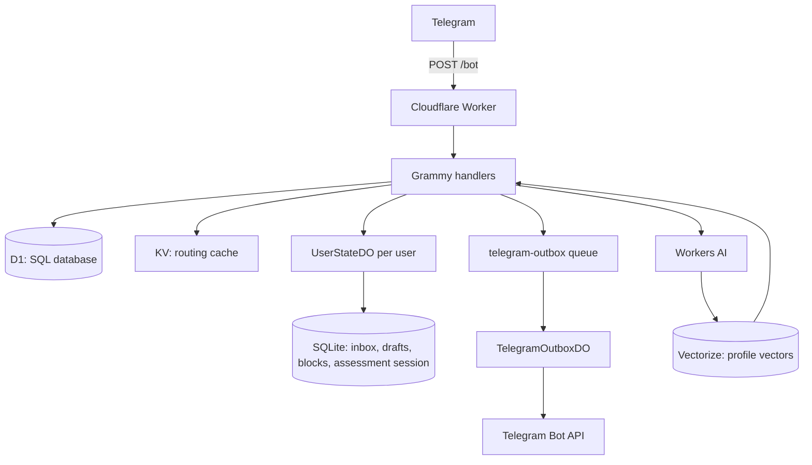
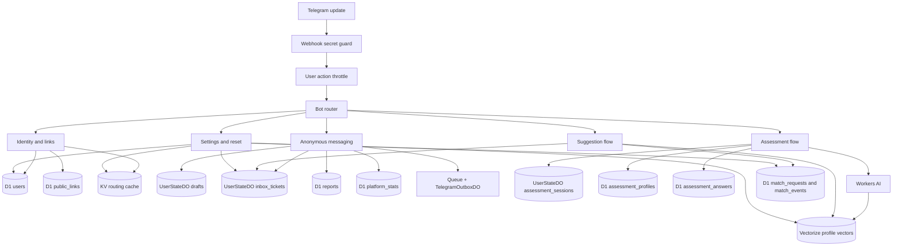
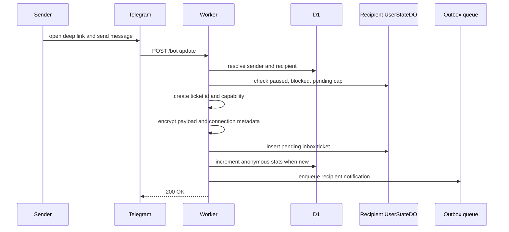
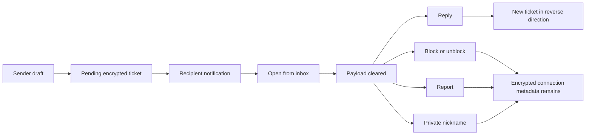
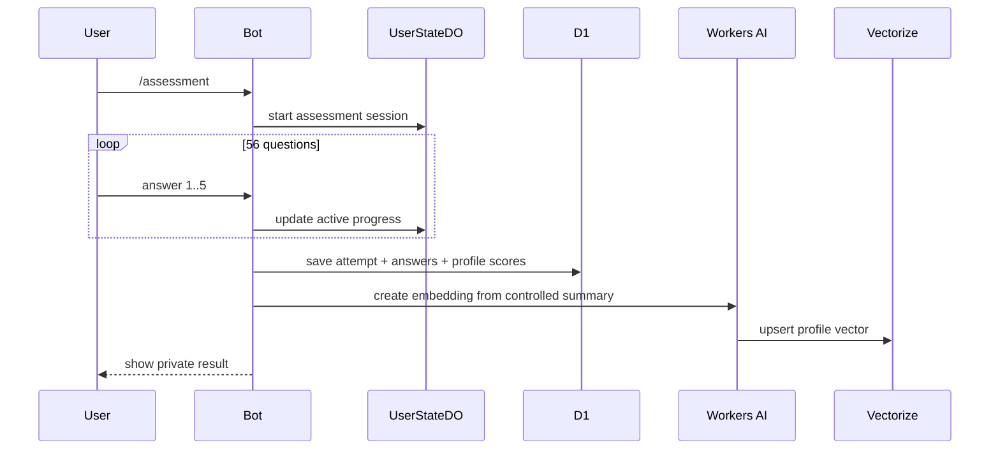
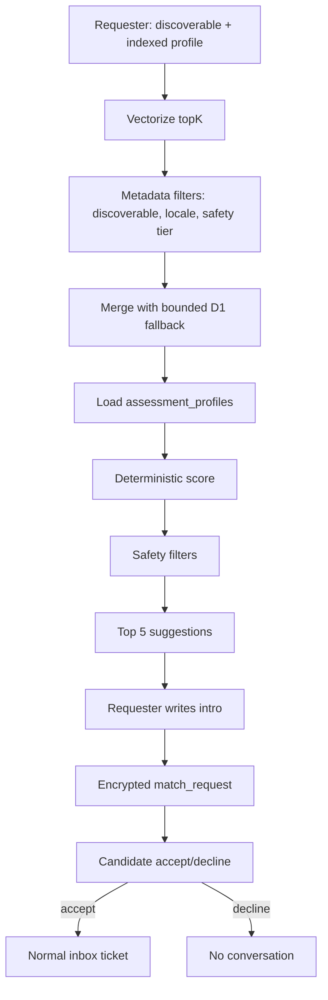
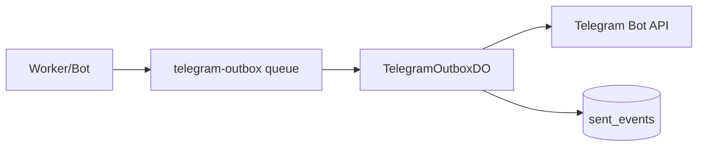

## نکونیموس چیست؟

Nekonymous یک ربات تلگرام فارسی‌محور برای پیام ناشناس و پیشنهاد گفت‌وگو است. هر کاربر یک لینک شخصی دارد. دیگران با همان لینک وارد bot می‌شوند و بدون نمایش یوزرنیم تلگرامشان پیام می‌فرستند. صاحب لینک پیام‌ها را داخل bot می‌خواند، ناشناس جواب می‌دهد، فرستنده را block یا report می‌کند، دریافت پیام را pause می‌کند، و برای آدم‌های تکراری nickname خصوصی می‌گذارد.

از بیرون، محصول ساده به نظر می‌رسد:

```txt
/start
  -> ساخت کاربر
  -> ساخت لینک شخصی
  -> دریافت پیام از deep link
  -> نمایش پیام در /inbox
```

اما همین مسیر کوچک، وقتی باید واقعاً قابل استفاده باشد، چند سؤال جدی دارد. اگر تلگرام یک update را دوباره بفرستد چه؟ اگر کاربر وسط نوشتن پیام برگردد چه؟ اگر گیرنده دیگر نمی‌خواهد پیام بگیرد چه؟ اگر کسی abuse کند چه؟ متن پیام کجا نگه داشته می‌شود و چقدر می‌ماند؟ وقتی قرار است آدم‌هایی با سبک گفت‌وگوی نزدیک‌تر به هم پیشنهاد شوند، داده اصلی کجاست؟

نکونیموس همین سؤال‌ها را به سه مسیر روشن تبدیل می‌کند: پیام ناشناس، ارزیابی سبک گفت‌وگو، و پیشنهاد گفت‌وگوی ناشناس.

UI اصلی محصول تلگرام است. Worker پیام‌های تلگرام را می‌گیرد، commandها و callbackها را پردازش می‌کند، داده‌ها را در storage مناسب نگه می‌دارد، ارزیابی را مدیریت می‌کند و پیشنهاد گفت‌وگو را اجرا می‌کند. وب‌سایت محصول فقط نقطه معرفی است؛ مسیر عملیاتی داخل خود bot می‌ماند.

این نوشته صفحه فروش محصول نیست. مستند فنی مسیر اصلی سیستم است: هر قطعه چه مسئولیتی دارد، داده از کجا وارد می‌شود، کجا ذخیره می‌شود، چه چیزی رمزگذاری می‌شود، و کدام مرزهای privacy باید شفاف بمانند.

لینک پروژه:

- [nekonymous.mohetios.dev](https://nekonymous.mohetios.dev)
- [mohetios/Nekonymous](https://github.com/mohetios/Nekonymous)

این lab مرجع مهندسی پروژه است. نوشته‌های blog می‌توانند درباره تجربه محصول، ایده، یا روایت کوتاه‌تر bot حرف بزنند و برای جزئیات معماری، storage، ticketing، privacy boundary و data flow به اینجا ارجاع بدهند.

برای همین، متن مثل دفترچه فنی یک سیستم در حال کار نوشته شده است. نه فقط «چه کاری انجام می‌دهد»، بلکه «داده کجا می‌رود»، «چرا این storage انتخاب شده»، «کدام ادعا نباید مطرح شود»، و «اگر کسی بخواهد همین مسیر را یاد بگیرد، از کدام لایه شروع کند».

مسیر خواندن این نوشته هم تقریباً همین است:

```mermaid
flowchart LR
  Idea[Product idea] --> Boundary[Privacy boundary]
  Boundary --> Architecture[Cloudflare architecture]
  Architecture --> MessageFlow[Anonymous message flow]
  MessageFlow --> Ticketing[Ticketing and capabilities]
  Ticketing --> Assessment[Assessment profile]
  Assessment --> Matching[Opt-in suggestions]
  Matching --> Ops[Outbox, reset, limits]
```



## مسئله محصول

پیام ناشناس ایده تازه‌ای نیست. یک نفر لینک می‌گیرد، نفر دیگر لینک را باز می‌کند، پیام می‌فرستد، و صاحب لینک بدون دیدن هویت مستقیم فرستنده پیام را می‌خواند.

برای کاربر، همین کافی است. نباید از او خواست اکانت جدید بسازد، وارد داشبورد شود، یا اپلیکیشن جدا نصب کند. تلگرام از قبل روی گوشی خیلی‌ها هست. deep link باز می‌شود، ربات start می‌شود، و کاربر همان‌جا پیامش را می‌نویسد.

اما ناشناس‌بودن دو لبه دارد. از یک طرف کمک می‌کند آدم‌ها راحت‌تر حرف بزنند. از طرف دیگر اگر کنترل نشود، می‌تواند به مزاحمت، پیام‌های تکراری، فشار بی‌جا یا سوءاستفاده برسد. برای همین block، report، pause، rate limit و nickname خصوصی بخشی از محصول‌اند، نه قابلیت‌های جانبی.

مسئله اصلی فقط «چطور یک Telegram bot بسازیم» نیست. مسئله دقیق‌تر این است:

> چطور می‌شود یک anonymous relay کوچک داشت که ادعای privacy بزرگ‌تر از واقعیت نکند، اما تا حد ممکن plaintext کمتری ذخیره کند، نشت هویت قابل مشاهده را کم کند، و همچنان ساده و عملیاتی بماند؟

نکونیموس پاسخ عملی همین سؤال است.

## نکونیموس دقیقاً چه کار می‌کند؟

سه مسیر اصلی داریم.

### ۱. پیام ناشناس

کاربر `/start` را می‌زند و یک لینک شخصی از جنس `t.me/Bot?start={slug}` می‌گیرد. هر کسی این لینک را باز کند، می‌تواند یک پیام ناشناس بفرستد. صاحب لینک پیام‌های pending را با `/inbox` می‌بیند و می‌تواند جواب بدهد، فرستنده را block/report کند، inbox را pause کند، یا برای فرستنده‌های تکراری nickname خصوصی بگذارد.

اینجا نکته مهم این است که reply هم یک مسیر جدا نیست. اگر گیرنده جواب بدهد، سیستم فقط یک پیام ناشناس جدید در جهت برعکس می‌سازد. همین باعث می‌شود هسته پیام ساده بماند.

### ۲. ارزیابی سبک گفت‌وگو

مسیر دوم، ارزیابی است. این بخش تست روان‌شناسی نیست؛ assessment یا ارزیابی سبک گفت‌وگو است.

ارزیابی شامل ۵۶ سؤال Likert در ۱۴ بُعد است. هدفش تشخیص روان‌شناسی، درمان، یا label زدن به کاربر نیست. فقط کمک می‌کند بفهمیم کاربر چه نوع گفت‌وگویی را ترجیح می‌دهد: آرام یا سریع، عمیق یا سبک، مستقیم یا نرم، مرزدار یا آزادتر، حساس‌تر یا آرام‌تر، راحت‌تر با ناشناس‌بودن یا محتاط‌تر.

نتیجه ارزیابی خصوصی است. کاربر خودش آن را می‌بیند. برای پیشنهاد گفت‌وگو هم فقط از scoreهای ساختاریافته و یک summary کنترل‌شده استفاده می‌شود، نه از نمایش کامل پاسخ‌ها به طرف مقابل.

### ۳. پیشنهاد گفت‌وگوی ناشناس

بعد از ارزیابی، کاربر می‌تواند discoverability را فعال کند. یعنی اجازه بدهد پروفایل گفت‌وگویش برای پیشنهادهای ناشناس استفاده شود. در UI فارسی پروژه، این بخش عمداً بیشتر با زبان «پیشنهاد گفت‌وگو» توضیح داده می‌شود، نه وعده‌ی «مچ کامل».

سیستم با Vectorize candidateهای نزدیک را پیدا می‌کند، اما تصمیم نهایی با کد deterministic گرفته می‌شود. similarity پایین دلیل حذف نیست؛ اگر فقط یک گزینه eligible وجود دارد، همان گزینه باید پیشنهاد شود. متن درست این نیست که «مچ خوب پیدا نشد»، بلکه این است: «نزدیک‌ترین گزینه موجود این است.»

پیشنهاد گفت‌وگو هم بدون consent طرف مقابل conversation نمی‌سازد. درخواست‌کننده یک intro می‌نویسد. طرف مقابل برچسب نزدیک‌بودن، چند دلیل کوتاه، و intro را می‌بیند. فقط اگر قبول کند، intro به یک پیام ناشناس عادی داخل inbox تبدیل می‌شود.

## چرا تلگرام؟

تلگرام برای این محصول طبیعی است، چون اصطکاک را کم می‌کند. کاربر با همان identity و session تلگرام وارد می‌شود. لینک شخصی هم با deep link خود تلگرام کار می‌کند. UI خود bot کافی است: چند دکمه، چند command، چند پیام کوتاه.

این انتخاب البته هزینه هم دارد. چون پیام از Telegram عبور می‌کند و Worker هم هنگام پردازش متن خام را می‌بیند. پس نکونیموس را نباید به‌عنوان پیام‌رسان end-to-end encrypted معرفی کرد.

ادعای دقیق‌تر این است:

```txt
Nekonymous is a hosted anonymous relay.
It reduces visible identity leakage inside the bot UI.
It encrypts sensitive payloads at rest.
It does not remove Telegram or the Worker runtime from the trust boundary.
```

این جمله شاید از نظر تبلیغاتی هیجان کمتری داشته باشد، اما برای محصولی که با اعتماد و ناشناس‌بودن سروکار دارد، دقیق‌تر و سالم‌تر است.

## چرا Cloudflare؟

در این معماری، قطعه‌های لازم نزدیک هم می‌مانند. قرار نیست برای هر نیاز یک سرویس جدا ساخته شود: یک سرور برای webhook، یک دیتابیس جدا، یک queue جدا، یک worker جدا برای ارسال پیام، یک سرویس جدا برای vector search، و بعد کلی glue code برای وصل‌کردنشان.

Cloudflare برای این مدل پروژه مناسب است، نه چون همه چیز را جادویی حل می‌کند، بلکه چون چند قطعه لازم را نزدیک هم می‌گذارد. Worker ورودی تلگرام را می‌گیرد. D1 مثل یک دیتابیس SQL معمولی برای جدول‌های اصلی کار می‌کند. Durable Object برای state زنده هر کاربر استفاده می‌شود. KV فقط دفترچه lookup سریع است. Queue برای کارهایی است که لازم نیست webhook را نگه دارند. Workers AI و Vectorize برای ارزیابی و پیشنهاد گفت‌وگو استفاده می‌شوند.

اگر ساده نگاه کنیم:

| اسم فنی | اگر فنی نباشیم یعنی چه؟ | نقش در نکونیموس |
| --- | --- | --- |
| Cloudflare Worker | همان برنامه اصلی که روی درخواست‌ها اجرا می‌شود | webhook تلگرام، routing، اجرای منطق bot |
| D1 | دیتابیس SQL؛ مثل یک SQLite serverless با جدول و query | user، لینک‌ها، ارزیابی، پیشنهادهای گفت‌وگو، گزارش‌ها |
| Durable Object | یک state شخصی و مرتب برای هر کاربر | inbox، draft، block، session ارزیابی |
| KV | یک دفترچه key-value سریع؛ مثل `key -> value` | فقط cache برای `slug -> userId` و `telegramHash -> userId` |
| Queue | صف کارهای غیرهم‌زمان | ارسال پیام‌های غیرحیاتی به تلگرام |
| OutboxDO | نگهبان ارسال‌های تلگرام | جلوگیری از ارسال تکراری در retryها |
| Workers AI | مدل هوش مصنوعی روی Cloudflare | تبدیل summary ارزیابی به embedding |
| Vectorize | دیتابیس برداری برای شباهت معنایی | پیدا کردن candidateهای نزدیک برای پیشنهاد گفت‌وگو |

قاعده طراحی این است:

```txt
Worker برای ورود و routing.
D1 برای داده‌ای که باید query شود.
Durable Object برای state داغ و ترتیبی.
KV برای cache و lookup سریع.
Queue برای کاری که نباید webhook را نگه دارد.
Workers AI + Vectorize برای discovery، نه تصمیم نهایی.
```

این تفکیک جلوی رشد بی‌دلیل معماری را می‌گیرد. هر بار داده‌ای قرار است در KV برود، سؤال اصلی این است: آیا این داده فقط cache است یا حقیقت سیستم؟ اگر حقیقت سیستم است، جای آن KV نیست.

## تصویر اصلی معماری

قبل از اینکه وارد جزئیات شویم، بهتر است تصویر اصلی روشن باشد.

نکونیموس از نظر محصول یک ربات تلگرام است. از نظر داده، سه جریان دارد: پیام ناشناس، ارزیابی سبک گفت‌وگو، و پیشنهاد گفت‌وگوی ناشناس. همه این‌ها از یک Worker وارد می‌شوند، اما داده‌هایشان در یک جا ذخیره نمی‌شود.



این diagram همه جزئیات را نشان نمی‌دهد، اما الگوی طراحی را می‌دهد:

- Worker فقط دروازه است.
- D1 دیتابیس SQL اصلی است.
- UserStateDO حافظه زنده هر کاربر است.
- KV فقط cache و lookup سریع است.
- Queue مسیر ارسال‌های غیرحیاتی است.
- Vectorize موتور حکم دادن نیست؛ فقط جست‌وجوی معنایی را شروع می‌کند.

برای دیدن سیستم از زاویه data flow، تصویر کمی دقیق‌تر این است:



این diagram را نباید به‌عنوان dependency graph کد دید. بیشتر یک نقشه یادگیری است: هر update تلگرام از یک ورودی مشترک وارد می‌شود، ولی خیلی زود بر اساس مسئولیتش به storage مناسب خودش می‌رود.

| جریان | hot path چه می‌کند؟ | حقیقت داده کجاست؟ | چه چیزی عمداً نیست؟ |
| --- | --- | --- | --- |
| پیام ناشناس | user و link را resolve می‌کند، draft یا ticket می‌سازد، payload را رمزگذاری می‌کند | `UserStateDO.inbox_tickets` برای ticket؛ D1 برای identity/report/stats | transcript پیام در D1 |
| ارزیابی | جواب‌ها را مرحله‌به‌مرحله می‌گیرد و progress فعال را نگه می‌دارد | session در DO؛ نتیجه و answerهای Likert در D1 | تشخیص پزشکی یا شخصیت‌شناسی |
| پیشنهاد گفت‌وگو | candidate را پیدا می‌کند، hard filter می‌زند، intro را رمزگذاری می‌کند | workflow در D1؛ discovery در Vectorize | شروع conversation بدون accept |
| ارسال خروجی | پاسخ‌های لازم را مستقیم می‌فرستد، notificationهای غیرحیاتی را queue می‌کند | `TelegramOutboxDO.sent_events` برای idempotency | promise شناور و بی‌رد |

از نظر محصول هم همه چیز باید سبک بماند. نه شبکه اجتماعی کامل. نه dating platform رسمی. نه پیام‌رسان کامل. نه ادعای privacy بزرگ‌تر از واقعیت. یک hosted anonymous relay روی تلگرام، با encrypted-at-rest storage، ارزیابی سبک گفت‌وگو، و پیشنهاد گفت‌وگوی opt-in.

## سطح bot

همه چیز داخل خود تلگرام اتفاق می‌افتد. محصول از همان محیطی کار می‌کند که کاربر قرار است در آن پیام بگیرد.

منوی اصلی ساده است:

```txt
🔗 لینک من
🧭 پیشنهاد گفت‌وگو
⚙️ تنظیمات
```

داخل پیشنهاد گفت‌وگو، کاربر می‌تواند پروفایل خودش را ببیند، گزینه‌های نزدیک را پیدا کند، درخواست‌های در انتظار را ببیند، یا ارزیابی را شروع/تکرار کند:

```txt
👤 پروفایل گفت‌وگو
🔎 پیدا کردن گزینه‌ها
📥 درخواست‌های گفت‌وگو
📝 شروع ارزیابی / 📝 ارزیابی دوباره
↩️ بازگشت
```

تنظیمات هم فقط یک صفحه جانبی نیست. چند کار مهم آنجاست: display name، pause/resume inbox، پاک‌کردن blockها، reset match history، about/privacy، technical notes، و پاک‌کردن حساب.

commandهای اصلی:

```txt
/start
/inbox
/settings
/assessment
/match
/match_system
```

اصطلاح درست این بخش assessment است؛ چون هدف، ارزیابی سبک گفت‌وگو است، نه تست روان‌شناسی.

## مسیر پیام ناشناس

مسیر پیام از deep link شروع می‌شود:

```txt
https://t.me/{bot}?start={slug}
```

وقتی کاربر این لینک را باز می‌کند، bot باید چند چیز را بفهمد:

- فرستنده کیست؟
- این slug متعلق به کدام گیرنده است؟
- فرستنده دارد به خودش پیام می‌دهد یا نه؟
- گیرنده pause کرده؟
- گیرنده این فرستنده را block کرده؟
- فرستنده rate limit شده؟
- inbox گیرنده جا دارد؟

در این مرحله هنوز ticket ساخته نمی‌شود، چون هنوز پیامی وجود ندارد. سیستم فقط یک draft برای فرستنده می‌سازد، یعنی یک state موقت که می‌گوید «پیام بعدی این کاربر قرار است برای این گیرنده باشد».

جریان ساده:

```txt
/start {slug}
  -> resolve sender from Telegram
  -> resolve recipient from link slug
  -> reject self-message
  -> check recipient can receive
  -> create draft for sender
  -> wait for sender message
```

وقتی متن یا media می‌رسد:

```txt
sender sends message
  -> read sender draft
  -> check rate limit
  -> check recipient pause/block/inbox cap
  -> create ticket_id + capability + ref
  -> encrypt payload
  -> encrypt connection metadata
  -> insert inbox ticket in recipient UserStateDO
  -> clear sender draft
  -> increment anonymous platform_stats if not duplicate
  -> notify recipient
```

همان مسیر اگر با sequence دیده شود، واضح‌تر است:



نقطه مهم این است که message body در D1 ذخیره نمی‌شود. جدول conversation جداگانه‌ای هم وجود ندارد. متن پیام و route metadata لازم برای actionها داخل ticket رمزگذاری‌شده در `UserStateDO` گیرنده می‌ماند. D1 برای identity، link، report، ارزیابی، پیشنهاد گفت‌وگو و آمار aggregate استفاده می‌شود، نه برای transcript پیام‌های ناشناس.

## ticket یعنی چه؟

در نکونیموس هر پیام ناشناس یک ticket است.

ticket فقط متن پیام نیست. یک reference عملیاتی است برای اینکه گیرنده بتواند روی همان ارتباط action انجام بدهد:

- reply
- block
- report
- nickname

سه چیز مهم داریم:

| شناسه | نقش |
| --- | --- |
| `ticket_id` | شناسه داخلی، طولانی و random؛ برای crypto context و tracking |
| `capability` | token کوتاه و random که داخل دکمه تلگرام قرار می‌گیرد |
| `ref` | HMAC lookup hash همان capability؛ فقط داخل inbox همان گیرنده معنی دارد |

callback data تلگرام کوتاه می‌ماند:

```txt
o:{capability}   open
r:{capability}   reply
b:{capability}   block
u:{capability}   unblock
rp:{capability}  report
n:{capability}   nickname
```

این بخش کوچک است، اما خیلی مهم است. نباید داخل callback اطلاعات حساس بگذاریم؛ نه `sender_user_id`، نه `recipient_user_id`، نه `conversation_id`، نه `ticket_id`. callback از UI تلگرام برمی‌گردد و باید فقط یک capability کوتاه باشد. مقدار خام capability در دکمه تلگرام است؛ داخل DO فقط lookup hash آن ذخیره می‌شود.

مدل درست‌تر:

```txt
callback r:{capability}
  -> current user از Telegram resolve می‌شود
  -> capability به lookup hash تبدیل می‌شود
  -> ticket از UserStateDO همان user خوانده می‌شود
  -> ownership verify می‌شود
  -> connection metadata decrypt می‌شود
  -> action اجرا می‌شود
```

این یعنی اگر کسی یک capability را حدس بزند یا از جایی ببیند، هنوز کافی نیست. capability فقط در کنار user فعلی معنی دارد و action باید با مالکیت همان ticket تأیید شود.

از نگاه lifecycle، ticket این‌طور حرکت می‌کند:



اینجا دو چیز از هم جدا می‌شوند: `payload_ciphertext` که کوتاه‌عمر است و بعد از delivery پاک می‌شود، و `connection_ciphertext` که برای actionهای بعدی لازم است. همین جداسازی باعث می‌شود inbox فقط یک لیست پیام نباشد؛ یک workspace عملیاتی کوچک باشد.

## رمزگذاری، بدون ادعای اضافه

نکونیموس end-to-end encrypted نیست. این جمله باید وسط متن بماند، نه ته footnote.

Telegram پیام اولیه را می‌بیند. Worker هنگام پردازش، متن خام را می‌بیند. کسی که runtime و secretها را کنترل کند، بخشی از trust boundary است.

پس رمزگذاری در نکونیموس برای حذف همه trust نیست. برای کم‌کردن plaintext ذخیره‌شده است.

هدف‌ها:

- Telegram username دو طرف در UI لو نرود.
- Telegram user id خام به عنوان public id استفاده نشود.
- chat id تلگرام encrypted ذخیره شود.
- متن پیام در storage به شکل plaintext نماند.
- payload بعد از delivery از inbox پاک شود.
- فقط connection metadata encrypted باقی بماند.
- match intro هم at rest encrypted باشد.

شکل ذهنی crypto این است:

```txt
APP_HMAC_PEPPER + telegram_user_id
  -> HMAC-SHA-256
  -> telegram_user_hash

APP_MASTER_KEY + ticket_id
  -> HKDF-SHA-256
  -> AES-256-GCM key
  -> payload_ciphertext + connection_ciphertext
```

دو نوع ciphertext اصلی وجود دارد:

| داده رمزگذاری‌شده | معنی ساده | چرا لازم است؟ |
| --- | --- | --- |
| `payload_ciphertext` | خود پیام | تا قبل از delivery پیام به شکل plaintext ذخیره نشود |
| `connection_ciphertext` | metadata ارتباط | برای reply/block/report/nickname بعد از delivery لازم است |

بعد از اینکه گیرنده `/inbox` را می‌زند، payload decrypt و نمایش داده می‌شود، بعد از storage پاک می‌شود. اما connection metadata باقی می‌ماند، چون بدون آن reply یا block بعدی دیگر نمی‌فهمد باید روی چه کسی عمل کند.

این tradeoff آگاهانه است:

```txt
payload کوتاه‌عمر است.
connection metadata طولانی‌تر می‌ماند، ولی encrypted است.
```

## مالکیت داده‌ها

در نکونیموس هر داده owner مشخص دارد.

| داده | کجا ذخیره می‌شود؟ | توضیح ساده |
| --- | --- | --- |
| user identity | D1 `users` | جدول اصلی کاربران در دیتابیس SQL |
| encrypted chat id | D1 `users` | برای اینکه بتوانیم به کاربر پیام بفرستیم، اما chat id خام ذخیره نشود |
| public slug | D1 `public_links` + KV | D1 حقیقت اصلی است؛ KV فقط lookup سریع است |
| reports | D1 `reports` | گزارش‌های ساختاریافته؛ جزئیات اختیاری رمزگذاری می‌شود |
| inbox tickets | UserStateDO | state زنده و مرتب inbox هر کاربر |
| drafts | UserStateDO | پیام نیمه‌کاره یا مرحله فعلی کاربر |
| blocks / labels | UserStateDO | blockهای hashشده و nicknameهای رمزگذاری‌شده همان گیرنده |
| rate limits | UserStateDO | throttle عمومی inputهای کاربر |
| assessment session | UserStateDO | پیشرفت فعال ارزیابی |
| assessment profile | D1 `assessment_profiles` | scoreهای ساختاریافته کاربر |
| assessment answers | D1 `assessment_answers` | جواب‌های Likert؛ متن آزاد نیستند |
| match requests | D1 `match_requests` | چرخه درخواست، accept/decline، expiry |
| match intro | D1 encrypted | متن intro تا قبل از accept، رمزگذاری‌شده |
| vector embeddings | Vectorize | بردارهای معنایی profile برای جست‌وجوی similarity |
| platform stats | D1 `platform_stats` | آمار کلی بی‌نام، بدون user id |

این جدول برای طراحی محصول هم مهم است. مثلاً اگر کاربر حسابش را پاک کند، D1 rowهای وابسته به خودش پاک می‌شوند، DO مربوط به خودش purge می‌شود، vector حذف می‌شود، و KV lookupها هم پاک می‌شوند. اما `platform_stats` مثل تعداد کل پیام‌های relayشده، چون به user وصل نیست، باقی می‌ماند.

## ارزیابی سبک گفت‌وگو

برای پیشنهاد گفت‌وگوی ناشناس، سیستم باید بداند هر کاربر چه سبک گفت‌وگویی را ترجیح می‌دهد.

نکونیموس تست شخصیت سنگین یا label سرگرمی‌محور نیست. ارزیابی قرار نیست تشخیص روان‌شناسی بدهد. therapy نیست. ارزیابی پزشکی نیست.

ارزیابی فقط یک ابزار محصولی است برای فهمیدن سبک گفت‌وگو:

- گفت‌وگوی عمیق یا سبک؟
- جواب سریع یا آرام؟
- مستقیم یا نرم؟
- مرزدار یا آزادتر؟
- ناشناس‌بودن راحت یا محتاط؟
- حساسیت احساسی بیشتر یا regulation بهتر؟
- نیاز به شنیده‌شدن یا راه‌حل سریع؟

ارزیابی شامل ۵۶ سؤال در ۱۴ بُعد است. active progress داخل `UserStateDO` نگه داشته می‌شود، چون state موقت و لحظه‌ای است. وقتی کاربر ارزیابی را کامل می‌کند، نتیجه در D1 ذخیره می‌شود: attemptها، answerها، profile و scoreها.

مسیر ساده:



یک نکته مهم: embedding از raw answer ساخته نمی‌شود. اول یک summary کنترل‌شده ساخته می‌شود؛ متنی شبیه این:

```txt
Language: fa.
Conversation profile:
- high boundary respect
- medium emotional sensitivity
- high emotional regulation
- prefers slower, thoughtful reply pace
- comfortable with anonymous conversation
```

این متن برای discovery کافی است، ولی همه جزئیات پاسخ‌ها را وارد vector index نمی‌کند.

## پیشنهاد گفت‌وگوی ناشناس

پیشنهاد گفت‌وگو opt-in است.

کاربر باید ارزیابی را کامل کند، profile ساخته شود، vector index شود، و خودش discoverable بودن را فعال کند. تا وقتی این اتفاق نیفتاده، نباید در پیشنهادهای دیگران ظاهر شود.

Vectorize در این مدل فقط نقطه شروع است. می‌شود آن را مثل یک جست‌وجوی معنایی دید: «از بین profileهایی که اجازه داده‌اند دیده شوند، کدام‌ها از نظر summary گفت‌وگو به این کاربر نزدیک‌ترند؟» اما این جواب نهایی نیست. query اولیه `topK=30` است و وقتی index خلوت باشد، سیستم یک fallback محدود از D1 هم اضافه می‌کند.

بعد از Vectorize، سیستم candidateها را با داده‌های D1 کامل‌تر می‌کند، hard filterها را اعمال می‌کند، و یک score deterministic می‌سازد.



Hard filterها از similarity مهم‌ترند:

- خود کاربر حذف می‌شود.
- کاربر inactive حذف می‌شود.
- profile ناقص حذف می‌شود.
- discoverable نبودن یعنی حذف.
- block و report باید محترم شمرده شود.
- pending request تکراری ساخته نمی‌شود.
- safety restriction بالاتر از score است.
- requestهای قدیمی expire می‌شوند و pairهای تازه decline/accept شده cooldown دارند.

Similarity فقط زبان پیشنهاد است، نه حکم قطعی. UI هم score خام را به عنوان درصد سازگاری قطعی نشان نمی‌دهد؛ بیشتر از برچسب کیفیت و دلیل‌های کوتاه استفاده می‌کند.

اگر فقط یک نفر eligible وجود دارد، سیستم نباید بگوید «مچ خوبی پیدا نشد». جمله درست‌تر این است:

```txt
نزدیک‌ترین گزینه موجود این است.
```

این تفاوت کوچک است، ولی روی حس محصول اثر دارد. سیستم نباید تظاهر کند oracle است.

## چرا match request مستقیم گفت‌وگو نمی‌سازد؟

این مرز مهم است.

اگر user A یک candidate را دید و intro نوشت، user B نباید ناگهان وارد conversation شود. اول باید درخواست را ببیند و accept یا decline کند.

مدل:

```txt
requester chooses candidate
  -> writes intro
  -> intro encrypted in match_requests
  -> candidate receives quality label + safe reasons + intro
  -> candidate accepts or declines
```

فقط بعد از accept:

```txt
accepted match request
  -> decrypt intro
  -> call sendAnonymousMessage()
  -> create normal inbox ticket
```

این یعنی feature پیشنهاد گفت‌وگو کنار سیستم پیام ننشسته؛ روی همان مسیر پیام سوار شده است. نتیجه‌اش ساده‌تر است: intro بعد از accept مثل یک پیام ناشناس عادی رفتار می‌کند.

## پاک کردن حساب

پاک کردن حساب واقعی است، نه فقط soft delete.

وقتی کاربر تأیید می‌کند، مسیر `clearUserAccountAndRecreate` این کارها را انجام می‌دهد:

1. state داخل Durable Object کاربر را پاک می‌کند؛ inbox، draftها، blockها، session ارزیابی و چیزهای شبیه این.
2. rowهای D1 مربوط به کاربر را hard-delete می‌کند؛ assessment، match، report، link و خود user.
3. vector مربوط به profile را از Vectorize حذف می‌کند.
4. lookupهای KV مثل `tg:{hash}` و `link:{slug}` را پاک می‌کند.
5. یک internal user id و public link جدید می‌سازد.

تنها چیزی که باقی می‌ماند، آمار aggregate بی‌نام است؛ مثلاً تعداد کل پیام‌های relayشده یا تعداد کل match requestها. این‌ها به user وصل نیستند و برای نمایش وضعیت کلی پلتفرم استفاده می‌شوند.

## Outbox و idempotency

Telegram output نقطه‌ای است که معمولاً دیر جدی گرفته می‌شود.

Webhook باید سریع جواب بدهد. اما ارسال پیام به Telegram ممکن است fail شود، retry بخواهد، یا duplicate شود. برای همین بخشی از خروجی‌ها از مسیر outbox عبور می‌کنند.



`TelegramOutboxDO` وظیفه دارد sendهای قبلی را با `idempotency_key` بشناسد. اگر همان job دوباره رسید، لازم نیست دوباره همان پیام را بفرستد. مسیر notificationهای غیرحیاتی از queue عبور می‌کند؛ چیزهایی که پاسخ مستقیم webhook به آن‌ها وابسته است همان‌جا await می‌شوند.

اصل مهم این است:

```txt
کاری که پاسخ webhook به آن وابسته نیست، نباید بی‌دلیل webhook را نگه دارد.
```

همه چیز لازم نیست queue شود. اما وقتی side effect غیرحیاتی است، outbox مدل بهتری می‌دهد.

## ساختار پروژه

ساختار پروژه باید ذهنی و قابل دنبال‌کردن باشد:

```txt
src/
├── index.ts
├── bot/                    # Grammy wiring, menus, keyboards, router
├── features/
│   ├── identity/           # users, links, hard delete
│   ├── messaging/          # relay, inbox, reports
│   ├── settings/
│   ├── assessment/         # questionnaire, profile, vectors
│   ├── matching/
│   └── platform/           # platform_stats
├── storage/                # UserState + Outbox DOs and clients
├── queues/
├── ticketing/              # crypto, capabilities, ticket envelopes
├── i18n/
└── utils/

migrations/
tools/                      # verify-*, flush-remote.*
docs/                       # matching architecture + threat model
```

این ساختار برای این است که وقتی کسی codebase را باز می‌کند، بداند کجا دنبال چه چیزی بگردد. bot handlerها در `bot` و featureها هستند. persistence داخل `storage` و D1 migrationهاست. crypto و capabilityها در `ticketing` هستند. assessment و matching هم featureهای مستقل‌اند، نه چند helper پراکنده.

## مرزهای محصول

این بخش به اندازه featureها مهم است. نکونیموس یک پیام‌رسان کامل، شبکه اجتماعی، یا dating platform نیست. محصول روی یک کار مشخص می‌ایستد: پیام ناشناس در تلگرام، کنترل abuse، ارزیابی سبک گفت‌وگو، و پیشنهاد گفت‌وگوی opt-in.

مرزهای اصلی:

- public HTML یا marketing page داخل Worker وجود ندارد.
- SPA یا dashboard جدا مسیر عملیاتی محصول نیست.
- متن پیام ناشناس در D1 transcript نمی‌شود.
- KV source of truth نیست.
- پیشنهاد گفت‌وگو بدون consent طرف مقابل conversation نمی‌سازد.
- auto-match وجود ندارد.
- public profile وجود ندارد.
- payment، subscription، boost و ranking پولی داخل هسته محصول نیستند.
- محصول ادعای end-to-end encryption، zero-knowledge، یا ناشناسی کامل ندارد.
- ارزیابی سبک گفت‌وگو diagnosis، therapy، یا شخصیت‌شناسی قطعی نیست.
- AI حکم نهایی نمی‌دهد؛ فقط برای embedding و discovery کمک می‌کند.

این مرزها محصول را کوچک‌تر نشان نمی‌دهند. برعکس، دقیق‌ترش می‌کنند. وقتی محصول با ناشناس‌بودن و اعتماد سروکار دارد، ادعاهای محدود اما درست از featureهای پر سروصدا مهم‌ترند.

## جمع‌بندی

نکونیموس روی یک core مشخص می‌ایستد:

- پیام ناشناس
- inbox
- reply
- block/report/nickname
- pause/resume
- ارزیابی سبک گفت‌وگو با ۵۶ سؤال در ۱۴ بُعد
- profile indexing با Workers AI و Vectorize
- پیشنهاد گفت‌وگوی ناشناس opt-in
- match request با accept/decline
- پاک‌کردن واقعی حساب
- platform stats بی‌نام

کل مسیر را می‌شود در چند خط نگه داشت:

```txt
پیام ناشناس ساده شروع می‌شود.
ساده ماندن سخت است.
هر state باید owner داشته باشد.
privacy باید کمتر ادعا کند و بهتر عمل کند.
matching باید با consent جلو برود.
AI کمک می‌کند، اما حکم نمی‌دهد.
```

این همان شکل فنی Nekonymous است: یک bot کوچک، با معماری قابل توضیح، برای گفت‌وگوهای ناشناس که قرار نیست بیشتر از چیزی که هست ادعا کند.
