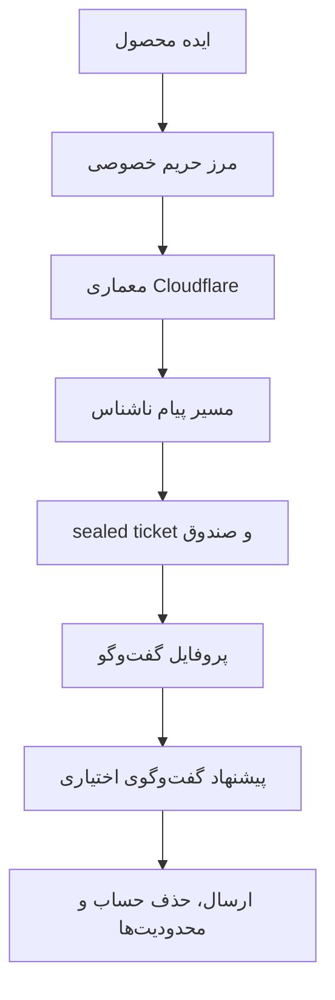
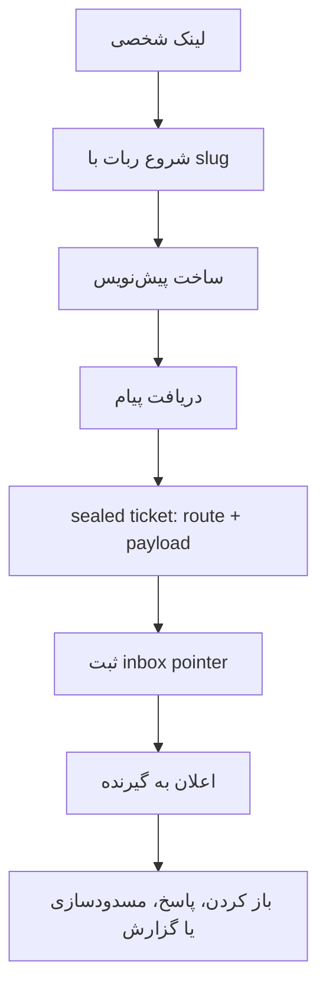
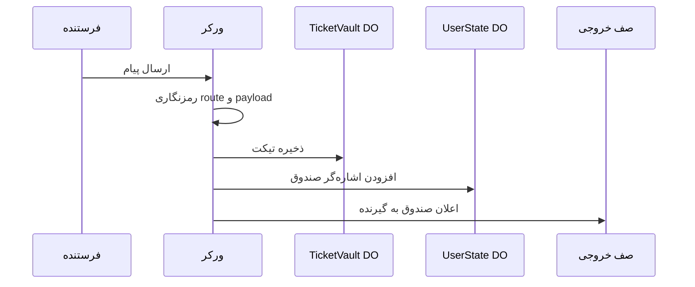
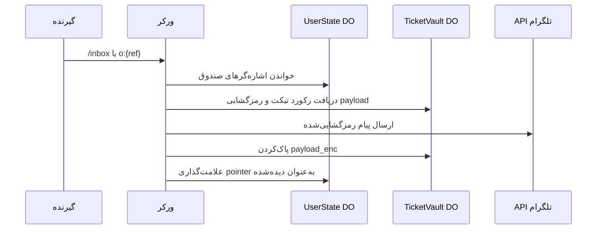
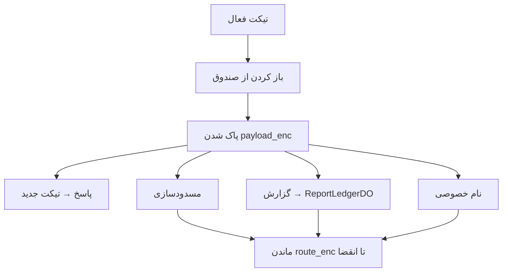
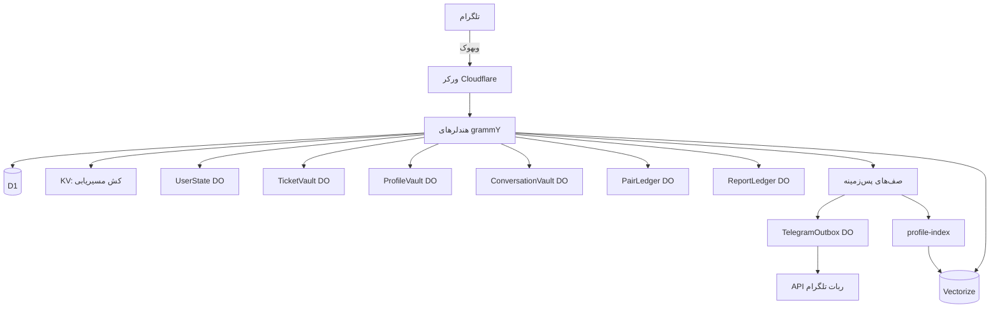
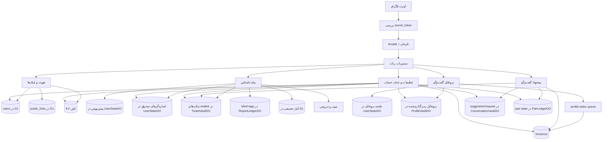
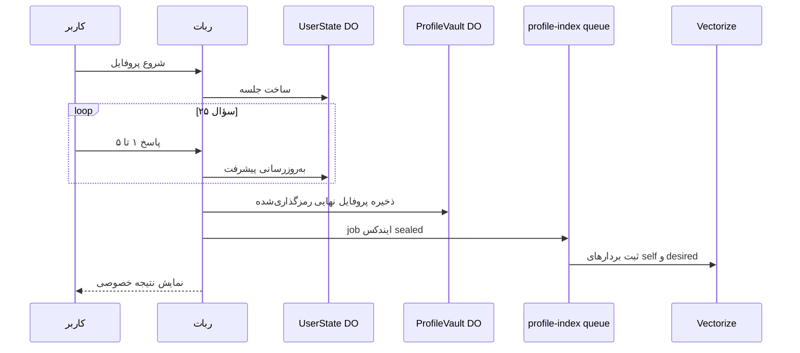
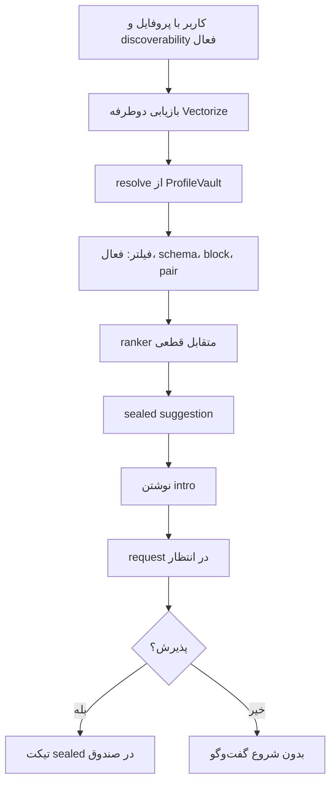
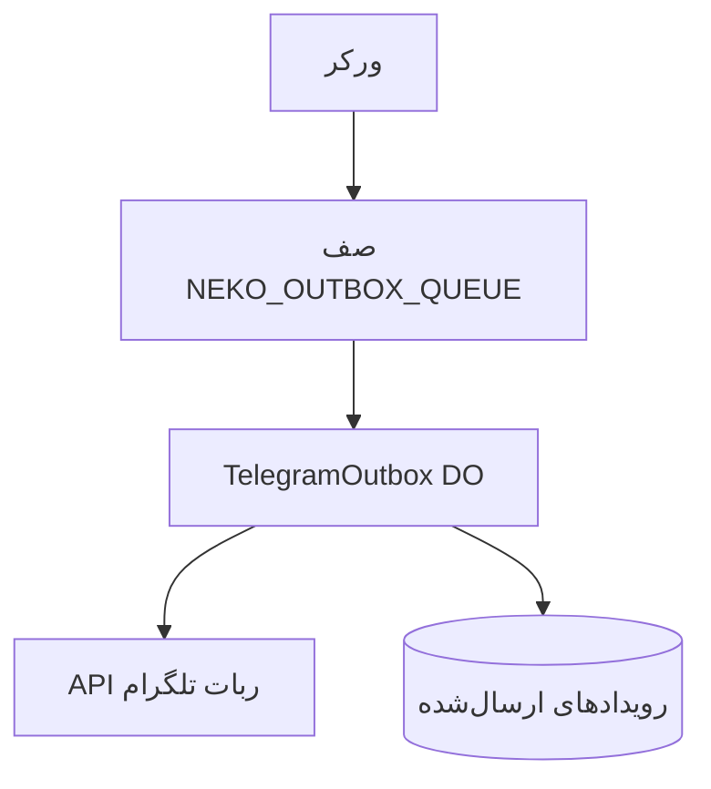

## ۱. چرا این پروژه ساخته شد

پیام ناشناس در تلگرام ایده ساده‌ای است: یک لینک شخصی، یک پیام بدون نمایش نام کاربری. اما وقتی چنین سیستمی واقعاً استفاده می‌شود، سؤال‌ها جدی می‌شوند. اگر تلگرام یک update را دوباره بفرستد چه؟ متن پیام کجا می‌ماند و چقدر؟ آیا باید یک گراف دائمی sender → recipient در دیتابیس نگه داشت؟ و اگر قرار است گفت‌وگوهای ناشناس پیشنهاد شوند، مرز بین «کمک به شروع گفت‌وگو» و «ادعای سازگاری یا دوستیابی» کجاست؟

ریشه طراحی نکونیموس از همان نقطه‌ای می‌آید که تجربه‌ی پیام ناشناس در وب فارسی برای خیلی‌ها ترک برداشت: هک شدن یک ربات ناشناس معروف و روشن شدن این واقعیت که ابزار «ناشناس» می‌تواند مقدار زیادی داده شخصی و ارتباطی را نگه دارد.

ایده پیام ناشناس هنوز جذاب است. به شروع گفت‌وگو کمک می‌کند، اصطکاک را کم می‌کند، و نشان داده که برای جامعه فارسی مصرف واقعی دارد. اما بعد از چنین اتفاقی، سؤال محصول عوض می‌شود. دیگر فقط نمی‌پرسیم «چطور پیام را برسانیم؟» می‌پرسیم «چطور پیام را برسانیم، بدون اینکه سیستم بیشتر از نیازش بداند؟»

نکونیموس از همین سؤال‌ها شروع شد: یک relay کوچک و عملیاتی که ادعای privacy بزرگ‌تر از واقعیت نکند، داده ذخیره‌شده را تا حد ممکن کم نگه دارد، و در عین حال برای کاربر فارسی‌زبان قابل استفاده بماند.

لینک‌ها:

- [mohetios.github.io/Nekonymous](https://mohetios.github.io/Nekonymous/)
- [t.me/nekonymous_bot](https://t.me/nekonymous_bot)

این نوشته صفحه فروش محصول نیست. مستند فنی مسیر اصلی سیستم است: هر قطعه چه مسئولیتی دارد، داده از کجا وارد می‌شود، کجا ذخیره می‌شود، چه چیزی رمزگذاری می‌شود، و کدام مرزهای privacy باید شفاف بمانند. نوشته‌های blog می‌توانند درباره تجربه محصول یا روایت کوتاه‌تر bot حرف بزنند؛ برای جزئیات معماری، storage، ticketing و data flow به اینجا ارجاع بدهند.

مسیر خواندن:



## ۲. نکونیموس چیست

نِکونیموس یک ربات پیام ناشناس فارسی‌محور است؛ برای ساخت لینک شخصی، دریافت پیام ناشناس، پاسخ ناشناس، ساخت پروفایل گفت‌وگو و پیشنهاد گفت‌وگوی اختیاری.

سطح محصول:

```txt
/start          → لینک ناشناس شخصی
deep link       → ارسال پیام ناشناس
/inbox          → صندوق پیام‌ها
پاسخ / مسدود / گزارش / نام خصوصی
/assessment     → پروفایل گفت‌وگو (۲۵ سؤال، ۸ بُعد، نسخه v2)
/match          → پیشنهاد گفت‌وگو (opt-in)
/settings       → توقف دریافت، نام نمایشی، پاک کردن حساب
```

UI اصلی داخل تلگرام است. یک Worker واحد روی Cloudflare webhook را می‌گیرد، منطق ربات را اجرا می‌کند و با D1، Durable Object، KV، Queue و Vectorize کار می‌کند. وب‌سایت محصول فقط نقطه معرفی است؛ مسیر عملیاتی داخل خود bot می‌ماند.

سه اصل محصول:

| اصل                    | معنی در سیستم                                                                              |
| ---------------------- | ------------------------------------------------------------------------------------------ |
| تیکتینگ کم‌داده        | پیام ناشناس transcript دائمی نیست؛ sealed ticket با `route_enc` و `payload_enc` موقت است.  |
| پیشنهاد گفت‌وگوی محتاط | سیستم کمک می‌کند شروع گفت‌وگو کمتر تصادفی باشد، اما سازگاری قطعی یا رابطه پیشنهاد نمی‌دهد. |
| سرویس کوچک و پایدار    | Worker، D1، Durable Object، KV و Queue هرکدام فقط همان کاری را انجام می‌دهند که لازم است.  |

## ۳. نکونیموس چه چیزی نیست

این مرزها عمداً در copy و معماری حفظ می‌شوند:

- پیام‌رسان رمزنگاری سرتاسری (E2EE) نیست
- zero-knowledge یا ادعای ناشناسی کامل ندارد
- اپلیکیشن dating یا شبکه اجتماعی کامل نیست
- تست شخصیت، تشخیص روان‌شناختی یا سیستم سازگاری دقیق نیست
- وب‌اپ یا SPA عمومی ندارد

مرز اعتماد شفاف:

> نکونیموس کاربران را در جریان معمول محصول از هم پنهان می‌کند، داده‌های ذخیره‌شده را تا حد ممکن کم نگه می‌دارد، داده‌های حساس ذخیره‌شده را در حد پیاده‌سازی فعلی در حالت سکون رمزنگاری می‌کند، و شفاف می‌گوید که تلگرام و Worker هنگام پردازش پیام‌ها متن پیام را می‌بینند.

## ۴. تجربه کاربر داخل بات

مدل تعامل فعلی ساده نگه داشته شده است. reply keyboard فقط برای ناوبری اصلی است؛ صفحه‌های کاری و تصمیم‌های حساس با inline keyboard روی همان پیام انجام می‌شوند.

**منوی اصلی ثابت (reply keyboard):**

```txt
🔗 لینک من          📥 صندوق پیام‌ها
🧭 پیشنهاد گفت‌وگو   ⚙️ تنظیمات
```

این چهار دکمه به ترتیب لینک شخصی، `/inbox`، hub پیشنهاد گفت‌وگو و صفحه تنظیمات را باز می‌کنند. تنظیمات، پیشنهاد گفت‌وگو و پروفایل گفت‌وگو فقط با inline keyboard جلو می‌روند، نه با reply keyboardهای جدا.

دستورات slash فعلی: `/start`، `/inbox`، `/settings`، `/assessment` و `/match`.

وقتی کاربر در حال نوشتن متن است، مثل پیام ناشناس، پاسخ، نام خصوصی، نام نمایشی یا معرفی کوتاه برای پیشنهاد گفت‌وگو، reply keyboard فقط یک دکمه دارد:

```txt
↩️ لغو
```

این تغییر کوچک جلوی یک خطای UX مهم را می‌گیرد: متن دکمه‌های منوی اصلی نباید وقتی کاربر وسط draft است، ورودی draft را hijack کند. برای همین `handleMessage` اول draft input را بررسی می‌کند و بعد سراغ labelهای منوی اصلی می‌رود.

ورودی‌های hub پیشنهاد گفت‌وگو هم محدود و روشن‌اند: `/match`، دکمه‌ی `🧭 پیشنهاد گفت‌وگو`، و callback `m:hub`. جست‌وجو فقط با `m:search` شروع می‌شود؛ درخواست‌های در انتظار با `m:pending`؛ پروفایل با `m:profile` یا `/assessment`. callbackهای قدیمی مثل `m:refresh` یا `m:back` دیگر رفتار پشتیبانی‌شده نیستند؛ اگر کاربر روی دکمه‌ی قدیمی باقی‌مانده در chat history بزند، catch-all فقط پیام «این دکمه دیگر در دسترس نیست.» را برمی‌گرداند و raw callback را log نمی‌کند.

خانواده‌های callback فعلی:

```txt
st:  تنظیمات و تأییدها
t:   پروفایل گفت‌وگو
m:   hub پیشنهاد گفت‌وگو
s:   اقدام روی suggestion sealed
q:   اقدام روی conversation request
r:/b:/u:/n:/rp:  پاسخ، مسدود، رفع مسدود، نام خصوصی، گزارش
ib:  میانبر صندوق
```

callbackها زبان‌مستقل، کوتاه و بدون شناسه خام تلگرام یا متن intro هستند.

## ۵. لینک ناشناس و پیام ناشناس

هر کاربر یک slug عمومی دارد: `t.me/{bot}?start={slug}`.

فرستنده لینک را باز می‌کند، پیام می‌نویسد و ارسال می‌کند. نام کاربری تلگرام فرستنده در رابط محصول به گیرنده نمایش داده نمی‌شود و برعکس.

قبل از پذیرش پیام، مسدودی، pause گیرنده و rate limit بررسی می‌شوند. در این مرحله هنوز ticket ساخته نمی‌شود؛ سیستم یک پیش‌نویس برای فرستنده می‌سازد — وضعیت موقتی که می‌گوید «پیام بعدی این کاربر برای این گیرنده است».

وقتی متن یا رسانه می‌رسد، پیام موفق به یک ticket محدود تبدیل می‌شود؛ نه یک ردیف transcript دائمی در D1.



```txt
/start {slug}
  -> شناسایی فرستنده از تلگرام
  -> پیدا کردن گیرنده از slug لینک
  -> رد کردن پیام به خود
  -> بررسی pause، block و ظرفیت صندوق گیرنده
  -> ساخت پیش‌نویس برای فرستنده
  -> انتظار برای پیام بعدی فرستنده

فرستنده پیام را می‌فرستد
  -> خواندن پیش‌نویس فرستنده
  -> بررسی rate limit
  -> randomTicketRef + ticketHash + ownerProofTag
  -> رمزنگاری route_enc و payload_enc
  -> storeTicket در TicketVaultDO
  -> addInboxPointer در UserStateDO گیرنده
  -> پاک کردن پیش‌نویس فرستنده
  -> اعلان به گیرنده از طریق outbox queue
```

## ۶. صندوق پیام‌ها و مدل sealed ticket

پیام ناشناس در نکونیموس مثل یک ردیف معمولی `sender_id → recipient_id` ذخیره نمی‌شود. هر پیام به یک sealed ticket محدود تبدیل می‌شود؛ callback دکمه‌ها فقط یک `ticketRef` کوتاه دارند، مسیر داخل `route_enc` رمزنگاری می‌شود، و متن پیام بعد از نمایش موفق از `payload_enc` پاک می‌شود.

دو لایه جدا داریم:

| لایه          | محل                          | چه نگه می‌دارد؟                                    |
| ------------- | ---------------------------- | -------------------------------------------------- |
| Ticket vault  | `TicketVaultDO`              | `route_enc` + `payload_enc` برای هر `ticketHash`   |
| Inbox pointer | `UserStateDO.inbox_pointers` | اشاره‌گر sealed، وضعیت، انقضا — بدون متن plaintext |

جریان:

1. `ticketRef` تصادفی ۳۲ کاراکتری برای دکمه‌های تلگرام (raw ref در D1/KV ذخیره نمی‌شود)
2. `ticketHash` از HMAC ref + pepper — کلید lookup
3. `ownerProofTag` — bind کردن vault record به hash تلگرام گیرنده
4. رمزنگاری `RouteCapsule` و `PayloadCapsule` با کلیدهای مشتق‌شده از ticket
5. `sealInboxTicketRef` — ref رمزنگاری‌شده داخل inbox pointer
6. ذخیره در `TicketVaultDO`؛ اشاره در `UserStateDO.inbox_pointers`
7. اعلان به گیرنده از طریق `NEKO_OUTBOX_QUEUE`
8. `/inbox` یا `o:{ref}` → رمزگشایی، ارسال به تلگرام، پاک‌کردن `payload_enc` فقط بعد از تأیید موفق تلگرام
9. ticket دیده‌شده فقط shell فشرده نشان می‌دهد؛ payload دوباره decrypt نمی‌شود
10. `route_enc` تا انقضا برای پاسخ، مسدودسازی، گزارش و نام خصوصی باقی می‌ماند

آیتم‌های صندوق حداکثر ۳۰ روز باقی می‌مانند (`INBOX_RETENTION_DAYS`). متن پیام بعد از نمایش موفق پاک می‌شود، اما پوسته‌ی ticket و مسیر رمزنگاری‌شده تا زمان انقضا می‌تواند برای پاسخ، گزارش، مسدودسازی یا نام خصوصی باقی بماند.

محدودیت‌های عملیاتی:

- حداکثر ۵۰ inbox pointer فعال در هر `UserStateDO`
- حداکثر ۱۰ payload در هر درخواست `/inbox`
- `callback_data` تلگرام حداکثر ۶۴ بایت





## ۷. پاسخ، مسدودسازی، گزارش و نام خصوصی

عمل‌های inbox فقط inline و روی همان پیام:

```txt
💬 پاسخ دادن
🏷️ نام خصوصی
🚫 مسدود کردن
⚠️ گزارش کردن
```

callbackها کوتاه و زبان‌مستقل هستند:

```txt
o:{ticketRef}   باز کردن
r:{ticketRef}   پاسخ
b:{ticketRef}   مسدود کردن
u:{ticketRef}   رفع مسدودی
rp:{ticketRef}  گزارش
n:{ticketRef}   نام خصوصی
ib:open         میانبر /inbox از اعلان
```

`ticketRef` خام در storage ذخیره نمی‌شود. قبل از هر عمل، `resolveTicketAction` vault row را با `ticketHash` بارگذاری می‌کند، **owner proof** را تأیید می‌کند و `route_enc` را رمزگشایی می‌کند — callback به‌تنهایی کافی نیست.

```txt
callback r:{ticketRef}
  -> شناسایی کاربر فعلی از تلگرام
  -> resolveTicketAction
  -> تأیید مالکیت vault record
  -> رمزگشایی route
  -> اجرای کنش (پاسخ / block / report / nickname)
```

پاسخ همان مسیر relay است: یک sealed ticket جدید در جهت معکوس. گزارش‌ها در **ReportLedgerDO** (Blind Abuse Ledger) با tagهای کور نگه داشته می‌شوند — نه transcript plaintext و نه گراف sender→recipient در D1.



## ۸. رمزگذاری، بدون ادعای اضافه

نکونیموس end-to-end encrypted نیست. این جمله باید وسط متن بماند، نه ته footnote.

Telegram پیام اولیه را می‌بیند. Worker هنگام پردازش، متن خام را می‌بیند. کسی که runtime و secretها را کنترل کند، بخشی از مرز اعتماد است.

رمزگذاری برای حذف همه اعتماد نیست. برای کم‌کردن plaintext ذخیره‌شده است.

هدف‌ها:

- username تلگرام دو طرف در UI لو نرود
- شناسه خام کاربر تلگرام به عنوان شناسه عمومی استفاده نشود
- chat id تلگرام رمزگذاری‌شده ذخیره شود
- متن پیام در storage به شکل plaintext نماند
- `payload_enc` بعد از تحویل از vault پاک شود
- `route_enc` تا انقضا برای actionهای بعدی باقی بماند
- intro درخواست گفت‌وگو در ConversationVault رمزگذاری‌شده ذخیره شود

شکل ذهنی crypto (همه زیر `src/ticketing/` با Web Crypto):

```txt
APP_HMAC_PEPPER + telegram_user_id
  -> HMAC-SHA-256
  -> telegram_user_hash

APP_MASTER_KEY + ticketHash
  -> HKDF-SHA-256
  -> AES-256-GCM key
  -> route_enc + payload_enc
```

| داده رمزگذاری‌شده | معنی ساده                   | چرا لازم است؟                                        |
| ----------------- | --------------------------- | ---------------------------------------------------- |
| `payload_enc`     | خود پیام                    | تا قبل از delivery پیام به شکل plaintext ذخیره نشود  |
| `route_enc`       | RouteCapsule — مسیر relay   | برای پاسخ، مسدودسازی، گزارش و نام خصوصی بعد از تحویل |
| `sealedTicketRef` | ref رمزنگاری‌شده در pointer | callback کوتاه بدون ذخیره ref خام                    |

tradeoff آگاهانه:

```txt
payload_enc کوتاه‌عمر است.
route_enc طولانی‌تر می‌ماند، ولی رمزگذاری‌شده است.
```

## ۹. چرا تلگرام؟

تلگرام برای این محصول طبیعی است، چون اصطکاک را کم می‌کند. کاربر با همان identity و session تلگرام وارد می‌شود. لینک شخصی با deep link خود تلگرام کار می‌کند. UI خود bot کافی است.

هزینه هم دارد: پیام از Telegram عبور می‌کند و Worker هم هنگام پردازش متن خام را می‌بیند. پس نکونیموس را نباید به‌عنوان پیام‌رسان E2EE معرفی کرد.

## ۱۰. معماری Cloudflare-native

```txt
Telegram Bot API
  → Cloudflare Worker (grammY)
  → D1 / Durable Objects / KV / Queues
  → Vectorize
  → Telegram outbox
```

| قطعه                   | نقش                                                                                          |
| ---------------------- | -------------------------------------------------------------------------------------------- |
| Worker                 | webhook، routing، منطق ربات، dispatch صف‌ها                                                  |
| grammY                 | commands، callbacks، keyboards                                                               |
| D1                     | users، public_links، آمار تجمیعی محصول                                                       |
| UserState DO           | inbox pointers، drafts، blocks، labels، rate limits، جلسه پروفایل، exposure tokens           |
| TicketVault DO         | sealed tickets (`route_enc` + `payload_enc`)                                                 |
| ProfileVault DO        | پروفایل گفت‌وگوی رمزگذاری‌شده و مسیر Vectorize                                               |
| ConversationVault DO   | suggestion و request sealed، intro رمزگذاری‌شده                                              |
| PairLedger DO          | pair lock، cooldown، block — بدون دایرکتوری قابل برگشت                                       |
| ReportLedger DO        | گزارش‌های کور (blind abuse tags)                                                             |
| TelegramOutbox DO      | ارسال idempotent به تلگرام با lease                                                         |
| KV                     | فقط cache: `tg:{hash}`، `link:{slug}`، کش آمار عمومی                                       |
| Queues                 | `NEKO_OUTBOX_QUEUE`، `NEKO_STATS_QUEUE`، `NEKO_PROFILE_INDEX_QUEUE`                          |
| Vectorize              | بازیابی coarse دوطرفه؛ نه ranker نهایی                                                       |
| Web Crypto             | HMAC، HKDF، AES-256-GCM                                                                      |

قاعده طراحی:

```txt
Worker برای ورود و مسیریابی.
D1 برای داده‌ای که باید پرس‌وجو شود.
Durable Object برای وضعیت داغ و ترتیبی.
KV برای کش و lookup سریع — نه حقیقت سیستم.
Queue برای کاری که نباید webhook را نگه دارد.
Vectorize برای بازیابی coarse دوطرفه، نه تصمیم نهایی.
Profile-index queue برای ایندکس غیرهمزمان بردارها بعد از نهایی شدن پروفایل.
```



برای دیدن سیستم از زاویه جریان داده:



| جریان           | hot path چه می‌کند؟                | حقیقت داده کجاست؟                                       | چه چیزی عمداً نیست؟        |
| --------------- | ---------------------------------- | ------------------------------------------------------- | -------------------------- |
| پیام ناشناس     | پیش‌نویس یا sealed ticket می‌سازد  | `TicketVaultDO` + `inbox_pointers`؛ D1 برای هویت و آمار | transcript پیام در D1      |
| پروفایل گفت‌وگو | جواب‌ها را مرحله‌به‌مرحله می‌گیرد  | جلسه در DO؛ نتیجه در ProfileVault                       | تشخیص پزشکی یا شخصیت‌شناسی |
| پیشنهاد گفت‌وگو | بازیابی دوطرفه + ranker قطعی     | vaultهای conversation/profile؛ کشف در Vectorize         | شروع گفت‌وگو بدون پذیرش    |
| ارسال خروجی     | اعلان‌های غیرحیاتی را queue می‌کند | `TelegramOutboxDO` + lease + idempotency key            | ارسال تکراری در retry      |

## ۱۱. مدل داده و مرزهای ذخیره‌سازی

| داده                 | کجا ذخیره می‌شود؟            | توضیح                              |
| -------------------- | ---------------------------- | ---------------------------------- |
| هویت کاربر           | D1 `users`                   | `telegram_user_hash` — نه id خام   |
| chat id              | D1 `users`                   | AES ciphertext                     |
| slug عمومی           | D1 `public_links` + KV       | D1 حقیقت؛ KV کش                    |
| inbox pointer        | UserStateDO `inbox_pointers` | sealed ref، وضعیت، انقضا           |
| sealed ticket        | TicketVaultDO                | `route_enc` + `payload_enc`        |
| پیش‌نویس‌ها          | UserStateDO                  | پیام نیمه‌کاره                     |
| مسدودسازی / nickname | UserStateDO                  | block hash + nickname رمزگذاری‌شده |
| rate limits          | UserStateDO                  | throttle ۱ ثانیه‌ای                |
| جلسه پروفایل فعال    | UserStateDO                  | پاسخ‌های خام تا نهایی‌سازی         |
| پروفایل نهایی        | ProfileVaultDO               | پروفایل رمزگذاری‌شده + مسیر vector |
| discoverability      | UserStateDO                  | ترجیح opt-in نمایش در پیشنهادها    |
| suggestion/request   | ConversationVaultDO          | capability sealed + intro رمزگذاری‌شده |
| pair state           | PairLedgerDO                 | lock، cooldown، block — blind tags |
| گزارش                | ReportLedgerDO               | blind abuse tags                   |
| vector               | Vectorize                    | بردار ۸بعدی کنترل‌شده؛ نه embedding متن |
| آمار تجمیعی          | D1 `platform_daily_stats*`   | بدون user id                       |

**D1 نگه نمی‌دارد:** متن پیام ناشناس، پاسخ پروفایل، پروفایل plaintext، intro، suggestion/request workflow، گراف plaintext فرستنده→گیرنده، `ticketRef` خام callback.

**KV:** فقط routing/cache و کش کوتاه‌عمر آمار عمومی؛ نه inbox، نه profile، نه suggestion state.

**Vectorize metadata:** namespace و discoverability کنترل‌شده — نه پاسخ خام، نه id تلگرام، نه intro.

پاک کردن حساب (`hard delete`): غیرفعال کردن discoverability، revoke vaultها و vectorها، purge DOها، حذف ردیف‌های D1، پاک lookupهای KV، ساخت شناسه و لینک تازه. شمارنده‌های aggregate کاهش نمی‌یابند. رکوردهای پروفایل قدیمی‌تر از release hardening ممکن است مسیر Vectorize کامل برای حذف خودکار نداشته باشند؛ cleanup برای آن‌ها best-effort است.

## ۱۲. پروفایل گفت‌وگو

پروفایل گفت‌وگو تست شخصیت یا تشخیص روان‌شناختی نیست. فقط یک سیگنال محصولی برای ساختن خلاصه‌ی کنترل‌شده و پیشنهادهای بهتر است.

نسخه فعلی (`PROFILE_SCHEMA_VERSION = v2`):

- ۲۵ سؤال Likert در ۸ بُعد
- ۱۶ سؤال self-style (دو مورد رفتاری برای هر بُعد)
- ۸ سؤال desired-style (ترجیح طرف مقابل؛ می‌تواند «بدون ترجیح مشخص» باشد)
- ۱ سؤال current intent (انتخاب مستقیم، نه استنباط‌شده)

بُعدها:

| بُعد | معنی |
| --- | --- |
| `depth` | تمایل به گفت‌وگوی سبک یا عمیق‌تر |
| `replyPace` | ریتم پاسخ ترجیحی |
| `directness` | ارتباط مستقیم یا غیرمستقیم |
| `energy` | انرژی گفت‌وگو |
| `playfulness` | شوخی و سبک‌بودن |
| `supportStyle` | شنیده‌شدن یا راه‌حل‌محوری |
| `disclosurePace` | سرعت باز شدن درباره موضوع‌های شخصی |
| `repairStyle` | برخورد با سوءتفاهم |

مقادیر current intent: `light`، `deep`، `support`، `exploration`، `open`.

جریان:

- پیشرفت فعال در `UserStateDO` (جلسه رمزگذاری‌شده)
- نهایی‌سازی → پروفایل رمزگذاری‌شده در `ProfileVaultDO`
- پاسخ‌های خام از جلسه فعال حذف می‌شوند
- job ایندکس sealed به `NEKO_PROFILE_INDEX_QUEUE` می‌رود
- Vectorize دو بردار ۸بعدی کنترل‌شده می‌گیرد: `self` و `desired`
- Workers AI در این مسیر استفاده نمی‌شود

کاربر فقط نتیجه خودش را می‌بیند. پاسخ‌های خام یا پروفایل کامل به طرف مقابل نمایش داده نمی‌شوند.

خلاصه نمایشی از مقادیر نرمال‌شده ساخته می‌شود، نه از متن آزاد:

```txt
باز بودن فعلی: گفت‌وگوی عمیق‌تر.
این یک تصویر سبک گفت‌وگوست، نه برچسب شخصیتی.
ترجیح‌های پررنگ‌تر: عمق گفت‌وگو (۷۲٪)، همراهی احساسی (۶۸٪)، سرعت باز شدن (۶۱٪)
```

تکمیل پروفایل به‌تنهایی discoverability را روشن نمی‌کند. کاربر باید نمایش در پیشنهادها را جداگانه فعال کند.



## ۱۳. پیشنهاد گفت‌وگو (Conversation Suggestions V2)

پیشنهاد گفت‌وگو دوستیابی، سیستم سازگاری دقیق یا امتیاز قطعی نیست. کاربر باید پروفایل را کامل کند، discoverability را فعال کند، گزینه‌ها را ببیند، intro بنویسد، و طرف مقابل هم باید قبول کند.

زنجیره capability:

```txt
Profile Capability
  → Suggestion Capability
  → Request Capability
  → Message Ticket
```

Pipeline:

```txt
پروفایل کامل + discoverability روشن
  → بازیابی دوطرفه در Vectorize (topK=30 per channel)
  → بارگذاری پروفایل از ProfileVault
  → فیلتر eligibility و pair state
  → ranker متقابل قطعی در TypeScript
  → sealed suggestion (حداکثر ۵ گزینه)
  → intro کوتاه (حداکثر ۵۰۰ کاراکتر)
  → sealed request در ConversationVault
  → طرف مقابل می‌پذیرد یا رد می‌کند
  → پذیرش → sealed ticket عادی در صندوق
```



ranker هر دو جهت را می‌سنجد:

```txt
A.self    نزدیک B.desired
A.desired نزدیک B.self
```

فیلترهای سخت از شباهت مهم‌ترند:

- خود کاربر، غیرفعال، پروفایل ناقص یا revision کهنه حذف می‌شوند
- discoverability خاموش = حذف
- block، pair block و pending conflict محترم شمرده می‌شوند
- cooldown پذیرش/رد: ۳۰ روز؛ dismiss suggestion: ۱۴ روز
- جست‌وجو: ۵۰ بار در ساعت
- TTL request در انتظار: ۷۲ ساعت
- TTL suggestion sealed: ۲ ساعت

اگر فقط یک گزینه مجاز وجود دارد، همان پیشنهاد می‌شود. UI درصد سازگاری یا زبان dating نشان نمی‌دهد. نتیجه‌ها «گزینه‌های نزدیک فعلی» نامیده می‌شوند، نه match قطعی.

callbackهای suggestion و request:

```txt
s:{ref}       باز کردن suggestion
s:r:{ref}     شروع درخواست از suggestion
s:d:{ref}     رد suggestion
q:{ref}       باز کردن request
q:a:{ref}     پذیرش
q:d:{ref}     رد
q:c:{ref}     لغو
```

## ۱۴. چرا request مستقیم گفت‌وگو نمی‌سازد؟

اگر کاربر A intro نوشت، کاربر B نباید ناگهان وارد گفت‌وگو شود. اول باید request را ببیند و بپذیرد، رد کند، یا فرستنده آن را لغو کند.

```txt
درخواست‌کننده suggestion را باز می‌کند
  -> intro کوتاه می‌نویسد
  -> intro در ConversationVault رمزگذاری می‌شود
  -> PairLedger lock موقت می‌گیرد
  -> طرف مقابل توضیح کنترل‌شده و intro را می‌بیند
  -> طرف مقابل می‌پذیرد یا رد می‌کند

پذیرش (compare-and-set)
  -> رمزگشایی intro
  -> createSealedTicket (همان مسیر deep link)
  -> ticket عادی در صندوق
  -> حداکثر یک ticket برای acceptهای همزمان
```

پذیرش request روی همان مسیر پیام ناشناس سوار شده است؛ بعد از آن، intro مثل یک پیام ناشناس عادی رفتار می‌کند. شکست ارسال اعلان تلگرام state محصول را rollback نمی‌کند.

## ۱۵. حریم خصوصی و محدودیت‌ها

**محافظت‌های پیاده‌سازی‌شده:**

- رمزنگاری در حالت سکون برای payload، chat id، nickname، route، profile و intro
- پاک‌کردن `payload_enc` بعد از تحویل موفق inbox
- shell دیده‌شده payload را دوباره decrypt نمی‌کند
- `ticketRef` کوتاه در callback؛ ref خام در storage نیست
- throttle سراسری ۱ ثانیه‌ای per-user
- سقف inbox (۵۰ pointer)، nickname (۲۰۰)، جست‌وجوی suggestion (۵۰/ساعت)
- webhook idempotency دو مرحله‌ای با lease (`processed_events` در UserStateDO)
- گزارش‌های کور در ReportLedgerDO
- outbox با lease و retention محدود

**محدودیت‌های صریح:**

- تلگرام plaintext را هنگام عبور می‌بیند
- Worker plaintext را هنگام پردازش می‌بیند
- گیرنده می‌تواند screenshot بگیرد
- compromise سکرت‌ها یا پلتفرم خارج از مدل محصول است

جزئیات threat model در repository: [docs/threat-model.md](https://github.com/mohetios/Nekonymous/blob/master/docs/threat-model.md).

## ۱۶. Outbox و idempotency

Webhook باید سریع جواب بدهد. ارسال پیام به Telegram ممکن است fail شود، retry بخواهد، یا duplicate شود.



`TelegramOutboxDO` sendهای قبلی را با `idempotency_key` و lease claim می‌شناسد. اعلان inbox از کلید `outbox:message-created:{ticketHash}` استفاده می‌کند. dispatch داخل یک chat ترتیبی است؛ بین chatها concurrency محدود دارد. شکست دائمی و retention cleanup هم bounded و idempotent هستند.

```txt
کاری که پاسخ webhook به آن وابسته نیست، نباید بی‌دلیل webhook را نگه دارد.
```

## ۱۷. پاک کردن حساب

پاک کردن حساب واقعی است، نه soft delete. مسیر `clearUserAccountAndRecreate`:

1. freeze هویت قدیمی و خاموش کردن discoverability
2. revoke profile، conversation capability و vector state
3. purge `UserStateDO` — pointers، drafts، blocks، جلسه پروفایل
4. حذف ticketها، vault recordها و pair state مرتبط
5. hard-delete ردیف‌های D1 — لینک و کاربر
6. حذف vectorهای شناخته‌شده از Vectorize
7. پاک lookupهای KV (`tg:{hash}`، `link:{slug}`)
8. ساخت شناسه داخلی، لینک عمومی و capabilityهای تازه

تنها چیزی که باقی می‌ماند آمار aggregate بی‌نام در جداول `platform_daily_stats*` است.

## ۱۸. ساختار پروژه

```txt
src/
├── index.ts
├── bot/                    # grammY، commands، منوی اصلی، render-screen، callback routing
├── features/
│   ├── identity/           # کاربران، لینک‌ها، hard delete
│   ├── ticketing/          # relay، inbox، sealed ticket، conversation capabilities
│   ├── conversation/
│   │   ├── profile/        # پرسش‌نامه v2، پروفایل، projection بردار
│   │   └── suggestions/    # retrieval، ranking، suggestion/request
│   ├── settings/
│   └── moderation/         # blind reports
├── storage/
│   ├── user-state-do.ts
│   ├── ticket-vault/
│   ├── profile-vault/
│   ├── conversation-vault/
│   ├── pair-ledger/
│   ├── report-ledger/
│   └── telegram-outbox-do.ts
├── queues/                 # outbox، profile-index، stats
├── stats/                  # emit، aggregate، reader
├── i18n/
└── utils/

migrations/
tools/                      # verify-*، audit-ticket-storage، setup-conversation-v2-resources
docs/                       # architecture، sealed-ticketing، conversation-suggestions، threat model
```

برای مدل فعلی تعامل داخل بات و نقشه runtime، سند canonical در repository این است: `docs/architecture.md`. پروتکل‌های جداگانه: `docs/sealed-ticketing.md` و `docs/conversation-suggestions.md`.

## ۱۹. تصمیم‌هایی که عمداً نگرفتیم

- inbox یا conversation در KV
- پروفایل یا suggestion workflow در D1
- Workers AI در مسیر ranking یا profile indexing
- soft-delete حساب
- پرداخت / Telegram Stars
- ادعای E2EE یا zero-knowledge
- نمایش درصد سازگاری یا زبان dating
- SPA عمومی داخل Worker
- لایه repository یا framework داخل framework
- transcript پیام یا گراف sender→recipient در D1

## ۲۰. وضعیت فعلی

`master` خط توسعه پشتیبانی‌شده است (`0.1.0`):

- یک Worker، webhook تلگرام فقط
- پیام ناشناس + sealed ticket vault
- پروفایل گفت‌وگو v2 (۲۵/۸)
- Conversation Suggestions V2 با ranking متقابل قطعی
- release hardening تیر ۱۴۰۵ (ticket cleanup، account reset، request idempotency، outbox leases)
- block، report، pause، nickname، hard reset
- Persian-first copy

اسکریپت‌های کیفیت: `pnpm check` و `pnpm audit:d1` (typecheck، lint، knip، verify scripts، `audit:ticket-storage`).

## ۲۱. مسیر بعدی

خارج از وضعیت فعلی و فعلاً پیاده‌سازی نشده:

- Telegram Stars / quotas
- داشبورد moderation
- abuse controls قوی‌تر
- analytics غنی‌تر
- polish چندزبانه
- مستندات provenance استقرار

## جمع‌بندی

نکونیموس روی یک هسته مشخص می‌ایستد:

- پیام ناشناس با sealed ticket
- صندوق با inbox pointer + TicketVault
- پاسخ، مسدودسازی، گزارش کور، نام خصوصی
- pause/resume و hard reset
- پروفایل گفت‌وگو (۲۵/۸)
- پیشنهاد گفت‌وگوی opt-in با پذیرش طرف مقابل
- آمار بی‌نام در `platform_daily_stats*`

```txt
پیام ناشناس ساده شروع می‌شود.
ساده ماندن سخت است.
هر وضعیت باید مالک داشته باشد.
حریم خصوصی باید کمتر ادعا کند و بهتر عمل کند.
پیشنهاد گفت‌وگو باید با رضایت طرف مقابل جلو برود.
Vectorize کمک می‌کند، اما حکم نمی‌دهد.
ranker قطعی است، نه مدل زبانی.
```

---

این نوشته lab مرجع مهندسی پروژه است. برای اطلاعات بیشتر:

- [مستندات repository](https://github.com/mohetios/Nekonymous/tree/master/docs)
- [صفحه معرفی](https://mohetios.github.io/Nekonymous/)
- [ربات تلگرام](https://t.me/nekonymous_bot)
