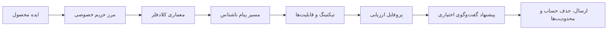
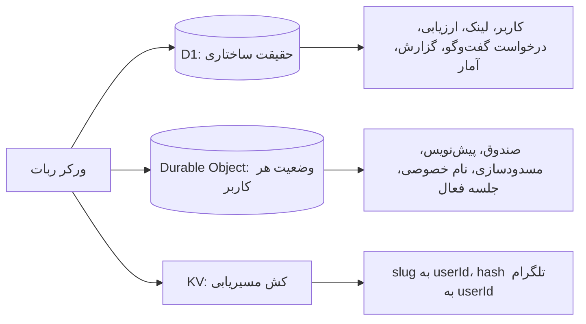
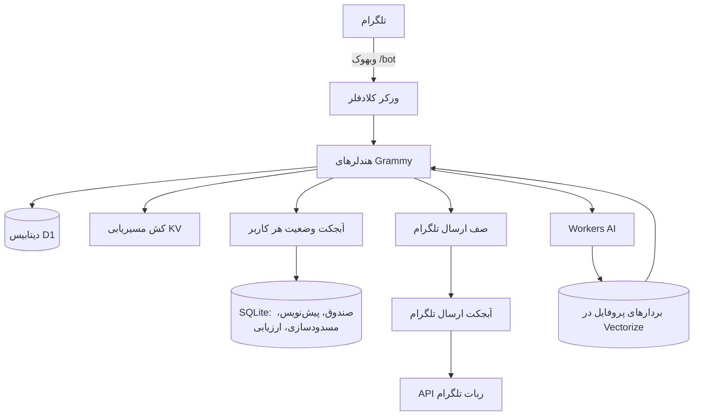
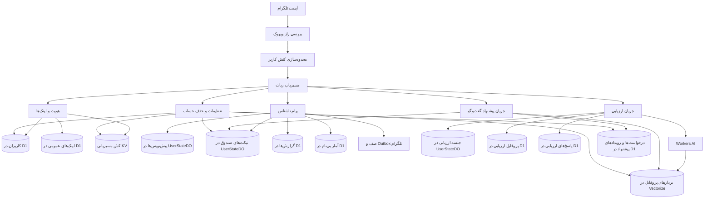
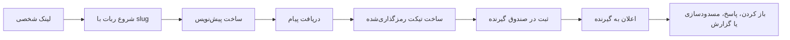
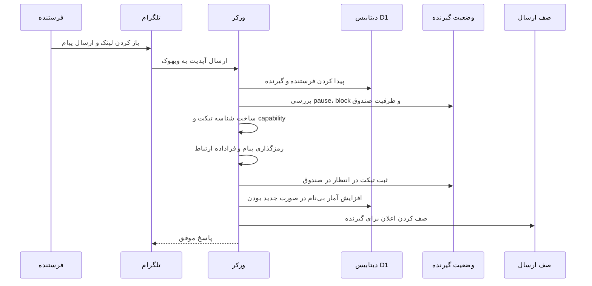
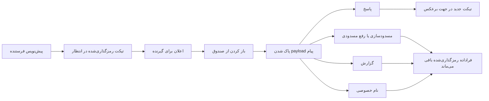
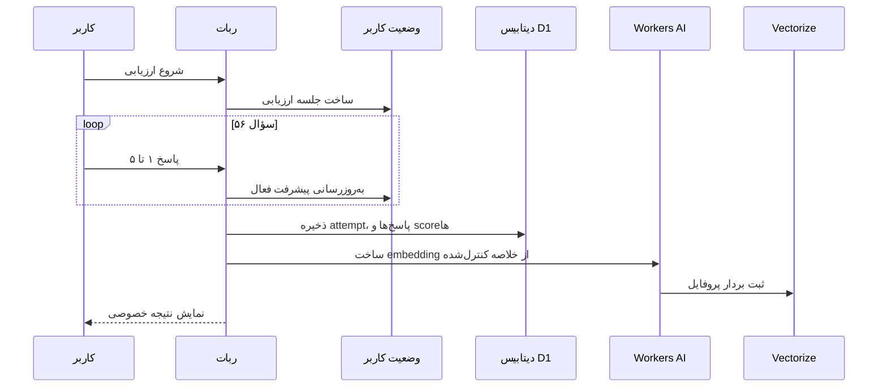
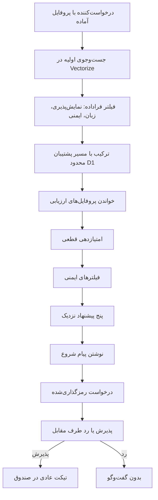
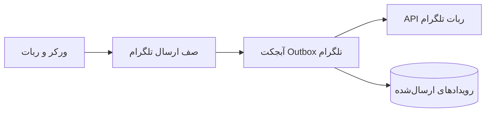

## نکونیموس چیست؟

Nekonymous یک ربات تلگرام فارسی‌محور برای پیام ناشناس و پیشنهاد گفت‌وگو است. هر کاربر یک لینک شخصی دارد. دیگران با همان لینک وارد bot می‌شوند و بدون نمایش یوزرنیم تلگرامشان پیام می‌فرستند. صاحب لینک پیام‌ها را داخل bot می‌خواند، ناشناس جواب می‌دهد، فرستنده را block یا report می‌کند، دریافت پیام را pause می‌کند، و برای آدم‌های تکراری nickname خصوصی می‌گذارد.

از بیرون، محصول ساده به نظر می‌رسد:

```txt
/start
  -> ساخت کاربر
  -> ساخت لینک شخصی
  -> دریافت پیام از deep link
  -> نمایش پیام در /inbox
```

اما همین مسیر کوچک، وقتی باید واقعاً قابل استفاده باشد، چند سؤال جدی دارد. اگر تلگرام یک update را دوباره بفرستد چه؟ اگر کاربر وسط نوشتن پیام برگردد چه؟ اگر گیرنده دیگر نمی‌خواهد پیام بگیرد چه؟ اگر کسی abuse کند چه؟ متن پیام کجا نگه داشته می‌شود و چقدر می‌ماند؟ وقتی قرار است آدم‌هایی با سبک گفت‌وگوی نزدیک‌تر به هم پیشنهاد شوند، داده اصلی کجاست؟

نکونیموس همین سؤال‌ها را به سه مسیر روشن تبدیل می‌کند: پیام ناشناس، ارزیابی سبک گفت‌وگو، و پیشنهاد گفت‌وگوی ناشناس.

UI اصلی محصول تلگرام است. Worker پیام‌های تلگرام را می‌گیرد، commandها و callbackها را پردازش می‌کند، داده‌ها را در storage مناسب نگه می‌دارد، ارزیابی را مدیریت می‌کند و پیشنهاد گفت‌وگو را اجرا می‌کند. وب‌سایت محصول فقط نقطه معرفی است؛ مسیر عملیاتی داخل خود bot می‌ماند.

این نوشته صفحه فروش محصول نیست. مستند فنی مسیر اصلی سیستم است: هر قطعه چه مسئولیتی دارد، داده از کجا وارد می‌شود، کجا ذخیره می‌شود، چه چیزی رمزگذاری می‌شود، و کدام مرزهای privacy باید شفاف بمانند.

لینک پروژه:

- [nekonymous.mohetios.dev](https://nekonymous.mohetios.dev)
- [mohetios/Nekonymous](https://github.com/mohetios/Nekonymous)

این lab مرجع مهندسی پروژه است. نوشته‌های blog می‌توانند درباره تجربه محصول، ایده، یا روایت کوتاه‌تر bot حرف بزنند و برای جزئیات معماری، storage، ticketing، privacy boundary و data flow به اینجا ارجاع بدهند.

برای همین، متن مثل دفترچه فنی یک سیستم در حال کار نوشته شده است. نه فقط «چه کاری انجام می‌دهد»، بلکه «داده کجا می‌رود»، «چرا این storage انتخاب شده»، «کدام ادعا نباید مطرح شود»، و «اگر کسی بخواهد همین مسیر را یاد بگیرد، از کدام لایه شروع کند».

مسیر خواندن این نوشته هم تقریباً همین است:



## مسئله محصول

پیام ناشناس ایده تازه‌ای نیست. یک نفر لینک می‌گیرد، نفر دیگر لینک را باز می‌کند، پیام می‌فرستد، و صاحب لینک بدون دیدن هویت مستقیم فرستنده پیام را می‌خواند.

برای کاربر، همین کافی است. نباید از او خواست اکانت جدید بسازد، وارد داشبورد شود، یا اپلیکیشن جدا نصب کند. تلگرام از قبل روی گوشی خیلی‌ها هست. deep link باز می‌شود، ربات start می‌شود، و کاربر همان‌جا پیامش را می‌نویسد.

ریشه طراحی نکونیموس از همان نقطه‌ای می‌آید که تجربه‌ی پیام ناشناس در وب فارسی برای خیلی‌ها ترک برداشت: هک شدن یک ربات ناشناس معروف و روشن شدن این واقعیت که ابزار «ناشناس» می‌تواند مقدار زیادی داده شخصی و ارتباطی را نگه دارد.

ایده پیام ناشناس هنوز جذاب است. به شروع گفت‌وگو کمک می‌کند، اصطکاک را کم می‌کند، و نشان داده که برای جامعه فارسی مصرف واقعی دارد. اما بعد از چنین اتفاقی، سؤال محصول عوض می‌شود. دیگر فقط نمی‌پرسیم «چطور پیام را برسانیم؟» می‌پرسیم «چطور پیام را برسانیم، بدون اینکه سیستم بیشتر از نیازش بداند؟»

اما ناشناس‌بودن دو لبه دارد. از یک طرف کمک می‌کند آدم‌ها راحت‌تر حرف بزنند. از طرف دیگر اگر کنترل نشود، می‌تواند به مزاحمت، پیام‌های تکراری، فشار بی‌جا یا سوءاستفاده برسد. برای همین block، report، pause، rate limit و nickname خصوصی بخشی از محصول‌اند، نه قابلیت‌های جانبی.

مسئله اصلی فقط «چطور یک Telegram bot بسازیم» نیست. مسئله دقیق‌تر این است:

> چطور می‌شود یک anonymous relay کوچک داشت که ادعای privacy بزرگ‌تر از واقعیت نکند، اما تا حد ممکن plaintext کمتری ذخیره کند، نشت هویت قابل مشاهده را کم کند، و همچنان ساده و عملیاتی بماند؟

نکونیموس پاسخ عملی همین سؤال است.

سه اصل محصول از همین سؤال بیرون می‌آید:

| اصل | معنی در سیستم |
| --- | --- |
| تیکتینگ کم‌داده | پیام ناشناس transcript دائمی نیست؛ یک تیکت محدود با payload رمزگذاری‌شده است. |
| پیشنهاد گفت‌وگوی محتاط | سیستم کمک می‌کند شروع گفت‌وگو کمتر تصادفی باشد، اما سازگاری قطعی یا رابطه پیشنهاد نمی‌دهد. |
| سرویس کوچک و پایدار | Worker، D1، Durable Object، KV و Queue هرکدام فقط همان کاری را انجام می‌دهند که لازم است. |

## نکونیموس دقیقاً چه کار می‌کند؟

سه مسیر اصلی داریم.

### ۱. پیام ناشناس

کاربر `/start` را می‌زند و یک لینک شخصی از جنس `t.me/Bot?start={slug}` می‌گیرد. هر کسی این لینک را باز کند، می‌تواند یک پیام ناشناس بفرستد. صاحب لینک پیام‌های pending را با `/inbox` می‌بیند و می‌تواند جواب بدهد، فرستنده را block/report کند، inbox را pause کند، یا برای فرستنده‌های تکراری nickname خصوصی بگذارد.

اینجا نکته مهم این است که reply هم یک مسیر جدا نیست. اگر گیرنده جواب بدهد، سیستم فقط یک پیام ناشناس جدید در جهت برعکس می‌سازد. همین باعث می‌شود هسته پیام ساده بماند.

### ۲. ارزیابی سبک گفت‌وگو

مسیر دوم، ارزیابی است. این بخش تست روان‌شناسی نیست؛ assessment یا ارزیابی سبک گفت‌وگو است.

ارزیابی شامل ۵۶ سؤال Likert در ۱۴ بُعد است. هدفش تشخیص روان‌شناسی، درمان، یا label زدن به کاربر نیست. فقط کمک می‌کند بفهمیم کاربر چه نوع گفت‌وگویی را ترجیح می‌دهد: آرام یا سریع، عمیق یا سبک، مستقیم یا نرم، مرزدار یا آزادتر، حساس‌تر یا آرام‌تر، راحت‌تر با ناشناس‌بودن یا محتاط‌تر.

نتیجه ارزیابی خصوصی است. کاربر خودش آن را می‌بیند. برای پیشنهاد گفت‌وگو هم فقط از scoreهای ساختاریافته و یک summary کنترل‌شده استفاده می‌شود، نه از نمایش کامل پاسخ‌ها به طرف مقابل.

### ۳. پیشنهاد گفت‌وگوی ناشناس

بعد از ارزیابی، کاربر می‌تواند discoverability را فعال کند. یعنی اجازه بدهد پروفایل گفت‌وگویش برای پیشنهادهای ناشناس استفاده شود. در UI فارسی پروژه، این بخش عمداً بیشتر با زبان «پیشنهاد گفت‌وگو» توضیح داده می‌شود، نه وعده‌ی «مچ کامل».

سیستم با Vectorize گزینه‌های نزدیک را پیدا می‌کند، اما تصمیم نهایی با کد قطعی گرفته می‌شود. شباهت پایین دلیل حذف نیست؛ اگر فقط یک گزینه مجاز وجود دارد، همان گزینه باید پیشنهاد شود. متن درست این نیست که «مچ خوب پیدا نشد»، بلکه این است: «نزدیک‌ترین گزینه موجود این است.»

این بخش را می‌شود به زبان محصول «امتیازدهی تقریبی و فازی» دید، اما نه به معنی سازگاری قطعی. امتیاز فقط کمک می‌کند ترتیب پیشنهادها بهتر شود. فیلترهای سخت، رضایت طرف مقابل و متن محصول از خود امتیاز مهم‌ترند.

پیشنهاد گفت‌وگو هم بدون رضایت طرف مقابل گفت‌وگو نمی‌سازد. درخواست‌کننده یک پیام شروع می‌نویسد. طرف مقابل برچسب نزدیک‌بودن، چند دلیل کوتاه، و همان پیام شروع را می‌بیند. فقط اگر قبول کند، پیام شروع به یک پیام ناشناس عادی داخل صندوق تبدیل می‌شود.

## چرا تلگرام؟

تلگرام برای این محصول طبیعی است، چون اصطکاک را کم می‌کند. کاربر با همان identity و session تلگرام وارد می‌شود. لینک شخصی هم با deep link خود تلگرام کار می‌کند. UI خود bot کافی است: چند دکمه، چند command، چند پیام کوتاه.

این انتخاب البته هزینه هم دارد. چون پیام از Telegram عبور می‌کند و Worker هم هنگام پردازش متن خام را می‌بیند. پس نکونیموس را نباید به‌عنوان پیام‌رسان end-to-end encrypted معرفی کرد.

ادعای دقیق‌تر این است:

```txt
نکونیموس یک relay ناشناس میزبانی‌شده است.
نشت هویت قابل‌دیدن را داخل UI ربات کمتر می‌کند.
payloadهای حساس را در حالت ذخیره رمزگذاری می‌کند.
تلگرام و runtime ورکر از مرز اعتماد حذف نمی‌شوند.
```

این جمله شاید از نظر تبلیغاتی هیجان کمتری داشته باشد، اما برای محصولی که با اعتماد و ناشناس‌بودن سروکار دارد، دقیق‌تر و سالم‌تر است.

## چرا Cloudflare؟

در این معماری، قطعه‌های لازم نزدیک هم می‌مانند. قرار نیست برای هر نیاز یک سرویس جدا ساخته شود: یک سرور برای webhook، یک دیتابیس جدا، یک queue جدا، یک worker جدا برای ارسال پیام، یک سرویس جدا برای vector search، و بعد کلی glue code برای وصل‌کردنشان.

Cloudflare برای این مدل پروژه مناسب است، نه چون همه چیز را جادویی حل می‌کند، بلکه چون چند قطعه لازم را نزدیک هم می‌گذارد. Worker ورودی تلگرام را می‌گیرد. D1 مثل یک دیتابیس SQL معمولی برای جدول‌های اصلی کار می‌کند. Durable Object برای state زنده هر کاربر استفاده می‌شود. KV فقط دفترچه lookup سریع است. Queue برای کارهایی است که لازم نیست webhook را نگه دارند. Workers AI و Vectorize برای ارزیابی و پیشنهاد گفت‌وگو استفاده می‌شوند.

اگر ساده نگاه کنیم:

| اسم فنی | اگر فنی نباشیم یعنی چه؟ | نقش در نکونیموس |
| --- | --- | --- |
| Cloudflare Worker | همان برنامه اصلی که روی درخواست‌ها اجرا می‌شود | وبهوک تلگرام، مسیریابی، اجرای منطق ربات |
| D1 | دیتابیس SQL؛ مثل یک SQLite serverless با جدول و پرس‌وجو | کاربران، لینک‌ها، ارزیابی، پیشنهادهای گفت‌وگو، گزارش‌ها |
| Durable Object | یک وضعیت شخصی و مرتب برای هر کاربر | صندوق، پیش‌نویس، مسدودسازی، جلسه ارزیابی |
| KV | یک دفترچه key-value سریع؛ مثل `key -> value` | فقط کش برای `slug -> userId` و `telegramHash -> userId` |
| Queue | صف کارهای غیرهم‌زمان | ارسال پیام‌های غیرحیاتی به تلگرام |
| OutboxDO | نگهبان ارسال‌های تلگرام | جلوگیری از ارسال تکراری در retryها |
| Workers AI | مدل هوش مصنوعی روی Cloudflare | تبدیل خلاصه ارزیابی به embedding |
| Vectorize | دیتابیس برداری برای شباهت معنایی | پیدا کردن گزینه‌های نزدیک برای پیشنهاد گفت‌وگو |

قاعده طراحی این است:

```txt
Worker برای ورود و مسیریابی.
D1 برای داده‌ای که باید پرس‌وجو شود.
Durable Object برای وضعیت داغ و ترتیبی.
KV برای کش و lookup سریع.
Queue برای کاری که نباید وبهوک را نگه دارد.
Workers AI + Vectorize برای کشف اولیه، نه تصمیم نهایی.
```

این تفکیک جلوی رشد بی‌دلیل معماری را می‌گیرد. هر بار داده‌ای قرار است در KV برود، سؤال اصلی این است: آیا این داده فقط cache است یا حقیقت سیستم؟ اگر حقیقت سیستم است، جای آن KV نیست.

نقشه‌ی کوچک storage همین است:



## تصویر اصلی معماری

قبل از اینکه وارد جزئیات شویم، بهتر است تصویر اصلی روشن باشد.

نکونیموس از نظر محصول یک ربات تلگرام است. از نظر داده، سه جریان دارد: پیام ناشناس، ارزیابی سبک گفت‌وگو، و پیشنهاد گفت‌وگوی ناشناس. همه این‌ها از یک Worker وارد می‌شوند، اما داده‌هایشان در یک جا ذخیره نمی‌شود.



این دیاگرام همه جزئیات را نشان نمی‌دهد، اما الگوی طراحی را می‌دهد:

- Worker فقط دروازه است.
- D1 دیتابیس SQL اصلی است.
- UserStateDO حافظه زنده هر کاربر است.
- KV فقط کش و lookup سریع است.
- Queue مسیر ارسال‌های غیرحیاتی است.
- Vectorize موتور حکم دادن نیست؛ فقط جست‌وجوی معنایی را شروع می‌کند.

برای دیدن سیستم از زاویه جریان داده، تصویر کمی دقیق‌تر این است:



این دیاگرام را نباید به‌عنوان dependency graph کد دید. بیشتر یک نقشه یادگیری است: هر آپدیت تلگرام از یک ورودی مشترک وارد می‌شود، ولی خیلی زود بر اساس مسئولیتش به storage مناسب خودش می‌رود.

| جریان | hot path چه می‌کند؟ | حقیقت داده کجاست؟ | چه چیزی عمداً نیست؟ |
| --- | --- | --- | --- |
| پیام ناشناس | کاربر و لینک را پیدا می‌کند، پیش‌نویس یا تیکت می‌سازد، payload را رمزگذاری می‌کند | `UserStateDO.inbox_tickets` برای تیکت؛ D1 برای هویت، گزارش و آمار | transcript پیام در D1 |
| ارزیابی | جواب‌ها را مرحله‌به‌مرحله می‌گیرد و پیشرفت فعال را نگه می‌دارد | جلسه در DO؛ نتیجه و پاسخ‌های Likert در D1 | تشخیص پزشکی یا شخصیت‌شناسی |
| پیشنهاد گفت‌وگو | گزینه را پیدا می‌کند، فیلترهای سخت را اعمال می‌کند، پیام شروع را رمزگذاری می‌کند | workflow در D1؛ کشف اولیه در Vectorize | شروع گفت‌وگو بدون پذیرش |
| ارسال خروجی | پاسخ‌های لازم را مستقیم می‌فرستد، اعلان‌های غیرحیاتی را queue می‌کند | `TelegramOutboxDO.sent_events` برای idempotency | promise شناور و بی‌رد |

از نظر محصول هم همه چیز باید سبک بماند. نه شبکه اجتماعی کامل. نه dating platform رسمی. نه پیام‌رسان کامل. نه ادعای privacy بزرگ‌تر از واقعیت. یک hosted anonymous relay روی تلگرام، با encrypted-at-rest storage، ارزیابی سبک گفت‌وگو، و پیشنهاد گفت‌وگوی opt-in.

## سطح bot

همه چیز داخل خود تلگرام اتفاق می‌افتد. محصول از همان محیطی کار می‌کند که کاربر قرار است در آن پیام بگیرد.

منوی اصلی ساده است:

```txt
🔗 لینک من
🧭 پیشنهاد گفت‌وگو
⚙️ تنظیمات
```

داخل پیشنهاد گفت‌وگو، کاربر می‌تواند پروفایل خودش را ببیند، گزینه‌های نزدیک را پیدا کند، درخواست‌های در انتظار را ببیند، یا ارزیابی را شروع/تکرار کند:

```txt
👤 پروفایل گفت‌وگو
🔎 پیدا کردن گزینه‌ها
📥 درخواست‌های گفت‌وگو
📝 شروع ارزیابی / 📝 ارزیابی دوباره
↩️ بازگشت
```

تنظیمات هم فقط یک صفحه جانبی نیست. چند کار مهم آنجاست: نام نمایشی، توقف یا فعال‌سازی صندوق، پاک‌کردن مسدودسازی‌ها، reset کردن تاریخچه پیشنهادها، about/privacy، technical notes، و پاک‌کردن حساب.

commandهای اصلی:

```txt
/start
/inbox
/settings
/assessment
/match
/match_system
```

اصطلاح درست این بخش assessment است؛ چون هدف، ارزیابی سبک گفت‌وگو است، نه تست روان‌شناسی.

## مسیر پیام ناشناس

مسیر پیام از deep link شروع می‌شود:

```txt
https://t.me/{bot}?start={slug}
```

وقتی کاربر این لینک را باز می‌کند، ربات باید چند چیز را بفهمد:

- فرستنده کیست؟
- این slug متعلق به کدام گیرنده است؟
- فرستنده دارد به خودش پیام می‌دهد یا نه؟
- گیرنده دریافت پیام را متوقف کرده؟
- گیرنده این فرستنده را مسدود کرده؟
- فرستنده rate limit شده؟
- صندوق گیرنده جا دارد؟

در این مرحله هنوز تیکت ساخته نمی‌شود، چون هنوز پیامی وجود ندارد. سیستم فقط یک پیش‌نویس برای فرستنده می‌سازد، یعنی یک وضعیت موقت که می‌گوید «پیام بعدی این کاربر قرار است برای این گیرنده باشد».

جریان ساده:



```txt
/start {slug}
  -> شناسایی فرستنده از تلگرام
  -> پیدا کردن گیرنده از slug لینک
  -> رد کردن پیام به خود
  -> بررسی امکان دریافت پیام توسط گیرنده
  -> ساخت پیش‌نویس برای فرستنده
  -> انتظار برای پیام بعدی فرستنده
```

وقتی متن یا رسانه می‌رسد:

```txt
فرستنده پیام را می‌فرستد
  -> خواندن پیش‌نویس فرستنده
  -> بررسی rate limit
  -> بررسی توقف دریافت، مسدودسازی و ظرفیت صندوق گیرنده
  -> ساخت ticket_id، capability و ref
  -> رمزگذاری payload
  -> رمزگذاری فراداده ارتباط
  -> ثبت تیکت در صندوق UserStateDO گیرنده
  -> پاک کردن پیش‌نویس فرستنده
  -> افزایش آمار بی‌نام اگر تکراری نباشد
  -> اعلان به گیرنده
```

همان مسیر اگر با sequence دیده شود، واضح‌تر است:



نقطه مهم این است که بدنه پیام در D1 ذخیره نمی‌شود. جدول گفت‌وگوی جداگانه‌ای هم وجود ندارد. متن پیام و فراداده مسیر لازم برای کنش‌ها داخل تیکت رمزگذاری‌شده در `UserStateDO` گیرنده می‌ماند. D1 برای هویت، لینک، گزارش، ارزیابی، پیشنهاد گفت‌وگو و آمار aggregate استفاده می‌شود، نه برای transcript پیام‌های ناشناس.

## تیکت یعنی چه؟

در نکونیموس هر پیام ناشناس یک تیکت است.

تیکت فقط متن پیام نیست. یک reference عملیاتی است برای اینکه گیرنده بتواند روی همان ارتباط کنش انجام بدهد:

- پاسخ
- مسدودسازی
- گزارش
- نام خصوصی

سه چیز مهم داریم:

| شناسه | نقش |
| --- | --- |
| `ticket_id` | شناسه داخلی، طولانی و random؛ برای crypto context و tracking |
| `capability` | token کوتاه و random که داخل دکمه تلگرام قرار می‌گیرد |
| `ref` | HMAC lookup hash همان capability؛ فقط داخل inbox همان گیرنده معنی دارد |

callback data تلگرام کوتاه می‌ماند:

```txt
o:{capability}   باز کردن
r:{capability}   پاسخ
b:{capability}   مسدود کردن
u:{capability}   رفع مسدودسازی
rp:{capability}  گزارش
n:{capability}   نام خصوصی
```

این بخش کوچک است، اما خیلی مهم است. نباید داخل callback اطلاعات حساس بگذاریم؛ نه `sender_user_id`، نه `recipient_user_id`، نه `conversation_id`، نه `ticket_id`. callback از UI تلگرام برمی‌گردد و باید فقط یک capability کوتاه باشد. مقدار خام capability در دکمه تلگرام است؛ داخل DO فقط lookup hash آن ذخیره می‌شود.

مدل درست‌تر:

```txt
callback r:{capability}
  -> کاربر فعلی از تلگرام شناسایی می‌شود
  -> capability به lookup hash تبدیل می‌شود
  -> تیکت از UserStateDO همان کاربر خوانده می‌شود
  -> مالکیت تیکت تأیید می‌شود
  -> فراداده ارتباط رمزگشایی می‌شود
  -> کنش اجرا می‌شود
```

این یعنی اگر کسی یک capability را حدس بزند یا از جایی ببیند، هنوز کافی نیست. capability فقط در کنار user فعلی معنی دارد و action باید با مالکیت همان ticket تأیید شود.

از نگاه lifecycle، ticket این‌طور حرکت می‌کند:



اینجا دو چیز از هم جدا می‌شوند: `payload_ciphertext` که کوتاه‌عمر است و بعد از delivery پاک می‌شود، و `connection_ciphertext` که برای actionهای بعدی لازم است. همین جداسازی باعث می‌شود inbox فقط یک لیست پیام نباشد؛ یک workspace عملیاتی کوچک باشد.

## رمزگذاری، بدون ادعای اضافه

نکونیموس end-to-end encrypted نیست. این جمله باید وسط متن بماند، نه ته footnote.

Telegram پیام اولیه را می‌بیند. Worker هنگام پردازش، متن خام را می‌بیند. کسی که runtime و secretها را کنترل کند، بخشی از مرز اعتماد است.

پس رمزگذاری در نکونیموس برای حذف همه اعتماد نیست. برای کم‌کردن plaintext ذخیره‌شده است.

هدف‌ها:

- username تلگرام دو طرف در UI لو نرود.
- شناسه خام کاربر تلگرام به عنوان شناسه عمومی استفاده نشود.
- chat id تلگرام رمزگذاری‌شده ذخیره شود.
- متن پیام در storage به شکل plaintext نماند.
- payload بعد از تحویل از صندوق پاک شود.
- فقط فراداده ارتباط به شکل رمزگذاری‌شده باقی بماند.
- پیام شروع پیشنهاد هم در حالت ذخیره رمزگذاری‌شده باشد.

شکل ذهنی crypto این است:

```txt
APP_HMAC_PEPPER + telegram_user_id
  -> HMAC-SHA-256
  -> telegram_user_hash

APP_MASTER_KEY + ticket_id
  -> HKDF-SHA-256
  -> AES-256-GCM key
  -> payload_ciphertext + connection_ciphertext
```

دو نوع ciphertext اصلی وجود دارد:

| داده رمزگذاری‌شده | معنی ساده | چرا لازم است؟ |
| --- | --- | --- |
| `payload_ciphertext` | خود پیام | تا قبل از delivery پیام به شکل plaintext ذخیره نشود |
| `connection_ciphertext` | فراداده ارتباط | برای پاسخ، مسدودسازی، گزارش و نام خصوصی بعد از تحویل لازم است |

بعد از اینکه گیرنده `/inbox` را می‌زند، payload رمزگشایی و نمایش داده می‌شود، بعد از storage پاک می‌شود. اما فراداده ارتباط باقی می‌ماند، چون بدون آن پاسخ یا مسدودسازی بعدی دیگر نمی‌فهمد باید روی چه کسی عمل کند.

این tradeoff آگاهانه است:

```txt
payload کوتاه‌عمر است.
فراداده ارتباط طولانی‌تر می‌ماند، ولی رمزگذاری‌شده است.
```

## مالکیت داده‌ها

در نکونیموس هر داده owner مشخص دارد.

| داده | کجا ذخیره می‌شود؟ | توضیح ساده |
| --- | --- | --- |
| هویت کاربر | D1 `users` | جدول اصلی کاربران در دیتابیس SQL |
| chat id رمزگذاری‌شده | D1 `users` | برای اینکه بتوانیم به کاربر پیام بفرستیم، اما chat id خام ذخیره نشود |
| slug عمومی | D1 `public_links` + KV | D1 حقیقت اصلی است؛ KV فقط lookup سریع است |
| گزارش‌ها | D1 `reports` | گزارش‌های ساختاریافته؛ جزئیات اختیاری رمزگذاری می‌شود |
| تیکت‌های صندوق | UserStateDO | وضعیت زنده و مرتب صندوق هر کاربر |
| پیش‌نویس‌ها | UserStateDO | پیام نیمه‌کاره یا مرحله فعلی کاربر |
| مسدودسازی‌ها / برچسب‌ها | UserStateDO | blockهای hashشده و nicknameهای رمزگذاری‌شده همان گیرنده |
| rate limits | UserStateDO | throttle عمومی inputهای کاربر |
| assessment session | UserStateDO | پیشرفت فعال ارزیابی |
| assessment profile | D1 `assessment_profiles` | scoreهای ساختاریافته کاربر |
| assessment answers | D1 `assessment_answers` | جواب‌های Likert؛ متن آزاد نیستند |
| match requests | D1 `match_requests` | چرخه درخواست، accept/decline، expiry |
| match intro | D1 encrypted | متن intro تا قبل از accept، رمزگذاری‌شده |
| vector embeddings | Vectorize | بردارهای معنایی profile برای جست‌وجوی similarity |
| platform stats | D1 `platform_stats` | آمار کلی بی‌نام، بدون user id |

این جدول برای طراحی محصول هم مهم است. مثلاً اگر کاربر حسابش را پاک کند، D1 rowهای وابسته به خودش پاک می‌شوند، DO مربوط به خودش purge می‌شود، vector حذف می‌شود، و KV lookupها هم پاک می‌شوند. اما `platform_stats` مثل تعداد کل پیام‌های relayشده، چون به user وصل نیست، باقی می‌ماند.

## ارزیابی سبک گفت‌وگو

برای پیشنهاد گفت‌وگوی ناشناس، سیستم باید بداند هر کاربر چه سبک گفت‌وگویی را ترجیح می‌دهد.

نکونیموس تست شخصیت سنگین یا label سرگرمی‌محور نیست. ارزیابی قرار نیست تشخیص روان‌شناسی بدهد. therapy نیست. ارزیابی پزشکی نیست.

ارزیابی فقط یک ابزار محصولی است برای فهمیدن سبک گفت‌وگو:

- گفت‌وگوی عمیق یا سبک؟
- جواب سریع یا آرام؟
- مستقیم یا نرم؟
- مرزدار یا آزادتر؟
- ناشناس‌بودن راحت یا محتاط؟
- حساسیت احساسی بیشتر یا regulation بهتر؟
- نیاز به شنیده‌شدن یا راه‌حل سریع؟

ارزیابی شامل ۵۶ سؤال در ۱۴ بُعد است. active progress داخل `UserStateDO` نگه داشته می‌شود، چون state موقت و لحظه‌ای است. وقتی کاربر ارزیابی را کامل می‌کند، نتیجه در D1 ذخیره می‌شود: attemptها، answerها، profile و scoreها.

مسیر ساده:



یک نکته مهم: embedding از پاسخ خام ساخته نمی‌شود. اول یک خلاصه کنترل‌شده ساخته می‌شود؛ متنی شبیه این:

```txt
زبان: fa.
پروفایل گفت‌وگو:
- احترام بالا به مرزها
- حساسیت عاطفی متوسط
- تنظیم هیجان بالا
- ترجیح ریتم پاسخ آرام و فکرشده
- راحتی با گفت‌وگوی ناشناس
```

این متن برای کشف اولیه کافی است، ولی همه جزئیات پاسخ‌ها را وارد index برداری نمی‌کند.

## پیشنهاد گفت‌وگوی ناشناس

پیشنهاد گفت‌وگو opt-in است.

کاربر باید ارزیابی را کامل کند، پروفایل ساخته شود، vector index شود، و خودش قابلیت دیده‌شدن را فعال کند. تا وقتی این اتفاق نیفتاده، نباید در پیشنهادهای دیگران ظاهر شود.

Vectorize در این مدل فقط نقطه شروع است. می‌شود آن را مثل یک جست‌وجوی معنایی دید: «از بین پروفایل‌هایی که اجازه داده‌اند دیده شوند، کدام‌ها از نظر خلاصه گفت‌وگو به این کاربر نزدیک‌ترند؟» اما این جواب نهایی نیست. پرس‌وجوی اولیه `topK=30` است و وقتی index خلوت باشد، سیستم یک مسیر پشتیبان محدود از D1 هم اضافه می‌کند.

بعد از Vectorize، سیستم گزینه‌ها را با داده‌های D1 کامل‌تر می‌کند، فیلترهای سخت را اعمال می‌کند، و یک امتیاز قطعی می‌سازد.



فیلترهای سخت از شباهت مهم‌ترند:

- خود کاربر حذف می‌شود.
- کاربر غیرفعال حذف می‌شود.
- پروفایل ناقص حذف می‌شود.
- فعال نبودن قابلیت دیده‌شدن یعنی حذف.
- مسدودسازی و گزارش باید محترم شمرده شود.
- درخواست در انتظار تکراری ساخته نمی‌شود.
- محدودیت ایمنی بالاتر از امتیاز است.
- درخواست‌های قدیمی منقضی می‌شوند و زوج‌های تازه رد یا پذیرفته‌شده دوره انتظار دارند.

شباهت فقط زبان پیشنهاد است، نه حکم قطعی. UI هم امتیاز خام را به عنوان درصد سازگاری قطعی نشان نمی‌دهد؛ بیشتر از برچسب کیفیت و دلیل‌های کوتاه استفاده می‌کند.

اگر فقط یک نفر مجاز وجود دارد، سیستم نباید بگوید «مچ خوبی پیدا نشد». جمله درست‌تر این است:

```txt
نزدیک‌ترین گزینه موجود این است.
```

این تفاوت کوچک است، ولی روی حس محصول اثر دارد. سیستم نباید تظاهر کند مرجع قطعی است.

## چرا match request مستقیم گفت‌وگو نمی‌سازد؟

این مرز مهم است.

اگر کاربر A یک گزینه را دید و پیام شروع نوشت، کاربر B نباید ناگهان وارد گفت‌وگو شود. اول باید درخواست را ببیند و بپذیرد یا رد کند.

مدل:

```txt
درخواست‌کننده یک گزینه را انتخاب می‌کند
  -> پیام شروع را می‌نویسد
  -> پیام شروع در match_requests رمزگذاری می‌شود
  -> طرف مقابل برچسب کیفیت، دلیل‌های امن و پیام شروع را می‌بیند
  -> طرف مقابل می‌پذیرد یا رد می‌کند
```

فقط بعد از پذیرش:

```txt
درخواست گفت‌وگوی پذیرفته‌شده
  -> رمزگشایی پیام شروع
  -> اجرای sendAnonymousMessage()
  -> ساخت تیکت عادی در صندوق
```

این یعنی قابلیت پیشنهاد گفت‌وگو کنار سیستم پیام ننشسته؛ روی همان مسیر پیام سوار شده است. نتیجه‌اش ساده‌تر است: پیام شروع بعد از پذیرش مثل یک پیام ناشناس عادی رفتار می‌کند.

## پاک کردن حساب

پاک کردن حساب واقعی است، نه فقط soft delete.

وقتی کاربر تأیید می‌کند، مسیر `clearUserAccountAndRecreate` این کارها را انجام می‌دهد:

1. وضعیت داخل Durable Object کاربر را پاک می‌کند؛ صندوق، پیش‌نویس‌ها، مسدودسازی‌ها، جلسه ارزیابی و چیزهای شبیه این.
2. rowهای D1 مربوط به کاربر را hard-delete می‌کند؛ ارزیابی، پیشنهاد گفت‌وگو، گزارش، لینک و خود کاربر.
3. vector مربوط به پروفایل را از Vectorize حذف می‌کند.
4. lookupهای KV مثل `tg:{hash}` و `link:{slug}` را پاک می‌کند.
5. یک شناسه داخلی کاربر و لینک عمومی جدید می‌سازد.

تنها چیزی که باقی می‌ماند، آمار aggregate بی‌نام است؛ مثلاً تعداد کل پیام‌های relayشده یا تعداد کل درخواست‌های گفت‌وگو. این‌ها به کاربر وصل نیستند و برای نمایش وضعیت کلی پلتفرم استفاده می‌شوند.

## Outbox و idempotency

خروجی تلگرام نقطه‌ای است که معمولاً دیر جدی گرفته می‌شود.

Webhook باید سریع جواب بدهد. اما ارسال پیام به Telegram ممکن است fail شود، retry بخواهد، یا duplicate شود. برای همین بخشی از خروجی‌ها از مسیر outbox عبور می‌کنند.



`TelegramOutboxDO` وظیفه دارد sendهای قبلی را با `idempotency_key` بشناسد. اگر همان job دوباره رسید، لازم نیست دوباره همان پیام را بفرستد. مسیر notificationهای غیرحیاتی از queue عبور می‌کند؛ چیزهایی که پاسخ مستقیم webhook به آن‌ها وابسته است همان‌جا await می‌شوند.

اصل مهم این است:

```txt
کاری که پاسخ webhook به آن وابسته نیست، نباید بی‌دلیل webhook را نگه دارد.
```

همه چیز لازم نیست queue شود. اما وقتی side effect غیرحیاتی است، outbox مدل بهتری می‌دهد.

## ساختار پروژه

ساختار پروژه باید ذهنی و قابل دنبال‌کردن باشد:

```txt
src/
├── index.ts
├── bot/                    # اتصال Grammy، منوها، کیبوردها، مسیریاب
├── features/
│   ├── identity/           # کاربران، لینک‌ها، حذف واقعی
│   ├── messaging/          # relay، صندوق، گزارش‌ها
│   ├── settings/
│   ├── assessment/         # پرسش‌نامه، پروفایل، بردارها
│   ├── matching/
│   └── platform/           # آمار پلتفرم
├── storage/                # UserState، Outbox DOها و clientها
├── queues/
├── ticketing/              # رمزنگاری، capabilityها، envelopeهای تیکت
├── i18n/
└── utils/

migrations/
tools/                      # ابزارهای verify-* و flush-remote.*
docs/                       # معماری پیشنهاد گفت‌وگو و threat model
```

این ساختار برای این است که وقتی کسی codebase را باز می‌کند، بداند کجا دنبال چه چیزی بگردد. bot handlerها در `bot` و featureها هستند. persistence داخل `storage` و D1 migrationهاست. crypto و capabilityها در `ticketing` هستند. assessment و matching هم featureهای مستقل‌اند، نه چند helper پراکنده.

## مرزهای محصول

این بخش به اندازه قابلیت‌ها مهم است. نکونیموس یک پیام‌رسان کامل، شبکه اجتماعی، یا dating platform نیست. محصول روی یک کار مشخص می‌ایستد: پیام ناشناس در تلگرام، کنترل abuse، ارزیابی سبک گفت‌وگو، و پیشنهاد گفت‌وگوی opt-in.

مرزهای اصلی را می‌شود این‌طور خواند:

| ادعا نمی‌کنیم | انجام می‌دهیم |
| --- | --- |
| پیام‌رسان کامل یا شبکه اجتماعی | یک ربات تلگرام برای پیام ناشناس، پاسخ، مسدودسازی و گزارش |
| وب‌اپ عمومی داخل Worker | مسیر عملیاتی داخل خود تلگرام |
| transcript کامل پیام‌ها در D1 | تیکت رمزگذاری‌شده در UserStateDO و پاک‌کردن payload بعد از تحویل |
| KV به عنوان source of truth | KV فقط برای lookup و کش مسیر‌یابی |
| گفت‌وگوی خودکار یا auto-match | درخواست گفت‌وگو فقط با پذیرش طرف مقابل |
| public profile یا ranking پولی | پروفایل ارزیابی خصوصی و پیشنهادهای محدود |
| end-to-end encryption، zero-knowledge یا ناشناسی کامل | encrypted-at-rest برای داده‌های حساس و مرز اعتماد شفاف |
| diagnosis، therapy یا شخصیت‌شناسی قطعی | ارزیابی سبک گفت‌وگو برای پیشنهادهای محتاط |
| تصمیم نهایی با AI | AI فقط برای embedding و کشف اولیه کمک می‌کند |

این مرزها محصول را کوچک‌تر نشان نمی‌دهند. برعکس، دقیق‌ترش می‌کنند. وقتی محصول با ناشناس‌بودن و اعتماد سروکار دارد، ادعاهای محدود اما درست از featureهای پر سروصدا مهم‌ترند.

## جمع‌بندی

نکونیموس روی یک هسته مشخص می‌ایستد:

- پیام ناشناس
- صندوق
- پاسخ
- مسدودسازی / گزارش / نام خصوصی
- pause/resume
- ارزیابی سبک گفت‌وگو با ۵۶ سؤال در ۱۴ بُعد
- index کردن پروفایل با Workers AI و Vectorize
- پیشنهاد گفت‌وگوی ناشناس opt-in
- درخواست گفت‌وگو با پذیرش یا رد
- پاک‌کردن واقعی حساب
- آمار بی‌نام پلتفرم

کل مسیر را می‌شود در چند خط نگه داشت:

```txt
پیام ناشناس ساده شروع می‌شود.
ساده ماندن سخت است.
هر وضعیت باید مالک داشته باشد.
حریم خصوصی باید کمتر ادعا کند و بهتر عمل کند.
پیشنهاد گفت‌وگو باید با رضایت طرف مقابل جلو برود.
AI کمک می‌کند، اما حکم نمی‌دهد.
```

این همان شکل فنی Nekonymous است: یک ربات کوچک، با معماری قابل توضیح، برای گفت‌وگوهای ناشناس که قرار نیست بیشتر از چیزی که هست ادعا کند.
