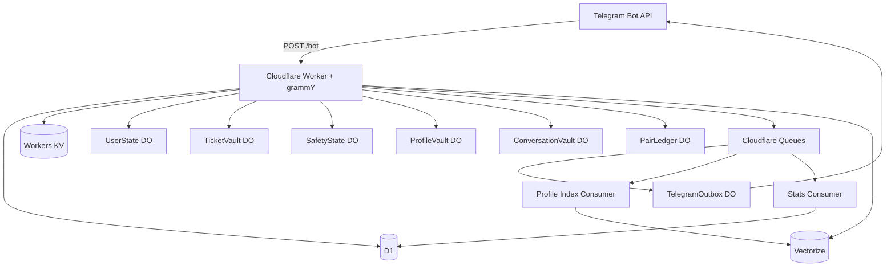
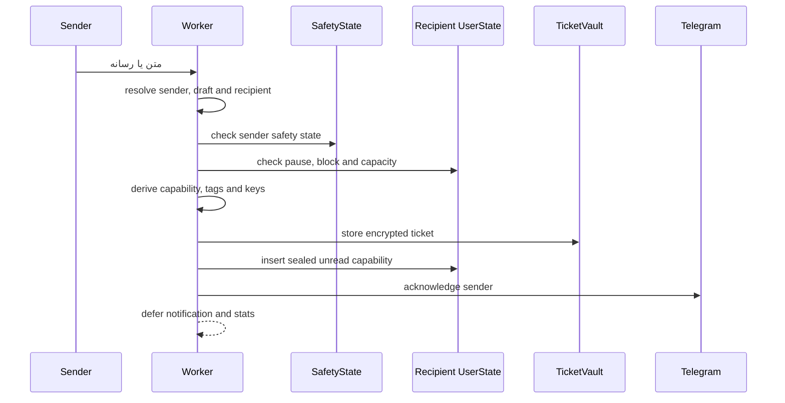

## مسئله از جایی شروع شد که پیام رسیده بود

ساختن ساده‌ترین نسخه‌ی یک ربات پیام ناشناس کار عجیبی نیست:

```txt
یک لینک شخصی
→ یک پیام
→ پیدا کردن صاحب لینک
→ ارسال پیام
```

حتی پاسخ ناشناس هم در نگاه اول پیچیدگی زیادی ندارد:

```txt
فرستنده
→ بات
→ گیرنده
→ بات
→ فرستنده
```

مسئله از جایی شروع می‌شود که این جریان ساده را با یک جدول معمولی پیاده کنیم:

```txt
sender_id
recipient_id
message_body
conversation_id
created_at
```

این مدل از نظر برنامه‌نویسی تمیز و قابل فهم است. با چند query می‌شود inbox ساخت، پاسخ‌ها را دنبال کرد و تاریخچه‌ی گفت‌وگو را نشان داد.

اما هم‌زمان، چیزی ساخته‌ایم که اصلاً قرار نبود وجود داشته باشد:

> یک دفترچه‌ی منظم از اینکه چه کسی، به چه کسی، در چه زمانی و چند بار پیام فرستاده است.

حتی اگر متن پیام‌ها را رمزنگاری کنیم، خود رابطه هنوز داخل دیتابیس وجود دارد.

از همین‌جا سؤال اصلی نِکونیموس برای من تغییر کرد.

دیگر سؤال این نبود:

> چطور یک پیام ناشناس را در تلگرام ارسال کنیم؟

سؤال دقیق‌تر این شد:

> چطور پیام را برسانیم، امکان پاسخ و کنترل سوءاستفاده را هم حفظ کنیم، اما برای انجام این کار یک آرشیو دائمی و قابل اتصال از آدم‌ها و رابطه‌هایشان نسازیم؟

معماری امروز نِکونیموس پاسخ فعلی من به همین سؤال است.

---

## محصولی که عمداً محدود نگه داشته شد

نِکونیموس یک ربات تلگرام فارسی‌محور و متن‌باز است.

سطح اصلی محصول خود Telegram است و Worker یک وب‌اپلیکیشن، dashboard عمومی یا API محصولی مستقل ارائه نمی‌کند.

فرمان‌های اصلی:

```txt
/start
/inbox
/settings
/assessment
/match
```

جریان پیام‌رسانی شامل این قابلیت‌هاست:

- ساخت لینک شخصی پیام ناشناس؛
- دریافت متن و رسانه‌های پشتیبانی‌شده‌ی تلگرام؛
- اعلان پیام‌های تحویل‌نشده؛
- بازکردن صندوق و تحویل صفی پیام‌ها؛
- پاسخ ناشناس؛
- نام خصوصی برای فرستنده؛
- بلاک و رفع بلاک؛
- گزارش سوءاستفاده؛
- توقف یا ادامه‌ی دریافت پیام؛
- پاک‌کردن حساب و ساخت هویت تازه.

بخش پیشنهاد گفت‌وگو نیز این قابلیت‌ها را اضافه می‌کند:

- ارزیابی سبک گفت‌وگو؛
- ساخت پروفایل محدود مکالمه؛
- یک hub مشترک برای وضعیت، خلاصه‌ی پروفایل و آمادگی پیشنهادها؛
- فعال‌سازی اختیاری نمایش در پیشنهادها؛
- دریافت گزینه‌های گفت‌وگو؛
- نوشتن پیام شروع؛
- پذیرش یا رد درخواست؛
- تبدیل درخواست پذیرفته‌شده به یک پیام ناشناس معمولی.

این دو بخش در نهایت از یک primitive مشترک استفاده می‌کنند:

```txt
هر پیام = یک تیکت مستقل
```

نِکونیموس قرار نیست پیام‌رسان جدیدی با تاریخچه‌ی دائمی باشد. قرار است یک relay میزبانی‌شده باشد که پیام را از یک مرز به مرز دیگر می‌رساند و بعد تا جای ممکن از سر راه کنار می‌رود.

---

## قبل از معماری، مرز اعتماد

اول باید چیزی را روشن کنیم که هیچ معماری داخلی نمی‌تواند آن را تغییر دهد.

نِکونیموس:

- E2EE نیست؛
- zero-knowledge نیست؛
- ناشناسی کامل یا untraceability را تضمین نمی‌کند؛
- مستقل از اعتماد به Telegram و Cloudflare نیست؛
- هویت یا سلامت طرف مقابل را تأیید نمی‌کند؛
- جلوی screenshot، forward یا انتشار پیام توسط گیرنده را نمی‌گیرد.

فرستنده متن را در Telegram وارد می‌کند. Telegram آن را می‌بیند.

Worker متن را برای پردازش، رمزنگاری و تحویل دریافت می‌کند. Worker هم آن را می‌بیند.

در سمت دیگر، پیام دوباره از Bot API وارد Telegram می‌شود و در تاریخچه‌ی حساب گیرنده قرار می‌گیرد.

پس رمزنگاری application-level نِکو قرار نیست plaintext را از کل مسیر حذف کند.

نقش آن محدودتر است:

> کم‌کردن plaintext ذخیره‌شده، کاهش قابلیت اتصال storageها و محدودکردن طول عمر داده‌ای که نِکو برای انجام وظیفه‌اش لازم دارد.

این مرز به نظرم مهم‌تر از جمله‌هایی مثل «امنیت مطلق» یا «ناشناسی بی‌قیدوشرط» است.

معماری خوب نباید با یک ادعای بزرگ شروع شود. باید با توضیح دقیق چیزهایی شروع شود که هنوز مجبوریم به آن‌ها اعتماد کنیم.

---

## تغییر مدل ذهنی: پیام یک row نیست

نقطه‌ی اصلی معماری زمانی شکل گرفت که پیام را دیگر یک رکورد متعلق به دو کاربر ندیدم.

در مدل معمول:

```txt
Message belongs to Sender
Message belongs to Recipient
Message belongs to Conversation
```

در مدل نِکو:

```txt
Message is an independent sealed capability
```

هر پیام:

- lookup مستقل دارد؛
- کلیدهای مستقل دارد؛
- lifecycle مستقل دارد؛
- وضعیت تحویل مستقل دارد؛
- idempotency مستقل دارد؛
- و بدون نیاز به یک conversation row دائمی می‌تواند reply، block، report و nickname را پشتیبانی کند.

این تیکت مثل یک پاکت مهروموم‌شده است.

داخل پاکت اطلاعاتی وجود دارد که سیستم برای رساندن پیام و انجام actionهای محدود بعدی لازم دارد؛ اما روی خود پاکت نوشته نشده که این پیام متعلق به کدام دو account داخلی است.

فرمول فشرده‌ی معماری:

```txt
Message
= Blind lookup
+ Encrypted route
+ Temporary encrypted payload
+ Encrypted metadata
+ Recipient-bound capability
+ Bounded lifecycle
```

---

## تصویر کلی سیستم

نِکونیموس یک Worker واحد دارد، نه مجموعه‌ای از microserviceهای مستقل.

اما داخل همان runtime، state و مسئولیت‌ها میان چند storage plane جدا شده‌اند.



Worker سه ورودی اصلی دارد:

```txt
fetch()
  → دریافت webhook تلگرام روی POST /bot

queue()
  → پردازش outbox، stats و profile-index

Durable Object exports
  → stateful storage و coordination
```

این تقسیم‌بندی صرفاً استفاده از چند سرویس Cloudflare نیست.

هر بخش به این دلیل انتخاب شده که نوع مشخصی از state را بهتر مدیریت می‌کند.

---

## هر storage فقط بخشی از تصویر را می‌بیند

### D1

D1 مرجع ساختارهای relational است:

- حساب‌های فعال؛
- لینک‌های عمومی؛
- داده‌های ساختاری محصول؛
- آمار روزانه‌ی تجمیعی.

اما D1 نباید تبدیل شود به:

- transcript پیام‌ها؛
- inbox کاربران؛
- پروفایل کامل گفت‌وگو؛
- جدول فرستنده و گیرنده؛
- graph درخواست‌ها و پیشنهادها.

### UserState Durable Object

هر account یک محدوده‌ی state محلی دارد:

- unreadهای موقت؛
- draftها؛
- pause state؛
- block tagها؛
- نام‌های خصوصی رمزنگاری‌شده؛
- rate limit؛
- session فعال ارزیابی؛
- تنظیمات discoverability و exposure.

این state به خود گیرنده محدود است و قرار نیست یک دیتابیس global از کاربران بسازد.

### TicketVault Durable Object

مرجع اصلی تیکت‌های ناشناس:

- blind ticket hash؛
- owner proof؛
- route رمزنگاری‌شده؛
- payload رمزنگاری‌شده؛
- metadata رمزنگاری‌شده؛
- status و expiry.

TicketVault نه inbox است و نه message table.

### SafetyState Durable Object

برای هر abuse subject یک state جدا نگه می‌دارد:

- گزارش‌های کور؛
- reporterهای متمایز؛
- strikeها؛
- suspension؛
- probation؛
- ban.

بدون اینکه یک جدول عمومی از گزارش‌دهنده و گزارش‌شونده بسازد.

### ProfileVault Durable Object

نسخه‌ی نهایی پروفایل گفت‌وگو و revision آن را رمزنگاری‌شده نگه می‌دارد.

### ConversationVault و PairLedger

Suggestionها، requestها، introهای رمزنگاری‌شده، pair lock، cooldown و blockهای زوجی را مدیریت می‌کنند.

این stateها نباید به یک relationship table قابل برگشت در D1 تبدیل شوند.

### TelegramOutbox Durable Object

ارسال پیام به Telegram یک side effect خارجی است.

Outbox برای هر chat:

- ارسال‌ها را pace می‌کند؛
- idempotency را enforce می‌کند؛
- lock و lease دارد؛
- retry را کنترل می‌کند؛
- و تاریخچه‌ی محدود خودش را پاک می‌کند.

### KV

KV فقط cache است:

```txt
tg:{telegramActorHash}
link:{publicSlug}
```

اگر KV fail شود، سیستم باید به D1 برگردد.

KV برای inbox، ticket، profile یا request authority مناسبی نیست.

### Queues

Queueها برای کارهای asynchronous استفاده می‌شوند:

- اعلان‌ها و ارسال‌های Telegram؛
- تحویل inbox؛
- آمار؛
- profile indexing.

Queue source of truth محصول نیست و duplicate delivery یک حالت طبیعی طراحی محسوب می‌شود.

### Vectorize

Vectorize فقط candidateهای نزدیک را پیدا می‌کند.

نه profile authority است، نه identity store و نه تصمیم‌گیرنده‌ی نهایی.

قاعده‌ی خلاصه:

```txt
D1        → ساختار relational
DO        → state ترتیبی و atomic
KV        → cache و routing
Queues    → side effect retryپذیر
Vectorize → retrieval محدود
```

---

## هویت داخلی بدون استفاده‌ی مستقیم از Telegram ID

کاربر با Telegram وارد سیستم می‌شود، اما Telegram ID خام نباید تبدیل به شناسه‌ی عمومی یا join key اصلی شود.

مدل مفهومی:

```txt
telegram_user_id
→ HMAC با application pepper
→ stable actor hash
→ internal account
```

هر account یک شناسه‌ی داخلی و یک public slug دارد:

```txt
https://t.me/{bot_username}?start={slug}
```

Public slug برای پیدا کردن صاحب لینک استفاده می‌شود، ولی identity داخلی کاربر را آشکار نمی‌کند.

`chat_id` برای ارسال پیام به Telegram لازم است، اما در storage به‌صورت رمزنگاری‌شده نگه‌داری می‌شود.

ساخت account و public link نیز در یک batch انجام می‌شود تا هیچ‌کدام بدون دیگری ساخته نشوند.

این تفکیک بعداً در reset، block و Safety اهمیت زیادی پیدا می‌کند:

- internal account قابل تعویض است؛
- stable actor hash با reset معمولی عوض نمی‌شود؛
- public link قابل باطل‌شدن است؛
- بعضی stateها باید با reset پاک شوند؛
- بعضی sanctionها نباید با reset دور زده شوند.

---

## قلب تیکت: یک capability سی‌ودوبایتی

هر تیکت یک `TicketCapability` مستقل دارد.

قالب canonical آن دقیقاً ۳۲ بایت است:

```txt
bytes 0..15   lookupNonce
bytes 16..31  keySeed
```

نمایش Base64URL بدون padding:

```txt
43 characters
[A-Za-z0-9_-]{43}
```

این اندازه تصادفی انتخاب نشده است.

دکمه‌های inline تلگرام فقط فضای محدودی برای `callback_data` دارند. capability باید همراه prefixهایی مثل `r:` یا `rp:` داخل همان محدودیت جا شود.

### چرا capability دو قسمت دارد؟

اگر یک token واحد هم record را پیدا کند و هم مستقیماً کلید رمزنگاری باشد، storage و key material بیش از حد به هم نزدیک می‌شوند.

در نِکو دو مسئولیت جدا شده‌اند.

`lookupNonce` فقط برای ساخت lookup کور استفاده می‌شود:

```txt
ticketHash =
  HMAC(
    APP_HMAC_PEPPER,
    "nekonymous:ticket:lookup" || lookupNonce
  )
```

TicketVault با `ticketHash` record را پیدا می‌کند.

اما برای بازکردن capsuleها، `keySeed` هم لازم است:

```txt
APP_MASTER_KEY
+ ticketHash
+ keySeed
→ HKDF
```

از این root چند کلید domain-separated ساخته می‌شود:

```txt
route key
payload key
metadata key
```

هر capsule:

- AES-GCM مستقل دارد؛
- IV مستقل دارد؛
- AAD مخصوص domain خودش دارد.

در نتیجه جابه‌جاکردن ciphertext میان دو ticket یا میان route و payload باید به authentication failure برسد.

### capability در vault ذخیره نمی‌شود

TicketVault این‌ها را ندارد:

- capability خام؛
- `lookupNonce`؛
- `keySeed`.

فقط blind lookup و envelopeهای رمزنگاری‌شده را نگه می‌دارد.

---

## capability به‌تنهایی مجوز نیست

قرارگرفتن capability در callback یک پیام Telegram به این معنی نیست که هرکسی با دیدن آن بتواند action را اجرا کند.

هر ticket یک `ownerProofTag` دارد که به سه چیز bind شده است:

```txt
recipient stable actor hash
+ recipient current internal account id
+ ticketHash
```

هنگام اجرای callback:

```txt
capability
→ parse
→ derive ticketHash
→ load record
→ calculate current owner proof
→ constant-time comparison
→ derive keys
→ decrypt required capsule
→ apply action
```

این‌جا `current internal account id` نقش مهمی دارد.

وقتی کاربر hard reset انجام می‌دهد، internal account تازه‌ای ساخته می‌شود.

در نتیجه callbackهای قدیمی، حتی اگر هنوز داخل تاریخچه‌ی Telegram باشند، owner proof معتبر ندارند.

یعنی reset فقط public link را عوض نمی‌کند؛ authorization تیکت‌های قدیمی را هم می‌شکند.

---

## داخل تیکت چه چیزی وجود دارد؟

TicketVault سه capsule جدا نگه می‌دارد.

### route capsule

Route اطلاعات لازم برای actionهای بعدی را حمل می‌کند:

- مسیر رمزنگاری‌شده‌ی برگشت به فرستنده؛
- `replyRouteTag`؛
- `contactTag`؛
- `blockTag`؛
- `abuseSubjectTag`؛
- policy محدود reply؛
- context لازم برای Telegram.

این capsule همان بخشی است که اجازه می‌دهد بعد از پاک‌شدن متن، reply یا block همچنان کار کند.

### payload capsule

محتوای قابل تحویل:

```txt
text
photo
video
animation
document
voice
audio
sticker
video_note
```

برای media، نِکو فایل را دوباره در storage خودش کپی نمی‌کند.

شناسه‌ی قابل استفاده‌ی فایل Telegram و caption محدود در payload قرار می‌گیرند.

پس storage نِکو شامل یک blob باینری جدا از ویدیو، صدا یا عکس نیست.

### metadata capsule

اطلاعات غیرمسیری لازم برای نمایش:

- شناسه‌ی کوتاه قابل نمایش تیکت؛
- زمان ساخت؛
- metadata محدود محصول.

جدا نگه‌داشتن این capsuleها باعث می‌شود برای هر action فقط داده‌ی لازم decrypt شود.

مثلاً block یا report نباید برای اجرا مجبور به بازکردن متن پیام باشد.

---

## ساخت یک پیام: جایی که تیکت پذیرفته می‌شود

مسیر ارسال پیام از دید فرستنده ساده است، اما پشت آن چند gate وجود دارد.



قبل از پذیرش پیام، سیستم بررسی می‌کند:

- account فرستنده معتبر است؛
- draft فعال و recipient درست است؛
- فرستنده suspended یا banned نیست؛
- گیرنده دریافت پیام را متوقف نکرده؛
- فرستنده در block list گیرنده نیست؛
- unread capacity پر نشده؛
- نوع و اندازه‌ی محتوا قابل قبول است.

بعد از آن:

```txt
generate capability
→ derive ticketHash
→ derive owner proof
→ encrypt route
→ encrypt payload
→ encrypt metadata
→ store TicketVault record
→ store sealed unread pointer
```

نقطه‌ی پذیرش durable این است:

```txt
TicketVault storage succeeds
+
Unread insertion succeeds
```

بعد از این نقطه پیام پذیرفته شده است.

اعلان و آمار side effect هستند. شکست آن‌ها نباید پیام پذیرفته‌شده را rollback کند.

---

## compensation بدون پاک‌کردن تیکت سالم

بعضی failureها دقیقاً بین دو write اتفاق می‌افتند.

مثلاً:

```txt
TicketVault store succeeds
→ UserState unread insertion fails
```

در این وضعیت باید ticket جدید پاک شود، چون هیچ unread pointer معتبری برای تحویل آن وجود ندارد.

اما یک مسئله‌ی مهم‌تر وجود دارد:

ممکن است همان ticket در retry قبلی ساخته شده باشد.

برای همین `storeTicket` فقط success برنمی‌گرداند. مشخص می‌کند record:

```txt
created
یا
existing
```

compensation فقط اجازه دارد recordی را حذف کند که در همان invocation ساخته شده باشد.

این تفاوت کوچک، accept request و عملیات deterministic را از حذف اشتباه یک ticket سالم نجات می‌دهد.

---

## inbox یک صفحه نیست؛ یک صف تحویل است

در نسخه‌های اولیه، inbox شبیه صفحه‌ای برای دیدن پیام‌های نگه‌داری‌شده تصور می‌شد.

در معماری فعلی این مدل کنار گذاشته شده است.

Inbox نِکو:

- list دائمی ندارد؛
- pagination ندارد؛
- viewed shell ندارد؛
- delivered registry دائمی ندارد؛
- تاریخچه‌ی مکالمه نیست.

Inbox فقط unreadهای تحویل‌نشده را نگه می‌دارد.

برای هر unread، UserState این state را دارد:

```txt
item_id
sealed_capability_enc
dedupe_tag
delivery_state
delivery_attempt_id
delivery_lease_until
created_at
expires_at
```

UserState این‌ها را ندارد:

- `ticketHash`؛
- capability plaintext؛
- message body؛
- route؛
- sender account ID.

محدودیت فعلی:

```txt
max active unread: 50
max items per drain: 50
delivery lease: 60 seconds
```

صف عمداً bounded است.

قرار نیست کسی نِکو را به‌عنوان فضای نگه‌داری بلندمدت پیام‌هایش استفاده کند.

---

## اعلان‌ها count را حمل نمی‌کنند

وقتی unread تازه‌ای پذیرفته می‌شود، یک notification event مستقل ساخته می‌شود.

اما Queue job تعداد unreadها را داخل خودش حمل نمی‌کند.

```txt
new unread
→ eventId
→ inbox-notification job
→ load current unread count
→ send fresh notification
```

Job شامل این‌ها نیست:

- capability؛
- `ticketHash`؛
- متن؛
- route؛
- sender identity؛
- count authoritative.

Consumer درست قبل از ارسال، count زنده را از UserState می‌خواند.

اگر inbox قبلاً خالی شده باشد:

```txt
count = 0
→ notification skipped
```

اگر Queue همان job را دوباره تحویل دهد، Outbox با idempotency key مبتنی بر account و event ID جلوی ارسال منطقی تکراری را می‌گیرد.

این انتخاب یک tradeoff دارد.

اگر ده پیام سریع برسد، ممکن است چند اعلان تازه با count مشابه ساخته شود.

نِکو آن‌ها را به یک پیام قابل edit و یک notification cycle مشترک تبدیل نمی‌کند، چون چنین مدلی خودش state و registry تازه‌ای می‌خواهد.

---

## بازکردن inbox

کاربر با `/inbox`، دکمه‌ی اصلی صندوق یا callback عمومی `ib:d` درخواست drain می‌دهد.

```txt
open inbox
→ cleanup expired unread rows
→ read live count
→ if empty, show empty state
→ enqueue inbox-drain
→ immediately acknowledge
```

تحویل در Queue consumer انجام می‌شود:

```txt
claim unread
→ assign lease
→ decrypt sealed capability in memory
→ resolve TicketVault record
→ verify owner proof
→ derive keys
→ decrypt route/payload/meta
→ send through TelegramOutbox
→ clear payload
→ remove unread row
```

هر آیتم جدا claim و finalize می‌شود.

اگر تحویل موفق باشد:

```txt
payload_enc = null
ticket.status = viewed
unread row = deleted
```

route و metadata تا انقضای محدود ticket باقی می‌مانند، چون دکمه‌های زیر هنوز باید کار کنند:

- پاسخ؛
- نام خصوصی؛
- بلاک؛
- گزارش.

بعد از تحویل، capability داخل callbackهای پیام Telegram قرار دارد.

UserState یک index بازیابی از ticketهای تحویل‌شده نگه نمی‌دارد.

---

## چرا payload فقط بعد از ارسال موفق پاک می‌شود؟

پاک‌کردن زودهنگام ممکن است privacy-friendly به نظر برسد، اما پیام را از بین می‌برد.

ترتیب اشتباه:

```txt
decrypt payload
→ clear payload
→ call Telegram
→ Telegram fails
```

در این وضعیت نه storage پیام را دارد و نه Telegram آن را تحویل گرفته است.

ترتیب درست:

```txt
decrypt payload
→ send through Outbox
→ Telegram accepts
→ clear payload
→ finalize unread
```

یعنی data minimization نباید به قیمت ازبین‌رفتن داده قبل از تحویل تمام شود.

کم‌نگه‌داشتن داده مهم است، اما lifecycle آن باید با نقطه‌ی واقعی success هماهنگ باشد.

---

## در سیستم توزیع‌شده، retry حالت استثنایی نیست

Queue، Telegram API، Worker و Durable Objectها می‌توانند در نقاط مختلف fail شوند.

حتی ممکن است Telegram یک پیام را پذیرفته باشد، اما Worker قبل از ثبت success متوقف شود.

برای همین failure semantics نِکو با یک اصل محافظه‌کارانه ساخته شده است:

```txt
unknown or temporary failure
→ release
→ retry
→ do not delete healthy data
```

خطاهای retryable:

- Queue failure؛
- Durable Object یا D1 موقتاً unavailable؛
- خطای runtime crypto؛
- Telegram network error؛
- Telegram 5xx؛
- پاسخ `429`؛
- Outbox lock یا pacing delay.

در این حالت lease unread آزاد می‌شود و Queue دوباره تلاش می‌کند.

cleanup دائمی فقط برای وضعیت‌های مشخص انجام می‌شود:

- capability واقعاً malformed؛
- ticket پیدا نمی‌شود؛
- ticket منقضی شده؛
- payload terminal یا غیرقابل تحویل است؛
- فرمت پشتیبانی نمی‌شود؛
- Telegram rejection دائمی برگردانده است.

حتی orphan cleanup نیز ابتدا باید ثابت کند همان `deliveryAttemptId` هنوز مالک unread است.

یک worker قدیمی یا lease منقضی حق ندارد recordی را حذف کند که invocation تازه‌ای آن را claim کرده است.

---

## Queue دقیقاً یک‌بار اجرا نمی‌شود

Cloudflare Queues مدل at-least-once دارد.

پس این فرض اشتباه است:

```txt
job received once
→ effect happens once
```

فرض درست:

```txt
job may be delivered again
→ effect must remain logically once
```

در نِکو idempotency فقط در consumer نوشته نشده است. در operationهای اصلی نیز وجود دارد:

- ticket creation؛
- notification؛
- inbox delivery؛
- request accept؛
- profile indexing؛
- statistics aggregation.

Queue مسئول تلاش برای تحویل است.

خود application مسئول جلوگیری از effect تکراری است.

---

## TelegramOutbox: مرز میان state داخلی و API خارجی

ارسال Telegram نمی‌تواند داخل transaction محلی Worker قرار بگیرد.

برای هر chat یک `TelegramOutboxDO` استفاده می‌شود.

این object:

- idempotency key پایدار دریافت می‌کند؛
- lease و lock می‌سازد؛
- ارسال اول را بدون delay مصنوعی انجام می‌دهد؛
- میان sendهای واقعی یک chat تقریباً یک ثانیه فاصله می‌گذارد؛
- `retry_after` تلگرام را به‌عنوان backoff اصلی می‌پذیرد؛
- برای خطاهای موقت retry عمومی دارد؛
- خطاهای دائمی را terminal می‌کند؛
- رکوردهای idempotency را با retention محدود پاک می‌کند.

نمونه‌ی key تحویل ticket:

```txt
ticket-delivery:{ticketHash}
```

کارهای یک chat به‌ترتیب اجرا می‌شوند، ولی chatهای مختلف می‌توانند موازی باشند.

seen receipt نیز در نسخه‌ی فعلی پیش‌فرض خاموش است؛ چون برای هر پیام یک send دیگر تولید می‌کند و بار Outbox را تقریباً دو برابر می‌سازد.

---

## پاسخ ناشناس conversation row نمی‌سازد

وقتی گیرنده روی «پاسخ دادن» می‌زند، ticket قبلی به یک thread دائمی تبدیل نمی‌شود.

```txt
Ticket A
→ reply draft
→ Ticket B
```

Route تیکت اول فقط مسیر لازم برای ساخت یک پیام تازه را می‌دهد.

قبل از ساخت reply جدید، همه‌ی gateهای اصلی دوباره بررسی می‌شوند:

- Safety فرستنده؛
- pause گیرنده‌ی جدید؛
- block؛
- capacity؛
- expiry و policy تیکت.

پس داشتن یک ticket قدیمی مجوز دائمی برای تماس ایجاد نمی‌کند.

هر پاسخ دوباره یک capability مستقل، payload مستقل و lifecycle مستقل دارد.

---

## نام خصوصی بدون پروفایل‌سازی فرستنده

گیرنده می‌تواند برای یک فرستنده‌ی ناشناس نام خصوصی بگذارد.

برای این کار `contactTag` از context دو account فعلی ساخته می‌شود:

```txt
recipient current account
+ sender current account
→ contactTag
```

label به‌صورت رمزنگاری‌شده داخل UserState گیرنده ذخیره می‌شود.

این نام:

- فقط برای همان گیرنده قابل مشاهده است؛
- برای فرستنده ارسال نمی‌شود؛
- داخل پروفایل عمومی قرار نمی‌گیرد؛
- با reset هر طرف continuity خودش را از دست می‌دهد.

این ویژگی برای تشخیص چند پیام از یک مسیر مفید است، اما نباید به identity واقعی یا پروفایل جهانی تبدیل شود.

---

## block باید با reset فرستنده دور زده نشود

اگر block فقط به internal account فعلی فرستنده bind شود، فرستنده می‌تواند reset کند و دوباره پیام بفرستد.

برای همین `blockTag` از این context ساخته می‌شود:

```txt
recipient current account
+ sender stable actor hash
```

نتیجه:

- reset فرستنده block را دور نمی‌زند؛
- reset گیرنده block list خودش را پاک می‌کند؛
- block همچنان recipient-scoped باقی می‌ماند.

receive gate برای هر سه مسیر اجرا می‌شود:

```txt
direct anonymous message
anonymous reply
conversation request
```

پیشنهاد گفت‌وگو راه فرعی برای عبور از block یا pause نیست.

---

## گزارش کور و SafetyState

گزارش‌کردن نیاز به continuity دارد.

سیستم باید بفهمد چند گزارش مستقل درباره‌ی یک actor ثبت شده، ولی نباید برای این کار یک جدول عمومی از رابطه‌ی reporter و subject بسازد.

برای این کار چند tag domain-separated ساخته می‌شود:

### abuseSubjectTag

به stable actor فرستنده bind می‌شود.

Sanction با reset account پاک نمی‌شود.

### reportEventTag

از ticket و reporter ساخته می‌شود.

جلوی گزارش دوباره‌ی همان ticket توسط همان reporter را می‌گیرد.

### reporterSubjectTag

برای تشخیص reporterهای متمایز در محدوده‌ی همان abuse subject استفاده می‌شود.

یک identity عمومی و قابل join برای reporter نمی‌سازد.

هر abuse subject یک `SafetyStateDO` مستقل دارد.

Policy فعلی می‌تواند actor را میان این حالت‌ها جابه‌جا کند:

```txt
clear
suspended
probation
banned
```

Thresholdهای فعلی:

```txt
5 distinct reporters in 24h
→ 72h suspension

after suspension
→ 30d probation

3 distinct reporters in 7d during probation
→ indefinite ban
```

این سیستم اثبات قطعی سوءاستفاده نیست.

یک heuristic عملیاتی است برای اینکه product بتواند بدون نگه‌داری یک moderation graph کامل، رفتارهای پرتکرار و پرریسک را محدود کند.

---

## hard reset باید واقعاً هویت عملیاتی را بشکند

Reset ساده می‌توانست فقط این باشد:

```txt
user.status = deleted
```

اما در این مدل:

- public link قدیمی ممکن بود باقی بماند؛
- callbackهای قبلی همچنان معتبر می‌ماندند؛
- profile index ممکن بود دوباره برگردد؛
- draft، block یا unread state قبلی می‌توانست زنده بماند.

Hard reset فعلی یک flow چندمرحله‌ای است:

```txt
invalidate profile and discoverability
→ cleanup known unread tickets
→ purge UserState
→ hard-delete user and public links from D1
→ remove routing cache
→ create new internal account
→ create new public link
```

تغییر internal account باعث می‌شود owner proof تیکت‌های قدیمی fail شود.

در عین حال Safety sanction به stable actor وابسته است و با reset پاک نمی‌شود.

Reset نمی‌تواند:

- پیام تحویل‌شده‌ی Telegram را حذف کند؛
- screenshot را پاک کند؛
- forward یا copy را پس بگیرد؛
- اطلاعاتی را که قبلاً توسط طرف مقابل ذخیره شده از بین ببرد.

---

## پروفایل گفت‌وگو، نه تست شخصیت

بخش پیشنهاد گفت‌وگو از یک سؤال محصولی دیگر شروع شد.

صرفاً پیداکردن دو آدم «شبیه» لزوماً گفت‌وگوی خوبی تولید نمی‌کند.

ممکن است کسی مستقیم حرف بزند ولی طرف مقابل لحن آرام‌تری بخواهد. یک نفر پاسخ سریع دوست داشته باشد و دیگری با فاصله فکر کند.

برای همین profile دو چیز را جدا می‌کند:

```txt
من معمولاً چطور گفت‌وگو می‌کنم؟
در حال حاضر چه نوع گفت‌وگویی می‌خواهم؟
```

نسخه‌ی فعلی:

```txt
schema: current
25 questions
8 dimensions
```

ابعاد:

| بُعد             | موضوع                       |
| ---------------- | --------------------------- |
| `depth`          | سبک یا عمیق‌بودن گفت‌وگو    |
| `replyPace`      | ریتم پاسخ                   |
| `directness`     | مستقیم یا غیرمستقیم‌بودن    |
| `energy`         | انرژی مکالمه                |
| `playfulness`    | شوخی و سبکی                 |
| `supportStyle`   | شنیده‌شدن یا راه‌حل‌محوری   |
| `disclosurePace` | سرعت بازشدن در موضوعات شخصی |
| `repairStyle`    | نحوه‌ی ترمیم سوءتفاهم       |

ساختار سؤال‌ها:

```txt
16 self-style questions
8 desired-style questions
1 current-intent question
```

در UX فعلی، ارزیابی و پیشنهادها دو مسیر جدا و بی‌ارتباط نیستند.

۱۶ سؤال اول برای سبک خود کاربر یک مقیاس پنج‌درجه‌ای مشترک دارند. ۸ سؤال بعدی هم با همان پنج دکمه پاسخ داده می‌شوند، اما به‌جای یک مقیاس مبهم و عمومی، برای هر بُعد راهنمای مخصوص خودش را نشان می‌دهند:

```txt
depth       → خیلی سبک ... خیلی عمیق
reply pace  → خیلی آرام ... خیلی سریع
directness  → خیلی غیرمستقیم ... خیلی مستقیم
```

سؤال آخر نیز تمایل فعلی کاربر را می‌پرسد.

پیشرفت ارزیابی ذخیره می‌شود و می‌توان بعداً از همان نقطه ادامه داد. شروع ارزیابی دوباره، session فعال را از نو می‌سازد و پیش از ثبت پاسخ تازه، نمایش در پیشنهادها را خاموش می‌کند.

پاسخ‌های خام فقط در session فعال و رمزنگاری‌شده‌ی UserState وجود دارند.

هنگام finalization:

```txt
validate answers
→ normalize values
→ derive importance and uncertainty
→ build controlled summary
→ store encrypted profile in ProfileVault
→ delete raw active answers
→ enqueue sealed index job
```

خلاصه‌ی کنترل‌شده‌ی پروفایل حالا داخل همان hub پیشنهاد گفت‌وگو دیده می‌شود: تمایل فعلی، چند بُعد پررنگ از سبک خود کاربر و ترجیح او برای گزینه‌ی گفت‌وگو. دیگر یک صفحه یا دکمه‌ی جدا برای «دیدن پروفایل» وجود ندارد.

وجود یک profile record به‌تنهایی به معنی آماده‌بودن جست‌وجو نیست. تا زمانی که indexing کامل و تأیید نشده، hub وضعیت «در حال آماده‌شدن» را نشان می‌دهد. دکمه‌ی پیشنهادها فقط وقتی آماده می‌شود که:

```txt
vault status = private | discoverable
+
selfVectorizeId exists
+
desiredVectorizeId exists
```

این gate نمی‌گذارد فاصله‌ی میان ذخیره‌ی پروفایل و آماده‌شدن هر دو مسیر Vectorize به‌اشتباه وضعیت آماده نشان داده شود.

سیستم از این پاسخ‌ها ویژگی‌های جمعیتی، سیاسی، مذهبی، جنسی یا تشخیص بالینی استخراج نمی‌کند.

---

## چرا Workers AI در پیشنهادها استفاده نشد؟

برای این feature به مدل زبانی یا embedding model نیاز نبود.

از profile دو بردار کنترل‌شده‌ی ۸بعدی ساخته می‌شود:

```txt
self vector
desired vector
```

Vectorize دو retrieval محدود انجام می‌دهد:

```txt
A.self
→ نزدیک‌ترین desired vectors

A.desired
→ نزدیک‌ترین self vectors
```

این مرحله فقط candidate set می‌سازد.

بعد profileهای authoritative از ProfileVault resolve می‌شوند و hard filterها اجرا می‌شوند:

- profile و revision معتبر؛
- discoverability روشن؛
- self-candidate حذف؛
- pair block؛
- cooldown؛
- pending conflict؛
- pause؛
- Safety؛
- exposure و rate budget؛
- stale state.

رتبه‌بندی نهایی pure TypeScript است و هر دو جهت را در نظر می‌گیرد:

```txt
requester self ↔ candidate desired
candidate self ↔ requester desired
```

در ranking عوامل زیر وارد می‌شوند:

- importance هر dimension؛
- no-preference flag؛
- uncertainty؛
- current intent؛
- freshness؛
- exposure fairness؛
- policy constraints.

Vector similarity score به کاربر نمایش داده نمی‌شود.

محصول نمی‌گوید:

```txt
۹۳٪ سازگاری
مچ کامل
بهترین فرد برای تو
```

فقط نزدیک‌ترین گزینه‌های قابل ارائه در وضعیت فعلی را نشان می‌دهد.

---

## suggestion خودش capability دارد

پیشنهاد گفت‌وگو فقط یک row با دو user ID نیست.

زنجیره‌ی capabilityها:

```txt
Profile Capability
→ Suggestion Capability
→ Request Capability
→ Message Ticket
```

Suggestion برای requester و candidate state مهروموم می‌شود.

وقتی requester پیام شروع می‌نویسد:

```txt
validate profiles
→ check discoverability
→ check Safety
→ check pause and block
→ acquire blind pair lock
→ encrypt intro
→ create sealed request
```

طرف مقابل می‌تواند request را:

- بپذیرد؛
- رد کند؛
- و requester نیز می‌تواند آن را لغو کند.

هیچ مکالمه‌ای قبل از پذیرش ساخته نمی‌شود.

---

## پذیرش request باید در retry دو پیام نسازد

Accept یکی از حساس‌ترین operationهای سیستم است.

ممکن است:

```txt
request accepted
→ ticket created
→ Worker fails before request status is finalized
→ Queue or callback retries
```

بدون idempotency، retry می‌تواند intro را دو بار به inbox بفرستد.

برای جلوگیری از این وضعیت:

```txt
operationId =
  conversation-request:{requestHash}
```

همین operation ID به‌عنوان `dedupeKey` برای sealed ticket استفاده می‌شود.

پس یک request با همان `operationId`، capability و `ticketHash` یکسانی تولید می‌کند.

TicketVault نیز مشخص می‌کند ticket:

```txt
created
یا
existing
```

نتیجه:

- retry تیکت دوم نمی‌سازد؛
- compensation تیکت deterministic قبلی را پاک نمی‌کند؛
- repeated callback success قبلی را برمی‌گرداند؛
- accepted intro وارد همان pipeline معمول inbox می‌شود.

Conversation Suggestions یک کانال پیام‌رسانی دوم ندارد.

بعد از consent دوباره همان primitive اصلی کار می‌کند:

```txt
normal sealed ticket
```

---

## آمار بدون اسکن‌کردن زندگی کاربران

برای ساخت آمار عمومی نباید TicketVault یا UserState کاربران scan شود.

مسیر آمار event-driven است:

```txt
product event
→ stats queue
→ batch aggregation
→ D1 daily counters
```

رویدادها می‌توانند شامل این موارد باشند:

- ساخت کاربر؛
- ساخت لینک؛
- ایجاد یا تحویل پیام؛
- پاسخ؛
- block یا report؛
- تکمیل profile؛
- جست‌وجوی پیشنهاد؛
- ارسال یا پذیرش request؛
- reset.

اما dashboard عمومی نباید این موارد را نشان دهد:

- کاربران برتر؛
- تعداد پیام یک فرد؛
- activity یک لینک مشخص؛
- ticket detail؛
- timeline کاربر؛
- sender-recipient graph؛
- متن پیام.

آمار باید درباره‌ی رفتار کلی محصول باشد، نه درباره‌ی کاربران خاص.

---

## logging نیز بخشی از معماری حریم خصوصی است

حتی storage model خوب هم می‌تواند با log اشتباه خراب شود.

نِکو نباید این‌ها را log کند:

```txt
message body
caption
ticket capability
lookupNonce
keySeed
raw Telegram user id
raw chat id
decrypted route
decrypted profile
request intro
application secrets
```

logهای مجاز باید stage-based و محدود باشند:

```txt
operation
status
error code
bounded hash prefix
duration bucket
queue attempt
```

هدف log این است که failure قابل بررسی باشد، نه اینکه یک storage موازی و کنترل‌نشده از داده‌های حساس ساخته شود.

---

## اگر storageها export شوند چه اتفاقی می‌افتد؟

این معماری metadata را ناپدید نمی‌کند.

یک storage export ممکن است همچنان نشان دهد:

- تعداد recordها؛
- timestampها؛
- اندازه‌ی ciphertext؛
- status؛
- expiry؛
- event count؛
- vectorهای کنترل‌شده؛
- access pattern در سطح زیرساخت.

همه‌ی storage planeها نیز در نهایت داخل trust boundary حساب Cloudflare قرار دارند.

اما هدف این است که یک export ساده مستقیماً چنین تصویری نسازد:

```txt
User A
→ sent 14 messages
→ to User B
→ received 9 replies
→ message history
```

در نِکو:

- D1 متن پیام ندارد؛
- D1 graph مستقیم پیام‌های ناشناس ندارد؛
- KV authority نیست؛
- UserState payload یا `ticketHash` ندارد؛
- TicketVault direct sender/recipient ID ندارد؛
- SafetyState graph عمومی reporterها ندارد؛
- ConversationVault relationship table عمومی نیست.

اسم دقیق این ویژگی «حذف metadata» نیست.

اسم دقیق‌ترش:

```txt
reducing joinability
```

---

## تهدیدهایی که معماری نمی‌تواند حذف کند

### compromise شدن Worker

اگر deployment یا secretهای runtime در اختیار مهاجم باشد، او می‌تواند plaintext در حال پردازش را ببیند و ciphertextهای قابل دسترس را باز کند.

### compromise شدن حساب Telegram

اگر حساب گیرنده در اختیار فرد دیگری قرار بگیرد، پیام‌ها و callbackهای موجود در history همان حساب نیز ممکن است در دسترس او قرار بگیرند.

### اپراتور پروژه

کسی که deployment credential و application key دارد، قدرت زیادی دارد.

معماری accidental exposure و joinability را کم می‌کند؛ قدرت operator را حذف نمی‌کند.

### رفتار گیرنده

هیچ پروتکل داخلی نمی‌تواند مانع screenshot، copy یا بازنشر پیام توسط گیرنده شود.

### traffic analysis

Telegram و Cloudflare metadata و access patternهای زیرساخت خودشان را دارند.

نِکو برای پنهان‌کردن این لایه طراحی نشده است.

### coordinated abuse

گزارش کور جلوی ساخت چند حساب Telegram یا هماهنگی بیرون از سیستم را نمی‌گیرد.

SafetyState فقط هزینه و سرعت بعضی abuseها را محدود می‌کند.

---

## performance بخشی از threat model است

سیستم privacy-sensitive اگر بدون محدودیت ساخته شود، خودش می‌تواند با مصرف CPU، تعداد round trip یا هزینه‌ی storage به نقطه‌ی failure برسد.

قواعد اصلی:

- همه‌ی loopها bounded هستند؛
- unread حداکثر ۵۰ است؛
- هر drain حداکثر ۵۰ آیتم دارد؛
- profile دقیقاً ۲۵ پاسخ و ۸ dimension دارد؛
- retrieval محدود است؛
- profile resolution batch و bounded است؛
- ranking قطعی و CPU-bounded است؛
- Queue payloadها کوچک‌اند؛
- vaultها برای آمار scan نمی‌شوند؛
- promise رهاشده وجود ندارد؛
- side effectهای غیرحیاتی با `waitUntil` جدا می‌شوند؛
- request-scoped mutable state در module scope قرار نمی‌گیرد.

نقطه‌ی اصلی این نیست که هر operation کمترین تعداد سرویس ممکن را لمس کند.

هدف این است که هر round trip مسئولیت مشخصی داشته باشد و هیچ query یا loop بدون سقف وارد مسیر کاربر نشود.

---

## ساختار کد

```txt
src/
├── index.ts
├── bot/
├── types/
├── identity/
├── ticketing/
├── moderation/
├── settings/
├── profile/
├── suggestions/
├── storage/
├── queues/
├── stats/
├── i18n/
└── utils/
```

در cleanup روز ۱۶ ژوئیه‌ی ۲۰۲۶، nesting قدیمی `contracts/` و `features/` حذف شد. featureهای محصول حالا مستقیم زیر `src/` قرار دارند و فایل‌های type و storage نیز با نام‌گذاری flat راحت‌تر پیدا می‌شوند. این refactor مسیر import و خواندن کد را ساده کرد؛ مدل runtime یا مرزهای storage را تغییر نداد.

مرزهای کد:

- handler فقط input تلگرام را parse و response را render می‌کند؛
- crypto داخل UI handler قرار نمی‌گیرد؛
- storage detail پشت clientهای typed می‌ماند؛
- typeها و قراردادهای مشترک runtime در `src/types/` هستند؛
- profile calculation و ranking pure هستند؛
- Durable Objectها transitionهای atomic خودشان را مالک‌اند؛
- لاگ‌ها نباید content حساس دریافت کنند.

---

## معماری فقط با مستندات enforce نمی‌شود

یک جمله داخل Threat Model نمی‌تواند جلوی اضافه‌شدن اشتباهی `message_body` به D1 را بگیرد.

برای همین repository علاوه بر testهای رفتاری، auditهای معماری هم دارد.

فرمان اصلی:

```bash
pnpm check
```

بررسی‌های جزئی‌تر:

```bash
pnpm types:check
pnpm typecheck
pnpm lint
pnpm knip
pnpm test
pnpm test:workers
pnpm audit:d1
pnpm audit:ticket-storage
pnpm audit:types
```

verificationها روی این invariantها متمرکزند:

- capability فقط فرمت canonical دارد؛
- D1 message body ندارد؛
- TicketVault direct sender/recipient column ندارد؛
- payload بعد از تحویل موفق پاک می‌شود؛
- temporary failure destructive نیست؛
- stale claim نمی‌تواند ticket جدیدتر را پاک کند؛
- duplicate Queue effect منطقی تازه نمی‌سازد؛
- request accept idempotent است؛
- stale profile revision دوباره index نمی‌شود؛
- reset callbackهای قبلی را بی‌اعتبار می‌کند؛
- Safety thresholdها درست transition می‌دهند؛
- log و storage leakهای شناخته‌شده شناسایی می‌شوند.

این testها اثبات امنیت کامل نیستند.

اما کمک می‌کنند تصمیم‌های معماری فقط داخل یک فایل Markdown باقی نمانند.

---

## چیزهایی که عمداً نساختم

در طول طراحی، چند راه ساده‌تر یا جذاب‌تر عمداً کنار گذاشته شدند:

- transcript دائمی در D1؛
- جدول مستقیم sender-recipient؛
- conversation row برای replyها؛
- KV به‌عنوان source of truth؛
- inbox archive و pagination؛
- viewed shell دائمی؛
- registry پیام‌های تحویل‌شده؛
- notification قابل edit و cycle مشترک؛
- Workers AI برای ranking؛
- compatibility percentage؛
- ساخت خودکار مکالمه بعد از suggestion؛
- reset به‌شکل soft delete؛
- moderation dashboard پیش از نیاز واقعی؛
- scanکردن vaultها برای analytics؛
- key rotation نمایشی بدون migration واقعی؛
- ادعای ناشناسی کامل یا رمزنگاری سرتاسری.

سادگی در این پروژه به معنی کم‌بودن componentها نیست.

سادگی برای من این‌جا یعنی:

> هر component فقط همان چیزی را بداند که برای انجام مسئولیت خودش لازم دارد.

---

## وضعیت نسخه‌ی اول

نسخه‌ی فعلی `master` شامل این بخش‌هاست:

- Telegram-only Worker runtime؛
- لینک شخصی پیام ناشناس؛
- متن و رسانه‌های پشتیبانی‌شده؛
- capability canonical برای هر پیام؛
- sealed TicketVault؛
- unread delivery queue؛
- اعلان مستقل با count زنده؛
- پاسخ ناشناس؛
- نام خصوصی؛
- block و unblock؛
- blind reporting؛
- SafetyState و sanctionهای ماندگار؛
- pause و resume؛
- hard account reset؛
- پروفایل گفت‌وگوی ۲۵سؤالی با ۸ بُعد؛
- hub یکپارچه‌ی پروفایل و پیشنهادها با gate آمادگی index؛
- پیشنهاد گفت‌وگوی opt-in؛
- retrieval محدود در Vectorize؛
- reciprocal deterministic ranking؛
- sealed suggestion و request؛
- accept idempotent؛
- Telegram Outbox paced و idempotent؛
- آمار تجمیعی؛
- audit و release hardening برای race، retry، cleanup و logging.

---

## جمع‌بندی

نِکونیموس با یک flow خیلی ساده شروع شد:

```txt
یک نفر پیام می‌فرستد
یک نفر پیام را می‌گیرد
```

اما وقتی حریم خصوصی را از سطح متن به سطح storage model ببریم، سؤال عوض می‌شود:

```txt
برای رساندن این پیام
واقعاً لازم است چه چیزی را بدانیم؟

چه چیزی را باید موقتاً نگه داریم؟

چه چیزی را نباید هیچ‌وقت
به‌شکل قابل اتصال بسازیم؟
```

پاسخ فعلی نِکو:

```txt
identity      = hashed and separated
message       = independent capability
lookup        = blind
route         = encrypted and bounded
payload       = temporary
inbox         = delivery queue
callback      = capability + owner proof
reply         = a new independent ticket
block         = recipient-scoped blind tag
report        = blind safety signal
Queue         = at-least-once
Outbox        = idempotent
Vectorize     = candidate retrieval
ranking       = deterministic
conversation  = only after consent
reset         = new operational identity
```

حریم خصوصی با بزرگ‌ترکردن ادعاها ساخته نمی‌شود.

با داده‌ی کمتر، storageهای محدودتر، مرزهای روشن‌تر و failureهایی ساخته می‌شود که از قبل برایشان تصمیم گرفته‌ایم.

نِکو هنوز به Telegram، Cloudflare و operator خودش اعتماد دارد.

اما تلاش می‌کند داخل همین مرز واقعی، چیزی بیشتر از نیازش درباره‌ی آدم‌ها و حرف‌هایشان نگه ندارد.

---

## مسیرهای مرجع

- [مخزن نِکونیموس](https://github.com/mohetios/Nekonymous)
- [معماری canonical](https://github.com/mohetios/Nekonymous/blob/master/docs/architecture.md)
- [پروتکل Sealed Ticketing](https://github.com/mohetios/Nekonymous/blob/master/docs/sealed-ticketing.md)
- [Conversation Suggestions](https://github.com/mohetios/Nekonymous/blob/master/docs/conversation-suggestions.md)
- [Threat Model](https://github.com/mohetios/Nekonymous/blob/master/docs/threat-model.md)
- [صفحه‌ی معرفی پروژه](https://mohetios.github.io/Nekonymous/)
- [داستان ساخت نِکونیموس](https://mohetios.dev/fa/blog/building-nekonymous-anonymous-telegram-bot)
- [ربات تلگرام](https://t.me/nekonymous_bot)
