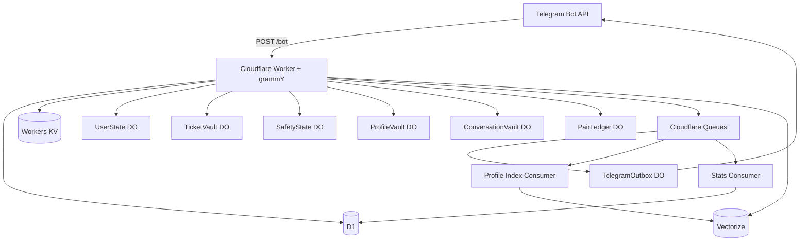
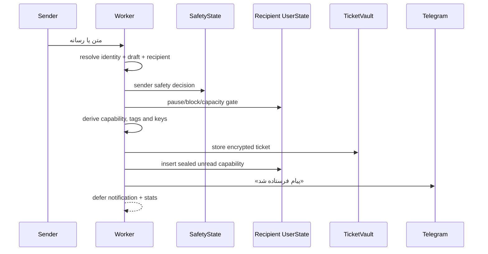

## ۱. مسئله‌ی اصلی «رساندن پیام» نبود

ساخت یک ربات پیام ناشناس در ساده‌ترین شکل چند مرحله بیشتر ندارد:

```txt
یک لینک شخصی
→ یک پیام
→ تحویل به صاحب لینک
→ یک پاسخ ناشناس
```

اما محصول واقعی از لحظه‌ای شروع می‌شود که این مسیر باید در برابر retry، race، حذف حساب، بلاک، گزارش، پیام‌های هم‌زمان و failureهای زیرساختی رفتار قابل پیش‌بینی داشته باشد.

سؤال‌های مهم‌تر این‌ها بودند:

- پیام پیش از تحویل کجا می‌ماند؟
- آیا برای ادامه‌ی گفت‌وگو باید یک جدول دائمی از رابطه‌ی فرستنده و گیرنده ساخت؟
- اگر storage export شود، چه میزان از ارتباط کاربران قابل بازسازی است؟
- اگر Telegram یا Queue یک event را دوباره ارسال کند، آیا پیام یا اعلان تکراری ساخته می‌شود؟
- اگر ارسال به تلگرام موقتاً شکست بخورد، چه چیزی باید باقی بماند و چه چیزی نباید حذف شود؟
- بلاک و گزارش چطور بدون تبدیل‌شدن به یک social graph عمومی نگه‌داری شوند؟
- reset چطور هویت عملیاتی قبلی را واقعاً بی‌اعتبار کند؟
- پیشنهاد گفت‌وگو چطور مفید باشد، بدون ادعای تشخیص شخصیت یا «درصد سازگاری»؟

نِکونیموس از پاسخ به همین سؤال‌ها ساخته شد.

هدف پروژه ساخت یک پیام‌رسان جدید یا ادعای «ناشناسی کامل» نبود. تعریف محدودتر و قابل دفاع‌تری انتخاب شد:

> نِکونیموس یک relay ناشناس میزبانی‌شده در تلگرام است که هر پیام را به یک تیکت مستقل تبدیل می‌کند، داده‌ی قابل اتصال را تا جای ممکن کم نگه می‌دارد و state لازم برای تحویل را عمر‌دار و محدود طراحی می‌کند.

این نوشته روایت تبلیغاتی پروژه نیست. تمرکز آن روی معماری، جریان داده، قابلیت‌ها، failure semantics و محدودیت‌های واقعی سیستم است.

## ۲. محصول امروز دقیقاً چیست؟

نِکونیموس یک ربات تلگرام فارسی‌محور و متن‌باز است برای:

- ساخت لینک ناشناس شخصی؛
- دریافت پیام متنی و رسانه‌های پشتیبانی‌شده‌ی تلگرام؛
- اعلان تعداد پیام‌های تحویل‌نشده؛
- تحویل صفی پیام‌ها از داخل صندوق؛
- پاسخ ناشناس؛
- بلاک و رفع بلاک؛
- گزارش سوءاستفاده؛
- نام خصوصی برای یک فرستنده‌ی ناشناس؛
- توقف و ادامه‌ی دریافت پیام؛
- پاک‌کردن حساب و ساخت هویت و لینک تازه؛
- ساخت پروفایل سبک گفت‌وگو؛
- دریافت پیشنهاد گفت‌وگوی اختیاری؛
- فرستادن درخواست گفت‌وگو با رضایت دوطرفه.

سطح اصلی محصول خود Telegram است:

```txt
/start
/inbox
/settings
/assessment
/match
```

صفحه‌ی وب فقط معرفی، مستندات و مسیر ورود به ربات است. هسته‌ی Worker یک dashboard عمومی یا REST API محصولی ارائه نمی‌کند.

دو جریان اصلی وجود دارد.

### پیام ناشناس

```txt
لینک شخصی
→ پیام ناشناس
→ sealed ticket
→ unread موقت در صندوق
→ اعلان با شمارنده‌ی زنده
→ تحویل
→ پاسخ / نام خصوصی / بلاک / گزارش
→ انقضای تیکت
```

### پیشنهاد گفت‌وگو

```txt
پروفایل گفت‌وگو
→ opt-in discoverability
→ retrieval محدود در Vectorize
→ رتبه‌بندی متقابل و قطعی
→ suggestion مهروموم‌شده
→ request مهروموم‌شده
→ پذیرش
→ تبدیل intro به یک sealed ticket معمولی
```

پیشنهاد گفت‌وگو یک سیستم پیام‌رسانی دوم نیست. بعد از پذیرش درخواست، دوباره همان primitive اصلی وارد عمل می‌شود: یک تیکت مستقل.

## ۳. چیزی که نِکونیموس ادعا نمی‌کند

این پروژه:

- E2EE نیست؛
- zero-knowledge نیست؛
- ناشناسی کامل یا untraceability تضمین نمی‌کند؛
- شبکه‌ی اجتماعی یا dating app نیست؛
- تست شخصیت یا تشخیص روان‌شناختی نیست؛
- هویت طرف مقابل را تأیید نمی‌کند؛
- امنیت یا سلامت یک گفت‌وگو را تضمین نمی‌کند.

مرز اعتماد ساده است: Telegram و Worker برای انتقال و پردازش، متن یا رسانه را در مسیر عادی می‌بینند. رمزنگاری application-level برای حذف این واقعیت نیست؛ برای کم‌کردن plaintext ذخیره‌شده و کاهش ارزش یک storage dump است.

این مرز فقط یک بار باید روشن گفته شود. باقی معماری درباره‌ی این است که سیستم بعد از پردازش چه چیزی را نگه می‌دارد و چه چیزی را عمداً نمی‌سازد.

## ۴. اصول طراحی

معماری فعلی روی چند اصل ثابت بنا شده است.

### ۴.۱ هر پیام یک capability مستقل است

پیام‌ها عضو یک conversation row دائمی نیستند. هر پیام capability، lookup، کلیدها، lifecycle و idempotency مستقل دارد.

### ۴.۲ صندوق آرشیو نیست

Inbox در نکو یک **صف تحویل موقت** است؛ نه صفحه‌ای برای مرور دائمی تاریخچه.

### ۴.۳ ذخیره‌سازی باید رابطه‌ی کمتری بسازد

D1 نباید به جدولی از این جنس تبدیل شود:

```txt
sender_id | recipient_id | message | created_at
```

### ۴.۴ state باید توسط مالک مناسب هماهنگ شود

Transitionهای حساس در Durable Objectها انجام می‌شوند؛ جایی که storage تراکنشی و strongly consistent برای هر object وجود دارد.

### ۴.۵ Queue دقیقاً یک‌بار نیست

Cloudflare Queues at-least-once است. بنابراین duplicate delivery یک حالت عادی طراحی است و effectهای محصول باید idempotent باشند.

### ۴.۶ failure موقت نباید destructive باشد

خطای شبکه، DO، D1، runtime crypto یا Telegram نباید باعث حذف یک تیکت سالم شود. اصل پیش‌فرض:

```txt
خطای ناشناخته یا موقت
→ release
→ retry
→ داده را حذف نکن
```

### ۴.۷ retrieval با تصمیم یکی نیست

Vectorize فقط candidateهای نزدیک را پیدا می‌کند. eligibility و ranking نهایی در TypeScript قطعی و قابل تست انجام می‌شود.

## ۵. تصویر کلی معماری



Worker سه مسئولیت runtime دارد:

```txt
fetch()
  → پذیرش webhook تلگرام روی POST /bot

queue()
  → dispatch صف‌های outbox، stats و profile-index

Durable Object exports
  → stateful coordination و storageهای محدود
```

### مرز هر storage plane

| Plane | مسئولیت | نباید تبدیل شود به |
|---|---|---|
| D1 | کاربران فعال، لینک عمومی و آمار تجمیعی | متن پیام، inbox، پروفایل کامل یا social graph |
| UserState DO | unread موقت، draft، block، nickname، rate state و profile session | دیتابیس عمومی کاربران یا plaintext inbox |
| TicketVault DO | route/payload/meta رمزنگاری‌شده و lifecycle تیکت | جدول پیام با sender/recipient مستقیم |
| SafetyState DO | eventهای blind گزارش و sanction یک abuse subject | گراف قابل برگشت گزارش‌دهنده و گزارش‌شونده |
| ProfileVault DO | پروفایل نهایی رمزنگاری‌شده و revision | جدول D1 از پروفایل کاربران |
| ConversationVault DO | suggestion، request و intro رمزنگاری‌شده | relationship table عمومی |
| PairLedger DO | lock، cooldown، block و exposure کور | دایرکتوری قابل برگشت زوج‌ها |
| TelegramOutbox DO | ارسال idempotent و paced برای یک chat | transcript یا log نامحدود ارسال |
| KV | cache مسیریابی و cache کوتاه‌عمر | source of truth محصول |
| Queues | کار asynchronous و retryپذیر | exactly-once authority |
| Vectorize | retrieval محدود روی بردارهای کنترل‌شده | ranker نهایی یا identity store |

قاعده‌ی ساده:

```txt
D1 برای ساختار قابل query.
Durable Objects برای state ترتیبی و atomic.
KV برای cache.
Queues برای side effectهای retryپذیر.
Vectorize برای retrieval، نه تصمیم.
```

## ۶. هویت داخلی و لینک عمومی

هر کاربر یک شناسه‌ی داخلی و یک public slug دارد:

```txt
t.me/{bot_username}?start={slug}
```

شناسه‌ی خام Telegram به public ID یا join key عمومی تبدیل نمی‌شود. مدل مفهومی:

```txt
telegram_user_id
→ HMAC با application pepper
→ telegram_user_hash
→ internal account
```

D1 مرجع اصلی کاربر و لینک است. KV فقط cache best-effort برای lookup سریع‌تر است:

```txt
KV read failure
→ fallback به D1

KV write/delete failure
→ log و ادامه
```

ساخت کاربر و لینک عمومی در یک D1 batch انجام می‌شود تا account بدون لینک یا لینک بدون account ساخته نشود.

`chat_id` لازم برای ارسال تلگرام به‌صورت رمزنگاری‌شده نگه‌داری می‌شود.

## ۷. capability اصلی تیکت

هسته‌ی مدل پیام، `TicketCapability` است.

### ۷.۱ قالب canonical

Capability دقیقاً ۳۲ بایت است:

```txt
bytes 0..15   lookupNonce
bytes 16..31  keySeed
```

نمایش canonical آن:

```txt
43 کاراکتر Base64URL بدون padding
[A-Za-z0-9_-]{43}
```

فرمت legacy یا version byte وجود ندارد.

این capability دو بخش را عمداً جدا می‌کند:

- `lookupNonce` برای پیدا کردن record؛
- `keySeed` برای مشتق‌کردن کلیدهای بازکردن capsuleها.

### ۷.۲ lookup کور

```txt
ticketHash =
  HMAC(APP_HMAC_PEPPER,
       "nekonymous:ticket:lookup" || lookupNonce)
```

TicketVault با `ticketHash` جست‌وجو می‌شود. storage برای lookup نیازی به `keySeed` ندارد و capability خام را نگه نمی‌دارد.

### ۷.۳ کلیدهای مستقل

ریشه‌ی کلید از secret پایدار Worker و context تیکت مشتق می‌شود:

```txt
APP_MASTER_KEY
+ ticketHash
+ keySeed
→ HKDF
```

از این ریشه، کلیدهای مجزا برای capsuleهای زیر ساخته می‌شوند:

```txt
route key
payload key
metadata key
```

هر capsule AES-GCM و AAD مستقل دارد. جابه‌جایی ciphertext میان دو تیکت یا دو domain باید authentication failure تولید کند.

### ۷.۴ owner proof

داشتن capability به‌تنهایی کافی نیست. proof ذخیره‌شده به این context bind می‌شود:

```txt
recipient stable actor hash
+ recipient current internal account id
+ ticketHash
```

در هر action، Worker proof را برای actor فعلی دوباره محاسبه می‌کند. hard reset شناسه‌ی داخلی تازه می‌سازد؛ بنابراین callbackهای قدیمی بلافاصله authorization خود را از دست می‌دهند.

## ۸. TicketVault چه چیزی نگه می‌دارد؟

record اصلی:

```txt
ticket_hash
owner_proof_tag
route_enc
payload_enc
meta_enc
status
created_at
expires_at
```

TicketVault نگه نمی‌دارد:

- capability خام؛
- `lookupNonce` یا `keySeed`؛
- Telegram user ID یا chat ID به‌شکل plaintext؛
- sender/recipient account ID مستقیم؛
- transcript گفت‌وگو؛
- conversation graph.

### route capsule

Route فقط اطلاعات لازم برای actionهای بعدی را حمل می‌کند:

- مسیر رمزنگاری‌شده‌ی برگشت به فرستنده؛
- `replyRouteTag`؛
- `contactTag`؛
- `blockTag`؛
- `abuseSubjectTag`؛
- policy محدود پاسخ؛
- context حداقلی reply در Telegram.

### payload capsule

Payload محتوای قابل تحویل را نگه می‌دارد. کد فعلی این نوع‌ها را پشتیبانی می‌کند:

```txt
text
photo
video
animation
document
voice
audio
sticker
video_note
```

برای رسانه، file identifier تلگرام و caption محدود ذخیره می‌شود؛ نه فایل باینری مستقل.

### metadata capsule

Metadata شامل داده‌ی غیرمسیری مورد نیاز نمایش، مانند شماره‌ی کوتاه تیکت و زمان ساخت است و جداگانه رمزنگاری می‌شود.

## ۹. ساخت یک پیام ناشناس

مسیر hot path فرستنده:



نقطه‌ی پذیرش durable این است:

```txt
TicketVault accepted
+
Unread insertion accepted
```

بعد از این نقطه، اعلان و آمار side effect هستند. شکست آن‌ها نباید تیکت پذیرفته‌شده را rollback کند.

### compensation

`storeTicket` مشخص می‌کند record در همین invocation ساخته شده یا از قبل وجود داشته است:

```txt
created
existing
```

اگر unread insertion شکست بخورد، فقط recordی پاک می‌شود که همان invocation ساخته است. این تفاوت برای عملیات deterministic مثل قبول درخواست گفت‌وگو حیاتی است؛ retry نباید تیکت سالم قبلی را حذف کند.

## ۱۰. UserState و unread موقت

برای هر تیکت تحویل‌نشده، UserState گیرنده فقط این state را دارد:

```txt
item_id                  random UUID
sealed_capability_enc    capability رمزنگاری‌شده و authenticated
dedupe_tag               blind dedupe value
delivery_state           active | delivering
delivery_attempt_id      مالک lease
delivery_lease_until     زمان انقضای lease
created_at
expires_at
```

UserState نگه نمی‌دارد:

- `ticketHash`؛
- capability plaintext؛
- متن یا رسانه‌ی پیام؛
- route capsule؛
- sender account ID.

محدودیت فعلی:

```txt
حداکثر unread فعال: 50
حداکثر آیتم در یک drain: 50
lease تحویل: 60 ثانیه
```

این سقف هم هزینه را bounded نگه می‌دارد و هم جلوی تبدیل‌شدن صندوق به archive را می‌گیرد.

## ۱۱. اعلان هر پیام با شمارنده‌ی زنده

تصمیم محصولی فعلی این است:

```txt
هر unread پذیرفته‌شده
→ یک notification event مستقل
```

Queue job شامل شمارنده نیست. هنگام اجرای consumer، عدد واقعی از UserState خوانده می‌شود:

```txt
inbox-notification(accountId, eventId)
→ getUnreadSummary()
→ اگر count > 0:
   «X پیام تحویل‌نشده داری»
→ callback: ib:d
```

ویژگی‌ها:

- job هیچ capability، `ticketHash`، متن، route یا sender identity ندارد؛
- count هنگام ارسال محاسبه می‌شود، نه هنگام enqueue؛
- Outbox idempotency با account و event ID ساخته می‌شود؛
- اگر صندوق قبل از اجرای job خالی شده باشد، اعلان ارسال نمی‌شود؛
- اعلان قبلی edit نمی‌شود؛
- notification cycle، revision، generation یا message-id registry وجود ندارد.

پیام‌های سریع می‌توانند چند اعلان با count مشابه بسازند. این هزینه‌ی مستقیم انتخاب «یک اعلان تازه برای هر پیام» است؛ اما authority تیکت‌ها را به هم متصل نمی‌کند.

## ۱۲. Inbox یک صف تحویل است

`/inbox`، دکمه‌ی اصلی صندوق و callback عمومی `ib:d` همگی صندوق فعلی actor را drain می‌کنند.

```txt
کاربر صندوق را باز می‌کند
→ cleanup محدود unreadهای منقضی
→ خواندن count زنده
→ اگر صفر: پیام خالی
→ enqueue inbox-drain
→ پاسخ فوری «در حال باز کردن پیام‌ها»
```

تحویل واقعی در Queue consumer انجام می‌شود:

```txt
claim one
→ open sealed capability
→ resolve one TicketVault record
→ verify owner proof
→ decrypt required capsules
→ send through TelegramOutbox
→ finalize one
→ repeat up to 50
```

در معماری فعلی:

- لیست inbox وجود ندارد؛
- pagination وجود ندارد؛
- viewed shell وجود ندارد؛
- delivered registry دائمی وجود ندارد؛
- هر تیکت مستقل claim و finalize می‌شود.

### بعد از تحویل موفق

```txt
Telegram send succeeds
→ payload_enc پاک می‌شود
→ ticket viewed می‌شود
→ unread attempt کامل و row حذف می‌شود
```

Route و metadata تا انقضای محدود باقی می‌مانند تا دکمه‌های reply، nickname، block و report کار کنند.

Capability بعد از تحویل در callbackهای پیام Telegram کاربر حضور دارد؛ نه در یک index قابل بازیابی داخل UserState.

## ۱۳. failure semantics صندوق

### خطاهای retryable

این خطاها نباید داده را حذف کنند:

- شکست موقت Durable Object یا D1؛
- failure در Queue consumer؛
- خطای runtime یا configuration در crypto؛
- Telegram network/5xx؛
- پاسخ `429`؛
- Outbox lock یا pacing delay.

رفتار:

```txt
release unread lease
→ Queue retry
```

### orphan دائمی

Cleanup دائمی فقط برای وضعیت‌های صریح انجام می‌شود:

- capability واقعاً malformed؛
- ticket missing یا expired؛
- payload غیرقابل تحویل یا terminal؛
- فرمت پشتیبانی‌نشده؛
- rejection دائمی Telegram.

قبل از حذف TicketVault، ابتدا باید همان `deliveryAttemptId` هنوز مالک unread row باشد. Worker قدیمی یا lease منقضی اجازه ندارد تیکتی را که claim جدید گرفته حذف کند.

### اصل محافظه‌کارانه

```txt
unknown exception
→ retry
نه delete
```

این اصل یکی از مهم‌ترین تغییرات release hardening بود.

## ۱۴. TelegramOutbox و idempotency

ارسال Telegram داخل transaction محلی Worker نیست. ممکن است API پیام را بپذیرد و Worker قبل از ثبت success متوقف شود. بنابراین ارسال باید با ambiguity خارجی کنار بیاید.

هر chat یک `TelegramOutboxDO` دارد:

- idempotency key پایدار؛
- lock و lease برای send؛
- ارسال اول بدون delay مصنوعی؛
- حدود یک ثانیه فاصله میان sendهای واقعی یک chat؛
- اولویت با `retry_after` تلگرام؛
- retry عمومی پنج‌ثانیه‌ای؛
- retention محدود رکوردهای idempotency؛
- cleanup با alarm.

Queue consumer کارها را برای هر chat در lane ترتیبی اجرا می‌کند، اما chatهای مختلف می‌توانند موازی باشند.

نمونه‌ی idempotency تحویل تیکت:

```txt
ticket-delivery:{ticketHash}
```

اصل:

```txt
Queue تلاش برای تحویل را تضمین می‌کند.
Application effect تکراری را مهار می‌کند.
```

Seen receipt در نسخه‌ی انتشار به‌صورت پیش‌فرض غیرفعال است تا بار Outbox برای هر پیام دو برابر نشود.

## ۱۵. reply، nickname، block و report

Actionهای پیام از همان capability تحویل‌شده استفاده می‌کنند:

```txt
callback capability
→ parse canonical format
→ derive ticketHash
→ load TicketVault
→ verify current actor/account
→ derive keys
→ decrypt only required capsule
→ enforce action policy
```

### پاسخ ناشناس

Reply ادامه‌ی همان database row نیست:

```txt
Ticket A
→ reply draft
→ Ticket B
```

قبل از ساخت reply تازه، Safety، pause و block دوباره بررسی می‌شوند. یک تیکت قدیمی مجوز دائمی برای تماس ایجاد نمی‌کند.

### نام خصوصی

`contactTag` به account فعلی دو طرف وابسته است:

```txt
recipient current account
+ sender current account
```

گیرنده می‌تواند یک label رمزنگاری‌شده برای این tag ذخیره کند. reset هر طرف continuity نام خصوصی را می‌شکند.

Nickname فقط داخل UserState گیرنده است و به پروفایل عمومی تبدیل نمی‌شود.

### بلاک

`blockTag` از این context مشتق می‌شود:

```txt
recipient current account
+ sender stable actor hash
```

بنابراین reset فرستنده block را دور نمی‌زند. reset گیرنده عمداً block list محلی خودش را پاک می‌کند.

receive gate برای این مسیرها اجرا می‌شود:

- پیام مستقیم از لینک؛
- reply؛
- conversation request.

### گزارش و SafetyState

گزارش از چند tag domain-separated استفاده می‌کند:

- `abuseSubjectTag` برای subject پایدار سوءاستفاده؛
- `reportEventTag` برای جلوگیری از گزارش تکراری همان ticket توسط همان reporter؛
- `reporterSubjectTag` برای شمردن reporterهای متمایز در محدوده‌ی یک subject.

هر abuse subject یک `SafetyStateDO` مستقل دارد. این object eventهای blind و sanction state را نگه می‌دارد؛ نه sender/recipient graph عمومی.

Policy فعلی thresholdهای زمانی و distinct reporter دارد و می‌تواند actor را به حالت‌های زیر ببرد:

```txt
clear
suspended
probation
banned
```

Sanction به stable actor material وابسته است و با reset عادی حساب پاک نمی‌شود.

## ۱۶. hard reset

Reset فقط `status = deleted` نیست.

جریان کلی:

```txt
invalidate profile/discovery
→ cleanup شناخته‌شده‌ی unread ticketها
→ purge UserState
→ hard-delete user و public links از D1
→ پاک‌کردن best-effort cacheهای KV
→ ساخت internal account و لینک تازه
```

نتیجه‌های مهم:

- internal account ID عوض می‌شود؛
- owner proof callbackهای قدیمی fail می‌شود؛
- draft، block، nickname و unread state قبلی پاک می‌شوند؛
- profile indexing قدیمی نباید revision حذف‌شده را برگرداند؛
- Safety sanction باقی می‌ماند.

Reset نمی‌تواند پیام‌های تحویل‌شده در Telegram، screenshot یا forward را حذف کند.

## ۱۷. پروفایل سبک گفت‌وگو

این پروفایل یک assessment بالینی نیست. هدف، ساخت representation محدود و قابل محاسبه از ترجیحات گفت‌وگو است.

نسخه‌ی فعلی:

```txt
25 سؤال
8 بُعد
Conversation Profile V2
```

ابعاد:

| بُعد | موضوع |
|---|---|
| `depth` | سبک یا عمیق‌بودن گفت‌وگو |
| `replyPace` | ریتم پاسخ |
| `directness` | مستقیم یا غیرمستقیم‌بودن |
| `energy` | انرژی مکالمه |
| `playfulness` | شوخی و سبکی |
| `supportStyle` | شنیده‌شدن یا راه‌حل‌محوری |
| `disclosurePace` | سرعت بازشدن در موضوعات شخصی |
| `repairStyle` | نحوه‌ی ترمیم سوءتفاهم |

ساختار سؤال‌ها:

```txt
16 سؤال self style
8 سؤال desired style
1 سؤال current intent
```

پاسخ‌های خام فقط در session رمزنگاری‌شده‌ی فعال داخل UserState وجود دارند. بعد از finalization:

```txt
validate
→ normalize
→ importance / uncertainty
→ finalized profile در ProfileVault
→ حذف raw active answers
→ enqueue sealed index job
```

## ۱۸. پیشنهاد گفت‌وگو

Discoverability خاموش است مگر کاربر صریحاً آن را فعال کند.

دو بردار کنترل‌شده‌ی ۸بعدی ساخته می‌شود:

```txt
self vector
desired vector
```

Vectorize فقط candidate set محدود را برمی‌گرداند. retrieval دوطرفه است:

```txt
A.self نزدیک B.desired
A.desired نزدیک B.self
```

بعد از retrieval، profileهای authoritative از ProfileVault resolve می‌شوند و فیلترهای سخت اعمال می‌شوند:

- profile معتبر و فعال؛
- discoverability روشن؛
- self-candidate حذف؛
- block و pair block؛
- pending conflict؛
- cooldown؛
- exposure budget؛
- revision معتبر.

Ranker نهایی pure TypeScript است و score فقط برای ordering داخلی استفاده می‌شود. UI «درصد سازگاری» نشان نمی‌دهد.

### زنجیره‌ی capability

```txt
Profile Capability
→ Suggestion Capability
→ Request Capability
→ Message Ticket
```

Request intro رمزنگاری‌شده است. accept با `dedupeKey` deterministic انجام می‌شود تا retry دو تیکت نسازد.

```txt
pending
→ accepting
→ accepted(ticketHash)
```

Notification و stats بعد از commit اصلی deferred هستند و failure آن‌ها state محصول را rollback نمی‌کند.

## ۱۹. آمار بدون اسکن vaultها

آمار عمومی از eventهای best-effort ساخته می‌شود:

```txt
product event
→ neko-stats queue
→ batch aggregate
→ D1 daily counters
```

TicketVault، UserState، ConversationVault، PairLedger یا SafetyState برای آمار global scan نمی‌شوند.

آمار عمومی نباید شامل این‌ها باشد:

- کاربران برتر؛
- timeline کاربر؛
- تعداد پیام یک لینک مشخص؛
- ticket detail؛
- message body؛
- sender-recipient graph.

## ۲۰. اگر storage export شود چه دیده می‌شود؟

معماری metadata را ناپدید نمی‌کند. export ممکن است این‌ها را نشان دهد:

- ciphertext size؛
- timestamps؛
- count؛
- status؛
- expiry؛
- coarse vector values؛
- الگوی دسترسی در سطح platform.

اما هدف این است که یک export ساده، دفترچه‌ی مرتب زیر را تولید نکند:

```txt
چه کسی
به چه کسی
چه گفته است
و بعد چه پاسخی گرفته است
```

D1 متن پیام، route، capability، پروفایل کامل، intro یا pair graph را نگه نمی‌دارد. در DOها نیز اطلاعات حساس به capsuleهای رمزنگاری‌شده و tagهای کور تقسیم شده‌اند.

این طراحی «حذف کامل metadata» نیست؛ کاهش joinability است.

## ۲۱. تهدیدهای مهم

### compromise شدن Worker یا secretها

ریسک high-impact است. مهاجم می‌تواند plaintext در حال پردازش را ببیند و بخشی از داده‌های encrypted-at-rest را باز کند.

### compromise شدن حساب Telegram گیرنده

Callbackهای موجود در chat history همان account تا پایان lifecycle ممکن است قابل استفاده باشند.

### recipient behavior

گیرنده می‌تواند screenshot بگیرد، forward کند یا متن را بیرون از نکو منتشر کند.

### coordinated abuse

Blind reporting مانع ساخت چند حساب Telegram و هماهنگی بیرون از سیستم نمی‌شود. sanction یک heuristic عملیاتی است، نه اثبات تخلف.

### traffic analysis

Cloudflare و Telegram در سطح زیرساخت metadata و access pattern خودشان را دارند. نکو ادعای پنهان‌کردن آن لایه را ندارد.

## ۲۲. performance و tradeoffهای آگاهانه

معماری privacy-first اگر کنترل نشود می‌تواند به تعداد زیادی round trip تبدیل شود. release hardening مسیر hot path را محدود کرد:

```txt
identity
→ draft
→ recipient
→ slug
→ sealed acceptance
→ sender acknowledgement
→ deferred notification + stats
```

Queue outbox با `max_batch_timeout: 0` تنظیم شده تا jobهای user-facing برای پرشدن batch منتظر نمانند.

Pacing per-chat حدود یک ثانیه باقی مانده است. بنابراین انتخاب «یک اعلان برای هر پیام» در burst بزرگ هزینه‌ی قابل مشاهده دارد:

```txt
10 پیام سریع
→ 10 notification event
→ ارسال ترتیبی همان chat
```

این bug نیست؛ tradeoff محصولی است. در مقابل، count هر اعلان هنگام send زنده است و اعلان‌ها editable state یا cycle مشترک نمی‌سازند.

قواعد performance:

- همه‌ی loopها bounded؛
- inbox حداکثر ۵۰؛
- retrieval و profile resolution محدود؛
- nickname در یک drain cache می‌شود؛
- statistics vault scan ندارد؛
- Queue payloadها کوچک‌اند؛
- promise رهاشده وجود ندارد؛
- side effect غیرحیاتی با `waitUntil` جدا می‌شود.

## ۲۳. ساختار کد

```txt
src/
├── index.ts
├── bot/
├── contracts/
├── features/
│   ├── identity/
│   ├── ticketing/
│   ├── moderation/
│   ├── settings/
│   └── conversation/
├── storage/
│   ├── user-state/
│   ├── ticket-vault/
│   ├── safety-state/
│   ├── profile-vault/
│   ├── conversation-vault/
│   ├── pair-ledger/
│   └── telegram-outbox/
├── queues/
├── stats/
├── i18n/
└── utils/
```

مرزها:

- handler ورودی Telegram را parse و خروجی را render می‌کند؛
- crypto و storage detail وارد UI handler نمی‌شود؛
- contractهای canonical در `src/contracts` هستند؛
- Durable Object clientها typed و مرکزی‌اند؛
- ranker و profile calculation pure باقی می‌مانند؛
- لاگ‌ها stage-based و بدون content حساس‌اند.

## ۲۴. verification

فرمان‌های اصلی:

```bash
pnpm typecheck
pnpm lint
pnpm knip
pnpm test
pnpm test:workers
pnpm test:release-hardening
pnpm audit:d1
pnpm audit:ticket-storage
pnpm audit:types
pnpm run check
```

تست‌ها و auditها روی این invariants متمرکزند:

- نبود message body در D1؛
- capability canonical؛
- lifecycle تیکت و unread؛
- Queue و Outbox idempotency؛
- retry غیرمخرب؛
- stale claim safety؛
- Safety thresholdها؛
- request accept idempotency؛
- profile revision و indexing؛
- retrieval و deterministic ranking؛
- reset hardening؛
- log redaction؛
- storage boundaries.

این‌ها اثبات امنیت مطلق نیستند. هدف این است که تصمیم‌های معماری فقط در متن باقی نمانند و بخشی از آن‌ها توسط repository enforce شوند.

## ۲۵. تصمیم‌هایی که عمداً نگرفتیم

- transcript دائمی در D1؛
- جدول sender-recipient؛
- KV به‌عنوان inbox authority؛
- inbox list و pagination؛
- delivered shell registry؛
- notification قابل edit با message ID؛
- Workers AI برای inference یا ranking؛
- compatibility percentage؛
- شروع خودکار مکالمه بعد از suggestion؛
- reset به‌شکل soft-delete ساده؛
- moderation dashboard پیش از نیاز واقعی؛
- key rotation پیچیده بدون migration plan؛
- ادعای E2EE، zero-knowledge یا perfect anonymity.

سادگی این پروژه به معنی کم‌بودن componentها نیست؛ به معنی محدودبودن مسئولیت هر component است.

## ۲۶. وضعیت فعلی

خط پشتیبانی‌شده `master` است و شامل این بخش‌هاست:

- Telegram-only Worker runtime؛
- deep-link anonymous messaging؛
- پیام متنی و رسانه‌های پشتیبانی‌شده؛
- sealed ticket capability؛
- unread delivery queue؛
- اعلان per-message با count زنده؛
- anonymous reply؛
- block / unblock؛
- blind reporting و SafetyState؛
- private nickname؛
- pause / resume؛
- hard account reset؛
- Conversation Profile V2؛
- opt-in Conversation Suggestions V2؛
- controlled Vectorize retrieval؛
- deterministic reciprocal ranking؛
- sealed suggestions and requests؛
- idempotent Telegram outbox؛
- aggregate product statistics؛
- release hardening برای retry، cleanup، reset، races و logging.

## جمع‌بندی

نِکونیموس با سؤال ساده‌ی «چطور یک پیام ناشناس را برسانیم؟» شروع شد، اما معماری واقعی با سؤال دقیق‌تری شکل گرفت:

```txt
چطور پیام را برسانیم
بدون اینکه برای انجام این کار
یک آرشیو دائمی و قابل اتصال
از آدم‌ها و رابطه‌هایشان بسازیم؟
```

پاسخ فعلی:

```txt
پیام = capability مستقل
lookup = blind
payload = موقت
route = رمزنگاری‌شده و عمر‌دار
inbox = صف تحویل محدود
notification = event مستقل با count زنده
block = recipient-scoped blind tag
report = blind safety signal
Queue = at-least-once
Outbox = idempotent
Vectorize = retrieval
ranking = deterministic
conversation = بعد از consent
```

اصل نهایی پروژه:

> حریم خصوصی با ادعای بزرگ‌تر ساخته نمی‌شود؛ با داده‌ی کمتر، مرز روشن‌تر، state محدودتر و failureهای قابل پیش‌بینی ساخته می‌شود.

---

### مسیرهای مرجع

- [Repository](https://github.com/mohetios/Nekonymous)
- [Architecture](https://github.com/mohetios/Nekonymous/blob/master/docs/architecture.md)
- [Sealed Ticketing](https://github.com/mohetios/Nekonymous/blob/master/docs/sealed-ticketing.md)
- [Conversation Suggestions](https://github.com/mohetios/Nekonymous/blob/master/docs/conversation-suggestions.md)
- [Threat Model](https://github.com/mohetios/Nekonymous/blob/master/docs/threat-model.md)
- [صفحه‌ی معرفی](https://mohetios.github.io/Nekonymous/)
- [ربات تلگرام](https://t.me/nekonymous_bot)
