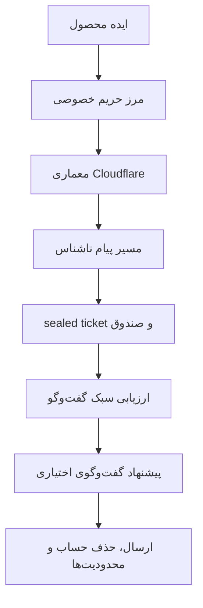
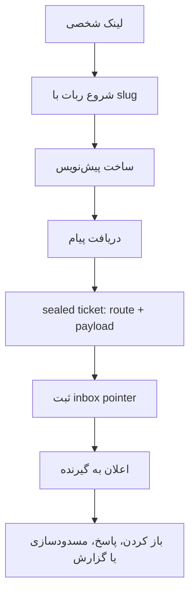
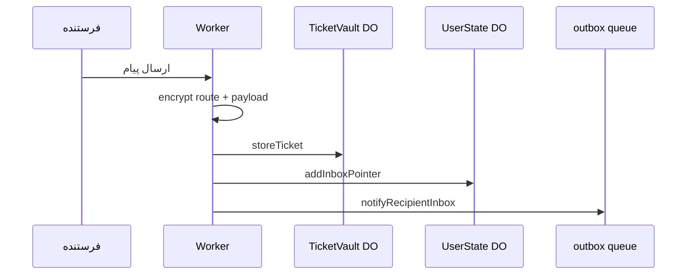
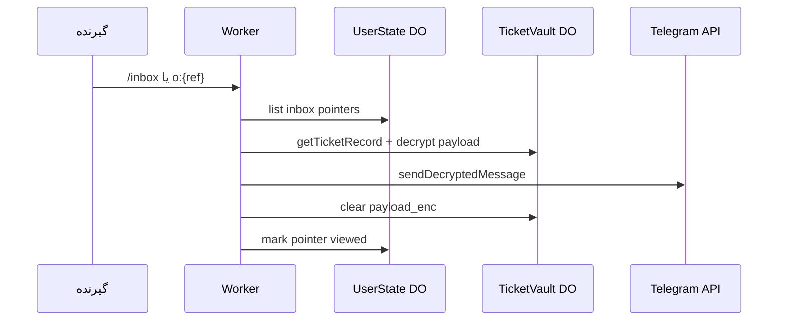
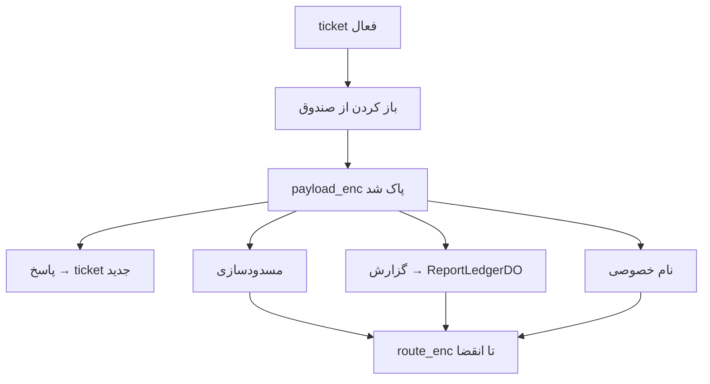
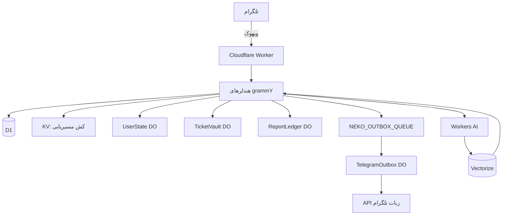
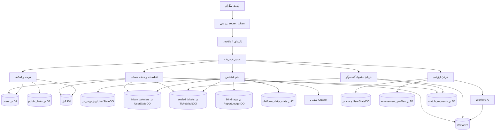
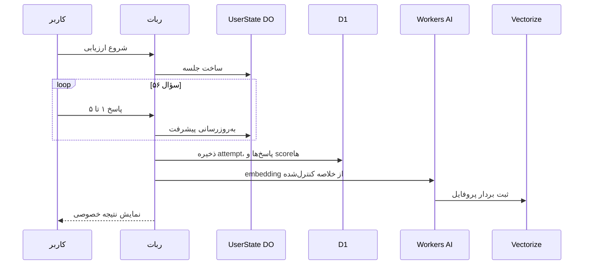
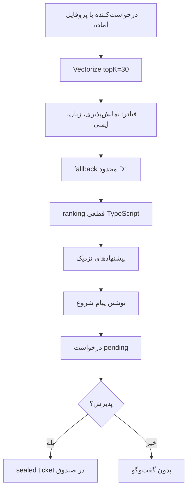
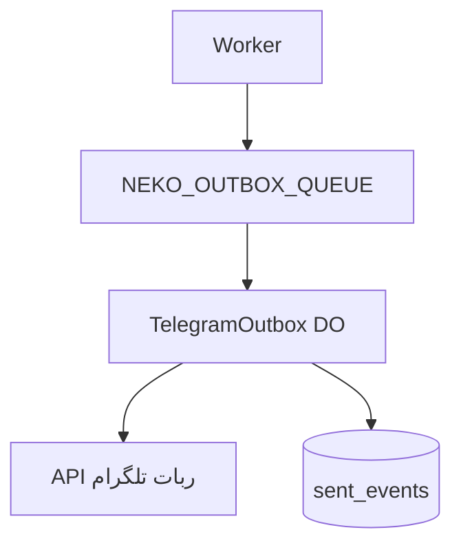

## ۱. چرا این پروژه ساخته شد

پیام ناشناس در تلگرام ایده ساده‌ای است: یک لینک شخصی، یک پیام بدون نمایش نام کاربری. اما وقتی چنین سیستمی واقعاً استفاده می‌شود، سؤال‌ها جدی می‌شوند. اگر تلگرام یک update را دوباره بفرستد چه؟ متن پیام کجا می‌ماند و چقدر؟ آیا باید یک گراف دائمی sender → recipient در دیتابیس نگه داشت؟ و اگر قرار است گفت‌وگوهای ناشناس پیشنهاد شوند، مرز بین «کمک به شروع گفت‌وگو» و «ادعای سازگاری یا دوستیابی» کجاست؟

ریشه طراحی نکونیموس از همان نقطه‌ای می‌آید که تجربه‌ی پیام ناشناس در وب فارسی برای خیلی‌ها ترک برداشت: هک شدن یک ربات ناشناس معروف و روشن شدن این واقعیت که ابزار «ناشناس» می‌تواند مقدار زیادی داده شخصی و ارتباطی را نگه دارد.

ایده پیام ناشناس هنوز جذاب است. به شروع گفت‌وگو کمک می‌کند، اصطکاک را کم می‌کند، و نشان داده که برای جامعه فارسی مصرف واقعی دارد. اما بعد از چنین اتفاقی، سؤال محصول عوض می‌شود. دیگر فقط نمی‌پرسیم «چطور پیام را برسانیم؟» می‌پرسیم «چطور پیام را برسانیم، بدون اینکه سیستم بیشتر از نیازش بداند؟»

نکونیموس از همین سؤال‌ها شروع شد: یک relay کوچک و عملیاتی که ادعای privacy بزرگ‌تر از واقعیت نکند، داده ذخیره‌شده را تا حد ممکن کم نگه دارد، و در عین حال برای کاربر فارسی‌زبان قابل استفاده بماند.

لینک‌ها:

- [nekonymous.mohetios.dev](https://nekonymous.mohetios.dev)
- [github.com/mohetios/Nekonymous](https://github.com/mohetios/Nekonymous)

این نوشته صفحه فروش محصول نیست. مستند فنی مسیر اصلی سیستم است: هر قطعه چه مسئولیتی دارد، داده از کجا وارد می‌شود، کجا ذخیره می‌شود، چه چیزی رمزگذاری می‌شود، و کدام مرزهای privacy باید شفاف بمانند. نوشته‌های blog می‌توانند درباره تجربه محصول یا روایت کوتاه‌تر bot حرف بزنند؛ برای جزئیات معماری، storage، ticketing و data flow به اینجا ارجاع بدهند.

مسیر خواندن:



## ۲. نکونیموس چیست

نِکونیموس یک ربات پیام ناشناس فارسی‌محور است؛ برای ساخت لینک شخصی، دریافت پیام ناشناس، پاسخ ناشناس، ارزیابی سبک گفت‌وگو و پیشنهاد گفت‌وگوی اختیاری.

سطح محصول:

```txt
/start          → لینک ناشناس شخصی
deep link       → ارسال پیام ناشناس
/inbox          → صندوق پیام‌ها
پاسخ / مسدود / گزارش / نام خصوصی
/assessment     → ارزیابی سبک گفت‌وگو (۵۶ سؤال، ۱۴ بُعد، نسخه v1)
/match          → پیشنهاد گفت‌وگو (opt-in)
/settings       → توقف دریافت، نام نمایشی، پاک کردن حساب
```

UI اصلی داخل تلگرام است. یک Worker واحد روی Cloudflare webhook را می‌گیرد، منطق ربات را اجرا می‌کند و با D1، Durable Object، KV، Queue، Workers AI و Vectorize کار می‌کند. وب‌سایت محصول فقط نقطه معرفی است؛ مسیر عملیاتی داخل خود bot می‌ماند.

سه اصل محصول:

| اصل | معنی در سیستم |
| --- | --- |
| تیکتینگ کم‌داده | پیام ناشناس transcript دائمی نیست؛ sealed ticket با `route_enc` و `payload_enc` موقت است. |
| پیشنهاد گفت‌وگوی محتاط | سیستم کمک می‌کند شروع گفت‌وگو کمتر تصادفی باشد، اما سازگاری قطعی یا رابطه پیشنهاد نمی‌دهد. |
| سرویس کوچک و پایدار | Worker، D1، Durable Object، KV و Queue هرکدام فقط همان کاری را انجام می‌دهند که لازم است. |

## ۳. نکونیموس چه چیزی نیست

این مرزها عمداً در copy و معماری حفظ می‌شوند:

- پیام‌رسان رمزنگاری سرتاسری (E2EE) نیست
- zero-knowledge یا ناشناسی کامل ادعا نمی‌کند
- اپلیکیشن dating یا شبکه اجتماعی کامل نیست
- تست شخصیت، تشخیص روان‌شناختی یا سیستم سازگاری دقیق نیست
- وب‌اپ یا SPA عمومی در V1 ندارد

مرز اعتماد شفاف:

> نکونیموس کاربران را در جریان معمول محصول از هم پنهان می‌کند، داده‌های ذخیره‌شده را تا حد ممکن کم نگه می‌دارد، داده‌های حساس ذخیره‌شده را در حد پیاده‌سازی فعلی در حالت سکون رمزنگاری می‌کند، و شفاف می‌گوید که تلگرام و Worker هنگام پردازش پیام‌ها متن پیام را می‌بینند.

## ۴. تجربه کاربر داخل بات

**منوی اصلی (reply keyboard):**

```txt
🔗 لینک من
🧭 پیشنهاد گفت‌وگو
⚙️ تنظیمات
```

**قاعده UX:** reply keyboard برای ناوبری و hub؛ inline keyboard برای عمل روی همان پیام، ticket، درخواست یا تأیید.

دستورات slash همچنان کار می‌کنند: `/start`، `/inbox`، `/settings`، `/assessment`، `/match`، `/match_system`.

داخل پیشنهاد گفت‌وگو:

```txt
👤 پروفایل گفت‌وگو
🔎 پیدا کردن گزینه‌ها
📥 درخواست‌های گفت‌وگو
📝 شروع ارزیابی / 📝 ارزیابی دوباره
↩️ بازگشت
```

تنظیمات شامل نام نمایشی، توقف یا فعال‌سازی صندوق، پاک‌کردن مسدودسازی‌ها، reset تاریخچه پیشنهادها، about/privacy و پاک‌کردن حساب است.

## ۵. لینک ناشناس و پیام ناشناس

هر کاربر یک slug عمومی دارد: `t.me/{bot}?start={slug}`.

فرستنده لینک را باز می‌کند، پیام می‌نویسد و ارسال می‌کند. نام کاربری تلگرام فرستنده در رابط محصول به گیرنده نمایش داده نمی‌شود و برعکس.

قبل از پذیرش پیام، مسدودی، pause گیرنده و rate limit بررسی می‌شوند. در این مرحله هنوز ticket ساخته نمی‌شود؛ سیستم یک پیش‌نویس برای فرستنده می‌سازد — وضعیت موقتی که می‌گوید «پیام بعدی این کاربر برای این گیرنده است».

وقتی متن یا رسانه می‌رسد، پیام موفق به یک ticket محدود تبدیل می‌شود؛ نه یک ردیف transcript دائمی در D1.



```txt
/start {slug}
  -> شناسایی فرستنده از تلگرام
  -> پیدا کردن گیرنده از slug لینک
  -> رد کردن پیام به خود
  -> بررسی pause، block و ظرفیت صندوق گیرنده
  -> ساخت پیش‌نویس برای فرستنده
  -> انتظار برای پیام بعدی فرستنده

فرستنده پیام را می‌فرستد
  -> خواندن پیش‌نویس فرستنده
  -> بررسی rate limit
  -> randomTicketRef + ticketHash + ownerProofTag
  -> رمزنگاری route_enc و payload_enc
  -> storeTicket در TicketVaultDO
  -> addInboxPointer در UserStateDO گیرنده
  -> پاک کردن پیش‌نویس فرستنده
  -> اعلان به گیرنده از طریق outbox queue
```

## ۶. صندوق پیام‌ها و مدل sealed ticket

پیام ناشناس در نکونیموس مثل یک ردیف معمولی `sender_id → recipient_id` ذخیره نمی‌شود. هر پیام به یک sealed ticket محدود تبدیل می‌شود؛ callback دکمه‌ها فقط یک `ticketRef` کوتاه دارند، مسیر داخل `route_enc` رمزنگاری می‌شود، و متن پیام بعد از نمایش موفق از `payload_enc` پاک می‌شود.

دو لایه جدا داریم:

| لایه | محل | چه نگه می‌دارد؟ |
| --- | --- | --- |
| Ticket vault | `TicketVaultDO` | `route_enc` + `payload_enc` برای هر `ticketHash` |
| Inbox pointer | `UserStateDO.inbox_pointers` | اشاره‌گر sealed، وضعیت، انقضا — بدون متن plaintext |

جریان:

1. `ticketRef` تصادفی ۳۲ کاراکتری برای دکمه‌های تلگرام (raw ref در D1/KV ذخیره نمی‌شود)
2. `ticketHash` از HMAC ref + pepper — کلید lookup
3. `ownerProofTag` — bind کردن vault record به hash تلگرام گیرنده
4. رمزنگاری `RouteCapsule` و `PayloadCapsule` با کلیدهای مشتق‌شده از ticket
5. `sealInboxTicketRef` — ref رمزنگاری‌شده داخل inbox pointer
6. ذخیره در `TicketVaultDO`؛ اشاره در `UserStateDO.inbox_pointers`
7. اعلان به گیرنده از طریق `NEKO_OUTBOX_QUEUE`
8. `/inbox` یا `o:{ref}` → رمزگشایی، ارسال به تلگرام، پاک‌کردن `payload_enc`
9. `route_enc` تا انقضا برای پاسخ، مسدودسازی، گزارش و نام خصوصی باقی می‌ماند

آیتم‌های صندوق حداکثر ۳۰ روز باقی می‌مانند (`INBOX_RETENTION_DAYS`). متن پیام بعد از نمایش موفق پاک می‌شود، اما پوسته‌ی ticket و مسیر رمزنگاری‌شده تا زمان انقضا می‌تواند برای پاسخ، گزارش، مسدودسازی یا نام خصوصی باقی بماند.

محدودیت‌های عملیاتی:

- حداکثر ۵۰ inbox pointer فعال در هر `UserStateDO`
- حداکثر ۱۰ payload در هر درخواست `/inbox`
- `callback_data` تلگرام حداکثر ۶۴ بایت





## ۷. پاسخ، مسدودسازی، گزارش و نام خصوصی

عمل‌های inbox فقط inline و روی همان پیام:

```txt
💬 پاسخ دادن
🏷️ نام خصوصی
🚫 مسدود کردن
⚠️ گزارش کردن
```

callbackها کوتاه و زبان‌مستقل هستند:

```txt
o:{ticketRef}   باز کردن
r:{ticketRef}   پاسخ
b:{ticketRef}   مسدود کردن
u:{ticketRef}   رفع مسدودی
rp:{ticketRef}  گزارش
n:{ticketRef}   نام خصوصی
ib:open         میانبر /inbox از اعلان
```

`ticketRef` خام در storage ذخیره نمی‌شود. قبل از هر عمل، `resolveTicketAction` vault row را با `ticketHash` بارگذاری می‌کند، **owner proof** را تأیید می‌کند و `route_enc` را رمزگشایی می‌کند — callback به‌تنهایی کافی نیست.

```txt
callback r:{ticketRef}
  -> شناسایی کاربر فعلی از تلگرام
  -> resolveTicketAction
  -> تأیید مالکیت vault record
  -> رمزگشایی route
  -> اجرای کنش (پاسخ / block / report / nickname)
```

پاسخ همان مسیر relay است: یک sealed ticket جدید در جهت معکوس. گزارش‌ها در **ReportLedgerDO** (Blind Abuse Ledger) با tagهای کور نگه داشته می‌شوند — نه transcript plaintext و نه گراف sender→recipient در D1.



## ۸. رمزگذاری، بدون ادعای اضافه

نکونیموس end-to-end encrypted نیست. این جمله باید وسط متن بماند، نه ته footnote.

Telegram پیام اولیه را می‌بیند. Worker هنگام پردازش، متن خام را می‌بیند. کسی که runtime و secretها را کنترل کند، بخشی از مرز اعتماد است.

رمزگذاری برای حذف همه اعتماد نیست. برای کم‌کردن plaintext ذخیره‌شده است.

هدف‌ها:

- username تلگرام دو طرف در UI لو نرود
- شناسه خام کاربر تلگرام به عنوان شناسه عمومی استفاده نشود
- chat id تلگرام رمزگذاری‌شده ذخیره شود
- متن پیام در storage به شکل plaintext نماند
- `payload_enc` بعد از تحویل از vault پاک شود
- `route_enc` تا انقضا برای actionهای بعدی باقی بماند
- پیام شروع پیشنهاد گفت‌وگو هم در حالت ذخیره رمزگذاری‌شده باشد

شکل ذهنی crypto (همه زیر `src/ticketing/` با Web Crypto):

```txt
APP_HMAC_PEPPER + telegram_user_id
  -> HMAC-SHA-256
  -> telegram_user_hash

APP_MASTER_KEY + ticketHash
  -> HKDF-SHA-256
  -> AES-256-GCM key
  -> route_enc + payload_enc
```

| داده رمزگذاری‌شده | معنی ساده | چرا لازم است؟ |
| --- | --- | --- |
| `payload_enc` | خود پیام | تا قبل از delivery پیام به شکل plaintext ذخیره نشود |
| `route_enc` | RouteCapsule — مسیر relay | برای پاسخ، مسدودسازی، گزارش و نام خصوصی بعد از تحویل |
| `sealedTicketRef` | ref رمزنگاری‌شده در pointer | callback کوتاه بدون ذخیره ref خام |

tradeoff آگاهانه:

```txt
payload_enc کوتاه‌عمر است.
route_enc طولانی‌تر می‌ماند، ولی رمزگذاری‌شده است.
```

## ۹. چرا تلگرام؟

تلگرام برای این محصول طبیعی است، چون اصطکاک را کم می‌کند. کاربر با همان identity و session تلگرام وارد می‌شود. لینک شخصی با deep link خود تلگرام کار می‌کند. UI خود bot کافی است.

هزینه هم دارد: پیام از Telegram عبور می‌کند و Worker هم هنگام پردازش متن خام را می‌بیند. پس نکونیموس را نباید به‌عنوان پیام‌رسان E2EE معرفی کرد.

## ۱۰. معماری Cloudflare-native

```txt
Telegram Bot API
  → Cloudflare Worker (grammY)
  → D1 / Durable Objects / KV / Queues
  → Workers AI + Vectorize
  → Telegram outbox
```

| قطعه | نقش |
| --- | --- |
| Worker | webhook، routing، منطق ربات |
| grammY | commands، callbacks، keyboards |
| D1 | users، links، assessment، matching، `platform_daily_stats` |
| UserStateDO | inbox pointers، drafts، blocks، labels، rate limits، assessment session، webhook idempotency |
| TicketVaultDO | sealed tickets (`route_enc` + `payload_enc`) |
| ReportLedgerDO | گزارش‌های کور (blind abuse tags) |
| TelegramOutboxDO | ارسال idempotent به تلگرام |
| KV | فقط cache: `tg:{hash}`، `link:{slug}` |
| Queues | `NEKO_OUTBOX_QUEUE` + `NEKO_STATS_QUEUE` |
| Workers AI + Vectorize | embedding پروفایل؛ کشف کاندید اولیه |
| Web Crypto | HMAC، HKDF، AES-256-GCM |

قاعده طراحی:

```txt
Worker برای ورود و مسیریابی.
D1 برای داده‌ای که باید پرس‌وجو شود.
Durable Object برای وضعیت داغ و ترتیبی.
KV برای کش و lookup سریع — نه حقیقت سیستم.
Queue برای کاری که نباید webhook را نگه دارد.
Workers AI + Vectorize برای کشف اولیه، نه تصمیم نهایی.
```



برای دیدن سیستم از زاویه جریان داده:



| جریان | hot path چه می‌کند؟ | حقیقت داده کجاست؟ | چه چیزی عمداً نیست؟ |
| --- | --- | --- | --- |
| پیام ناشناس | پیش‌نویس یا sealed ticket می‌سازد | `TicketVaultDO` + `inbox_pointers`؛ D1 برای هویت و آمار | transcript پیام در D1 |
| ارزیابی | جواب‌ها را مرحله‌به‌مرحله می‌گیرد | جلسه در DO؛ نتیجه در D1 | تشخیص پزشکی یا شخصیت‌شناسی |
| پیشنهاد گفت‌وگو | Vectorize + فیلتر + ranking قطعی | workflow در D1؛ کشف در Vectorize | شروع گفت‌وگو بدون پذیرش |
| ارسال خروجی | اعلان‌های غیرحیاتی را queue می‌کند | `TelegramOutboxDO` + idempotency key | ارسال تکراری در retry |

## ۱۱. مدل داده و مرزهای ذخیره‌سازی

| داده | کجا ذخیره می‌شود؟ | توضیح |
| --- | --- | --- |
| هویت کاربر | D1 `users` | `telegram_user_hash` — نه id خام |
| chat id | D1 `users` | AES ciphertext |
| slug عمومی | D1 `public_links` + KV | D1 حقیقت؛ KV کش |
| inbox pointer | UserStateDO `inbox_pointers` | sealed ref، وضعیت، انقضا |
| sealed ticket | TicketVaultDO | `route_enc` + `payload_enc` |
| پیش‌نویس‌ها | UserStateDO | پیام نیمه‌کاره |
| مسدودسازی / nickname | UserStateDO | block hash + nickname رمزگذاری‌شده |
| rate limits | UserStateDO | throttle ۱ ثانیه‌ای |
| assessment session | UserStateDO | پیشرفت فعال |
| assessment profile | D1 `assessment_profiles` | scoreها + `profile_summary_text` |
| assessment answers | D1 `assessment_answers` | Likert — متن آزاد نیست |
| match requests | D1 `match_requests` | workflow + intro رمزگذاری‌شده |
| گزارش | ReportLedgerDO | blind abuse tags |
| vector | Vectorize | id `profile:{userId}:v1` |
| آمار تجمیعی | D1 `platform_daily_stats` | بدون user id |

**D1 نگه نمی‌دارد:** متن پیام ناشناس، گراف plaintext فرستنده→گیرنده، `ticketRef` خام callback.

**KV:** فقط routing/cache؛ نه inbox، نه profile، نه matching state.

**Vectorize metadata:** discoverability، locale، نسخه پروفایل — نه پاسخ خام، نه id تلگرام.

پاک کردن حساب (`hard delete`): purge DOها، حذف ردیف‌های D1، حذف vector و کلیدهای KV، ساخت شناسه و لینک تازه. شمارنده‌های `platform_daily_stats` کاهش نمی‌یابند.

## ۱۲. ارزیابی سبک گفت‌وگو

ارزیابی سبک گفت‌وگو تشخیص شخصیت نیست. فقط یک سیگنال محصولی برای ساختن خلاصه‌ی کنترل‌شده و پیشنهادهای بهتر است.

- ۵۶ سؤال Likert در ۱۴ بُعد (`ASSESSMENT_VERSION = v1`)
- پیشرفت فعال در `UserStateDO.assessment_sessions`
- نتیجه کامل در D1 `assessment_profiles` (امتیاز بُعدها + `profile_summary_text` کنترل‌شده)
- embedding در Vectorize با id `profile:{userId}:v1`

کاربر فقط نتیجه خودش را می‌بیند. پاسخ‌های خام به طرف مقابل نمایش داده نمی‌شوند.

embedding از پاسخ خام ساخته نمی‌شود. اول یک خلاصه کنترل‌شده ساخته می‌شود:

```txt
زبان: fa.
پروفایل گفت‌وگو:
- احترام بالا به مرزها
- حساسیت عاطفی متوسط
- تنظیم هیجان بالا
- ترجیح ریتم پاسخ آرام و فکرشده
- راحتی با گفت‌وگوی ناشناس
```



## ۱۳. پیشنهاد گفت‌وگو

پیشنهاد گفت‌وگو دوستیابی یا سیستم سازگاری دقیق نیست. کاربر باید خودش نمایش در پیشنهادها را فعال کند، گزینه‌ها را ببیند، پیام شروع بنویسد، و طرف مقابل هم باید قبول کند.

Pipeline:

```txt
ارزیابی کامل + فعال‌سازی نمایش
  → Vectorize topK=30 (کاندید اولیه)
  → fallback محدود D1 وقتی index خلوت است
  → فیلتر و رتبه‌بندی قطعی در TypeScript
  → نمایش نزدیک‌ترین گزینه‌های فعلی
  → درخواست‌کننده پیام شروع می‌نویسد
  → intro رمزگذاری‌شده در match_requests
  → طرف مقابل می‌پذیرد یا رد می‌کند
  → پذیرش → sealed ticket عادی در صندوق
```



فیلترهای سخت از شباهت مهم‌ترند:

- خود کاربر، غیرفعال، پروفایل ناقص حذف می‌شوند
- discoverability خاموش = حذف
- block و report محترم شمرده می‌شوند
- درخواست تکراری ساخته نمی‌شود
- cooldown ۳۰ روزه بعد از accept/decline
- جست‌وجو: ۵۰/ساعت؛ درخواست: ۳۰۰/روز؛ TTL pending: ۷ روز

اگر فقط یک گزینه مجاز وجود دارد، همان پیشنهاد می‌شود. جمله‌ی «گزینه مناسبی پیدا نشد» فقط وقتی است که واقعاً چیزی برای نمایش نیست. UI درصد سازگاری قطعی نشان نمی‌دهد.

## ۱۴. چرا match request مستقیم گفت‌وگو نمی‌سازد؟

اگر کاربر A پیام شروع نوشت، کاربر B نباید ناگهان وارد گفت‌وگو شود. اول باید درخواست را ببیند و بپذیرد یا رد کند.

```txt
درخواست‌کننده گزینه را انتخاب می‌کند
  -> پیام شروع را می‌نویسد
  -> intro در match_requests رمزگذاری می‌شود
  -> طرف مقابل برچسب کیفیت، دلیل‌های کوتاه و پیام شروع را می‌بیند
  -> طرف مقابل می‌پذیرد یا رد می‌کند

پذیرش
  -> رمزگشایی intro
  -> createSealedTicket (همان مسیر deep link)
  -> ticket عادی در صندوق
```

پیشنهاد گفت‌وگو روی همان مسیر پیام سوار شده است؛ بعد از پذیرش، پیام شروع مثل یک پیام ناشناس عادی رفتار می‌کند.

## ۱۵. حریم خصوصی و محدودیت‌ها

**محافظت‌های پیاده‌سازی‌شده:**

- رمزنگاری در حالت سکون برای payload، chat id، nickname، route
- پاک‌کردن `payload_enc` بعد از تحویل موفق inbox
- `ticketRef` کوتاه در callback؛ ref خام در storage نیست
- throttle سراسری ۱ ثانیه‌ای per-user
- سقف inbox (۵۰)، nickname (۲۰۰)، جست‌وجو و درخواست گفت‌وگو
- webhook idempotency دو مرحله‌ای (`processed_events` در UserStateDO)
- گزارش‌های کور در ReportLedgerDO

**محدودیت‌های صریح:**

- تلگرام plaintext را هنگام عبور می‌بیند
- Worker plaintext را هنگام پردازش می‌بیند
- گیرنده می‌تواند screenshot بگیرد
- compromise سکرت‌ها یا پلتفرم خارج از مدل محصول است

جزئیات threat model در repository: [docs/security/threat-model.md](https://github.com/mohetios/Nekonymous/blob/master/docs/security/threat-model.md) و [SECURITY.md](https://github.com/mohetios/Nekonymous/blob/master/SECURITY.md).

## ۱۶. Outbox و idempotency

Webhook باید سریع جواب بدهد. ارسال پیام به Telegram ممکن است fail شود، retry بخواهد، یا duplicate شود.



`TelegramOutboxDO` sendهای قبلی را با `idempotency_key` می‌شناسد. اعلان inbox از کلید `outbox:message-created:{ticketHash}` استفاده می‌کند.

```txt
کاری که پاسخ webhook به آن وابسته نیست، نباید بی‌دلیل webhook را نگه دارد.
```

## ۱۷. پاک کردن حساب

پاک کردن حساب واقعی است، نه soft delete. مسیر `clearUserAccountAndRecreate`:

1. purge `UserStateDO` — pointers، drafts، blocks، جلسه ارزیابی
2. hard-delete ردیف‌های D1 — ارزیابی، match، لینک، کاربر
3. حذف vector از Vectorize
4. پاک lookupهای KV (`tg:{hash}`، `link:{slug}`)
5. ساخت شناسه داخلی و لینک عمومی جدید

تنها چیزی که باقی می‌ماند آمار aggregate بی‌نام در `platform_daily_stats` است.

## ۱۸. ساختار پروژه

```txt
src/
├── index.ts
├── bot/                    # grammY، منوها، keyboards، router
├── features/
│   ├── identity/           # کاربران، لینک‌ها، hard delete
│   ├── messaging/          # relay، inbox، sealed ticket
│   ├── settings/
│   ├── assessment/         # پرسش‌نامه، پروفایل، بردارها
│   ├── matching/
│   ├── moderation/         # blind reports
│   └── platform/           # platform_daily_stats
├── storage/
│   ├── user-state-do.ts
│   ├── ticket-vault/       # TicketVault DO
│   ├── report-ledger/      # ReportLedger DO
│   └── telegram-outbox-do.ts
├── queues/
├── ticketing/              # crypto، envelope، capability routing
├── i18n/
└── utils/

migrations/
tools/                      # verify-*، audit-ticket-storage، flush-remote.*
docs/                       # architecture، threat model، release audits
```

## ۱۹. تصمیم‌هایی که عمداً نگرفتیم

- inbox یا conversation در KV
- soft-delete حساب
- پرداخت / Telegram Stars در V1
- ادعای E2EE یا zero-knowledge
- نمایش درصد سازگاری یا زبان dating
- SPA عمومی داخل Worker
- لایه repository یا framework داخل framework
- transcript پیام یا گراف sender→recipient در D1

## ۲۰. وضعیت نسخه اول

V1 کد-frozen است (`0.1.0`):

- یک Worker، webhook تلگرام فقط
- پیام ناشناس + sealed ticket vault
- ارزیابی v1 (۵۶/۱۴)
- پیشنهاد گفت‌وگوی opt-in با accept-gated intro
- block، report، pause، nickname، hard reset
- Persian-first copy

اسکریپت‌های کیفیت: `pnpm check` (typecheck، lint، knip، verify scripts، `audit:ticket-storage`).

## ۲۱. مسیر بعدی

خارج از V1 و فعلاً پیاده‌سازی نشده:

- Telegram Stars / quotas
- داشبورد moderation
- abuse controls قوی‌تر
- analytics غنی‌تر
- polish چندزبانه
- مستندات provenance استقرار

## جمع‌بندی

نکونیموس روی یک هسته مشخص می‌ایستد:

- پیام ناشناس با sealed ticket
- صندوق با inbox pointer + TicketVault
- پاسخ، مسدودسازی، گزارش کور، نام خصوصی
- pause/resume و hard reset
- ارزیابی سبک گفت‌وگو (۵۶/۱۴)
- پیشنهاد گفت‌وگوی opt-in با پذیرش طرف مقابل
- آمار بی‌نام در `platform_daily_stats`

```txt
پیام ناشناس ساده شروع می‌شود.
ساده ماندن سخت است.
هر وضعیت باید مالک داشته باشد.
حریم خصوصی باید کمتر ادعا کند و بهتر عمل کند.
پیشنهاد گفت‌وگو باید با رضایت طرف مقابل جلو برود.
AI کمک می‌کند، اما حکم نمی‌دهد.
```

---

این نوشته lab مرجع مهندسی پروژه است. برای راه‌اندازی محلی، bindings و جزئیات پیاده‌سازی به [README](https://github.com/mohetios/Nekonymous/blob/master/README.md) و [CONTRIBUTING](https://github.com/mohetios/Nekonymous/blob/master/CONTRIBUTING.md) در repository مراجعه کن.
