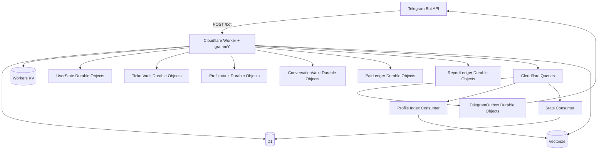
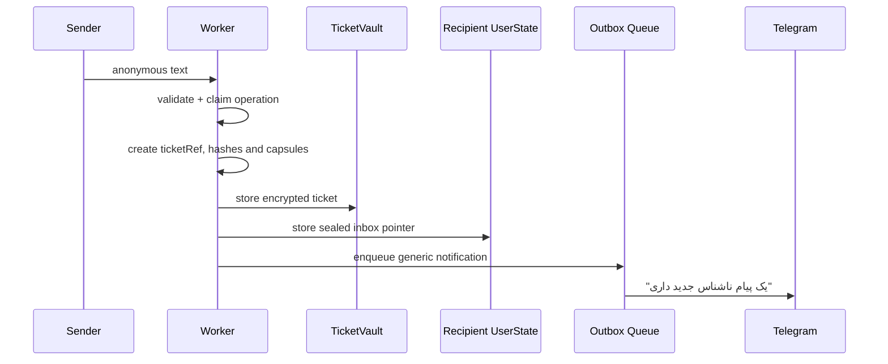
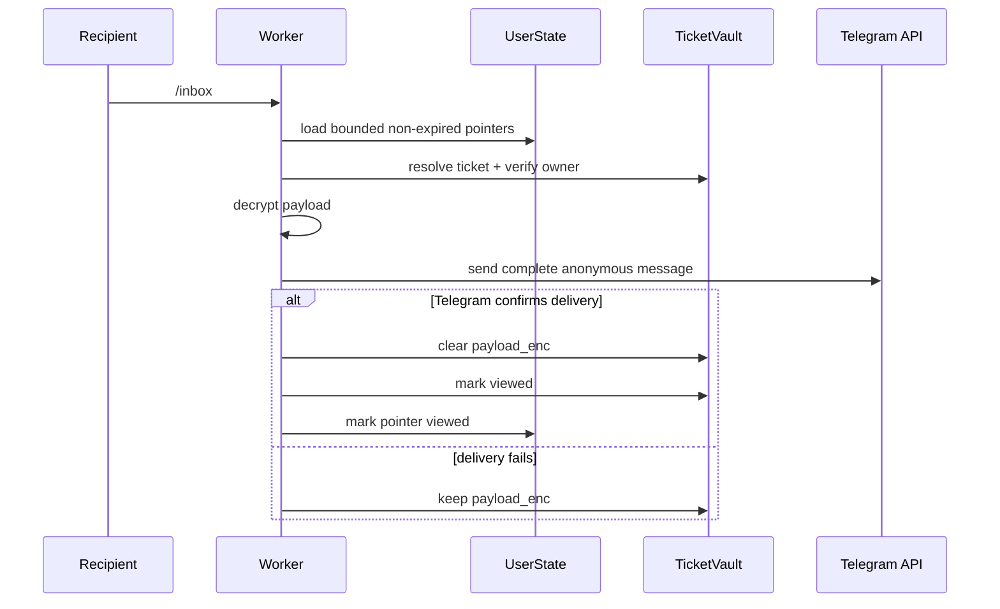
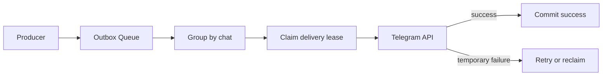
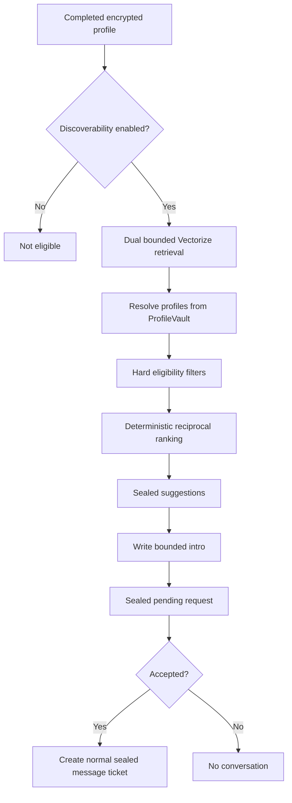

## ۱. مسئله فقط رساندن پیام نبود

پیام ناشناس در تلگرام در ظاهر محصول ساده‌ای است:

```txt
یک لینک شخصی
→ یک پیام
→ تحویل به صاحب لینک
→ پاسخ ناشناس
```

اما به‌محض اینکه این مسیر قرار باشد واقعاً استفاده شود، سؤال اصلی دیگر «چطور پیام را برسانیم؟» نیست.

سؤال‌های مهم‌تر این‌ها هستند:

- متن پیام کجا ذخیره می‌شود و تا چه زمانی؟
- آیا برای ادامه گفت‌وگو باید یک جدول دائمی از ارتباط فرستنده و گیرنده ساخت؟
- اگر دیتابیس یا storage export شود، چه چیزهایی از روابط کاربران قابل بازسازی است؟
- اگر تلگرام یک update را دوباره ارسال کند، آیا یک پیام دو بار ساخته می‌شود؟
- اگر دو callback هم‌زمان اجرا شوند، کدام state معتبر است؟
- اگر delivery به تلگرام شکست بخورد، آیا payload باید پاک شود؟
- گزارش سوءاستفاده را چطور نگه داریم، بدون اینکه خود سیستم گزارش به یک social graph تبدیل شود؟
- پیشنهاد گفت‌وگو چطور می‌تواند مفید باشد، بدون اینکه به ادعای تشخیص شخصیت یا سازگاری قطعی برسد؟

ریشه‌ی طراحی نکونیموس از همین سؤال‌ها می‌آید.

هدف، ساختن «امن‌ترین ربات ناشناس» یا یک پیام‌رسان جدید نبود. هدف محدودتر بود:

> یک relay ناشناس کوچک که فقط داده‌ی لازم برای انجام وظیفه‌اش را نگه دارد، رابطه‌های مستقیم و قابل اتصال را تا جای ممکن نسازد، و درباره مرزهای حریم خصوصی خودش اغراق نکند.

این نوشته روایت عمومی پروژه نیست؛ آن بخش در مقاله‌ی وبلاگ آمده است. اینجا تمرکز روی معماری، جریان داده، storage boundaries، مدل capability، هماهنگی state و محدودیت‌های واقعی سیستم است.

اسناد داخل repository مرجع نهایی implementation هستند. این مقاله بیشتر یک نقشه‌ی فنی برای فهمیدن کل سیستم است.

## ۲. تعریف فعلی محصول

نِکونیموس یک ربات تلگرام فارسی‌محور است برای:

- ساخت لینک ناشناس شخصی؛
- دریافت پیام متنی ناشناس؛
- دیدن پیام‌ها در صندوق؛
- پاسخ ناشناس؛
- مسدودکردن و رفع مسدودی؛
- گزارش سوءاستفاده؛
- تعیین نام خصوصی برای یک مسیر ناشناس؛
- توقف و فعال‌سازی دریافت پیام؛
- ساخت پروفایل سبک گفت‌وگو؛
- دریافت پیشنهاد گفت‌وگوی اختیاری؛
- پاک‌کردن حساب و ساخت هویت و لینک تازه.

سطح عملیاتی داخل خود Telegram باقی می‌ماند:

```txt
/start
/inbox
/settings
/assessment
/match
```

وب‌سایت پروژه فقط صفحه‌ی معرفی، مستندات و مسیر ورود است. Worker هیچ SPA، dashboard عمومی، plugin API یا REST API عمومی برای محصول ندارد.

جریان اصلی محصول:

```txt
Personal link
→ anonymous message
→ sealed ticket
→ recipient inbox
→ reply / nickname / block / report
→ ticket expiry
```

جریان اختیاری پیشنهاد گفت‌وگو جداست:

```txt
conversation profile
→ opt-in discoverability
→ bounded retrieval
→ deterministic reciprocal ranking
→ sealed suggestion
→ sealed request
→ accepted request becomes a normal message ticket
```

نکته‌ی مهم این است که سیستم پیشنهاد گفت‌وگو مسیر پیام ناشناس را جایگزین نمی‌کند. بعد از پذیرش یک درخواست، نتیجه دوباره به همان primitive اصلی سیستم تبدیل می‌شود: یک sealed message ticket.


## ۳. مرز محصول و ادعا

نکونیموس این‌ها نیست:

- پیام‌رسان با رمزنگاری سرتاسری؛
- zero-knowledge system؛
- ناشناسی کامل یا untraceability؛
- شبکه اجتماعی یا dating app؛
- سیستم اثبات هویت؛
- تست شخصیت یا تشخیص روان‌شناختی؛
- موتور محاسبه‌ی درصد سازگاری؛
- تضمین امنیت یا سلامت طرف مقابل.

تعریف دقیق‌تر آن:

> Nekonymous یک hosted anonymous Telegram relay است که کاربران را در جریان عادی محصول از یکدیگر پنهان می‌کند، داده‌های قابل اتصال ذخیره‌شده را کم می‌کند، اطلاعات حساس ذخیره‌شده را در مرزهای پیاده‌سازی فعلی رمزنگاری می‌کند و محدودیت‌های پردازش روی Telegram و Worker را صریح نگه می‌دارد.

### مرز اعتماد

plaintext در چند نقطه وجود دارد:

```txt
دستگاه فرستنده
→ Telegram
→ Worker هنگام پردازش
→ Telegram
→ دستگاه گیرنده
```

تلگرام متن پیام را هنگام انتقال می‌بیند.

Worker نیز برای validation، رمزنگاری، رمزگشایی و تحویل، متن را در حافظه‌ی runtime می‌بیند.

رمزنگاری application-level در نکونیموس برای حذف این مرز اعتماد نیست. هدف آن محدودکردن plaintext ذخیره‌شده و کاهش ارزش یک storage dump است.

اگر Worker در حال اجرا، حساب deployment یا کلیدهای اصلی compromise شوند، مهاجم می‌تواند plaintext در حال پردازش را ببیند و بعضی داده‌های رمزنگاری‌شده را باز کند. این یک residual risk جدی است، نه چیزی خارج از threat model.


## ۴. ایده‌ی اولیه: capability داخل Telegram

prototype اولیه‌ی نکو از یک مدل ساده‌تر استفاده می‌کرد:

```txt
capability
  → derived lookup key
  → KV lookup
  → encrypted envelope
  → derived decryption key
```

در آن مدل، capability خام داخل دیتابیس نکو ذخیره نمی‌شد. همراه دکمه‌ی Telegram برای گیرنده ارسال می‌شد و نسخه‌ی قابل استفاده‌ی آن در chat history خود کاربر باقی می‌ماند.

وقتی capability دوباره به bot برمی‌گشت، سیستم از آن:

1. یک کلید برای پیدا کردن encrypted value در KV؛
2. یک کلید برای بازکردن envelope؛

استخراج می‌کرد.

خود KV چیزی شبیه این نگه می‌داشت:

```txt
opaque-key → encrypted-value
opaque-key → encrypted-value
opaque-key → encrypted-value
```

داخل envelope نیز حداقل route metadata لازم برای ادامه مسیر وجود داشت.

از نظر مفهومی، این مدل چند خصوصیت مهم داشت:

- capability نزد کاربر باقی می‌ماند؛
- storage بدون capability قابل استفاده نبود؛
- یک جدول مستقیم `sender → recipient → message` وجود نداشت؛
- هر پاسخ می‌توانست یک ticket و capability تازه بسازد.

همین ایده پایه‌ی معماری فعلی باقی ماند، اما implementation تغییر کرد.


## ۵. چرا مدل اولیه تغییر کرد؟

مدل KV برای prototype مناسب بود، اما برای نسخه‌ای که باید race، retry، inbox state، report، block و حذف حساب را مدیریت کند، محدودیت‌های مهمی داشت.

### ۵.۱ KV یک coordination authority مناسب نیست

KV برای lookup سریع، cache و داده‌های read-heavy مناسب است، اما eventual consistency و نبود transactionهای محلی باعث می‌شود برای stateهایی مثل این‌ها انتخاب خوبی نباشد:

```txt
active → viewed
pending → accepted
unclaimed → delivery lease
profile revision N → profile revision N+1
```

این transitionها باید atomic و قابل retry باشند.

### ۵.۲ capability خالی نباید کافی باشد

در مدل ساده‌ی bearer token، هرکس capability را داشته باشد می‌تواند از آن استفاده کند.

در نسخه فعلی، possession به‌تنهایی کافی نیست. هر action علاوه بر ticket capability باید به actor فعلی نیز bind شده باشد.

### ۵.۳ payload و route عمر یکسان ندارند

متن پیام فقط تا اولین تحویل موفق لازم است.

اما route باید مدتی بیشتر باقی بماند تا این actionها کار کنند:

- پاسخ؛
- بلاک؛
- رفع بلاک؛
- گزارش؛
- نام خصوصی.

پس payload و routing capsule باید lifecycle جدا داشته باشند.

### ۵.۴ inbox فقط یک لیست key نیست

صندوق باید بتواند:

- آیتم‌های منقضی را حذف کند؛
- پیام دیده‌شده را به‌صورت shell نگه دارد؛
- pagination داشته باشد؛
- decryptها را محدود کند؛
- action state را عقب نبرد؛
- در صورت failure پیام را از دست ندهد.

نتیجه‌ی این بازطراحی، مدل **sealed ticket capability** فعلی شد.


## ۶. تصویر کلی معماری



Worker سه surface اصلی دارد:

```txt
fetch()
  → فقط webhook تلگرام روی POST /bot

queue()
  → dispatch صف‌های شناخته‌شده

Durable Object exports
  → stateful storage و coordination
```

هر storage plane یک مسئولیت محدود دارد:

| Plane                | مسئولیت                                  | نباید تبدیل شود به                 |
| -------------------- | ---------------------------------------- | ---------------------------------- |
| D1                   | هویت ساختاری، public link، آمار تجمیعی   | transcript پیام یا social graph    |
| UserState DO         | state محلی کاربر و workflowهای کوتاه‌عمر | دیتابیس عمومی همه کاربران          |
| TicketVault DO       | ticketهای ناشناس مهروموم‌شده             | جدول plaintext پیام‌ها             |
| ProfileVault DO      | پروفایل نهایی رمزنگاری‌شده               | جدول قابل query از پروفایل کاربران |
| ConversationVault DO | suggestion و request مهروموم‌شده         | relationship table عمومی           |
| PairLedger DO        | lock، cooldown و block کور               | دایرکتوری قابل برگشت زوج‌ها        |
| ReportLedger DO      | سیگنال‌های کور گزارش                     | گراف گزارش‌دهنده و گزارش‌شونده     |
| TelegramOutbox DO    | تحویل idempotent با lease                | log نامحدود ارسال                  |
| KV                   | routing cache و cache کوتاه‌عمر          | source of truth محصول              |
| Queues               | کار asynchronous و retryپذیر             | exactly-once authority             |
| Vectorize            | candidate retrieval محدود                | ranker نهایی یا identity store     |

قاعده‌ی اصلی:

```txt
D1 برای ساختار قابل query.
Durable Objects برای state ترتیبی و atomic.
KV فقط برای cache و routing.
Queues برای کار غیرحیاتی و retryپذیر.
Vectorize برای retrieval، نه تصمیم.
```


## ۷. مدل هویت و لینک عمومی

هر حساب یک شناسه داخلی و یک public link slug دارد:

```txt
t.me/{bot_username}?start={slug}
```

`slug` برای ورود به مسیر ارسال پیام استفاده می‌شود. D1 منبع حقیقت لینک است و KV می‌تواند فقط lookup سریع آن را cache کند.

هویت Telegram نباید مستقیماً به شناسه عمومی محصول تبدیل شود.

مدل کلی:

```txt
telegram_user_id
  → HMAC with application pepper
  → telegram_user_hash
  → internal account lookup
```

شناسه خام Telegram به‌عنوان public ID یا join key در D1 استفاده نمی‌شود.

`chat_id` که برای ارسال پیام لازم است، در جایی که نگهداری می‌شود به‌صورت رمزنگاری‌شده باقی می‌ماند.

این طراحی ناشناسی در برابر Telegram یا runtime operator ایجاد نمی‌کند. هدف آن جلوگیری از قرارگرفتن raw Telegram identity در تمام جدول‌ها و جریان‌های داخلی است.


## ۸. مسیر ساخت پیام ناشناس

فرستنده public link را باز می‌کند:

```txt
/start {slug}
```

سیستم قبل از دریافت متن:

- لینک را resolve می‌کند؛
- ارسال پیام به خود را رد می‌کند؛
- وضعیت pause گیرنده را بررسی می‌کند؛
- block و محدودیت‌ها را بررسی می‌کند؛
- یک draft کوتاه‌عمر برای فرستنده می‌سازد.

draft فقط می‌گوید پیام بعدی این کاربر باید وارد کدام workflow شود.

در نسخه فعلی، payload اصلی پیام متنی است.

بعد از دریافت متن:



اعلان شامل متن پیام نیست.

ترتیب مفهومی ساخت ticket:

```txt
1. validate sender, recipient and draft
2. claim stable operation identity
3. generate random ticketRef
4. derive ticketHash
5. derive ownerProofTag
6. create compact route and payload capsules
7. derive per-ticket encryption material
8. encrypt route and payload
9. store ticket in TicketVault
10. store sealed pointer in recipient UserState
11. clear sender draft
12. notify recipient
13. emit aggregate stat best-effort
```

اگر ذخیره pointer بعد از ساخت vault record شکست بخورد، عملیات باید compensation یا cleanup قابل retry داشته باشد تا ticket یتیم دائمی ایجاد نشود.


## ۹. مدل sealed ticket

هسته‌ی relay به این شکل است:

```txt
ticketRef
  → blind ticketHash
  → actor-bound ownerProofTag
  → encrypted route capsule
  → temporary encrypted payload
  → TicketVault
  → sealed inbox pointer
```

### ۹.۱ `ticketRef`

یک capability تصادفی و base64url است که داخل callback دکمه‌های Telegram قرار می‌گیرد:

```txt
o:{ticketRef}
r:{ticketRef}
b:{ticketRef}
u:{ticketRef}
n:{ticketRef}
rp:{ticketRef}
```

قواعد:

- شامل user ID، chat ID، locale یا متن پیام نیست؛
- قبل از عملیات رمزنگاری، format و طول آن validate می‌شود؛
- raw value به‌عنوان database key ذخیره نمی‌شود؛
- possession به‌تنهایی مجوز action نیست.

کوتاه‌بودن callback فقط انتخاب زیبایی‌شناختی نیست. Telegram برای `callback_data` محدودیت بایتی دارد، بنابراین capability باید compact و language-independent بماند.

### ۹.۲ `ticketHash`

برای lookup، خود `ticketRef` ذخیره نمی‌شود:

```txt
ticketHash = HMAC(K_TICKET_LOOKUP, ticketRef)
```

این hash:

- کلید lookup در TicketVault است؛
- برای انتخاب shard استفاده می‌شود؛
- raw capability را از storage جدا می‌کند.

### ۹.۳ `ownerProofTag`

برای اینکه ticketRef کپی‌شده به‌تنهایی کافی نباشد:

```txt
ownerProofTag =
  HMAC(K_OWNER_PROOF, actorHash || ticketHash)
```

هنگام inbox یا callback، Worker proof را برای actor فعلی دوباره محاسبه و با مقدار ذخیره‌شده به‌صورت constant-time مقایسه می‌کند.

بنابراین مدل capability است، اما bearer-only نیست.

### ۹.۴ `route_enc`

route capsule یک envelope فشرده و رمزنگاری‌شده است که فقط اطلاعات لازم برای ادامه مسیر را نگه می‌دارد:

- route پاسخ؛
- tagهای blind برای block و report؛
- action policy؛
- expiry context؛
- اطلاعات محدود مورد نیاز برای nickname خصوصی.

route plaintext در D1، KV، inbox pointer، callback یا log کپی نمی‌شود.

### ۹.۵ `payload_enc`

payload capsule در نسخه فعلی شامل متن پیام و metadata حداقلی آن است:

```ts
type PayloadCapsule = {
  type: 'text'
  text: string
  createdAt: number
}
```

این envelope فقط تا اولین تحویل موفق صندوق یا expiry باقی می‌ماند.


## ۱۰. چرا inbox pointer جداست؟

TicketVault نباید بداند ticket متعلق به کدام ردیف کاربر در D1 است.

از طرف دیگر، UserState گیرنده نیز نباید متن یا route پیام را نگه دارد.

پس صندوق فقط یک pointer مهروموم‌شده نگه می‌دارد:

```txt
UserState inbox pointer
  → sealed ticket reference
  → local display number
  → local status
  → created/expiry timestamps
```

این جداسازی دو نتیجه دارد:

```txt
TicketVault:
  پیام و route رمزنگاری‌شده دارد
  اما user relation مستقیم ندارد

UserState:
  می‌داند کاربر یک آیتم صندوق دارد
  اما payload یا route plaintext ندارد
```

برای بازکردن پیام، Worker باید هر دو boundary را طی کند:

1. pointer را از UserState بخواند؛
2. capability را از pointer باز کند؛
3. ticketHash را بسازد؛
4. vault record را پیدا کند؛
5. owner proof را بررسی کند؛
6. payload را رمزگشایی کند.


## ۱۱. چرخه‌ی عمر صندوق

حداکثر زمان نگهداری pointer و ticket:

```txt
30 days
```

حداکثر payloadهای دیده‌نشده که در یک درخواست `/inbox` رمزگشایی می‌شوند:

```txt
10
```

این محدودیت برای bounded نگه‌داشتن CPU، storage calls، Telegram sends و زمان execution است.

### تیکت دیده‌نشده

```txt
status: active
route_enc: present
payload_enc: present
```

مسیر بازکردن:



اصل حیاتی:

> payload فقط بعد از تأیید موفق ارسال به Telegram پاک می‌شود.

اگر payload قبل از delivery پاک شود، یک failure موقت می‌تواند باعث ازدست‌رفتن دائمی پیام شود.

### تیکت دیده‌شده

```txt
status: viewed / replied / reported / blocked
route_enc: present
payload_enc: absent
```

در بازکردن‌های بعدی، فقط shell نمایش داده می‌شود:

```txt
پیام #NQ-7KFP قبلاً نمایش داده شده است.
```

برای shell هیچ payloadی decrypt نمی‌شود.

متن اصلی فقط در همان Telegram message تحویل‌داده‌شده باقی می‌ماند.

### تیکت منقضی یا evicted

بعد از expiry یا حذف pointer:

```txt
route_enc: removed
payload_enc: removed
meta_enc: removed
callback: unavailable
```

record یا کامل حذف می‌شود یا فقط یک tombstone محدود و غیرحساس برای idempotency باقی می‌ماند.

نکونیموس archive منقضی از route و payload نگه نمی‌دارد.


## ۱۲. پاسخ، بلاک، گزارش و نام خصوصی

actionهای پیام روی همان sealed ticket انجام می‌شوند:

```txt
💬 پاسخ دادن
🏷️ نام خصوصی
🚫 مسدود کردن
⚠️ گزارش کردن
```

تمام actionها از یک resolver مرکزی عبور می‌کنند:

```txt
callback
→ validate action and ticketRef
→ derive actorHash
→ derive ticketHash
→ load TicketVault record
→ verify ownerProofTag
→ reject expiry or illegal state
→ derive ticket key
→ decrypt and validate route capsule
→ execute action
```

برای پاسخ، بلاک، nickname یا routing معمول گزارش، `payload_enc` دوباره باز نمی‌شود. این actionها فقط به route capsule نیاز دارند.

### پاسخ

پاسخ یک update روی transcript قبلی نیست.

یک sealed ticket تازه در جهت مقابل ساخته می‌شود:

```txt
Ticket A
→ reply
→ Ticket B
```

پس conversation table دائمی وجود ندارد. هر پیام lifecycle مستقل خودش را دارد.

### بلاک

block با یک route کورشده کار می‌کند، نه با plaintext sender ID در D1.

هدف این است که گیرنده بتواند همان مسیر را مسدود کند، بدون اینکه سیستم نیاز داشته باشد یک sender-recipient edge عمومی بسازد.

### نام خصوصی

nickname فقط یک label محلی برای گیرنده است.

فرستنده آن را نمی‌بیند و این قابلیت نباید به یک نام عمومی یا پروفایل مشترک تبدیل شود.

### گزارش

ReportLedger به‌جای ذخیره‌ی این مدل:

```txt
reporter_id
sender_id
recipient_id
message_id
```

از tagهای blind استفاده می‌کند:

```txt
sender abuse tag
pair abuse tag
link abuse tag
reporter proof tag
reason code
```

هدف، حفظ امکان تشخیص الگوهای تکراری سوءاستفاده بدون ایجاد یک report social graph قابل برگشت است.

این مدل metadata را کاملاً حذف نمی‌کند. count، زمان، status و blind tags همچنان signal هستند؛ اما رابطه plaintext را از مدل حذف می‌کند.


## ۱۳. مدل رمزنگاری

نکونیموس از Web Crypto runtime برای این primitiveها استفاده می‌کند:

- HMAC-SHA-256؛
- HKDF-SHA-256؛
- AES-256-GCM؛
- random capability generation؛
- constant-time comparison در boundaryهای حساس.

تصویر مفهومی:

```txt
APP_HMAC_PEPPER + telegram_user_id
  → HMAC
  → actorHash

K_TICKET_LOOKUP + ticketRef
  → HMAC
  → ticketHash

K_OWNER_PROOF + actorHash + ticketHash
  → HMAC
  → ownerProofTag

APP_MASTER_KEY + ticket context
  → HKDF
  → per-ticket AES-GCM key
  → route_enc / payload_enc
```

کلیدهای کاربردهای مختلف باید domain-separated باشند:

```txt
identity hashing
ticket lookup
owner proof
ticket encryption
inbox pointer sealing
report tags
pair tags
```

استفاده از یک secret برای همه این حوزه‌ها، coupling و blast radius را افزایش می‌دهد.

envelopeها versioned هستند تا format یا key derivation بعداً قابل migration باشد.

بااین‌حال پروژه یک سیستم کامل و خودکار برای rotation تمام encrypted records موجود ارائه نمی‌کند. exposure کلید اصلی یا HMAC pepper باید security incident در نظر گرفته شود و rotation بدون migration plan می‌تواند داده‌های موجود را غیرقابل استفاده کند.


## ۱۴. storage boundaries

| داده                | محل اصلی             | شکل ذخیره‌سازی                      |
| ------------------- | -------------------- | ----------------------------------- |
| هویت حساب           | D1 `users`           | internal ID + Telegram hash         |
| chat route          | D1 / account state   | رمزنگاری‌شده                        |
| public slug         | D1 + KV cache        | D1 authoritative                    |
| compose/reply draft | UserState DO         | کوتاه‌عمر                           |
| inbox pointer       | UserState DO         | sealed reference                    |
| message route       | TicketVault DO       | `route_enc`                         |
| message body        | TicketVault DO       | `payload_enc` موقت                  |
| block / nickname    | UserState DO         | blind/encrypted local state         |
| rate state          | UserState DO         | bounded counters                    |
| report              | ReportLedger DO      | blind tags                          |
| profile session     | UserState DO         | پاسخ‌های فعال رمزنگاری‌شده          |
| finalized profile   | ProfileVault DO      | encrypted profile                   |
| suggestion/request  | ConversationVault DO | sealed capability + encrypted intro |
| pair state          | PairLedger DO        | blind lock/cooldown/block           |
| candidate vectors   | Vectorize            | controlled 8D values                |
| aggregate stats     | D1                   | daily anonymous counters            |
| routing cache       | KV                   | کوتاه‌عمر و non-authoritative       |

### D1 عمداً نگه نمی‌دارد

- متن پیام ناشناس؛
- route تیکت؛
- transcript گفت‌وگو؛
- plaintext sender-recipient edge؛
- پاسخ‌های خام profile نهایی‌شده؛
- finalized profile plaintext؛
- request intro؛
- suggestion/request workflow؛
- raw ticket capability.

### KV عمداً authority نیست برای

- inbox؛
- ticket؛
- profile؛
- suggestion؛
- request؛
- report؛
- pair state.

### Vectorize دریافت نمی‌کند

- Telegram ID؛
- chat ID؛
- display name؛
- پاسخ‌های خام؛
- intro؛
- message text.


## ۱۵. webhook، retry و idempotency

Telegram webhook ممکن است یک update را بعد از پاسخ ناموفق دوباره ارسال کند.

ورودی `/bot` باید:

- فقط `POST` را بپذیرد؛
- webhook secret header را بررسی کند؛
- update را validate کند؛
- operation identity پایدار بسازد؛
- update تکراری را بدون ساخت state جدید پاسخ دهد.

مسئله فقط duplicate webhook نیست.

این raceها هم ممکن‌اند:

```txt
دو callback هم‌زمان
دو accept هم‌زمان
queue retry بعد از timeout
delivery lease منقضی‌شده
alarm تکراری
cleanup هم‌زمان با action
```

بنابراین transitionها باید monotonic و compare-and-set باشند.

مثال:

```txt
active → viewed
active → blocked
active → reported
viewed → replied
pending → accepting → accepted
pending → declined
pending → canceled
```

این‌ها نباید ممکن باشند:

```txt
reported → viewed
blocked → replied
expired → active
accepted → pending
declined → accepted
```

هر عملیات تکراری باید یا همان نتیجه قبلی را برگرداند یا یک پاسخ unavailable کنترل‌شده بدهد؛ نه اینکه state دوم بسازد.


## ۱۶. Outbox و تحویل Telegram

ارسال Telegram همیشه بخشی از transaction محلی storage نیست.

ممکن است:

- API موقتاً fail شود؛
- Queue یک job را دوباره تحویل دهد؛
- Worker بعد از ارسال ولی قبل از ثبت success متوقف شود؛
- چند پیام برای یک chat نیازمند ترتیب باشند.

برای ارسال‌های غیرحیاتی:

```txt
Worker
→ NEKO_OUTBOX_QUEUE
→ TelegramOutbox DO
→ Telegram API
```

TelegramOutbox از این مفاهیم استفاده می‌کند:

- stable idempotency key؛
- delivery lease؛
- lease expiry و reclaim؛
- completion guard؛
- ترتیب درون هر chat؛
- concurrency محدود میان chatها؛
- retention محدود success/failure records.



Cloudflare Queues at-least-once است، نه exactly-once.

در نتیجه exactly-once effect باید در application state ساخته شود، نه اینکه از queue فرض گرفته شود.

اصل عملیاتی:

```txt
Queue guarantees delivery attempts.
Application guarantees idempotent effects.
```


## ۱۷. مدل تعامل داخل bot

Reply keyboard دائمی فقط برای navigation است:

```txt
🔗 لینک من
📥 صندوق پیام‌ها
🧭 پیشنهاد گفت‌وگو
⚙️ تنظیمات
```

Inline keyboard برای action روی context فعلی است:

- ticket؛
- settings screen؛
- profile question؛
- suggestion؛
- request؛
- confirmation.

هنگام text input، reply keyboard فقط این را دارد:

```txt
↩️ لغو
```

draft modeها شامل مسیرهایی مثل این هستند:

```txt
compose
reply
nickname
display_name
request_intro
```

input routing باید قبل از تفسیر متن منوی اصلی، draft فعال را بررسی کند. در غیر این صورت فشردن یک دکمه navigation ممکن است به‌عنوان متن پیام ناشناس یا nickname ثبت شود.

callbackها کوتاه، زبان‌مستقل و بدون payload حساس هستند:

```txt
st:  settings
t:   profile
m:   suggestions hub
s:   sealed suggestion
q:   conversation request
o:   open ticket
r:   reply
b:   block
u:   unblock
n:   private nickname
rp:  report
ib:  inbox navigation
```

callback قدیمی، منقضی یا ناشناخته یک پاسخ عمومی unavailable می‌گیرد. raw callback در log چاپ نمی‌شود.


## ۱۸. پروفایل سبک گفت‌وگو

پروفایل گفت‌وگو یک diagnostic assessment نیست.

هدف آن ساختن یک representation محدود برای preferenceهای گفت‌وگو است؛ چیزی که بتوان از آن برای retrieval و ranking استفاده کرد، نه برای برچسب‌زدن به شخصیت کاربر.

نسخه فعلی:

```txt
25 questions
8 dimensions
Conversation Profile V2
```

ساختار:

- ۱۶ سؤال self-style؛
- ۸ سؤال desired-style؛
- ۱ سؤال current intent.

ابعاد:

| بُعد             | موضوع                       |
| ---------------- | --------------------------- |
| `depth`          | سبک یا عمیق‌بودن گفت‌وگو    |
| `replyPace`      | ریتم پاسخ                   |
| `directness`     | مستقیم یا غیرمستقیم‌بودن    |
| `energy`         | سطح انرژی مکالمه            |
| `playfulness`    | شوخی و بازیگوشی             |
| `supportStyle`   | شنیده‌شدن یا راه‌حل‌محوری   |
| `disclosurePace` | سرعت بازشدن در موضوعات شخصی |
| `repairStyle`    | برخورد با سوءتفاهم          |

فرآیند نهایی‌سازی:

```txt
active encrypted session
→ validate complete profile
→ normalize self values
→ record desired values/no-preference
→ calculate importance and uncertainty
→ record current intent
→ build controlled summary
→ encrypt finalized profile in ProfileVault
→ remove raw active answers
→ enqueue sealed profile-index job
```

پروفایل نهایی revision دارد.

job قدیمی نباید بتواند:

- revision جدیدتر را overwrite کند؛
- profile حذف‌شده را دوباره index کند؛
- بعد از reset بردار قدیمی را احیا کند.

### بردارها

این سیستم از embedding متن آزاد استفاده نمی‌کند.

از پروفایل دو بردار کنترل‌شده‌ی ۸بعدی تولید می‌شود:

```txt
self vector
desired vector
```

بردارها فقط شامل مقادیر نرمال‌شده‌ی محصول هستند.

Workers AI در این مسیر استفاده نمی‌شود.


## ۱۹. Conversation Suggestions V2

سیستم پیشنهاد گفت‌وگو بر چهار اصل بنا شده است:

1. discoverability اختیاری است؛
2. Vectorize فقط candidate retrieval انجام می‌دهد؛
3. رتبه‌بندی نهایی deterministic است؛
4. هیچ گفت‌وگویی بدون پذیرش طرف مقابل آغاز نمی‌شود.

Pipeline:



### retrieval دوطرفه

برای actor A و candidate B، فقط نزدیک‌بودن `A.self` به `B.self` مهم نیست.

دو جهت اصلی بررسی می‌شوند:

```txt
A.self    نزدیک B.desired
A.desired نزدیک B.self
```

بعد profileهای authoritative از ProfileVault خوانده می‌شوند.

### فیلترهای سخت

قبل از ranking:

- actor و candidate فعال باشند؛
- schema و revision معتبر باشد؛
- profile کامل باشد؛
- discoverability روشن باشد؛
- self-candidate حذف شود؛
- block یا pair block فعال نباشد؛
- pending conflict وجود نداشته باشد؛
- cooldown و exposure policy اجازه دهد؛
- budgetهای bounded رعایت شوند.

فیلتر سخت همیشه از similarity مهم‌تر است.

### ranker قطعی

ranker pure TypeScript است و binding Cloudflare دریافت نمی‌کند.

ورودی آن profileهای resolve‌شده است و مفاهیمی مانند این‌ها را ترکیب می‌کند:

```txt
reciprocal distance
dimension importance
no-preference handling
self uncertainty
current intent adjustment
exposure policy
deterministic tie-breaking
```

score فقط signal داخلی برای ordering است.

در UI درصد سازگاری نمایش داده نمی‌شود و نتیجه به‌عنوان «گزینه‌های نزدیک فعلی» توصیف می‌شود.

### capability chain

پیشنهادها نیز همان فلسفه‌ی ticket را دنبال می‌کنند:

```txt
Profile Capability
→ Suggestion Capability
→ Request Capability
→ Message Ticket
```

raw capabilityها در storage نگه داشته نمی‌شوند.

callback شامل candidate ID، requester ID، profile values، score یا intro نیست.

### request lifecycle

```txt
pending
  → accepting
  → accepted(ticketHash)

pending → declined
pending → canceled
pending → expired
```

accept ابتدا state را claim می‌کند و سپس ticket می‌سازد.

اگر دو accept هم‌زمان برسند، حداکثر یک intro ticket باید ایجاد شود.

notification failure بعد از commit محصول، state را rollback نمی‌کند.


## ۲۰. تهدیدها و residual riskها

### storage export

اگر D1، DO storage، KV، Queue یا Vectorize export شود، کنترل‌های اصلی این‌ها هستند:

- storage planeهای جدا؛
- encrypted capsules؛
- blind lookup keys؛
- blind pair/report tags؛
- نبود message body و relay graph در D1؛
- نبود Telegram identity در Vectorize؛
- retention محدود payload و route.

اما metadata کاملاً حذف نمی‌شود.

مهاجم ممکن است همچنان این‌ها را ببیند:

- ciphertext size؛
- timestamps؛
- count؛
- status؛
- expiry؛
- coarse vectors؛
- access patterns در سطح platform.

### Worker یا secret compromise

این حمله high-impact است:

- plaintext در حال پردازش دیده می‌شود؛
- encrypted capsuleها ممکن است قابل بازشدن شوند؛
- route و identity قابل correlation می‌شوند؛
- پیام Telegram قابل جعل می‌شود.

نکونیموس در برابر runtime operator مخرب ادعای حفاظت ندارد.

### callback replay

کنترل‌ها:

- capability تصادفی؛
- blind lookup؛
- owner proof؛
- format validation؛
- expiry؛
- state validation؛
- raw capability خارج از storage.

اما اگر Telegram account یا device خود کاربر compromise شود، capability موجود در history ممکن است تا expiry و تا وقتی state اجازه می‌دهد replay شود.

### abuse

کنترل‌ها:

- action throttle؛
- inbox cap؛
- message length؛
- pause/resume؛
- block؛
- report؛
- ticket expiry؛
- bounded rendering؛
- idempotent creation.

این‌ها جلوی ساخت حساب Telegram تازه یا سوءاستفاده با اطلاعات بیرون از سیستم را تضمینی نمی‌گیرند.

### recipient behavior

بعد از تحویل پیام، گیرنده می‌تواند:

- screenshot بگیرد؛
- پیام را forward کند؛
- متن را کپی کند؛
- آن را خارج از نکو منتشر کند.

حذف payload از storage نکو، نسخه‌ای را که قبلاً داخل Telegram تحویل شده حذف نمی‌کند.


## ۲۱. پاک‌کردن حساب و ساخت هویت تازه

hard reset صرفاً `status = deleted` نیست.

مسیر کلی:

```txt
freeze old identity
→ disable discoverability
→ revoke profile and conversation capabilities
→ remove known Vectorize routes
→ delete owned inbox pointers and tickets
→ purge UserState
→ remove D1 identity and public link
→ clear KV routing entries
→ create new internal identity and public link
```

operation باید retryable و idempotent باشد.

### چه چیزهایی حذف نمی‌شوند؟

- پیام‌هایی که قبلاً در Telegram تحویل شده‌اند؛
- screenshot و forward؛
- Telegram-side data؛
- backupهای خارج از کنترل برنامه؛
- آمار تجمیعی ناشناس.

### محدودیت migration

بعضی profileهای ساخته‌شده قبل از hardening تیر ۱۴۰۵، route کامل Vectorize را داخل profile encrypted state نگه نمی‌داشتند.

برای profileهای جدید، reset می‌تواند vector شناخته‌شده را حذف و stale indexing job را رد کند.

برای بعضی رکوردهای قدیمی، operator cleanup ممکن است لازم باشد.

تا زمانی که آن داده‌های قدیمی migrate یا پاک نشده‌اند، نباید ادعای حذف خودکار قوی‌تری مطرح شود.


## ۲۲. آمار بدون اسکن vaultها

Dashboard یا آمار عمومی نباید برای شمارش پیام‌ها، TicketVault یا UserState را scan کند.

مدل:

```txt
product event
→ best-effort stats queue
→ batch aggregate
→ D1 daily counters
→ optional short KV cache
```

جداول تجمیعی:

```txt
platform_daily_stats
platform_daily_stats_by_key
platform_daily_unique_stats
```

daily unique با blind hash روزانه محاسبه می‌شود.

آمار عمومی نباید این‌ها را ارائه دهد:

- کاربران برتر؛
- تعداد پیام هر user؛
- آمار owner هر public link؛
- timeline کاربر؛
- جزئیات ticket؛
- متن پیام؛
- sender-recipient graph.

failure آمار نباید عملیات کاربر را fail کند.


## ۲۳. performance invariants

معماری فقط درباره privacy نیست. Worker باید bounded بماند.

قواعد فعلی:

- حداکثر ۱۰ payload دیده‌نشده در هر inbox request؛
- shellهای دیده‌شده payload decrypt نمی‌کنند؛
- candidate retrieval محدود است؛
- profile resolution محدود است؛
- Queue concurrency محدود است؛
- vaultها برای آمار global scan نمی‌شوند؛
- D1 queryها limit و index صریح دارند؛
- capsuleها فشرده‌اند و هر field جدا رمزنگاری نمی‌شود؛
- bindings مستقیم استفاده می‌شوند، نه HTTP call به Cloudflare API؛
- هر state پایدار retention یا cleanup مشخص دارد؛
- هیچ promise رهاشده‌ای نباید وجود داشته باشد؛
- state وابسته به request داخل global module نگهداری نمی‌شود.

این قواعد هم هزینه را کنترل می‌کنند، هم blast radius را.


## ۲۴. ساختار سورس

```txt
src/
├── index.ts
├── bot/
│   ├── commands
│   ├── callbacks
│   ├── keyboards
│   ├── input navigation
│   └── screen rendering
├── features/
│   ├── identity/
│   ├── ticketing/
│   ├── moderation/
│   ├── settings/
│   └── conversation/
│       ├── profile/
│       └── suggestions/
├── storage/
│   ├── user-state
│   ├── ticket-vault/
│   ├── profile-vault/
│   ├── conversation-vault/
│   ├── pair-ledger/
│   ├── report-ledger/
│   └── telegram-outbox/
├── queues/
├── stats/
├── i18n/
└── utils/

migrations/
tools/
docs/
```

boundaryهای کد:

- bot handler ورودی را parse و خروجی را render می‌کند؛
- crypto و storage implementation وارد UI handler نمی‌شود؛
- ranker و profile calculation pure باقی می‌مانند؛
- Durable Objects مالک transitionهای atomic هستند؛
- queueها کار غیرحیاتی را جدا می‌کنند؛
- abstraction جدید فقط وقتی ساخته می‌شود که رفتار واقعی تکرارشونده وجود داشته باشد.


## ۲۵. verification و release hardening

فرمان‌های اصلی بررسی:

```bash
pnpm typecheck
pnpm lint
pnpm knip
pnpm test
pnpm run check
pnpm audit:d1
pnpm test:workers
```

بررسی‌ها فقط syntax و type نیستند.

repository برای این invariants تست و verify script دارد:

- storage boundary تیکت؛
- نبود message body در D1؛
- نبود raw capability در storageهای ممنوع؛
- webhook idempotency؛
- outbox leases؛
- queue dispatch؛
- account reset؛
- profile indexing revision؛
- suggestion ownership؛
- privacy leakage؛
- deterministic ranking؛
- eligibility؛
- request race؛
- log redaction؛
- capsule validation؛
- cleanup و retention.

هدف از این تست‌ها اثبات امنیت مطلق نیست.

هدف این است که تصمیم‌های اصلی معماری فقط داخل documentation باقی نمانند و بخشی از آن‌ها توسط repository enforce شوند.


## ۲۶. تصمیم‌هایی که عمداً نگرفتیم

این‌ها omissions تصادفی نیستند:

- نگهداری transcript پیام در D1؛
- نگهداری sender-recipient edge در یک جدول رابطه‌ای؛
- استفاده از KV به‌عنوان inbox یا ticket authority؛
- نگهداری finalized profile و suggestion workflow در D1؛
- استفاده از Workers AI برای profile inference یا ranking؛
- ساخت compatibility percentage؛
- شروع خودکار گفت‌وگو بعد از suggestion؛
- soft-delete به‌عنوان reset کامل؛
- SPA عمومی داخل Worker؛
- payment و Telegram Stars در V1؛
- dashboard moderation پیش از نیاز واقعی؛
- framework عمومی و repository layer بدون رفتار تکرارشونده؛
- ادعای E2EE، zero-knowledge یا perfect anonymity.

سادگی در این پروژه به معنی کم‌بودن قطعات نیست.

به معنی محدودبودن مسئولیت هر قطعه است.


## ۲۷. وضعیت فعلی

خط پشتیبانی‌شده‌ی فعلی `master` است و شامل این بخش‌هاست:

- Telegram-only Worker runtime؛
- anonymous deep-link messaging؛
- sealed ticket vault؛
- bounded inbox؛
- anonymous reply؛
- block / unblock؛
- blind report؛
- private nickname؛
- pause / resume؛
- hard account reset؛
- Conversation Profile V2 با ۲۵ سؤال و ۸ بُعد؛
- opt-in Conversation Suggestions V2؛
- controlled 8D Vectorize retrieval؛
- deterministic reciprocal TypeScript ranking؛
- sealed suggestions and requests؛
- idempotent Telegram outbox؛
- aggregate product statistics؛
- release hardening برای cleanup، reset، leases، log redaction و raceها.


## ۲۸. مسیرهای بعدی

خارج از release فعلی:

- moderation tooling بهتر؛
- abuse controlهای قوی‌تر؛
- key rotation و migration tooling کامل‌تر؛
- analytics تجمیعی غنی‌تر؛
- multilingual polish؛
- deployment provenance و build attestation؛
- quota یا payment فقط بعد از مشاهده‌ی usage واقعی؛
- operator tooling برای cleanup رکوردهای legacy.

این موارد نباید به ادعاهای نسخه فعلی اضافه شوند تا زمانی که واقعاً پیاده‌سازی و verify نشده‌اند.


## جمع‌بندی

نکونیموس از یک سؤال ساده شروع شد:

```txt
چطور پیام ناشناس را برسانیم؟
```

اما معماری واقعی با سؤال دیگری ساخته شد:

```txt
چطور آن را برسانیم،
بدون اینکه سیستم یک آرشیو دائمی و قابل اتصال
از پیام‌ها و رابطه‌های کاربران بسازد؟
```

پاسخ فعلی پروژه این است:

```txt
پیام = sealed capability
payload = موقت
route = رمزنگاری‌شده و زمان‌دار
inbox = pointer محدود
report = blind signal
pair state = blind coordination
statistics = aggregate events
Vectorize = retrieval، نه تصمیم
ranking = deterministic
conversation = فقط بعد از consent
```

نکونیموس در برابر همه‌ی مهاجمان و همه‌ی لایه‌ها ناشناس نیست.

Telegram و Worker plaintext را هنگام پردازش می‌بینند. runtime compromise همچنان یک خطر جدی است. metadata کاملاً ناپدید نمی‌شود و گیرنده می‌تواند پیام تحویل‌شده را نگه دارد.

اما storage معماری عمداً طوری طراحی شده که یک export ساده، دفترچه‌ی مرتب «چه کسی با چه کسی چه گفته است» تولید نکند.

اصل نهایی پروژه:

```txt
حریم خصوصی با ادعای بزرگ‌تر ساخته نمی‌شود.
با داده‌ی کمتر، مرز روشن‌تر،
state محدودتر و failureهای قابل پیش‌بینی ساخته می‌شود.
```

---

برای جزئیات canonical implementation:

- [مستندات repository](https://github.com/mohetios/Nekonymous/tree/master/docs)
- [Architecture](https://github.com/mohetios/Nekonymous/blob/master/docs/architecture.md)
- [Sealed Ticketing](https://github.com/mohetios/Nekonymous/blob/master/docs/sealed-ticketing.md)
- [Conversation Suggestions](https://github.com/mohetios/Nekonymous/blob/master/docs/conversation-suggestions.md)
- [Threat Model](https://github.com/mohetios/Nekonymous/blob/master/docs/threat-model.md)
- [صفحه معرفی پروژه](https://mohetios.github.io/Nekonymous/)
- [ربات تلگرام](https://t.me/nekonymous_bot)
